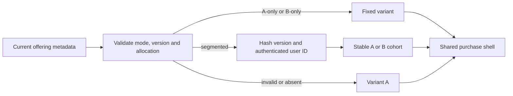

# Paywall layout variants

The final mobile paywall reads one `paywall_layout_config` value from the current RevenueCat offering metadata.
Absent or invalid metadata resolves to A-only with version `default-a`.
Variant A shows the real search hero card and three benefits.
Variant B shows the same mosaic and purchase controls with a selected-offer timeline.
The current release default is A-only; no live segmented allocation has been selected.



Set the offering metadata field to one of these JSON values to flip all users or disable segmentation:

```json
{"paywall_layout_config":{"mode":"A-only","version":"layout-1"}}
{"paywall_layout_config":{"mode":"B-only","version":"layout-1"}}
{"paywall_layout_config":{"mode":"segmented","version":"layout-1","percentB":25}}
```

`percentB` is an integer from 0 through 100.
Use a new version when changing an allocation so analytics can distinguish assignments.
The same authenticated Supabase user ID and version resolve to the same variant across launches and plan changes.
No email or relay address enters the assignment.
The paywall view events `paywall_shown` and `paywall_experiment_exposed`, plus the purchase outcome event `paywall_result`, carry `paywall_variant` and `paywall_config_version`.
Filter those events by user ID, version and offering ID in PostHog to inspect assignment.
Exclude `paywall_tester_override=true` when evaluating cohorts.

On a development build, open `/welcome/payment?devPaywallVariant=A` or `...=B` to review both layouts on one phone.
The tester override changes presentation only; RevenueCat's live eligibility, product and entitlement remain authoritative.
The existing `devTrialVisual=1` fixture separately marks synthetic trial eligibility and disables purchase.

Variant B calculates a conditional first-charge calendar date from the selected eligible store trial period and the current day.
The store confirms the actual purchase and charge date before checkout.
No reminder is shown until a verified selected-offer reminder state is available from #431.
