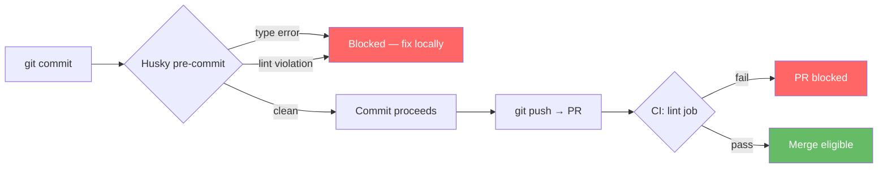

# Pre-commit Harness Spec (S-26)

## Problem

CI first-run pass rate is currently ~27%. Type errors and lint violations
reach CI because nothing catches them locally before push. Developers only
learn about failures after waiting for CI, creating a slow feedback loop.

## Solution

Two-layer enforcement:

1. **Pre-commit hook** (local, seconds) — Husky hook catches type and lint
   failures before they are committed. Issues are fixed in-editor, not in
   a PR revision cycle.
2. **CI lint gate** (server, definitive) — ESLint step in `ci.yml` validates
   every PR. Pre-commit is a courtesy; CI is the source of truth.

## Data Flow



## Pre-commit Hook Behaviour

Runs on every `git commit`:

1. `npm run type-check --workspaces --if-present` — full TypeScript strict check across all workspaces
2. `npm run lint --workspaces --if-present` — ESLint on all workspaces that declare a `lint` script

Fast-fail: first violation aborts the commit with a clear error message.
Skippable with `--no-verify` for emergencies (hook does not block CI).

## ESLint Configuration

Single flat config at root (`eslint.config.mjs`), extending
`@typescript-eslint/recommended`:

| Rule | Level | Rationale |
|------|-------|-----------|
| `@typescript-eslint/no-explicit-any` | error | Prevents type-safety escapes |
| `@typescript-eslint/no-unused-vars` | error | Dead code indicator |
| `no-console` | warn | Log noise in production |
| `@typescript-eslint/explicit-function-return-type` | off | Too noisy for Next.js routes |

Scope: `apps/api/**/*.{ts,tsx}`, `packages/shared/**/*.ts`.
Excludes: `node_modules`, `.next`, `coverage`, `dist`.

## CI Changes

New parallel `lint` job added to `ci.yml`:

```yaml
lint:
  name: Lint
  runs-on: ubuntu-latest
  steps:
    - uses: actions/checkout@v4
    - uses: actions/setup-node@v4
      with: { node-version: 20, cache: npm }
    - run: npm ci
    - run: npm run lint --workspaces --if-present
```

Runs in parallel with `typecheck` — does not block the test/build chain
until both typecheck and lint pass.

## Expected Impact

| Metric | Before | After |
|--------|--------|-------|
| CI first-run pass rate | ~27% | >90% |
| Median PR revisions | ~2.3 | ~1.1 |
| Lint issues per PR | uncounted | 0 (pre-commit blocks) |

## What This Does NOT Change

- Structural tests (`scripts/structural-tests.sh`)
- Existing `typecheck` CI job
- Coverage gate (≥80%)
- No Prettier — formatting is a separate concern, deferred to Roll Out

## Files Changed

| File | Change |
|------|--------|
| `package.json` | Add husky, lint-staged, lint script, prepare script |
| `apps/api/package.json` | Add eslint deps, lint script |
| `eslint.config.mjs` | New — flat ESLint config |
| `.husky/pre-commit` | New — type-check + lint hook |
| `.github/workflows/ci.yml` | Add parallel lint job |
