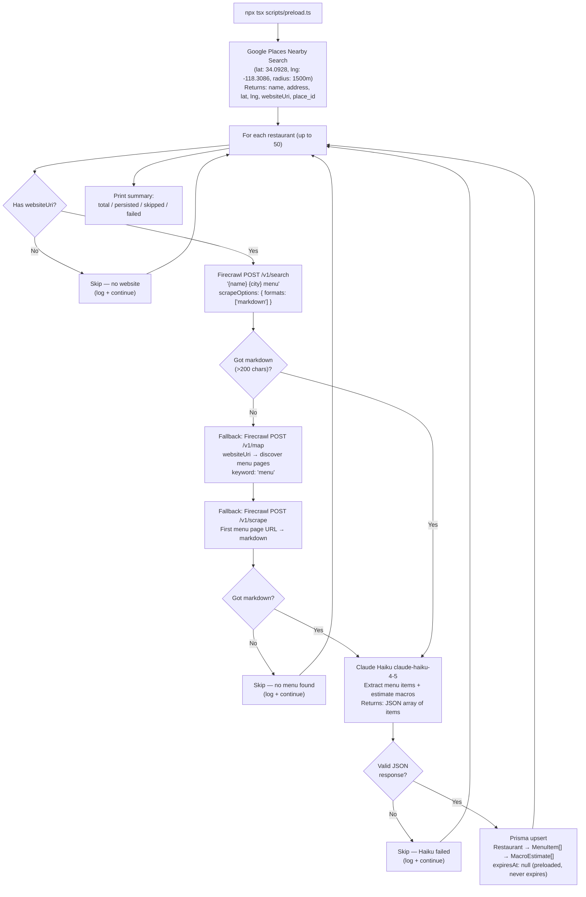

# Preload Pipeline Spec — S-11

> **Status**: APPROVED
> **Author**: CTO
> **Date**: 2026-03-24
> **Sprint**: S-11

---

## 1. Purpose

The preload script populates the PostgreSQL database with restaurant and menu data for a target geographic area before the API backend is deployed. It is a one-shot batch runner — not a production service. The API backend then serves this pre-populated data as a read-only query layer with no runtime scraping.

This spec covers the implementation of `scripts/preload.ts` targeting the 90029 zip code (~50 restaurants for MVP-0).

---

## 2. Pipeline Architecture



---

## 3. Stage Definitions

### 3.1 Discovery — Google Places Nearby Search

- **Endpoint**: `POST https://places.googleapis.com/v1/places:searchNearby`
- **Auth**: `X-Goog-Api-Key` header
- **Parameters**:
  - `locationRestriction.circle.center`: `{ latitude: 34.0928, longitude: -118.3086 }`
  - `locationRestriction.circle.radius`: `1500` (meters, ~1 mile)
  - `includedTypes`: `["restaurant"]`
  - `maxResultCount`: `20` (Google max per call; paginate via `pageToken` for more)
- **Field mask** (`X-Goog-FieldMask`): `places.id,places.displayName,places.formattedAddress,places.location,places.websiteUri,places.types`
- **Pagination**: Collect up to 3 pages (60 results total) to reach ~50 usable restaurants after filtering
- **Output**: Array of `{ placeId, name, address, lat, lng, websiteUri?, types[] }`

### 3.2 Menu Discovery — Firecrawl Search (Primary)

- **Endpoint**: `POST https://api.firecrawl.dev/v1/search`
- **Auth**: `Authorization: Bearer {FIRECRAWL_API_KEY}`
- **Request body**:
  ```json
  {
    "query": "{restaurantName} Los Angeles menu",
    "limit": 3,
    "scrapeOptions": { "formats": ["markdown"] }
  }
  ```
- **Success criterion**: At least one result with markdown content length > 200 characters
- **Concatenate**: Join markdown from all results with `\n\n---\n\n` separator
- **Cost**: ~$0.002/search

### 3.3 Menu Discovery — Firecrawl Map + Scrape (Fallback)

Triggered when search returns no usable markdown.

**Map step**:
- **Endpoint**: `POST https://api.firecrawl.dev/v1/map`
- **Request body**: `{ "url": websiteUri, "search": "menu" }`
- **Output**: Array of URLs matching "menu" on the restaurant's site
- **Take**: Up to 2 menu URLs

**Scrape step**:
- **Endpoint**: `POST https://api.firecrawl.dev/v1/scrape`
- **Request body**: `{ "url": menuPageUrl, "formats": ["markdown"] }`
- **Cost**: ~$0.00083/scrape

### 3.4 Macro Estimation — Claude Haiku

- **Model**: `claude-haiku-4-5`
- **One call per restaurant** — all items in a single prompt
- **Prompt structure**:
  ```
  System: You are a nutrition expert. Extract menu items from the provided text and estimate macros.

  User: Restaurant: {name}
  Menu text:
  {markdown (truncated to 8000 chars)}

  Return ONLY valid JSON (no markdown fences) in this format:
  [{"n":"item name","desc":"brief description","cat":"category","cal":500,"p":30,"c":40,"f":15,"conf":"HIGH|MEDIUM|LOW"}]

  Confidence levels:
  - HIGH: known chain item or very clear description with specific ingredients
  - MEDIUM: typical restaurant item with reasonable description
  - LOW: vague name, no description, or unusual item
  ```
- **Max tokens**: 4096
- **Parse**: `JSON.parse(responseText)` — if parse fails, skip restaurant
- **Cost**: ~$0.0005/restaurant

### 3.5 Persistence — Prisma Upsert

**Transaction order**: Restaurant → MenuItems → MacroEstimates

```
Restaurant upsert: externalPlaceId as unique key
  ↓
MenuItem upsert: (restaurantId, name) composite as unique key
  (create if not exists, update description/category if exists)
  ↓
MacroEstimate create: new record per run
  expiresAt: null (preloaded data never expires)
  hadPhoto: false (preload does not use photos)
```

---

## 4. Data Mapping

### 4.1 Google Places → Restaurant

| Places field | Prisma field | Notes |
|---|---|---|
| `id` | `externalPlaceId` | Unique key for upsert |
| `displayName.text` | `name` | |
| `formattedAddress` | `address` | |
| `location.latitude` | `lat` | |
| `location.longitude` | `lng` | |
| `types[]` | `cuisineTags` | Filter to cuisine-relevant types |
| detected from types | `chainFlag` | Heuristic: check `types` for chain indicators |
| `"google_places"` | `source` | Static string |

### 4.2 Haiku JSON → MenuItem + MacroEstimate

| Haiku field | Prisma field | Model |
|---|---|---|
| `n` | `name` | MenuItem |
| `desc` | `description` | MenuItem |
| `cat` | `category` | MenuItem |
| `cal` | `calories` | MacroEstimate |
| `p` | `proteinG` | MacroEstimate |
| `c` | `carbsG` | MacroEstimate |
| `f` | `fatG` | MacroEstimate |
| `conf` | `confidence` | MacroEstimate (`HIGH`/`MEDIUM`/`LOW`) |

---

## 5. Configuration

All configuration via environment variables. No hardcoded secrets.

| Variable | Purpose | Required |
|---|---|---|
| `DATABASE_URL` | Prisma connection string | Yes |
| `GOOGLE_PLACES_API_KEY` | Google Places Nearby Search | Yes |
| `ANTHROPIC_API_KEY` | Claude Haiku API | Yes |
| `FIRECRAWL_API_KEY` | Firecrawl search/map/scrape | Yes |
| `TARGET_LAT` | Target latitude (default: 34.0928) | No |
| `TARGET_LNG` | Target longitude (default: -118.3086) | No |
| `TARGET_RADIUS` | Search radius in meters (default: 1500) | No |
| `MAX_RESTAURANTS` | Max restaurants to process (default: 50) | No |

---

## 6. Error Handling

| Failure | Behavior |
|---|---|
| Missing required env var | Exit with error message listing missing vars |
| Google Places API error | Abort — no data to process |
| Google Places returns 0 results | Abort with message |
| Restaurant has no websiteUri | Skip + log (expected ~10-15% of results) |
| Firecrawl search fails / no markdown | Try map+scrape fallback |
| Map+scrape fallback fails | Skip restaurant + log |
| Haiku returns non-JSON or empty array | Skip restaurant + log |
| Haiku returns items with missing fields | Skip item, persist valid items |
| Prisma write fails | Log error, continue with next restaurant |

---

## 7. Output

The script prints structured progress to stdout:

```
[preload] Starting preload for 90029 (lat: 34.0928, lng: -118.3086)
[preload] Discovered 55 restaurants from Google Places
[preload] Processing Sqirl (1 of 55)...
[preload]   Firecrawl search: 3 results, 4200 chars of markdown
[preload]   Haiku: extracted 12 menu items
[preload]   Persisted restaurant + 12 items
[preload] Processing Café de Leche (2 of 55)...
...
[preload] Done.
[preload] Summary: 55 discovered / 47 persisted / 5 skipped (no website) / 3 skipped (no menu)
```

---

## 8. Running the Script

```bash
# Install dependencies (tsx required)
npm install

# Set environment variables
export DATABASE_URL="postgresql://..."
export GOOGLE_PLACES_API_KEY="..."
export ANTHROPIC_API_KEY="..."
export FIRECRAWL_API_KEY="..."

# Run (default: 90029 zip code)
npm run preload

# Or directly:
npx tsx scripts/preload.ts
```

---

## 9. Rate Limiting

| Service | Limit | Script behavior |
|---|---|---|
| Google Places | 100 RPS | Single batch call; no throttling needed |
| Firecrawl | 20 RPS | 500ms delay between restaurant batches |
| Claude Haiku | 50 RPS | Sequential per restaurant; no additional delay needed |
| Prisma/PostgreSQL | Connection pool | Single connection; sequential writes |

---

## 10. Exit Criteria

- [ ] Script runs to completion against 90029 without unhandled exceptions
- [ ] At least 40 of 50 attempted restaurants persist to DB (80% success rate)
- [ ] All menu items have MacroEstimate with `expiresAt: null`
- [ ] `npm run preload -- --dry-run` prints discovery results without writing to DB
- [ ] Type-checks cleanly with `npx tsc --noEmit`
