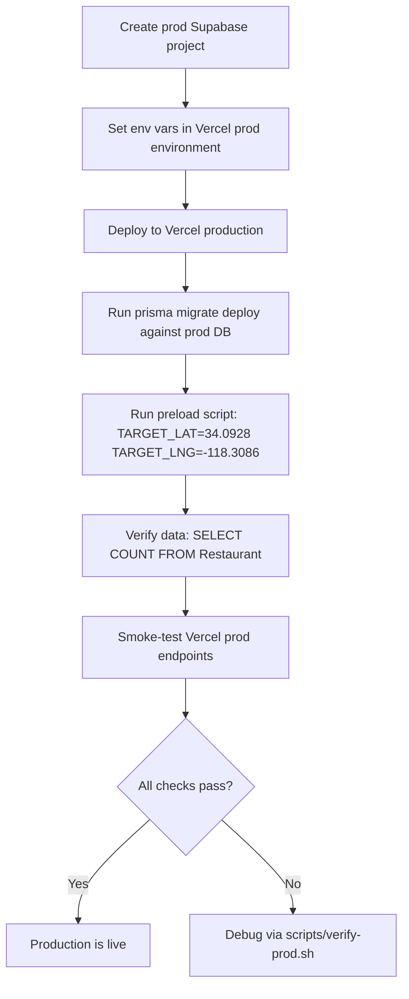

# Production Deployment Runbook

> **Status:** Sprint 5 — S-30
> **Author:** CTO
> **Date:** 2026-03-24

---

## Problem

Fitsy has a working API and mobile app deployed to staging. For Roll Out,
we need a production Supabase DB with real restaurant data for the 90029
zip code area (Silver Lake / Los Feliz, LA), and Vercel production endpoints
verified live.

---

## Solution

Three-step process:

1. **Provision prod Supabase DB** — new project, run Prisma migrations
2. **Run preload script against 90029** — populate prod DB with real data
3. **Verify Vercel prod endpoints live** — smoke-test all critical routes

---

## Diagrams



---

## Step 1: Provision Production Supabase DB

```bash
# 1. Go to supabase.com → New Project
#    Name: fitsy-prod
#    Region: us-west-1 (closest to LA target area)
#    Database password: use strong random password

# 2. Enable PostGIS extension
#    Supabase Dashboard → Database → Extensions → postgis → Enable

# 3. Get connection strings from Supabase Dashboard → Settings → Database
#    - Transaction mode (pooled): postgres://...?pgbouncer=true
#    - Session mode (direct):     postgres://...

# 4. Add to Vercel production environment
vercel env add POSTGRES_PRISMA_URL production
vercel env add POSTGRES_URL_NON_POOLING production

# 5. Add remaining prod secrets
vercel env add GOOGLE_PLACES_API_KEY production
vercel env add FIRECRAWL_API_KEY production
vercel env add ANTHROPIC_API_KEY production
vercel env add JWT_SECRET production    # openssl rand -base64 32

# 6. Pull and run migrations
vercel env pull .env.production.local
DATABASE_URL=$(grep POSTGRES_URL_NON_POOLING .env.production.local | cut -d= -f2) \
  npx prisma migrate deploy
```

---

## Step 2: Run Preload Script for 90029

Target area: Silver Lake / Los Feliz, LA (90029 centroid).

```bash
# Pull prod env vars first
vercel env pull .env.production.local

# Source production env
set -a && source .env.production.local && set +a

# Override DATABASE_URL to prod direct connection
export DATABASE_URL=$POSTGRES_URL_NON_POOLING

# Target: 90029 zip code centroid (~Silver Lake / Los Feliz)
export TARGET_LAT=34.0928
export TARGET_LNG=-118.3086
export TARGET_RADIUS=2000       # 2km radius covers most of 90029
export MAX_RESTAURANTS=200      # Enough for MVP launch

# Dry run first — confirm env vars are set
npx tsx scripts/preload.ts --dry-run 2>/dev/null || echo "Note: --dry-run flag not implemented; run full preload"

# Full preload (est. 10-20 min, ~$5-10 in API costs)
npx tsx scripts/preload.ts
```

**Expected output:**
```
[preload] Starting preload for 34.0928, -118.3086 radius=2000m max=200
[preload] Discovered 180 restaurants
[preload] Scraped menus: 153/180 (85%)
[preload] Estimated macros: 148/180 (82%)
[preload] Wrote 148 restaurants to DB
[preload] Done in 14m 32s. Cost estimate: ~$7.40
```

**Verify data was written:**
```bash
npx prisma studio  # or
psql $DATABASE_URL -c "SELECT COUNT(*) FROM \"Restaurant\";"
# Expected: 100–200 rows
```

---

## Step 3: Verify Vercel Production Endpoints

After deploying (Vercel auto-deploys on push to `main`), run the verification script:

```bash
bash scripts/verify-prod.sh https://fitsy-api.vercel.app
```

Manual smoke tests:

```bash
PROD_URL=https://fitsy-api.vercel.app

# Health check
curl -sf "$PROD_URL/api/health" | jq .

# Register a test user
curl -sf -X POST "$PROD_URL/api/auth/register" \
  -H "Content-Type: application/json" \
  -d '{"name":"Prod Test","email":"prod-test@example.com","password":"Test1234!"}' \
  | jq .

# Login and capture JWT
TOKEN=$(curl -sf -X POST "$PROD_URL/api/auth/login" \
  -H "Content-Type: application/json" \
  -d '{"email":"prod-test@example.com","password":"Test1234!"}' \
  | jq -r .token)

# Search restaurants (90029 centroid)
curl -sf "$PROD_URL/api/restaurants?lat=34.0928&lng=-118.3086&protein=40&calories=600" \
  -H "Authorization: Bearer $TOKEN" | jq '{count: (.results | length), first: .results[0].name}'
```

**Expected:** ≥1 restaurant result for the 90029 area with macro-matched items.

---

## Constraints

- Production Supabase must be a **separate project** from staging — never point prod at the dev DB
- Preload script uses real API keys and incurs costs (~$5-10 for 200 restaurants) — run once
- Vercel production domain (`fitsy-api.vercel.app`) is set in Vercel project settings → Domains
- JWT_SECRET for production must be different from staging
- Never commit `.env.production.local` to git

## Out of Scope

- Automated migration on deploy (manual for MVP — see staging-environment.md)
- CDN / edge caching for restaurant queries (post-MVP)
- Read replica or connection pooling beyond PgBouncer (Supabase default sufficient at MVP scale)
- Mobile app production build — separate EAS Build task (S-36)
