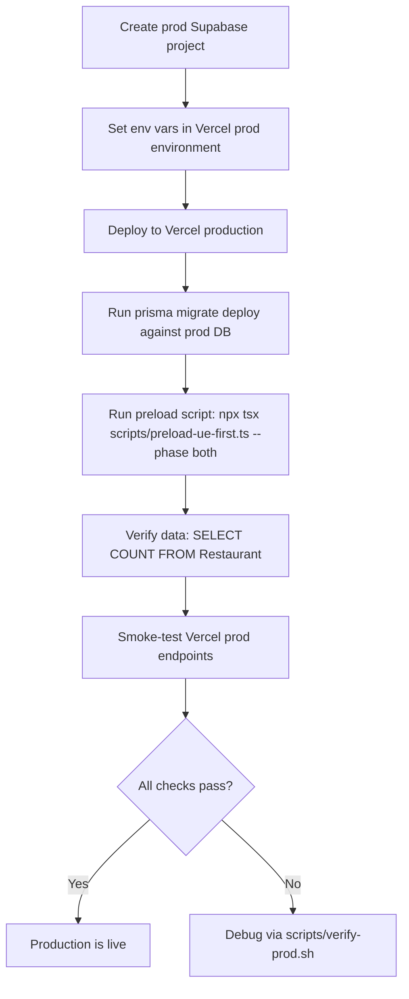

# Production Deployment Runbook

> **Status:** Living · **Last verified:** 2026-06-12
> **Author:** CTO
> **Originally drafted:** 2026-03-24 (Sprint 5 — S-30) · refreshed 2026-06-12

---

## Problem

Fitsy has a working API and mobile app deployed to staging. For Roll Out,
we need a production Supabase DB with real restaurant data for the 90029
zip code area (Silver Lake / Los Feliz, LA), and Vercel production endpoints
verified live.

---

## Solution

Three-step process:

1. **Provision prod Supabase DB** — new project, run Prisma migrations
2. **Run preload script against 90029** — populate prod DB with real data
3. **Verify Vercel prod endpoints live** — smoke-test all critical routes

---

## Diagrams


```mermaid
flowchart TD
    A[Create prod Supabase project] --> B[Set env vars in Vercel prod environment]
    B --> C[Deploy to Vercel production]
    C --> D[Run prisma migrate deploy against prod DB]
    D --> E[Run preload script: npx tsx scripts/preload-ue-first.ts --phase both]
    E --> F[Verify data: SELECT COUNT FROM Restaurant]
    F --> G[Smoke-test Vercel prod endpoints]
    G --> H{All checks pass?}
    H -- Yes --> I[Production is live]
    H -- No --> J[Debug via scripts/verify-prod.sh]
```

---

## Step 1: Provision Production Supabase DB

```bash
# 1. Go to supabase.com → New Project
#    Name: fitsy-prod
#    Region: us-west-1 (closest to LA target area)
#    Database password: use strong random password

# 2. Enable PostGIS extension
#    Supabase Dashboard → Database → Extensions → postgis → Enable

# 3. Get connection strings from Supabase Dashboard → Settings → Database
#    - Transaction mode (pooled): postgres://...?pgbouncer=true
#    - Session mode (direct):     postgres://...

# 4. Add to Vercel production environment
vercel env add POSTGRES_PRISMA_URL production
vercel env add POSTGRES_URL_NON_POOLING production

# 5. Add remaining prod secrets
vercel env add GOOGLE_PLACES_API_KEY production
vercel env add FIRECRAWL_API_KEY production
vercel env add ANTHROPIC_API_KEY production
vercel env add JWT_SECRET production    # openssl rand -base64 32

# 6. Pull and run migrations
vercel env pull .env.production.local
DATABASE_URL=$(grep POSTGRES_URL_NON_POOLING .env.production.local | cut -d= -f2) \
  npx prisma migrate deploy
```

---

## Step 2: Run UE-First Preload Pipeline

Target area: Silver Lake / Los Feliz, LA (LA-only launch). The pipeline is now **UE-first**: Uber Eats `getFeedV1` for discovery, FatSecret/UE direct API for chain macros, Claude Haiku for indie menus, Google Places for photo fallback only.

The primary script is `scripts/preload-ue-first.ts`. The canonical invocation reference and resume/troubleshooting procedures are in `docs/engineering/pipeline/runbook.md`.

### Required environment variables

| Variable | Purpose |
|----------|---------|
| `POSTGRES_PRISMA_URL` | DB connection (pooled) |
| `POSTGRES_URL_NON_POOLING` | DB migrations and preload writes (direct) |
| `ANTHROPIC_API_KEY` | Claude Haiku macro estimation (indie path) |
| `UE_LOC_COOKIE` | URL-encoded `uev2.loc` cookie (Uber Eats geo auth) |
| `GOOGLE_PLACES_API_KEY` | Optional — tier-3 photo fallback only |
| `AXIOM_TOKEN` | Optional — pipeline telemetry to `fitsy-pipeline` dataset |

### Available flags

| Flag | Description | Default |
|------|-------------|---------|
| `--phase discover\|enrich\|both` | Run discovery only, enrichment only, or both | `both` |
| `--hex-id HEX` | Run enrichment on a single res-7 hex | — |
| `--max-hexes N` | Limit Phase 2 to N pending hexes | 0 (unlimited) |
| `--dry-run` | Skip all DB writes in Phase 2; print plans | false |
| `--force` | Skip the post-fetch menuHash skip gate | false |
| `--days N` | Skip restaurants scraped within N days | 7 |
| `--run-id ID` | Explicit run ID; otherwise resumes or uses date-based ID | — |
| `--skip-preflight` | Skip UE + Anthropic preflight checks (offline testing) | false |

### Invocation

```bash
# Pull prod env vars
vercel env pull .env.production.local
set -a && source .env.production.local && set +a
export DATABASE_URL=$POSTGRES_URL_NON_POOLING

# Dry run first — confirm env and preflight pass
npx tsx scripts/preload-ue-first.ts --phase discover --dry-run

# Full pipeline — both phases
npx tsx scripts/preload-ue-first.ts --phase both

# Resume enrichment only (after a partial run)
npx tsx scripts/preload-ue-first.ts --phase enrich --run-id <run-id-from-prior-run>
```

> **Cost note:** API costs depend on the number of independent (non-chain) restaurants requiring Haiku estimation. Chains use FatSecret/UE direct and incur negligible LLM cost. A typical LA-area full run costs significantly less than the old Google Places + Firecrawl approach; confirm current estimates from the Axiom `fitsy-pipeline` dataset telemetry after a dry run. The old ~$5–10 estimate (Google Places + Firecrawl) no longer applies.

**Verify data was written:**
```bash
npx prisma studio  # or
psql $DATABASE_URL -c "SELECT COUNT(*) FROM \"Restaurant\";"
# Expected for LA: 80–120 restaurants
```

---

## Step 3: Verify Vercel Production Endpoints

After deploying (Vercel auto-deploys on push to `main`), run the verification script:

```bash
bash scripts/verify-prod.sh https://fitsy-api.vercel.app
```

Manual smoke tests:

```bash
PROD_URL=https://fitsy-api.vercel.app

# Health check
curl -sf "$PROD_URL/api/health" | jq .

# Search restaurants unauthenticated (LA centroid — auth is Apple/Google OAuth in production)
curl -sf "$PROD_URL/api/restaurants?lat=34.0928&lng=-118.3086&protein=40&calories=600" \
  | jq '{count: (.results | length), first: .results[0].name}'

# Note: authenticated endpoints require a Supabase-signed JWT from Apple/Google
# Sign in via the mobile app (EAS dev build) and copy the token from the keychain (SecureStore)
# to test protected routes manually.
```

**Expected:** ≥1 restaurant result for the 90029 area with macro-matched items.

---

## Constraints

- Production Supabase must be a **separate project** from staging — never point prod at the dev DB
- Preload script uses real API keys and incurs costs — run `--dry-run` first; check Axiom telemetry for estimates
- Vercel production domain (`fitsy-api.vercel.app`) is set in Vercel project settings → Domains; the **API project** (`fitsy-api`) is the real backend — the `fitsy` project is the marketing site
- `UE_LOC_COOKIE` must be a valid, unexpired `uev2.loc` cookie — re-capture via browser devtools if discovery returns 0 results
- Never commit `.env.production.local` to git

## Out of Scope

- Automated migration on deploy (manual for MVP — see staging-environment.md)
- CDN / edge caching for restaurant queries (post-MVP)
- Read replica or connection pooling beyond PgBouncer (Supabase default sufficient at MVP scale)
- Mobile app production build — separate EAS Build task (S-36)
