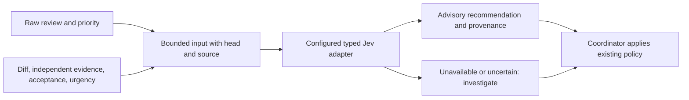

# On-demand review finding advice (#372)

The advisory CLI classifies one independent finding from bounded supplied evidence.
It never writes a review verdict, disposition sidecar, priority, required check, issue, queue card, or merge status.
The coordinator applies [the existing source-bound disposition policy](review-dispositions.md) and retains release authority.

Run `python3 scripts/review/advisory-finding.py path/to/finding.json` from this checkout.
The file contains one JSON object with `raw` (`verdict`, `priority`, `severity`, full 40-character `head`, `source`, and verbatim `finding`), bounded `context`, `evidence`, `urgency_rubric`, `acceptance_criteria` as `[{"id":"A1","text":"...","source":"https://..."}]`, and optional `owner` and `followup` for a real defect that might be deferred.
List only acceptance criteria mandatory for the current release; follow-up repair acceptance belongs in the linked follow-up issue.
The checked-in [shadow case inputs](../../../scripts/review/fixtures/advisory-cases.json) show examples with historical owner and follow-up outcomes withheld.
The optional `--config` accepts a private JSON file with `provider`, `model`, `endpoint`, `key_file`, and `usd_per_million_input_tokens` for the configured adapter.
The default reuses the verified #388 Jev credential reader and private credential file.
The JSON response includes the preserved raw verdict, priority, reviewed head and source, input hash, provider and model, recommendation, reason, confidence, a concrete criterion object for `fix_now`, owner and follow-up for `defer_with_owner`, latency, usage, provider-billed cost where available, a separate list-price estimate, and explicit fallback.
The committed [real provider receipt](review-finding-provider-receipt.json) shows a Jev `jev-1.13.0` call on a PR #389 finding without credentials.
An unavailable provider returns `status: unavailable` and `recommendation: investigate`; the deterministic fallback is the existing review policy.
Low disposition confidence, a low-confidence fix-now criterion, a P0/P1 deferral, or a missing deferral owner also yields investigation.

## Frozen shadow evaluation

The final exploratory [15 case inputs](../../../scripts/review/fixtures/advisory-cases.json) and separate [expected decisions](../../../scripts/review/fixtures/advisory-oracle.json) were frozen before the final model run, with SHA-256 values `227a7a80004e41ea19b95ea220414d72d1d4a677b9a337cb72cd28c3be1fd836` and `f91ba40b84ab935fce2200f697283b387edb6fa6de7f9f79a14ccb71d0d9061c`.
Thirteen cases use prior PR #389 independent lens findings or historical owner repairs, with the pre-existing source-bound owner outcome as the oracle.
Two explicit policy controls cover unsupported style advice and conflicting evidence; they are separate from historical defect accuracy.
The set includes orphan and timeout P1s, dependency lookup, stale alert, uninstall race, policy conflict, alternate reviewer recovery, mandatory acceptance, owned debt, and uncertainty.
The expected decision and historical owner and follow-up outcomes never enter the classifier input.
A fixture guard rejects those ownership fields before any provider call; the separate oracle retains actual follow-up links.
The evaluator supplies the same synthetic candidate owner and follow-up to every case, independent of its expected outcome.
That synthetic plan permits deferral advice in the shadow run but is not a real source-bound disposition or permission to defer a defect.
A spec review found outcome language in earlier case evidence; the leaky fixture is retained at `.evidence/372-advisory-cases-leaky.json`.
The final inputs remove that language and historical ownership outcomes, and were frozen with the unchanged independent oracle before this final provider run.
No success threshold was preregistered before model calls, so this is exploratory evidence rather than a threshold-passing validation.
A future validation needs prespecified blocker recall and false-deferral thresholds before collecting or running new cases.
The earlier pilot reported 4/4 intensity and 4/6 P2 disposition matches; that pilot did not measure blocker recall and is not counted as this run.

The first 16-call implementation run over-investigated because it required high confidence in a reason label even when the disposition was clear.
Its private receipt is `.evidence/372-advisory-evaluation-initial.json` and is retained, along with later wrapper revisions.
An oracle audit then found incorrect mappings of prior #388 P2 deferrals to fix-now and wrong follow-up links.
Those earlier scores are invalid for accuracy claims; `.evidence/372-advisory-evaluation-invalid-oracle.json` preserves the last one.
The corrected oracle uses the pre-existing #388 source-bound outcomes and was hashed before the final provider requests.
The first review repair exposed follow-up acceptance text incorrectly presented to Jev as mandatory current-release acceptance; the 6/15 diagnostic run is retained as `.evidence/372-advisory-evaluation-v6.json`.
The next reviews found contradictory evidence reasons could still accompany deferral, whitespace-only ownership could appear valid, and a reserved criterion ID could collide; their repairs and diagnostic runs are also retained.
The final 15-call run matched 9/15 expected decisions, with 2 missed fix-now recommendations, 0 emitted false deferrals, and 0 unnecessary fix-now recommendations.
The two misses were investigations rather than permissions to defer or merge, but Jev's raw choices for those cases were deferrals that the deterministic owner guard rejected.
The raw provider false-deferral count was therefore 2; neither the raw advice nor this small evaluation establishes blocker recall.
The earlier 12/15 result used historical owner and follow-up fields in the inputs and is invalid as evidence of independent classification; its receipt is retained at `.evidence/372-advisory-evaluation-v11.json`.
Mean raw provider-choice confidence was 0.913 on correct choices and 0.797 on wrong choices; the selected-choice Brier score was 0.1389 on this small sample.
When a deterministic guard changes the provider choice to investigate, the advisory confidence is unknown and the raw provider confidence remains separately visible.
The final 15 calls totaled 3,187 ms and an estimated $0.00073311 from returned input token counts and TypeSafe's [published $0.042 per million input token price](https://typesafe.ai/blog/introducing-system-one-models-and-jev).
Jev returned no billed amount for any of the 15 calls, so actual charged cost is unknown.
The earlier runs, including the outcome-leaking input run, and diagnostic calls are retained in private evidence and are excluded from the final-run cost and latency.
The detailed final receipt is `.evidence/372-advisory-evaluation.json` in the isolated checkout.

PR #389's issue-bound ledger recorded 2,214.447 seconds of independent review over 14 rounds at inspection.
That is measured reviewer execution, not repair time or hypothetical time saved by this advisor.
Repair time for those rounds was unavailable and remains unknown.
The observed disagreements rule out claims of blocker recall or production safety from this backtest.
This CLI has no canonical runner or poller integration; that work belongs to #378.
