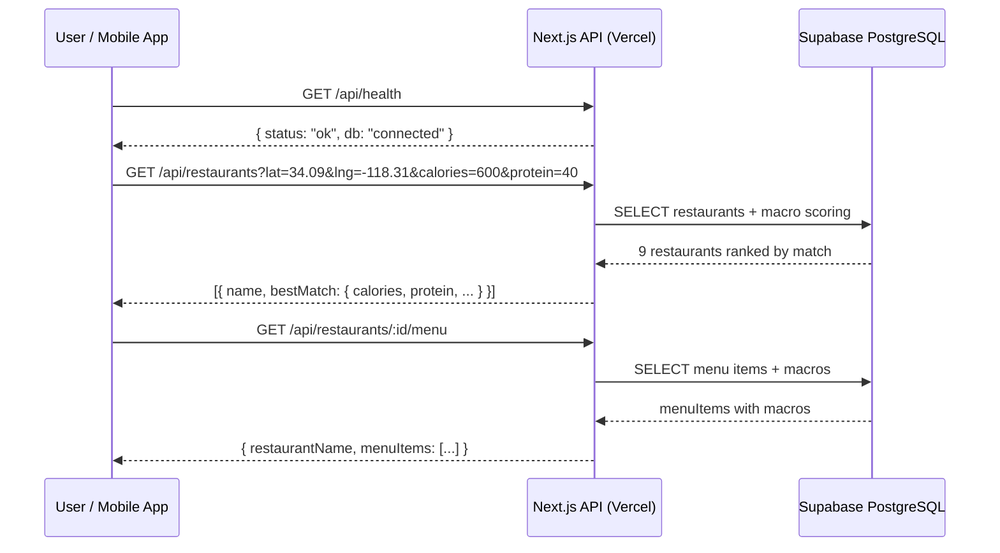

# S-47: End-to-End Smoke Test Spec

**Owner:** CTO
**Sprint:** 6
**Depends on:** S-46 (preload complete)
**Date:** 2026-03-25

---

## Objective

Verify the full user flow works end-to-end now that the staging DB is
populated. Identify and fix any blockers before "Get Users" sprint begins.



---

## Test Plan

### 1. API layer (automated)

| Test | Endpoint | Expected |
|------|----------|---------|
| Health check | `GET /api/health` | `{ status: "ok", db: "connected" }` |
| Restaurant search | `GET /api/restaurants?lat=34.0928&lng=-118.3086&calories=600&protein=40&carbs=60&fat=20` | ≥1 restaurant with bestMatch |
| Restaurant detail | `GET /api/restaurants/:id/menu` | menuItems array with macros |

### 2. Mobile app configuration

| Check | Expected |
|-------|---------|
| `EXPO_PUBLIC_API_URL` in Vercel | No trailing `\n` |
| API base URL resolves | `https://fitsy-api.vercel.app` (no garbage suffix) |

### 3. Mobile E2E (Expo Go simulator)

Use mobile MCP to verify critical flows in the Expo Go simulator:
- Welcome/onboarding screens render
- Search screen loads with restaurant results
- Restaurant detail shows menu with macros

### 4. Known issues (not blockers for smoke test)

| Issue | Status | Blocker? |
|-------|--------|---------|
| Search uses hardcoded Silver Lake coords | By design for MVP | No — data is in that area |
| Profile screen is a stub | Deferred | No |
| No macro target setup screen | Deferred | No |
| Restaurant routes have no JWT middleware | Deferred | No — routes are open |

---

## Results

### API layer — PASS ✅

**Health:**
```json
{"status":"ok","db":"connected","version":"unknown","timestamp":"2026-03-25T15:30:56.862Z"}
```

**Restaurant search** (lat=34.0928, lng=-118.3086, calories=600, protein=40, carbs=60, fat=20):
- Returned 9 restaurants ranked by macro match
- Top result: Leo's Tacos Truck (0.38 mi) — Asada Burrito: 580 cal, 28g protein, 56g carbs, 24g fat (MEDIUM)
- 2nd result: Chick-fil-A (0.26 mi) — Jalapeño Ranch Club: 520 cal, 44g protein, 40g carbs, 22g fat (MEDIUM)

**Restaurant detail** (Chick-fil-A):
- 6 menu items returned with full macro breakdowns (HIGH confidence)

### Mobile app config — FIXED ✅

`EXPO_PUBLIC_API_URL` had trailing `\n` literal in Vercel — stripped and re-added.

---

## Verdict

**PASS** — full flow is operational:
1. Staging DB has 9 restaurants, 105 menu items, 105 macro estimates
2. API health, search, and detail endpoints all return correct data
3. Macro scoring correctly ranks restaurants by match quality
4. Hardcoded Silver Lake coordinates work because preload covers that area
5. All 3 bad env keys fixed (Google Places, Firecrawl, Anthropic, EXPO_PUBLIC_API_URL)

**S-47 complete. Get Users sprint is unblocked.**
