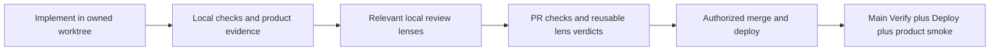

# Shipping a Fitsy change

This is the operational procedure for any coding harness or entry point, including Slack, Claude Code, Codex, and future supervisors.
The executable checks remain in `scripts/verify/registry.yml`, `scripts/verify/risk-tiers.yml`, and `scripts/review/`.
`autonomous-shipping.md` describes the broader design and historical rollout; where its older entry-point instructions differ, use this procedure and the executable checks.



## One branch owner and one review process

Inspect active worktrees and compare changes against each branch's merge base before integrating overlapping work.
Do not change another agent's checkout or force-push its branch.
Keep dependency chains explicit and rebase the dependent branch after its prerequisite lands.
Use a fresh checkout for integration/deployment when the primary checkout is occupied.
Do not use a feature-branch mobile publication as a substitute for integrating the intended release commit.

Run the following on the branch to be submitted:

```sh
npm run verify
# For changed production build behavior or required build evidence:
npm run verify:all
```

The pre-push hook runs layers 0–2 plus size/domain checks.
A hook pass does not replace the applicable product-flow verification or independent review.
The registry determines which checks apply and whether a check is blocking or shadow.

## Local product-flow gate

Local iPhone simulator E2E is the blocking baseline. CI continues static checks,
unit tests and builds; it does not need a cloud simulator. The optional L7 smoke
and experimental EAS workflow cannot satisfy `product-flow/local`.

`npm run verify` and pre-push validate `.evidence/product-flow/report.json` for
mobile, mobile-facing API, shared, schema and dependency changes. No relevant
changes produces an explicit `not_applicable` pass. Missing tools, missing
coverage, skipped/failed assertions, or stale/modified evidence are failures.

Use an owned worktree and the dev configuration from `npm run dev:env`. Keep
`EXPO_PUBLIC_*` values in its ignored mobile environment file; never put them in
evidence or PR text. The builder generates native iOS files, disables downloaded
OTA updates, and produces an embedded Release bundle. It records source, native
app, JS bundle, public-config digest, simulator and store identity. A keyless
build can check welcome navigation but cannot satisfy billing coverage.

```sh
node scripts/verify/product-flow.mjs --plan
export FITSY_SIM_OWNER=my-task
export MAESTRO_BIN="$HOME/.maestro/bin/maestro"
node --env-file=apps/mobile/.env.development.local scripts/sim/product-flow.mjs build <UDID>
node --env-file=apps/mobile/.env.development.local scripts/sim/product-flow.mjs run <UDID> <affected-flow-name>
# Capture the affected primary and recovery paths through Mobile MCP.
node --env-file=apps/mobile/.env.development.local scripts/sim/product-flow.mjs finish .evidence/walkthrough.json
npm run verify
```

The runner always executes cold-start and sign-in baseline flows. Add/select
Maestro scenarios in `apps/mobile/e2e/flows/` with YAML tags matching every
category in `--plan`; baseline flows alone never cover a changed journey.
Each changed-journey flow needs at least two non-optional assertions. Assert
the user outcome and recovery state, not just the existence of a screen.
Known regressions found through exploration become deterministic scenarios.

The walkthrough file is a JSON array, one entry per affected category:
`category`, `expected`, `observed`, `branches: ["primary", "recovery"]`,
`result: "pass"`, and `trace` (relative to `.evidence/product-flow/`). The trace
contains the actual timestamped Mobile MCP actions and screen observations.
Use run-owned synthetic accounts, identify fixtures with `FITSY_FIXTURE`, and
inspect artifacts for personal data/credentials before publication. Reviewers
judge scenario relevance and visual quality; a manifest cannot establish those.

The collector verifies that dev's deployed API/shared/schema matches the
candidate and remains unchanged during the run. Deploy those changes to dev
first; testing an older dev API cannot verify a candidate backend change.
Use a configured Apple simulator/store environment for subscription evidence
and explicitly record which real-store paths still need device/sandbox testing.

After committing, reviewing, pushing and opening the PR, publish the verdict:

```sh
node scripts/sim/publish-product-flow.mjs <PR_NUMBER>
```

The publisher requires a clean checkout matching the current PR head and current
main, validates evidence no more than 24 hours old, and attaches command reports,
screenshots and walkthrough traces to a **private draft** GitHub release. Keep
these drafts unpublished. It sets `product-flow/local` on that exact head.
Non-product PRs publish an explicit N/A result without needing a simulator.
Republish before merge; any code/test change requires new evidence. Required
status checks bind commits, not elapsed time; GitHub does not revoke an old
success automatically when its local report ages past 24 hours.

Main's required `product-flow/local` status enforces this local result remotely.
It shares the trusted developer/agent credential boundary of local review;
it is not a security attestation against a repository administrator. Preserve
existing required checks when configuring branch protection. Cloud simulator
execution can be promoted separately once reliable; it is not a launch blocker.

Commit the tested change locally before reviewing it with the local review runner; `--local` reviews committed `origin/main...HEAD`, not uncommitted edits.
Fetch the base first and ensure the branch contains the current review definitions.
If it predates the harness, rebase/update it deliberately in its own worktree before review; do not silently skip missing lenses.

Use the same lenses that the project poller selects:

| Condition | Required local lens |
|---|---|
| Low tier | `docs-sanity` (advisory) |
| Medium/high tier | `correctness` |
| High tier | Also `danger-zone` |
| Incident | Also `harness-audit` |
| PR declares `Spec:` | Also `spec-conformance` |
| CI/deployment paths selected by the poller | Also `workflow-security` |
| Test files selected by the poller | Also `test-quality` |

Determine the tier using `scripts/review/tier.mjs`; exact routing is in `scripts/review/poller.sh`.
Do not reinterpret every change as the highest tier.

```sh
bash scripts/review/run-lens.sh --local correctness
# Substitute/add each applicable lens from the routing above.
```

Address confirmed findings, commit the fixes, and rerun affected checks/lenses.
The runner caches by the diff, lens instructions, REVIEW.md, and model.
A matching post-PR pass should reuse the local verdict rather than duplicate the expensive review.
A changed diff or changed review inputs invalidates that reuse.
A rebase may alter the actual diff and requires checking again.

Local mode does not carry the full PR body into its review context.
For a spec-conformance judgment that depends on the PR's linked spec or acceptance text, ensure the reviewer actually reads that spec; require a PR-context review when the local evidence does not establish conformance.
Do not use the content-only cache as proof that changed requirements were reviewed.
The same applies when a reviewer relied on context outside the cached diff and that context changed.

Do not run a separate generic `/code-review ... high` after these project lenses solely because a global skill says to.
Use additional review only for a concrete uncovered risk or an explicit user request.

## PR, integration, and deployment

Open the PR with scope, intent, actual verification results, relevant evidence paths, and remaining limits.
Use `--body-file` for multiline CLI PR bodies.
Include `Spec:` or the incident reference where applicable.
Check the current PR head, its CI, and required lens statuses before merging; an earlier commit's green result is insufficient.
Follow existing task authorization for push, merge, migration, and deployment.
If the user has already authorized the complete shipping sequence, continue through it without repeatedly requesting the same authorization.
Do not treat a request to discuss or prepare a proposal as authority to publish it.

Use the existing release tooling and documentation:

- API/landing: inspect the appropriate Vercel deployment for the merged commit; these are separate projects.
- Mobile JS: `scripts/deploy/ota.sh` and the iOS release runbook own the production OTA procedure.
  Production exports must use the production environment and valid RevenueCat/Supabase configuration.
  Native dependency/configuration changes require the appropriate binary build; an OTA cannot supply native changes.
- Database: use the documented migration and rollback process; a successful Vercel deployment does not prove a migration ran.
- Rollback: `scripts/deploy/rollback.sh` plus the relevant deployment runbook; record the previous deployment/update and data rollback evidence before publishing risky changes.
- Documentation-only work has no mobile/API deployment requirement.

Once merged, inspect BOTH the main **Verify** workflow and the applicable **Deploy** workflow at the resulting commit.
The September workflow-lint incident showed that PR-only checks and a green deployment can coexist with a failing main Verify.
Do not report production completion while that distinction remains unchecked.
Recheck the applicable authenticated user path, not only a public health endpoint.

## Evidence for completion

Record the branch/PR, reviewed head, merge commit, deployment/update identity, check results, and rollback target.
Identify failures that were fixed separately from checks that remain skipped, shadow, or untested.
A screenshot or video should show the changed interaction; a successful build is not equivalent evidence.

For subscription/onboarding changes, explicitly name the states tested: new user, active subscriber, lapsed subscriber, restore, delete/recreate, and delayed synchronization where affected.
Record whether evidence comes from RevenueCat Test Store, Apple sandbox/StoreKit, or production behavior and configuration.
Do not claim complete real-store validation from a simulator/Test Store purchase.

For data work, identify the source/reference facts, preserved identities, before/after rows, writer path exercised, and rollback proof.
Distinguish synthetic fixtures and estimates from independently verified reference data.

Finish with a concise state report:

- What changed and where it is available.
- Which of local verification, PR checks, main Verify, deployment, and product smoke have passed, with evidence.
- Any remaining blocker or untested path, and the next owner/action.

A background process existing is not proof that it will wake its owner.
When waiting, retain durable task state and use the harness's supported completion notification mechanism.
If the runner cannot continue automatically, report that limitation rather than promise an unverified future follow-up.
