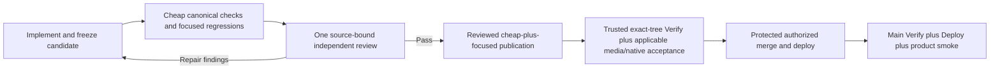

# Shipping a Fitsy change

The human-selected standalone Pstack `orchestrate-delivery`, `ship-branch` and `verify-fitsy` skills control coordination, evidence planning and shipping sequence.
Load the exact committed package paths supplied in the coordinator assignment.
Latest direct human instructions and issue-bound authorizations take precedence.
This document supplies supported command contracts, product acceptance, security/data protections and release requirements.
It does not impose another workflow, lifetime review count, automatic retry or budget increase.
The executable checks remain in `scripts/verify/registry.yml`, `scripts/verify/risk-tiers.yml`, and `scripts/review/`.
Historical recipes in `autonomous-shipping.md` and generic global skills do not select a competing pipeline.


```mermaid
flowchart LR
    A[Implement and freeze candidate] --> B[Cheap canonical checks and focused regressions]
    B --> C[One source-bound independent review]
    C -->|Repair findings| A
    C -->|Pass| D[Reviewed cheap-plus-focused publication]
    D --> T[Trusted exact-tree Verify plus applicable media/native acceptance]
    T --> E[Protected authorized merge and deploy]
    E --> F[Main Verify plus Deploy plus product smoke]
```

## One branch owner and one review process

Inspect active worktrees and compare changes against each branch's merge base before integrating overlapping work.
Do not change another agent's checkout or force-push its branch.
Keep dependency chains explicit and rebase the dependent branch after its prerequisite lands.
Define one accepted user outcome per PR, with acceptance evidence, non-goals, and one execution owner.
An API and mobile change may ship in one PR when their contract evolves together; split only independently useful and safe outcomes.
Distinguish actual blockers from preferred order, and verify a backward-compatible interface with a small end-to-end contract check before shipping an API-first sequence.
The domain and 600-line checks report scope for review; neither imposes an automatic split or replaces affected product and security gates.
Use a fresh checkout for integration/deployment when the primary checkout is occupied.
Do not use a feature-branch mobile publication as a substitute for integrating the intended release commit.

Freeze the accepted outcome and non-goals when validation starts.
Optional hardening and preferred abstractions remain owned follow-ups unless a reachable failure invalidates required acceptance.
A substantive new human requirement changes scope explicitly; acknowledge it and refreeze the candidate before continuing.
Finish implementation and commit the frozen candidate before review.
Select meaningful focused reproduction and regression tests for the changed behavior.
Run applicable structural, lint, type and safety checks plus that focused selection before independent review.
Independent review uses the [simple-review runner](../../../scripts/review/simple-review.md) and retained routing and severity rules.
The installed review caller publishes the existing `AI review` status for the exact candidate.
Local admission completes cheap checks and revalidates matching independent evidence through immutable trusted-main reviewer controls.
Reviewer execution remains separate, with attempts controlled by the installed local AI reviewer.

```sh
node scripts/verify/focused-tests.mjs --set scripts/verify/impact-plan.test.ts
npm run verify -- --stage=cheap
node --test scripts/review/simple-review.test.mjs
# After independent review, the retained local session revalidates protected evidence.
scripts/verify/shipping-session.mjs -- bash <task-owned-shipping-script>
```

Replace the focused test and task script with the accepted issue's meaningful regressions and applicable final acceptance commands.
Focused selection supports Jest, Node `.test.mjs` and Python `.test.py` through the canonical runner.
A focused selection is not full acceptance; correctness review still judges scenario relevance.
The retained local admission path validates the installed canonical review authority without executing the retired reviewer or reading review caches.
Missing canonical authority fails admission.
The review behavior suite proves runner behavior; it does not supply a candidate's independent verdict.

The live shipping session binds committed head, base, source/configuration, delivery issue, authorization and focused selection through acceptance and push.
Closing it removes execution ownership; a later session revalidates matching evidence without demanding another reviewer.
Final-candidate simulator acceptance requires that live ownership.
Source drift invalidates the session and requires affected evidence to be revalidated before shipping.
Raw admission attempts remain under `.evidence/review-admission/`.
`--stage=cheap` cannot satisfy final acceptance.
Hosted checks retain their independent required suites.
Apple/legal approvals, product-flow status, hooks, PR checks, main Verify, Deploy and actual affected release proof remain required.

Keep source frozen throughout checks, review and acceptance.
Source drift fails the run, and later source changes require current cheap checks, review and affected full acceptance.
Reuse unchanged verification receipts only through the canonical runners and preserve raw failure history for unfinished tasks.
Verification retains each stage attempt under `.evidence/verify/attempts/` and archives retired test receipts under `check-cache/history/`.
UI signoff and development walkthroughs precede final UI acceptance.
The publishable `final-candidate` simulator entry point requires the live shipping session's matching canonical review before native journeys.
Keep each publishable native journey and its finish inside live matching-review ownership, using `set -e` or `&&` to stop on failure.
For ordinary publication, run `scripts/verify/shipping-session.mjs -- git push -u origin HEAD` after freezing and reviewing the candidate.
The existing trusted public Verify supplies heavy validation before protected merge; applicable local media/native evidence may be completed separately against that same frozen head.
Development walkthroughs and UI signoff happen before that session.
Source or focused-selection drift invalidates the live admission and requires revalidation of cheap checks and affected review evidence; it never silently starts another reviewer.
Apple account, legal and submission approvals, required product-flow status, pre-push, PR, main Verify, Deploy and actual release acceptance remain required.

The pre-push hook revalidates the live source-bound independent review, runs cheap/focused checks plus size/domain checks, then rechecks live ownership.
It does not run local tests/builds as a publication prerequisite.
The independently installed external approval operator validates the existing Verify workflow bytes, approved candidate tree, PR base/head/merge tree, exact run/attempt/checksuite and successful standard-runner jobs from the GitHub Actions issuer before publishing required acceptance.
The existing per-issue `local_acceptance` policy pins `source_tree_sha` from the independently reviewed candidate and retains only the applicable local receipt/recipe/required checks, including real media when affected.
An empty local required-check set means no applicable local receipt, not permission to skip trusted CI or product-flow/release protections.
A hook pass does not replace the applicable product-flow verification or independent review.
The registry determines which checks apply and whether a check is blocking or shadow.
Removing obsolete structural exceptions belongs to the changed product domain only when every removed entry names a file in the same diff.
Allowlist additions, unrelated removals, deletion of the allowlist and unreadable history retain infrastructure ownership.

Changes under `scripts/sim/` or the product-flow verification controls run the blocking local `media-integration` lane in `npm run verify`.
Install `ffprobe` and `ffmpeg` locally before that run.
The lane runs real decoder and XCTest attachment cases, then records `.evidence/verify/media-integration.json` with the candidate SHA and source/test hash.
Hosted L2 runs deterministic tests without media tools.
After committing, rerun `node scripts/verify/run.mjs --only=media-integration --runs=local` so the receipt names the PR head.
The `product-flow/local` publisher checks that receipt before setting its exact-head status, including when mobile product evidence is not applicable.

**Local product-flow gate.** Local iPhone E2E is blocking for mobile-facing changes.
CI runs static checks, unit tests and builds; its optional simulator workflow remains experimental.
Applicable product acceptance and its exact-head publisher require fresh `.evidence/product-flow/report.json` when impact selection applies; ordinary publication does not claim that proof.
Missing tools, skipped/failed assertions, missing coverage and stale evidence fail; unrelated changes get explicit `not_applicable`.

Use an owned worktree, `npm run dev:env`, and an explicit simulator UDID.
Keep public configuration in the ignored mobile environment file.
The builder generates an embedded Release app, disables downloaded OTA updates, and records source/native/JS/configuration identities.
A keyless build proves navigation only and cannot cover billing.
Never publish credentials or personal data in evidence.

For RevenueCat Test Store, add `--test-store` to `build` and configure the public `EXPO_PUBLIC_REVENUECAT_TEST_KEY`.
This builds Debug without the dev launcher and uses an owned Metro server on port 8099.
Expo development bundles require a server connection; an embedded Debug bundle cannot initialize.
Each run starts its own server, refuses a busy port, and records its process, source, configuration and served-bundle hashes.
Keep that server running through walkthrough, publication and merge; the gate rechecks its identity and bundle.
Use `node scripts/sim/product-flow.mjs stop-metro` after shipping.
It only stops the recorded process; the usual development server is untouched.
Test Store evidence does not establish Apple sandbox billing behavior.

Both configurations use local simulator signing with Xcode's application entitlement so SecureStore can read and persist sessions.
Use a disposable simulator: iOS app reinstalls preserve keychain sessions.
For a fresh-account run, explicitly set `FITSY_SIM_RESET_KEYCHAIN` to that simulator's UDID.
This clears its entire keychain before the baseline and records the reset.
Never set it for a simulator containing accounts you need to keep.

```sh
node scripts/verify/product-flow.mjs --plan
export FITSY_SIM_OWNER=my-task MAESTRO_BIN="$HOME/.maestro/bin/maestro"
node --env-file=apps/mobile/.env.development.local scripts/sim/product-flow.mjs build <UDID>
# Inside the task-owned shipping script, invoked through shipping-session.mjs:
node --env-file=apps/mobile/.env.development.local scripts/sim/product-flow.mjs run <UDID> <affected-flow-name> --mode=final-candidate
# Capture affected primary and recovery paths through Mobile MCP, then:
node --env-file=apps/mobile/.env.development.local scripts/sim/product-flow.mjs finish .evidence/walkthrough.json
```

Cold-start and sign-in always run.
Add/select flows in `apps/mobile/e2e/flows/` tagged for every category in `--plan`, with at least two non-optional outcome assertions per changed journey.
Baseline flows cannot cover a paywall change.
Promote discovered regressions into deterministic scenarios.
Final candidate runs retain required assertions, raw Maestro commands, screenshots, XCTest capture receipts, timing and changed-journey walkthroughs without recording video by default.
When a reviewer explicitly requests video, add `--record-video` to the final candidate run; the runner retains complete untrimmed video and the validator checks each recording before publication.
Development runs remain separate from final publication even when recorded.

The walkthrough JSON is an array with one entry per category: `category`, `expected`, `observed`, `branches: ["primary", "recovery"]`, `result: "pass"`, and `trace` relative to `.evidence/product-flow/`.
Traces are JSONL: one `{at, command: {name}, result: {content}}` object per line, recording actual Mobile MCP actions and screen observations.
Identify run-owned synthetic fixtures with `FITSY_FIXTURE`; reviewers judge scenario relevance and visual quality.

### Keep mobile walkthroughs focused and recoverable

Before interacting, list the expected primary and recovery checkpoints, required assertions, and a task-appropriate action, retry and elapsed-time budget in the task evidence.
Use the accessibility screen or relevant subtree where supported to find visible controls and confirm semantic state.
Save complete successful Mobile MCP responses in the source-bound walkthrough trace, while bringing only the relevant controls and state change into working context.
Keep any failed response, including `isError: true`, in separate private diagnostic evidence because the product-flow validator rejects failed events in the walkthrough trace.
Record the failed attempt in the diagnostic action history and include a successful retry in the validated trace only after it actually changes or observes the required state.
If a target is offscreen, scroll to it deliberately, refresh the accessibility state, and verify reachability before tapping.
If accessibility data is missing or misleading, record that limitation and use a screenshot or another supported observation instead of inventing a selector.
Take screenshots at required outcomes and when checking layout, clipping, redundant controls or visual state that the accessibility tree cannot establish.
Inspect those images against the affected screen's acceptance criteria; semantic success alone does not establish visual quality.

Count attempts without a relevant state change across taps, selector variations, waits and restarts.
After two such attempts, save the current tree, screenshot and diagnostic action history, then diagnose the failed checkpoint before another action.
For a stale element, refresh the tree and reacquire the control.
For an overlay, inspect it, dismiss only a known safe overlay, and confirm the expected screen.
For delayed accessibility updates, use a bounded state-based wait and compare the screen image before treating the delay as an app failure.
At the planned budget boundary, record the failed step and cause through the normal recovery path; never turn a skipped assertion into a pass or replace it with a sleep.

Keep complete action responses and the selected raw log window in private task evidence, then read only a scoped excerpt during diagnosis.
For example, capture a short device window with `xcrun simctl spawn <UDID> log show --last 30s --style compact > .evidence/product-flow/device-log.txt`, then use `rg -n '<relevant-pattern>' .evidence/product-flow/device-log.txt` for the relevant lines.
Use `scripts/sim/sim logs --seconds 30 --grep '<relevant-pattern>'` when a quick bounded excerpt is sufficient.
Do not include credentials or personal data in published evidence.
Record actual tool calls, elapsed time, no-progress attempts, retries and evidence size if comparing flows; external speed claims are not Fitsy measurements.

```sh
node scripts/sim/publish-product-flow.mjs <PR_NUMBER>
```

The publisher requires a clean checkout matching the PR head and current main.
Deploy candidate backend changes to dev before testing.
The publisher rechecks source, app/configuration and backend identity, validates evidence no more than 24 hours old, and attaches verified commands, screenshots and traces to a **private draft** GitHub release.
Keep drafts unpublished.
Non-product PRs publish N/A without a simulator; `--include-baseline` optionally attaches a baseline validation run.

Main requires `product-flow/local` on the exact head.
Republish before merge; code/test changes require fresh evidence.
GitHub does not automatically expire an old success after 24 hours.
This trusts repository writers like the existing local reviews; it is not an attestation against an administrator.
Preserve existing required checks when configuring protection.
The shadow L7 smoke cannot satisfy this gate; cloud execution is not a launch requirement.

For a backend change before its first push, deploy a clean committed checkout with `vercel deploy --target=preview`, then assign the ready preview to dev during a coordinated test window.
The gate accepts Vercel's CLI `meta.gitCommitSha` identity as well as a Git deployment's `gitSource.sha`, rejects dirty CLI uploads, and still compares candidate backend contents and pins the deployment across the test and publication.

## Independent review

Use one independent read-only review of the exact candidate through `scripts/review/simple-review.mjs`.
The required review gate remains `AI review`, alongside the final `Verify` job.
Do not change branch protection as part of local review tooling cleanup.
The implementer cannot supply its own independent verdict.

The retained `scripts/route-reviewers.sh` maps changed paths to roles.
The runner always includes correctness and maps API/mobile to danger-zone, CTO to workflow-security, product-manager to spec-conformance, and design/GTM to docs-sanity.
`REVIEW.md` retains the severity definitions, evidence requirements and complete-domain JSON contract.
Missing domains, contradictory verdicts, malformed output, timeouts and provider failures never establish approval.
Only CONFIRMED P0/P1 findings block the review result.
P2/P3 and plausible findings remain visible with the raw verdict; custom disposition files and test-receipt fingerprints are retired.
Required product tests and essential acceptance criteria still block independently of finding priority.

The runner supports Codex only, defaults to `gpt-6-sol` with high reasoning effort, and accepts an explicit `FITSY_REVIEW_MODEL`.
The provider executes in a temporary home with a read-only sandbox, without GitHub credentials or inherited agent-session configuration.
The installed subscription caller uses the same routing and output validation with its local transport.
See [simple review](../../../scripts/review/simple-review.md) for inputs, exit codes and the behavior suite.

Use immutable trusted-base review controls against the exact checked-out PR head and merge-base diff.
The runner checks live commits, labels and PR state before publication and creates or updates one marked bot comment.
A stale or incomplete review cannot publish a passing result.
Review caches, approval fingerprints, compatibility lens statuses and repository poller scripts no longer supply review results.
Keep all findings visible and repair material defects and mandatory acceptance failures together.
After repair, review changed behavior and affected consequences against current source.
Before protected merge, require current trusted Verify and every applicable real-media/native flow.
Apple, legal, submission and release approvals remain applicable.

## PR, integration, and deployment

Open the PR with scope, intent, actual verification results, relevant evidence paths, and remaining limits.
State the coherent outcome, acceptance evidence, non-goals, owner, and blocking dependencies.
Use `--body-file` for multiline CLI PR bodies.
Include `Spec:` or the incident reference where applicable.
Check the current PR head, its CI, and the `AI review` status before merging; an earlier commit's green result is insufficient.
Follow existing task authorization for push, merge, migration, and deployment.
If the user has already authorized the complete shipping sequence, continue through it without repeatedly requesting the same authorization.
Do not treat a request to discuss or prepare a proposal as authority to publish it.

Use the existing release tooling and documentation:

- API/landing: inspect the appropriate Vercel deployment for the merged commit; these are separate projects.
- Mobile JS: `scripts/deploy/ota.sh` and the iOS release runbook own the production OTA procedure.
  Production exports must use the production environment and valid RevenueCat/Supabase configuration.
  Native dependency/configuration changes require the appropriate binary build; an OTA cannot supply native changes.
- Database: use the documented migration and rollback process; a successful Vercel deployment does not prove a migration ran.
- Rollback: `scripts/deploy/rollback.sh` plus the relevant deployment runbook; record the previous deployment/update and data rollback evidence before publishing risky changes.
- Documentation-only work has no mobile/API deployment requirement.

Once merged, inspect BOTH the main **Verify** workflow and the applicable **Deploy** workflow at the resulting commit.
The September workflow-lint incident showed that PR-only checks and a green deployment can coexist with a failing main Verify.
Do not report production completion while that distinction remains unchecked.
Recheck the applicable authenticated user path, not only a public health endpoint.

## Evidence for completion

Record the branch/PR, reviewed head, merge commit, deployment/update identity, check results, and rollback target.
Identify failures that were fixed separately from checks that remain skipped, shadow, or untested.
A screenshot or video should show the changed interaction; a successful build is not equivalent evidence.

For subscription/onboarding changes, explicitly name the states tested: new user, active subscriber, lapsed subscriber, restore, delete/recreate, and delayed synchronization where affected.
Record whether evidence comes from RevenueCat Test Store, Apple sandbox/StoreKit, or production behavior and configuration.
Do not claim complete real-store validation from a simulator/Test Store purchase.

For data work, identify the source/reference facts, preserved identities, before/after rows, writer path exercised, and rollback proof.
Distinguish synthetic fixtures and estimates from independently verified reference data.

Finish with a concise state report:

- What changed and where it is available.
- Which of local verification, PR checks, main Verify, deployment, and product smoke have passed, with evidence.
- Any remaining blocker or untested path, and the next owner/action.

A background process existing is not proof that it will wake its owner.
When waiting, retain durable task state and use the harness's supported completion notification mechanism.
If the runner cannot continue automatically, report that limitation rather than promise an unverified future follow-up.

Protected release entrypoints execute `scripts/verify/shipping-session.mjs` and `scripts/verify/run.mjs` directly, using their trusted system Env startup wrapper.
Do not launch them through a caller-configured `node` process: Node startup imports run before module code can validate admission.
The executable wrapper clears `NODE_OPTIONS` and `NODE_PATH` and fixes administrator interpreter search locations before Node starts.
For npm verification aliases, clear those startup options before invoking npm; the pre-push hook and protected live child environment enforce this for shipping.
