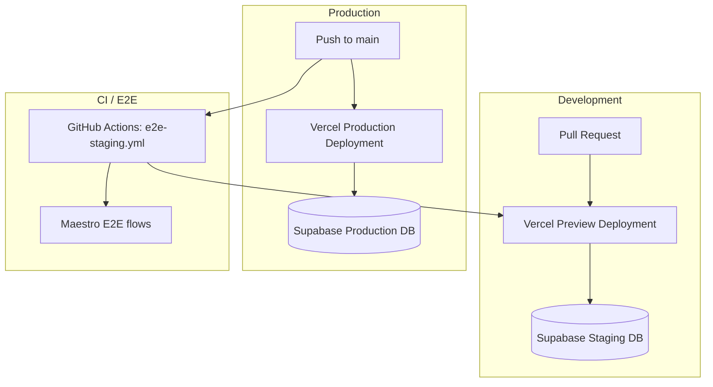

# Staging Environment Spec (S-24)

## Overview

Fitsy staging environment for validating PRs and running E2E tests before
they reach production. Uses Vercel Preview Deployments for the API and
a dedicated Supabase staging database.

## Architecture



## Environments

| Environment | Trigger | API URL | Database |
|-------------|---------|---------|----------|
| **Preview** | Every PR push | `https://fitsy-api-<hash>.vercel.app` | Supabase staging DB |
| **Production** | Push to `main` | `https://fitsy-api.vercel.app` | Supabase production DB |
| **Local** | `npm run dev:api` | `http://localhost:3000` | Local Postgres or dev tunnel |

## Setup Steps

### 1. Vercel Project

The API is deployed as a Next.js project on Vercel. The `vercel.json` at
root configures the build:

```json
{
  "buildCommand": "npm run build -w apps/api",
  "installCommand": "npm install",
  "framework": "nextjs",
  "outputDirectory": "apps/api/.next"
}
```

Vercel automatically creates preview deployments for every PR. No extra
config needed — it's already wired up.

### 2. Supabase Staging Database

The staging database is the same Supabase project used for development.
Production uses a separate Supabase project with separate credentials.

**Provisioning a fresh staging DB:**
```bash
# Pull staging env vars (Vercel ↔ Supabase integration auto-populates these)
vercel env pull .env.local

# Run migrations
npx prisma migrate deploy
```

**Required environment variables** (set in Vercel dashboard → staging/preview):

| Variable | Description |
|----------|-------------|
| `POSTGRES_PRISMA_URL` | Supabase pooled connection string |
| `POSTGRES_URL_NON_POOLING` | Supabase direct connection (for migrations) |
| `GOOGLE_PLACES_API_KEY` | Google Places API key |
| `FIRECRAWL_API_KEY` | Firecrawl API key |
| `ANTHROPIC_API_KEY` | Anthropic API key (Haiku) |
| `JWT_SECRET` | Random secret for signing JWTs (generate with `openssl rand -base64 32`) |

```bash
# Add JWT_SECRET to staging/preview environments
vercel env add JWT_SECRET preview
vercel env add JWT_SECRET development
```

### 3. E2E Tests

Maestro E2E flows run post-merge on `main` via `e2e-staging.yml`. They
require the `STAGING_API_URL` secret set in GitHub:

```bash
# Get your production/staging API URL from Vercel
vercel ls

# Set in GitHub secrets (repo settings → Secrets → Actions)
# STAGING_API_URL = https://fitsy-api-<your-project>.vercel.app
```

### 4. Running Migrations on Staging

After merging schema changes, apply the migration to the staging DB:

```bash
vercel env pull .env.local          # Get staging creds
npx prisma migrate deploy            # Apply pending migrations
```

This is done manually post-merge. A future improvement is to add this as
a Vercel deployment hook (Roll Out phase).

## Vercel CLI Workflow

```bash
vercel env ls                         # List all environment variables
vercel env pull .env.local            # Sync to local
vercel env add KEY prod               # Add/update a secret
vercel deploy --prebuilt              # Manual preview deploy
vercel --prod                         # Deploy to production
```

## Runbook: Validating a New Feature

1. Open a PR → Vercel creates a preview deployment automatically
2. Check the Vercel preview URL in the PR comments
3. Smoke-test auth endpoints: `POST /api/auth/register`, `POST /api/auth/login`
4. Smoke-test restaurant search: `GET /api/restaurants?lat=34.05&lng=-118.24`
5. Merge to `main` → E2E tests run automatically via Maestro
6. If E2E fails, check `maestro-screenshots` artifact in the GitHub Actions run

## What's NOT Staging Yet

- **Preload pipeline**: runs locally (`npm run preload`) or on CI — not deployed
- **Mobile app**: built via Expo EAS, not part of Vercel staging
- **Automated migration on deploy**: manual step for now
