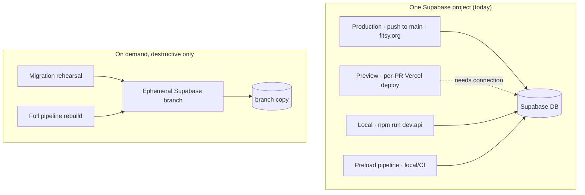

# Environments & Testing Strategy (S-24)

## Overview

How Fitsy validates changes before they reach users. The guiding principle:
**we run a single Supabase database and isolate by _operation type_, not by
maintaining a duplicate environment.** Reads are safe against production;
only destructive writes (full pipeline rebuilds, schema migrations) need
isolation, and those use an on-demand ephemeral Supabase branch — spun up
when needed, torn down after.

> **Reality check (verified 2026-06-12):** there is currently **one** Supabase
> project (`zaxkmjqozvmbifiwbxps`). Production (fitsy.org), local dev, and the
> preload pipeline all point at it. There is no separate "staging" or
> "production" database despite older versions of this doc describing two.
> Preview deployments do not yet have a DB connection (see Action Items).

## Why no duplicate DB

The API is a **read-only query layer** over preloaded data, so user traffic
can't corrupt the dataset. The only dangerous operations are:

1. **Schema migrations** — DDL that locks real tables (e.g. the provenance
   migration rebuilds a unique index on ~676k rows).
2. **Full pipeline rebuild** — the rare `TRUNCATE` path in
   `scripts/preload-ue-first.ts`. (Incremental refreshes are now safe in place:
   after the stable-ID change they upsert per restaurant and never wipe.)

A permanently duplicated, always-on environment is not worth the cost for
these. A Supabase **branch** gives a prod-scale copy on demand for pennies.

## Environments


```mermaid
graph TB
    subgraph "One Supabase project (today)"
        PROD[Production · push to main · fitsy.org] --> DB[(Supabase DB)]
        PREVIEW[Preview · per-PR Vercel deploy] -.needs connection.-> DB
        LOCAL[Local · npm run dev:api] --> DB
        PIPE[Preload pipeline · local/CI] --> DB
    end

    subgraph "On demand, destructive only"
        MIG[Migration rehearsal] --> BR[Ephemeral Supabase branch]
        REBUILD[Full pipeline rebuild] --> BR
        BR --> BRDB[(branch copy)]
    end
```

| Environment | Trigger | API URL | Database |
|-------------|---------|---------|----------|
| **Production** | Push to `main` | `https://fitsy.org` | The Supabase DB |
| **Preview** | Every PR push | `https://fitsy-api-<hash>.vercel.app` | Same DB (read-mostly) — **connection not yet wired** |
| **Local** | `npm run dev:api` | `http://localhost:3000` | Same DB via `vercel env pull` |
| **Ephemeral branch** | Manual, on demand | n/a | Supabase branch copy (destructive testing) |

## Testing flows — what to run where

| Testing need | Where / how | Touches prod DB? |
|--------------|-------------|------------------|
| Unit / integration (Jest) | `npm test`. Prisma is mocked, or wrap writes in a transaction and roll back. | No — no real DB |
| Type / structural / build | `npx tsc --noEmit` (per app), `scripts/structural-tests.sh`, `npm run build` | No |
| API behavior, PR smoke test | Vercel Preview deploy → hit the preview URL | Read-only — safe |
| Mobile QA | Mobile MCP + simulator against the Preview (or prod) API | Read + a little user-write — safe |
| Pipeline **incremental** refresh | `scripts/preload-ue-first.ts` (per-hex upserts) | Yes, but non-destructive (stable-ID upserts) |
| **Schema migration** | Rehearse on an ephemeral branch first, then `prisma migrate deploy` to prod | Isolated, then prod |
| **Full pipeline rebuild** (`TRUNCATE`) | Run on an ephemeral branch, validate, then promote / cut over | Isolated |

### Ephemeral branch — when and how (not set up yet)

We do **not** need this provisioned today (no users, no migration cadence). It
becomes necessary the first time you rehearse a migration or full rebuild
against real-scale data post-launch. When that time comes:

1. Create a Supabase branch from a recent snapshot (Supabase dashboard →
   Branches, or `supabase branches create`).
2. Point a throwaway `.env` at the branch connection string.
3. Run the migration / rebuild there; time it, check lock duration and row
   counts.
4. Either apply the validated migration to prod (`prisma migrate deploy`) or
   promote the rebuilt dataset (snapshot swap / cut-over).
5. Delete the branch.

Tracked as a pre-launch action item — see `docs/product/pre-launch-action-items.md`.

## Setup

### Vercel project

`fitsy-api` (live at fitsy.org). Build configured in root `vercel.json`.
Vercel auto-creates a preview deployment per PR — no extra config for the
deploy itself, but preview needs the DB env vars below to exercise the data
layer.

### Giving Preview the DB connection

The Supabase↔Vercel integration currently populates `POSTGRES_PRISMA_URL`,
`POSTGRES_URL_NON_POOLING`, `POSTGRES_URL`, and `POSTGRES_PASSWORD` for
**Production** and **Development** only — **Preview** is missing them, so
per-PR previews can't query the DB.

Preferred fix (survives credential rotation): **Vercel dashboard →
Integrations → Supabase → enable the Preview environment**, so the integration
manages the Preview vars too.

CLI alternative (run interactively — the non-interactive `--yes` form is
refused for "all Preview branches"):

```bash
vercel link --project fitsy-api
for V in POSTGRES_PRISMA_URL POSTGRES_URL_NON_POOLING POSTGRES_URL POSTGRES_PASSWORD; do
  vercel env add "$V" preview   # paste the same value used for Production
done
```

Note: with one shared DB, Preview deploys can write user-scoped data (saved
items, profiles) to prod. Acceptable pre-launch; once an ephemeral-branch /
snapshot workflow exists, point Preview at that instead of prod.

### Local dev / required env vars

```bash
vercel env pull .env.local   # syncs the DB connection + API keys
npx prisma migrate deploy    # apply pending migrations (see below)
```

Key variables (managed via Vercel; see root `CLAUDE.md` for the full table):
`POSTGRES_PRISMA_URL` (pooled, runtime), `POSTGRES_URL_NON_POOLING` (direct,
migrations), `ANTHROPIC_API_KEY`, `UE_LOC_COOKIE`, `BRAVE_API_KEY`,
`SLACK_BOT_TOKEN`.

## Running migrations

```bash
vercel env pull .env.local       # get DB creds
npx prisma migrate deploy         # apply pending migrations
```

Done manually post-merge. Because this hits the live DB, rehearse anything
non-trivial (index rebuilds, type changes, backfills over large tables) on an
ephemeral branch first. A future improvement is a Vercel deploy hook.

## Runbook: validating a feature

1. Open a PR → Vercel creates a preview deployment automatically.
2. Hit the preview URL from the PR comments (needs the Preview DB connection
   above to exercise data routes).
3. Smoke-test auth: `POST /api/auth/register`, `POST /api/auth/login`.
4. Smoke-test search: `GET /api/restaurants?lat=34.05&lng=-118.24`.
5. Merge to `main` → production deploy triggers automatically.
6. Run local E2E via mobile MCP if the change touches mobile.

## What's NOT automated yet

- **Preview DB connection** — missing; see Action Items.
- **Ephemeral branch workflow** — documented above, not provisioned.
- **Migration-on-deploy** — manual step for now.
- **Preload pipeline** — runs locally / on CI, not a deployed service.
- **Separate prod vs. non-prod DB** — single DB today; the destructive-op
  isolation strategy above is the intentional substitute.
