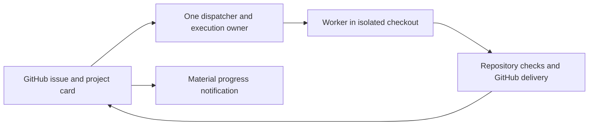

# Task management and worker ownership

> **Status:** living · **Last verified:** 2026-09-26

## Authority

The [Fitsy Delivery GitHub Project](https://github.com/users/dgmolla/projects/1) is the authoritative queue for Fitsy deliverables.
GitHub issues hold outcomes, acceptance criteria, dependencies, ownership, and follow-ups.
The project records the current stage and explicit blocker fields, while pull requests and Actions provide source-bound delivery evidence.
Do not start a second writable backlog.
Existing authorized work continues under its existing owner during migration.

| System | Responsibility |
| --- | --- |
| GitHub Issues and Fitsy Delivery Project | Deliverable, priority, dependencies, acceptance, execution owner, current stage, and blockers. |
| FM or an explicitly delegated coordinator | Claim work, supervise workers, reconcile evidence, and update the same issue. |
| Repository and GitHub | Canonical checks, source-bound review, PR/merge identity, deployment and verification receipts. |
| Slack | Notifications linked to the issue and evidence; never a separate task queue. |

## One issue, one execution owner

Search for an existing issue before creating one.
Each independently testable deliverable records its outcome, acceptance criteria, priority, dependencies, owning role, execution owner, and applicable release surface.
Use the real GitHub issue number in branch and PR references.
Link related PRs, Actions runs, deployment receipts, and source-bound follow-up issues rather than copying raw logs or credentials into the project.
Apply existing PR scope and review rules from [shipping.md](shipping.md); this contract adds no approval or review gate.

One dispatcher assigns the execution owner before starting a worker.
An FM task delegated to a Codex coordinator remains owned by that coordinator until explicit transfer or completion; FM must not dispatch a competing implementation.
Parallel subtasks have explicit file/behavior boundaries and report to that owner.
Before transfer, persist current source, evidence, running operations, blockers and next action, confirm the prior owner stopped or released ownership, then record the successor.
An issue assignment alone is not an atomic process lock; use FM's supported ownership/session controls for runtime exclusion.
If ownership cannot be established, reconcile it before launching another worker.

## Stages and evidence

Use the project's existing `Queued`, `In flight`, and `Done` statuses instead of creating duplicates.

| Project status | Required meaning |
| --- | --- |
| Queued | Accepted work awaiting priority or dependencies. |
| In flight | A named execution owner is implementing, validating, reviewing, integrating, or verifying the release. |
| Done | Applicable main checks, release verification and acceptance passed, with linked receipts. |

Record ready, review, merge, and deployment milestones in the issue with the source-bound receipts, not as new project statuses.
Record blocked reason, blocker owner, next action, and next check separately from the current project status.
Documentation-only work records deployment as not applicable.
For mobile, distinguish OTA publication, native binary distribution, and observed device uptake; one does not establish the others.
P2/P3 follow-ups retain the source-bound disposition and named acceptance from the review contract; creating an issue alone does not satisfy that contract.

## Progress and elapsed time

Before implementation in an owned worktree, bind the real issue with `node scripts/delivery/phase-events.mjs bind --issue N`.
Start an observed implementation interval with `begin --phase implementation` and save its returned attempt ID in the task handoff.
End that attempt with `end --attempt-id ID --status pass` before verification, or use `interrupted` when pausing.
Start a new implementation attempt for later fixes; never stretch an old interval across testing or review.
The verify runner, review runner, and product-flow CLI record their own attempts when an issue is bound.
Product-flow `build`, `run`, `finish`, and `check` attempts remain distinct; a completed build is not completed E2E acceptance.
Before opening the PR, begin a `shipping` attempt and end it only after applicable main Verify, Deploy, and acceptance receipts are confirmed.
Use `node scripts/delivery/phase-events.mjs publish` at material transitions and at least hourly while active; it reconciles bounded issue comments for each logical run.
Long runs use stable transport shards without splitting worker identity or dropping attempts.
Comment count is not worker count.
Interrupted attempts retain their observed result; a hard-killed worker can leave an unfinished attempt whose duration remains unknown.
If publication reports a retained lock, inspect its owner and confirm no publisher is active before removing only that lock; reconcile uncertain GitHub writes and never remove the pending-publication guard blindly.
The pre-push hook requires a valid issue binding and attempts publication after its existing gates, but a GitHub outage leaves local timing evidence pending without bypassing those gates.
The [hourly delivery report](hourly-delivery-report.md) summarizes measured phase intervals and keeps missing evidence explicit.

Record actual UTC timestamps for request, ready, work start, PR opened, required gates ready, merged, deployed, and acceptance verified.
Preserve unknown historical values rather than substituting commit times or reconstructing imaginary work starts.
The execution owner sets the project's `Started at` to the observed ISO UTC time when work starts.
At material progress or a blocker, update `Progress`, `Next action`, `Last progress at`, and the existing Blocker/Dependencies fields on that project item.
Set `Verified at` only after acceptance and applicable main Verify, Deploy, and release receipts are linked; a merge or issue close is not verified delivery.
The [hourly delivery report](hourly-delivery-report.md) uses only valid timestamp pairs and counts missing values as unknown.
Report request-to-verified-delivery separately from PR-open-to-merge, queue time, active execution, and blocked time.
Do not sum overlapping reviewer/test durations and label the result wall time.
Update the issue at material transitions, failures, ownership changes, and completion.
For active work, publish a fresh checkpoint at the configured reporting interval; a missed checkpoint is a liveness signal, not permission to repeat stale progress.
Use one configured reporting path with stable event identities and confirmed delivery receipts.
Honor the task's communication authorization before sending external notifications.
If reporting is unavailable, record the gap in the active handoff and report it through the current user conversation.

## Worker lifecycle

A persistent FM supervisor may outlive many tasks; task workers must have a current purpose.
Use a fresh worker context for a new unrelated issue, preserving reusable evidence and repository state outside the conversation.
Resume the same issue only from its current compact handoff and verified source/evidence identities.
A paused worker records the hold reason, next owner/action, and explicit wake condition; pause its periodic progress reporting.
Reconcile workers on completion and on the supervisor's normal heartbeat.
After recording completion, use FM's canonical teardown for the completed worker when no child work, owned running operation, pending delivery, or unrecorded evidence remains.
Keep a completed worker only for a documented recovery need with an owner and expiry/recheck condition.
Do not keep it idle indefinitely as a substitute for durable task state.
Do not kill workers solely because of elapsed age, and do not restart them to evade review budgets or erase failed attempts.
Worker retirement and worktree deletion are separate operations: preserve unmerged changes, source-bound evidence, review history, and release/rollback receipts.
Release simulator, Metro, database and other resource claims only through their ownership-aware procedures.

## Cutover and recovery

Inventory existing FM and local rollout items, then map each deliverable to an existing or newly created GitHub issue.
Preserve completed PR/deployment links and unresolved findings; do not import old completed generations as new work.
Store returned issue identifiers before attempting another create; reconcile uncertain writes before retrying.
Record verified dependencies and the single dispatcher, then mark the previous backlog as a reference to the Fitsy Delivery project.
Confirm issue reads, a real task update, owner reconciliation and the configured notification path before declaring the integration operational.
During an outage, preserve a bounded pending-update log keyed by issue and event identity under the current dispatcher.
Continue already-owned authorized work when safe; do not dispatch duplicate work or claim unsynchronized statuses were delivered.
Replay and reconcile the pending updates after recovery, retaining their original observed timestamps.

### Persistent reviewers and timing coverage

Every PR body includes exactly one `Delivery-Issue: #N` line within its first 4,000 characters, naming the authoritative outcome issue.
PR-mode review runners isolate their timing binding by PR under `.evidence/review-delivery/` and publish on closeout.
Missing, ambiguous or conflicting issue metadata creates an explicit timing gap and never borrows another task's binding.
The poller publishes again after its selected lenses finish to reconcile their combined evidence.
GitHub reporting outages retain local events and do not convert a failed review into a passing gate or block a passing review.
Historical accepted observations count as tracked coverage; stale checkpoints remain a separate liveness signal even when their phases are outside the 24-hour duration window.

At each review round closeout, record confirmed findings, impact priority, and either the detector plus prevention change or an owned follow-up under the review disposition contract.
If no new hardening is warranted, state that explicitly instead of manufacturing a change.
Publish shipped improvements using the [hourly report evidence contract](hourly-delivery-report.md#local-phases-and-review-hardening); queued fixes do not count as shipped improvements.
