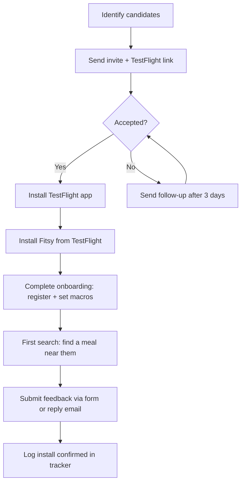

# TestFlight Recruiting Runbook

**Task**: S-58
**Owner**: CTO
**Last updated**: 2026-03-25

## Overview

This runbook covers how to recruit, onboard, and track Fitsy's first 10 TestFlight beta testers. The goal is to get fitness-conscious people using the app on real devices, confirm installs, and collect structured first-week feedback.



---

## Step 1 — Find the First 10 Testers

Target profile: fitness-conscious people who track macros or care about what they eat at restaurants. They do not need to be technical.

### Priority channels

| Channel | Notes | Target # |
|---------|-------|----------|
| Personal network: gym friends, fitness buddies | Highest conversion — warm intro | 3–4 |
| Local gym members (posted flyer or direct ask) | Easy to follow up in person | 2–3 |
| r/Fitness, r/MacroFit, r/BodyweightFitness | Post a "looking for beta testers" thread; DM responders | 2–3 |
| Twitter/X fitness community | Post from personal account + relevant hashtags (#IIFYM, #MacroTracking, #FitnessTech) | 1–2 |

### Qualifying question (before sending invite)
Ask one question to qualify: "Do you ever look up nutrition info when eating out?" Anyone who says yes is a good candidate.

### What to send alongside the invite
Use the invite message in Step 3 below. Invite message templates are tracked in a separate GTM task (S-58b). Send the Apple TestFlight link once the tester confirms they have an iPhone (iOS 16+).

---

## Step 2 — Send the Invite

### App Store Connect — add tester by Apple ID

1. Go to [appstoreconnect.apple.com](https://appstoreconnect.apple.com)
2. Select **Fitsy** → **TestFlight** → **External Testing**
3. Click the **Fitsy Beta** group (or create it if it doesn't exist)
4. Click **+** → **Add Tester** → enter tester's Apple ID (email)
5. Apple sends the tester a TestFlight invite email automatically

Alternatively, send the **public TestFlight link** (available in the group settings) — testers can join without you adding them one by one. Use this for Reddit/Twitter outreach.

### Tracking the invite

Log each invite in the install tracker (see Step 4) immediately when sent. Do not wait for confirmation.

---

## Step 3 — Onboarding Message

Send this message alongside the TestFlight invite (via DM, iMessage, or email). Invite message templates are tracked in a separate GTM task (S-58b).

**Short version for DMs:**
```
Hey [Name]! I'm building Fitsy — an app that finds restaurants near you with
meals that match your macro targets. I'd love for you to be one of the first
10 people to try it. Takes about 5 minutes. Here's the TestFlight link: [LINK]

Once you install it:
1. Create an account
2. Set your macro targets (protein/carbs/fat)
3. Search for food near you and tap a result

Reply to this message with what you think — even one line helps!
```

---

## Step 4 — Track Install Confirmations

Use the table below (or mirror it in Notion/Airtable) to track every tester:

| # | Name | Contact | Invited | Installed | First Search | Feedback Received |
|---|------|---------|---------|-----------|--------------|-------------------|
| 1 |      |         |         |           |              |                   |
| 2 |      |         |         |           |              |                   |
| 3 |      |         |         |           |              |                   |
| 4 |      |         |         |           |              |                   |
| 5 |      |         |         |           |              |                   |
| 6 |      |         |         |           |              |                   |
| 7 |      |         |         |           |              |                   |
| 8 |      |         |         |           |              |                   |
| 9 |      |         |         |           |              |                   |
| 10|      |         |         |           |              |                   |

**Definition of "Installed"**: tester replies or messages saying they can see the Fitsy app in TestFlight.
**Definition of "First Search"**: tester has run at least one restaurant search and seen results.
**Definition of "Feedback Received"**: tester has sent at least one structured response (see checklist below).

---

## Step 5 — First-Week Testing Checklist (for testers)

Share this checklist with each tester after they install the app:

```
Fitsy Beta — First Week Checklist

Day 1 (15 minutes):
  [ ] Create an account (register with email + password)
  [ ] Set your macro targets on the profile screen (protein, carbs, fat)
  [ ] Search for food near you — do the results look right for your area?
  [ ] Tap a restaurant — does the menu load? Do macros show?

Day 2–5 (whenever you eat out):
  [ ] Use Fitsy before or during a real meal out — did it help you choose?
  [ ] Note any restaurants or meals that seem wrong or missing

Day 7 (5 minutes):
  [ ] Answer the feedback questions below and reply to this message

Feedback questions:
  1. Did the app install and open without issues? (yes/no)
  2. Did GPS find restaurants near you? (yes/no/sometimes)
  3. Were the macro estimates believable? (yes/no/unsure)
  4. What's the one thing you'd change first?
  5. Would you use this regularly? (yes/maybe/no — one sentence why)
```

---

## Step 6 — Follow-Up Cadence

| Day | Action |
|-----|--------|
| Day 0 | Send invite + onboarding message |
| Day 3 | Follow up if no install confirmation: "Did the TestFlight link work?" |
| Day 7 | Send feedback request with checklist |
| Day 10 | Final nudge for feedback if none received |
| Day 14 | Close loop — thank tester, note status in tracker |

---

## Support FAQ — Common TestFlight Questions

**"I don't see the app after accepting the invite."**
Open the TestFlight app (download from App Store if needed), then pull down to refresh. The build may take a few minutes to appear after accepting.

**"TestFlight says the app is not available in my region."**
This should not happen for internal/external testing groups. Ask them to check that their Apple ID matches the one you invited.

**"The app crashes on launch."**
Ask them to: (1) delete and reinstall from TestFlight, (2) confirm iOS version is 16 or later. If it still crashes, ask them to enable crash reporting in TestFlight settings and send the crash log.

**"I can't create an account — it says my email is already taken."**
They may have registered previously. Have them try the login screen instead. If locked out, note it as a bug.

**"GPS isn't finding restaurants near me."**
Ask them to check: Settings → Privacy → Location Services → Fitsy → set to "While Using". If already enabled, note it as a bug in the tracker.

**"The macros look way off for a meal I know."**
This is expected in beta — macro estimates come from an LLM pipeline and will have some error. Ask them to note the specific meal and what they expected. This is valuable feedback.

**"How do I update when a new version is available?"**
TestFlight will notify them automatically. They can also open the TestFlight app and tap "Update" next to Fitsy.

---

## Success Criteria for S-58

- [ ] 10 testers invited
- [ ] 7+ installs confirmed (70% install rate)
- [ ] 5+ testers complete at least one restaurant search
- [ ] 5+ structured feedback responses received by Day 14
