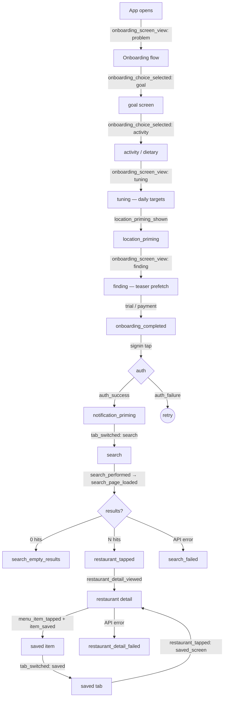

# Analytics event taxonomy

Last updated: 2026-05-09 (Sprint 12, S-222 + post-S-225 priming reorder).

This is the canonical list of every PostHog event the Fitsy mobile client
fires. The runtime contract lives in
`apps/mobile/lib/analytics.ts` — every event has a typed `track*` helper
and is pinned by tests in `apps/mobile/lib/analytics.test.ts`. The naming
convention is `snake_case` for both event names and property names.

If you add an event, update three places in lockstep:
1. add a `track*` helper in `apps/mobile/lib/analytics.ts`,
2. add a test in `apps/mobile/lib/analytics.test.ts`,
3. add a row to the relevant table below.

PostHog ingestion config (S-222 baseline): `flushAt: 1`, `flushInterval: 5000`.
Events should land in PostHog within ~5 seconds during the pre-launch period;
revert to defaults (`flushAt: 20`, `flushInterval: 30000`) before public
launch — frequent flushes increase battery use.

## Funnel diagram

Each labelled edge is the event that fires at that transition. Drop-off
between any two edges is measurable as a PostHog funnel step.

## Identity

| Event | When | Properties | Question it answers |
|-------|------|------------|---------------------|
| `$identify` (via `identifyUser`) | After successful auth (Apple, Google, dev) | `email?`, `goal?`, `activity_level?`, `macro_protein?`, `macro_carbs?`, `macro_fat?`, `macro_calories?` | Stitch anonymous → identified events; segment by goal/activity |
| `$reset` (via `resetAnalyticsSession`) | On explicit logout | none | Drop attributed user from subsequent anonymous events |

## Onboarding

| Event | When | Properties | Question it answers |
|-------|------|------------|---------------------|
| `onboarding_screen_view` | On mount of every `app/welcome/*` screen | `screen_name: string` | Per-step drop-off across the 15-screen onboarding |
| `onboarding_choice_selected` | User picks an option on `goal`, `activity`, or `dietary` | `screen: string`, `value: string` | Which goals / activity levels / dietary tags do testers actually pick? |
| `onboarding_completed` | Tap "Start Free Trial" on `payment` | `goal?`, `activity_level?`, `has_weight: boolean`, `has_height: boolean` | Conversion: of those who started, how many completed onboarding? |

### Onboarding API failures (S-221)

| Event | When | Properties | Question it answers |
|-------|------|------------|---------------------|
| `stats_fetch_failed` | `/api/stats` errors during `data-scale` | `error_message?` | Frequency of stats endpoint failures during onboarding |
| `preview_fetch_failed` | `/api/restaurants` preview call errors during `finding` / `results` | `error_message?` | Frequency of preview endpoint failures |
| `save_macro_targets_failed` | AsyncStorage write fails persisting macro targets | `error_message?` | Frequency of macro persistence failures (linked to retry dialog) |

## Auth

| Event | When | Properties | Question it answers |
|-------|------|------------|---------------------|
| `auth_success` | `/api/auth/*` returns a session for Apple / Google / dev login | `provider: 'apple' \| 'google' \| 'dev'`, `is_new_user: boolean` | New-user vs returning-user split per provider |
| `auth_failure` | Any auth provider call rejects (excluding user cancellation) | `provider`, `error_message?` | Reliability of each auth path |

## Session (S-228)

| Event | When | Properties | Question it answers |
|-------|------|------------|---------------------|
| `session_refreshed` | Supabase `onAuthStateChange` rotates the access token | `user_id: string` | Background refresh frequency / token TTL |
| `session_refresh_failed` | Refresh token rejected → SIGNED_OUT | `user_id: string` | Forced-logout rate — refresh-token reuse / expiry frequency |

## Location (S-224, S-225, S-227)

| Event | When | Properties | Question it answers |
|-------|------|------------|---------------------|
| `location_permission_denied` | `useLocation` falls back from a denied OS permission | `had_last_known: boolean` | Permission denial rate; whether we still served a usable last-known location |
| `location_timeout` | `useLocation` GPS lookup exceeds the timeout | `had_last_known: boolean` | Slow-GPS rate per platform |
| `location_error` | GPS lookup throws (catch-all) | `error_message?` | Rare iOS/Android GPS errors |
| `location_manual_override_opened` | User taps the location chip in the search masthead | none | Discoverability of the manual-override sheet |
| `location_manual_override_picked` | User chooses a preset neighborhood | `neighborhood: string` | Which presets get used; whether we need more |
| `location_manual_override_cleared` | User taps "Use current location" | none | How often manual users return to GPS |

### Notification priming (S-226b)

| Event | When | Properties | Question it answers |
|-------|------|------------|---------------------|
| `notification_priming_shown` | Mount of `welcome/notification-permission` | none | Reach of the priming screen |
| `notification_priming_allow_tapped` | User taps "Allow notifications" | none | Click-through rate to the OS dialog |
| `notification_priming_skip_tapped` | User taps "Skip" | none | Skip rate at the priming step |
| `notification_permission_granted` | OS dialog returns `granted` | none | Permission opt-in conversion |
| `notification_permission_denied` | OS dialog returns `denied` | none | Permission opt-out rate |

## Tab navigation (S-222)

| Event | When | Properties | Question it answers |
|-------|------|------------|---------------------|
| `tab_switched` | User taps a tab in the bottom bar | `tab: 'saved' \| 'search' \| 'profile'`, `from_tab: TabId \| null` | Top-level engagement: which tabs do users actually visit? |

## Search (S-230, S-222)

| Event | When | Properties | Question it answers |
|-------|------|------------|---------------------|
| `search_performed` | `/api/restaurants` first-page request resolves (success or error) | `has_protein_target`, `has_carbs_target`, `has_fat_target`, `has_calories_target`, `cuisine_filter`, `result_count`, `location_source`, `success` | Search volume, target/cuisine combos, success rate |
| `search_page_loaded` | Each page (initial + paginated) lands | `page_index`, `result_count`, `cursor: string \| null` | Pagination depth distribution |
| `search_pagination_end_reached` | `nextCursor` flips to null | `total_results`, `pages_loaded` | How often do users exhaust the result set? |
| `search_empty_results` | Search succeeded but returned 0 rows | `cuisine_filter`, `has_protein_target`, `has_carbs_target`, `has_fat_target`, `has_calories_target` | Filter-too-aggressive rate (distinct from network failures) |
| `search_failed` | `/api/restaurants` throws / errors | `cuisine_filter`, `error_message?` | Search-API reliability |
| `cuisine_selected` | User taps a cuisine chip in the search masthead | `cuisine: string` | Which cuisines drive engagement |
| `macro_targets_edited` | User applies the FilterPopup (search or profile) | `entry_point: 'search' \| 'profile'`, `has_protein`, `has_carbs`, `has_fat`, `has_calories` | How often do users actually tune macros after onboarding? |

## Restaurant detail (S-229, S-222)

| Event | When | Properties | Question it answers |
|-------|------|------------|---------------------|
| `restaurant_tapped` | User taps a restaurant card | `restaurant_id`, `restaurant_name`, `position`, `entry_point: 'hero' \| 'dish_card' \| 'section' \| 'saved_screen'`, `best_match_calories?` | Click-through rate by entry surface / list position |
| `restaurant_detail_viewed` | `/api/menu/[id]` resolves successfully | `restaurant_id`, `item_count` | Detail-screen views; baseline for save / tap funnels |
| `restaurant_detail_failed` | `fetchMenu` returns null (network or non-2xx) | `restaurant_id`, `error_message?` | Detail-API reliability |
| `menu_search_typed` | User types in the menu search input (throttled: emit on first/clear/every 5 chars) | `query_length: number` | Whether menu search is discoverable & used |
| `menu_filter_chip_toggled` | User taps a filter chip on the detail screen | `chip: string`, `on: boolean` | Which dietary / macro chips drive filtering |
| `menu_sort_changed` | User picks a sort option | `sort: string` | Match vs Protein vs Calories vs Price preference |
| `menu_item_tapped` | User taps a menu item card | `menu_item_id`, `restaurant_id`, `position` | Per-item engagement / position bias |

## Saving items

| Event | When | Properties | Question it answers |
|-------|------|------------|---------------------|
| `item_saved` | `/api/saved-items` create or delete succeeds | `menu_item_id`, `restaurant_id`, `action: 'save' \| 'unsave'`, `entry_point: 'restaurant_detail' \| 'saved_screen'` | Save volume / unsave rate per surface |
| `save_failed` | `/api/saved-items` create or delete fails | `menu_item_id`, `restaurant_id`, `action`, `entry_point`, `error_message?` | Save-API reliability |

## Profile (S-222)

| Event | When | Properties | Question it answers |
|-------|------|------------|---------------------|
| `profile_field_edited` | User taps any editable stat in profile | `field: 'goal' \| 'activity' \| 'height' \| 'weight' \| 'age'` | Which fields get adjusted post-onboarding? |
| `profile_logout_tapped` | User taps "Log out" | none | Explicit-logout rate (vs forced-logout via session_refresh_failed) |
| `profile_account_deleted` | `DELETE /api/user` resolves | `success: boolean` | Account-deletion volume + delete-API reliability |

## Naming conventions

- Event names: `snake_case`, verb-led where possible
  (`restaurant_tapped`, `search_performed`, `save_failed`).
- Property names: `snake_case`. Booleans use `has_*` or `is_*` prefixes.
- `entry_point` is reserved for events that fire from multiple surfaces:
  use it whenever the same logical action can be reached from more than
  one screen, so funnels can split by surface without re-deriving from
  screen-view sequences.
- Failure events end in `_failed` (e.g. `auth_failure` is the historical
  exception kept for backward compatibility — do not rename).
- Screen-view events use `_view` (singular) for the legacy
  `onboarding_screen_view` pattern; new ones should use `_viewed` (past
  tense) — see `restaurant_detail_viewed`.

## Out of scope

- Paywall events ship with S-217 (subscription gating). Don't pre-instrument here.
- This doc tracks the mobile client; backend events (Vercel logs) live in `docs/engineering/backend/`.
