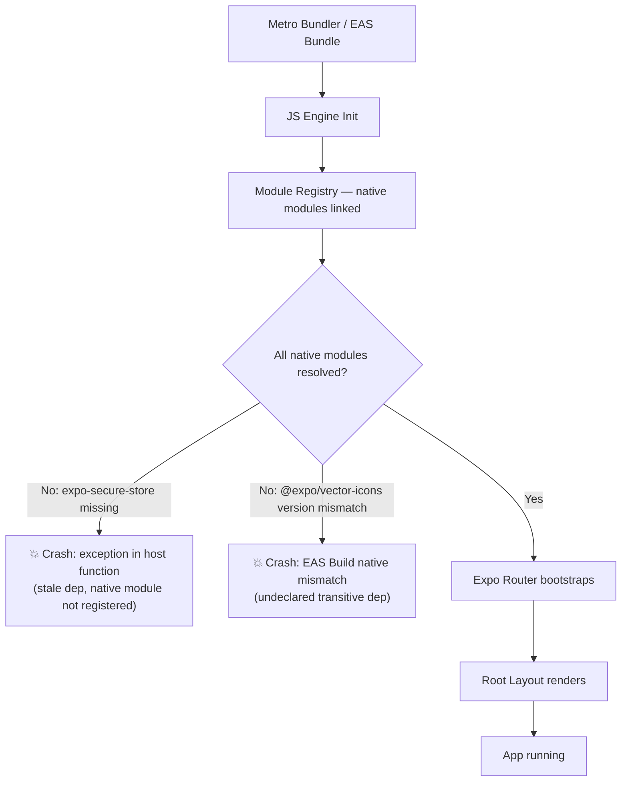

# Mobile Crash Fix — S-53b Frontend Spec

## Overview

Expo Go and EAS builds were crashing at startup due to two dependency issues
introduced during the Expo SDK 52 → 54 upgrade. This spec documents the root
cause, the fix applied, and how to verify the fix.

---

## Root Cause

Two separate issues combined to break the Expo boot sequence:

### 1. `@expo/vector-icons` — undeclared transitive dependency

`@expo/vector-icons` was consumed transitively (pulled in by `expo-router`)
but not declared in `apps/mobile/package.json`. When EAS Build resolved
packages for the native bundle, it picked up the transitive version rather
than the SDK-compatible version, causing a native module mismatch and a
crash in the host function bridge.

Fix: declare `"@expo/vector-icons": "^14.0.0"` explicitly in
`apps/mobile/package.json`.

### 2. `expo-secure-store` — stale dependency

`expo-secure-store` was removed in S-52 (replaced by `AsyncStorage` for
Expo Go compatibility), but its entry in `package.json` was not cleaned up.
The stale reference caused the module resolver to attempt to load a native
module that was no longer registered, triggering a crash during the JS
engine's module init phase.

Fix: remove `expo-secure-store` from `apps/mobile/package.json` and delete
the dead mock at `apps/mobile/__mocks__/expo-secure-store.ts` and its
`moduleNameMapper` entries in `apps/mobile/jest.config.js`.

---

## Expo Boot Flow — Where the Crashes Occur

---

## Files Changed

| File | Change |
|------|--------|
| `apps/mobile/package.json` | Add `@expo/vector-icons ^14.0.0`; remove `expo-secure-store` |
| `package-lock.json` | Updated to reflect dependency changes |
| `apps/mobile/__mocks__/expo-secure-store.ts` | Deleted (dead mock) |
| `apps/mobile/jest.config.js` | Remove `'^expo-secure-store$'` from `moduleNameMapper` in both test projects |

---

## Verification

1. `npm test` — all mobile tests pass without the stale mock
2. `npx expo start` in Expo Go — no crash on boot
3. EAS Build — iOS build completes and app launches on device

---

## Related

- S-52: original `expo-secure-store` → `AsyncStorage` migration
- S-53 / PR #79: CTO-domain changes (cross-domain companion)
- S-53b / PR #84: this fix (frontend domain)
