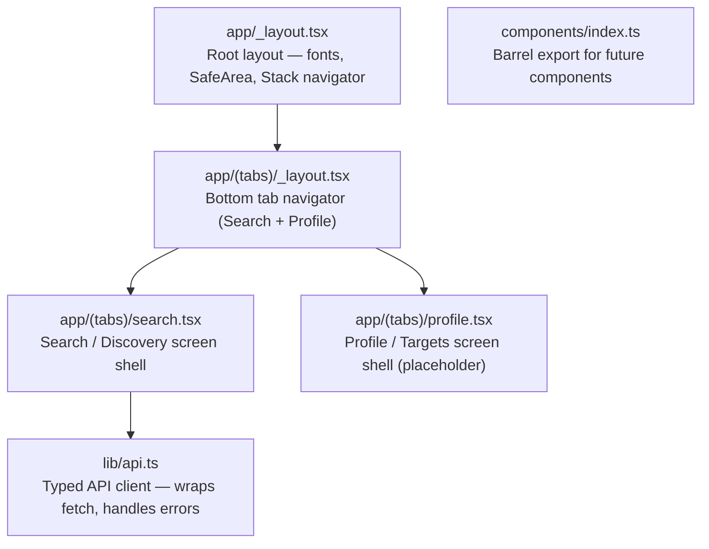
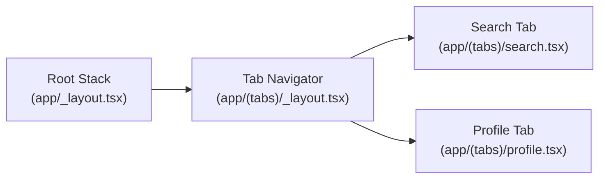

# S-16: Mobile App Scaffold Spec

> **Status**: Approved
> **Author**: Frontend Engineer
> **Date**: 2026-03-24
> **Ticket**: S-16 — Scaffold mobile app: Expo Router, bottom tab nav, Search screen shell

---

## 1. Overview

This spec covers the initial scaffold for the Fitsy React Native (Expo) mobile
client. The goal is a runnable shell that establishes the navigation structure,
API client layer, and the Search screen skeleton — ready for feature work in
subsequent sprints.



---

## 2. Scope

### In scope (S-16)
- Root Expo Router layout (`app/_layout.tsx`) — fonts not loaded yet (deferred to component sprint), SafeAreaProvider, Slot
- Bottom tab navigator (`app/(tabs)/_layout.tsx`) — two tabs: Search and Profile
- Search screen shell (`app/(tabs)/search.tsx`) — static layout with TargetBar placeholder and empty restaurant list state
- Profile screen shell (`app/(tabs)/profile.tsx`) — placeholder screen
- API client module (`lib/api.ts`) — typed `get()` helper wrapping `fetch`, base URL from env
- Component barrel export (`components/index.ts`)
- Remove `.gitkeep` placeholders in directories that receive real files

### Out of scope (future sprints)
- Expo Font loading (Inter, SpaceMono) — requires font assets
- Design system tokens implementation
- All component implementations (MacroPill, RestaurantCard, etc.)
- Actual API data fetching and list rendering
- State management (Zustand or Context — to be decided)
- Auth / user session

---

## 3. Navigation Structure



- **Root layout**: `Stack` from `expo-router` with a single `(tabs)` group
- **Tab bar**: Bottom tab navigator using `Tabs` from `expo-router`. Two tabs:
  1. `Search` — icon: `search`, label: "Search"
  2. `Profile` — icon: `person`, label: "Profile"
- **Tab bar styling**: Use `@expo/vector-icons` `Ionicons` for tab icons; active color `#2D7D46` (brand primary), inactive `#6B7280` (neutral-500)

---

## 4. Screen Specs

### 4.1 Search Screen (`app/(tabs)/search.tsx`)

Shell layout only — no live data yet.

```
┌──────────────────────────────────────────┐
│  SafeAreaView                            │
│  ┌────────────────────────────────────┐  │
│  │  TargetBar placeholder             │  │
│  │  "Set macro targets to get         │  │
│  │   personalized results"            │  │
│  └────────────────────────────────────┘  │
│                                          │
│  ┌────────────────────────────────────┐  │
│  │  FlatList (empty)                  │  │
│  │  ListEmptyComponent:               │  │
│  │  "Enter your location to find      │  │
│  │   nearby restaurants"              │  │
│  └────────────────────────────────────┘  │
└──────────────────────────────────────────┘
```

**Requirements:**
- `SafeAreaView` with `flex: 1` and `backgroundColor: '#FFFFFF'`
- Target bar area: `View` with placeholder text — `"Set macro targets to get personalized results"` in `colors.neutral[500]`
- `FlatList` with `data={[]}` — `ListEmptyComponent` showing empty state message
- No inline styles — use `StyleSheet.create()`
- `accessibilityLabel` on the empty state text: `"No restaurants found. Enter location to search."`

### 4.2 Profile Screen (`app/(tabs)/profile.tsx`)

Minimal placeholder — exact implementation in a future sprint.

```
┌──────────────────────────────────────────┐
│  SafeAreaView (centered)                 │
│  "Profile — coming soon"                 │
└──────────────────────────────────────────┘
```

---

## 5. API Client (`lib/api.ts`)

Typed fetch wrapper. All API calls in components go through this module — never direct `fetch` calls.

```typescript
// lib/api.ts

const BASE_URL = process.env.EXPO_PUBLIC_API_URL ?? 'http://localhost:3000';

async function get<T>(path: string): Promise<T> {
  const res = await fetch(`${BASE_URL}${path}`);
  if (!res.ok) {
    const body = await res.json().catch(() => ({}));
    throw new Error(body.error ?? `Request failed: ${res.status}`);
  }
  return res.json() as Promise<T>;
}

export const api = { get };
```

- Uses `EXPO_PUBLIC_API_URL` env var (Expo's public env prefix)
- Falls back to `localhost:3000` for local development
- Throws on non-2xx responses with parsed error message
- Generic `get<T>()` so callers get typed responses
- No POST/PUT/DELETE yet — search and menu are read-only endpoints

---

## 6. Component Barrel (`components/index.ts`)

Empty barrel export file — establishes the pattern for future component exports:

```typescript
// components/index.ts
// Component barrel — export all public components from this file.
// Screens import from '@/components', not from individual component files.
```

---

## 7. File Manifest

| File | Action |
|------|--------|
| `apps/mobile/app/_layout.tsx` | Create — root Expo Router layout |
| `apps/mobile/app/(tabs)/_layout.tsx` | Create — bottom tab navigator |
| `apps/mobile/app/(tabs)/search.tsx` | Create — search screen shell |
| `apps/mobile/app/(tabs)/profile.tsx` | Create — profile screen shell |
| `apps/mobile/lib/api.ts` | Create — API client |
| `apps/mobile/components/index.ts` | Create — barrel export |
| `apps/mobile/app/.gitkeep` | Delete |
| `apps/mobile/components/.gitkeep` | Delete |
| `apps/mobile/lib/.gitkeep` | Delete |

---

## 8. Dependencies

No new runtime dependencies required for this scaffold. The following are
already in `apps/mobile/package.json`:

| Package | Version | Use |
|---------|---------|-----|
| `expo` | ~52.0.0 | Base Expo SDK |
| `expo-router` | ~4.0.0 | File-based navigation |
| `react-native` | 0.76.5 | Core RN |

`@expo/vector-icons` ships with Expo — no separate installation needed.

---

## 9. Pre-PR Checklist

- [ ] `bash scripts/structural-tests.sh` — PASS
- [ ] `npx tsc --noEmit` — PASS (from `apps/mobile/`)
- [ ] `npm test` — PASS (from root)
- [ ] `npm run build` — PASS (if applicable)
- [ ] Single-domain: only `apps/mobile/` and `docs/engineering/frontend/` files changed
