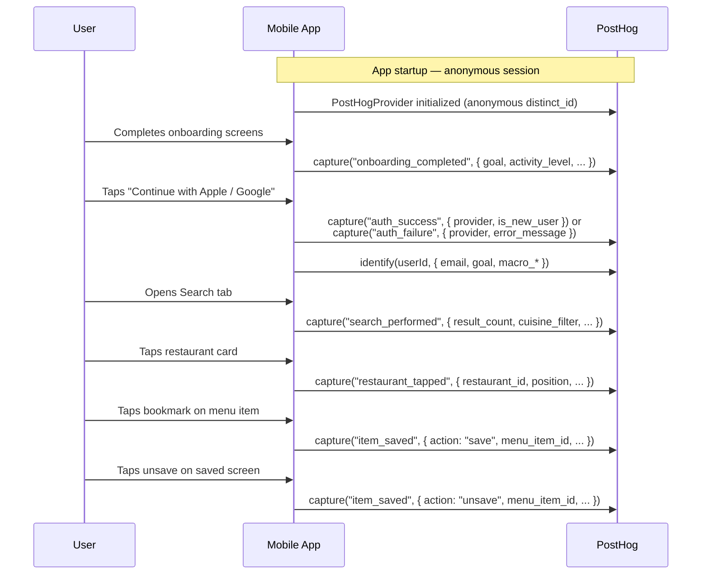

# PostHog Analytics — Mobile Instrumentation Spec

**Sprint**: S-102
**Author**: Frontend Engineer
**Status**: Approved
**Last updated**: 2026-04-08

---

## Overview

Integrate PostHog analytics into the Fitsy React Native mobile client to capture key
user funnel events before beta launch. The primary goal is to understand where users
drop off between onboarding and their first meaningful search, and to surface which
macro targets / goals are most common among retained users.

This PR covers **mobile instrumentation only**. API-side event capture
(server-side search logging, item-save confirmation) is a follow-up task for the
Backend Engineer — see [Follow-up](#follow-up-api-side-instrumentation) below.

---

## Event Taxonomy

### 1. `search_performed`

Fired when the debounced search call to `/api/restaurants` completes (success or
failure). Captures the macro inputs that drove the query.

| Property | Type | Description |
|---|---|---|
| `has_protein_target` | boolean | Whether protein field was set |
| `has_carbs_target` | boolean | Whether carbs field was set |
| `has_fat_target` | boolean | Whether fat field was set |
| `has_calories_target` | boolean | Whether calories field was set |
| `cuisine_filter` | string | Active cuisine chip (`all`, `asian`, etc.) |
| `result_count` | number | Number of restaurants returned |
| `location_source` | string | `gps` or `fallback` |
| `success` | boolean | Whether the API call succeeded |

### 2. `restaurant_tapped`

Fired when the user navigates to a restaurant detail screen from the search list
(hero card, dish card, or numbered section).

| Property | Type | Description |
|---|---|---|
| `restaurant_id` | string | Opaque restaurant ID |
| `restaurant_name` | string | Restaurant name |
| `position` | number | 0-based position in the results list |
| `entry_point` | string | `hero`, `dish_card`, or `section` |
| `best_match_calories` | number \| undefined | Calories of the suggested best-match item |

### 3. `item_saved`

Fired when the user bookmarks a menu item. Also fires with `action: 'unsave'` on
removal.

| Property | Type | Description |
|---|---|---|
| `menu_item_id` | string | Opaque menu item ID |
| `restaurant_id` | string | Restaurant the item belongs to |
| `action` | `'save'` \| `'unsave'` | Direction of toggle |
| `entry_point` | string | `restaurant_detail` or `saved_screen` |

### 4. `onboarding_completed`

Fired when the user reaches the payment/trial screen (`/welcome/payment`) — the
last step before sign-in. This is the "funnel bottom" for organic onboarding.

| Property | Type | Description |
|---|---|---|
| `goal` | string \| undefined | User's stated goal (`lose_fat`, `maintain`, `build_muscle`) |
| `activity_level` | string \| undefined | User's activity level |
| `has_weight` | boolean | Whether user entered their weight |
| `has_height` | boolean | Whether user entered their height |

### 5. `auth_success` / `auth_failure`

Fired after sign-in attempt completes (Apple or Google OAuth), regardless of
outcome.

| Property | Type | Description |
|---|---|---|
| `provider` | string | `apple`, `google`, or `dev` |
| `is_new_user` | boolean | True for new registrations (auth_success only) |
| `error_message` | string \| undefined | Sanitized error text (auth_failure only) |

---

## User Identity Strategy

```
Anonymous           →   Identified
(pre-auth)              (post-auth)
  posthog.capture()       posthog.identify(userId, { ... })
  [distinct_id = random]  [distinct_id = server userId]
```

- Before auth: PostHog assigns an anonymous `distinct_id` automatically.
- On `auth_success`: call `posthog.identify(userId)` with user properties.
- User properties captured at identify time:

| Property | Source |
|---|---|
| `email` | Auth response |
| `goal` | `onboardingStorage` |
| `activity_level` | `onboardingStorage` |
| `macro_protein` | `macroStorage` |
| `macro_carbs` | `macroStorage` |
| `macro_fat` | `macroStorage` |
| `macro_calories` | `macroStorage` |

- On logout: call `posthog.reset()` to disassociate the session.

---

## Mobile vs. API Instrumentation Split

| Event | Mobile | API |
|---|---|---|
| `search_performed` | Client-side (after API response) | Follow-up: server-side logging |
| `restaurant_tapped` | Client-side (on `router.push`) | Not needed |
| `item_saved` | Client-side (in `handleToggleSave`) | Follow-up: confirmation event |
| `onboarding_completed` | Client-side (in `PaymentScreen`) | Not needed |
| `auth_success` | Client-side (after token stored) | Not needed |
| `auth_failure` | Client-side (in catch block) | Not needed |

API-side instrumentation can provide more reliable counts (not affected by
connectivity drops, JS crashes, or users closing the app mid-request). The
follow-up task should add server-side `search_performed` and `item_saved`
confirmation events using the PostHog Node SDK.

---

## Architecture

### Provider placement

PostHog is initialized via `PostHogProvider` wrapping the root layout. This gives
every screen access to the `usePostHog()` hook without prop drilling.

### Analytics client module

A thin wrapper at `apps/mobile/lib/analytics.ts` owns all `posthog.capture()` calls.
Screens import typed helper functions (`trackSearchPerformed`, `trackRestaurantTapped`,
etc.) rather than calling PostHog directly. This:

- Keeps event names and property schemas in one place
- Makes it trivial to swap analytics providers in future
- Allows easy mocking in tests

### Error handling

All PostHog calls are fire-and-forget. Errors are swallowed — analytics must never
crash the app or affect user-facing behavior. The wrapper module enforces this.

---

## Event Flow Diagram



---

## Environment Variables

| Variable | Platform | Description |
|---|---|---|
| `EXPO_PUBLIC_POSTHOG_API_KEY` | Mobile (Expo) | PostHog project API key |
| `EXPO_PUBLIC_POSTHOG_HOST` | Mobile (Expo) | PostHog ingest host (default: `https://us.i.posthog.com`) |

Both are exposed via the `EXPO_PUBLIC_` prefix so they are available at build time
in the Expo managed workflow. They are **not** secrets — PostHog project API keys
are designed to be embedded in client code. Real values are added via Vercel CLI:

```bash
vercel env add EXPO_PUBLIC_POSTHOG_API_KEY preview
vercel env add EXPO_PUBLIC_POSTHOG_HOST preview
```

---

## Implementation Plan

1. Install `posthog-react-native` in `apps/mobile`
2. Add `EXPO_PUBLIC_POSTHOG_API_KEY` placeholder to `.env.example` (or document in
   this spec — no `.env.example` currently exists in this repo)
3. Create `apps/mobile/lib/analytics.ts` — typed event helpers + PostHog instance
4. Wrap root layout with `PostHogProvider`
5. Instrument each event at the call site:
   - `search_performed` — `apps/mobile/app/(tabs)/search.tsx`
   - `restaurant_tapped` — `apps/mobile/app/(tabs)/search.tsx` (hero + section taps)
   - `item_saved` — `apps/mobile/app/restaurant/[id].tsx` + `apps/mobile/app/(tabs)/saved.tsx`
   - `onboarding_completed` — `apps/mobile/app/welcome/payment.tsx`
   - `auth_success` / `auth_failure` — `apps/mobile/app/welcome/signin.tsx` + `apps/mobile/app/auth/login.tsx`

---

## Follow-up: API-Side Instrumentation

**Ticket**: Create S-103 for Backend Engineer.

Tasks:
- Install `posthog-node` in `apps/api`
- Add `POSTHOG_API_KEY` (server-side, not `EXPO_PUBLIC_`) to Vercel env
- Add server-side `search_performed` event in `/api/restaurants` route with
  query params and result count
- Add server-side `item_saved` event in `/api/saved` POST route

Server-side events are more reliable than client-side for funnel analysis and
should be used as the source of truth for conversion metrics in PostHog.

---

## Testing

- Unit tests are not required for analytics calls (fire-and-forget wrappers).
- Verify manually: open PostHog dashboard → Live Events view → exercise each
  event in the simulator. Confirm event name and key properties appear within
  ~5 seconds.
- The `analytics.ts` module exports a `__resetForTesting` helper to allow
  snapshot tests of event shapes without a live PostHog connection.
