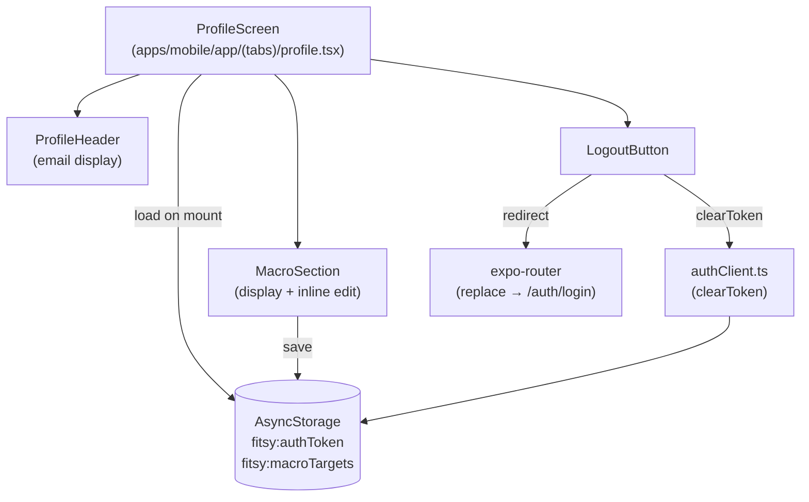

# Profile Screen Spec — S-56

## Summary

The profile screen is the second tab in the Fitsy app. It surfaces the
user's account email, current macro targets, and provides a logout
action. It is the canonical entry point for editing macro targets and
serves as the recovery path when targets have never been set.

---

## Screens in Scope

| Screen | Route | Trigger |
|--------|-------|---------|
| Profile | `/(tabs)/profile` | Tab navigation |

---

## Data Sources

| Data | Storage key | Type |
|------|-------------|------|
| Auth token (JWT) | `fitsy:authToken` (AsyncStorage) | `string` |
| User email | Decoded from JWT payload | `string` |
| Macro targets | `fitsy:macroTargets` (AsyncStorage) | `MacroValues` JSON |

The JWT payload contains `email` as a base64-encoded JSON claim.
Decoding is done client-side from the stored token — no extra API
call is required.

---

## Functional Requirements

### Display

- Show user email decoded from the stored JWT (no API round-trip).
- Show current macro targets: protein (g), carbs (g), fat (g), calories.
- If no macro targets are stored, show a "Set up macro targets" CTA
  that opens the search tab where `MacroInputBar` lets users configure
  their targets (the search tab already persists macro inputs to the
  same AsyncStorage key).

### Edit Macro Targets

- Tapping the macro targets section opens an inline edit mode.
- In edit mode, each macro field becomes a numeric `TextInput`.
- A "Save" button persists the values to `fitsy:macroTargets` and
  returns to display mode.
- A "Cancel" button discards any unsaved edits.

### Logout

- A "Log out" button clears `fitsy:authToken` via `clearToken()` from
  `authClient`.
- After clearing, the app redirects to `/auth/login` via
  `router.replace`.

---

## Component Architecture

---

## States

| State | What the UI shows |
|-------|------------------|
| Loading | Spinner centered on screen |
| No macro targets set | "Account" section with email + "Set up macro targets" CTA |
| Macro targets set, display mode | Macro target cards (protein/carbs/fat/cals) + Edit button |
| Edit mode | Numeric inputs pre-filled with saved values + Save / Cancel |

---

## Error Handling

- If the JWT cannot be decoded (malformed), show email as "—".
- If AsyncStorage read fails, treat macros as not set.
- If AsyncStorage write fails on save, show an inline error message.

---

## Accessibility

- All interactive elements have `accessibilityLabel`.
- Touch targets are minimum 44×44 pt.
- `accessibilityRole="button"` on all tappable elements.
- Edit / Save / Cancel buttons are keyboard accessible (numeric keyboard
  for macro inputs with `returnKeyType="done"`).

---

## Out of Scope

- Editing email or password (requires backend endpoint — separate ticket).
- Push notification preferences.
- Profile photo.
