# Restaurant-led onboarding

The approved flow connects the user's prior healthy-eating approach to restaurant choices and fitness goals, then lets them explore the real discovery screen before choosing a subscription.
The paywall uses direction C: the selected restaurant and more meals close to the active meal targets.

```mermaid
flowchart LR
  A[Favorite bite] --> B[Location and coverage]
  B --> C[Prior approach]
  C --> D[Personalized response and fitness payoff]
  D --> E{Meal targets}
  E -->|Own targets| F[Edit meal targets]
  E -->|Assisted| G[Goal and profile questions]
  G --> F
  F --> H[Nutrition sources]
  H --> I[Shared search and guided preview]
  I --> J[Account]
  J --> K[Restaurant and matching-meal paywall]
  K --> L[Purchase or restore]
  L --> M[Optional notification permission]
  M --> N[Selected menu]
```

## Discovery and proof

Onboarding and the main app use the same `DiscoveryScreen`, search state, branded loading component and request cancellation.
The search field remains mounted while its results update.
A context change invalidates old results, count, pagination and pending requests before the debounce begins.
The backend's versioned close-to-target policy applies to the preview and the main app's opt-in search requests.
Dish-name matches take priority for cravings; explicit restaurant searches retain restaurant discovery.

The preview exposes the first dish name and all three restaurants' nutrition.
Picks two and three use blurred name placeholders, including hidden-name protection in accessibility labels.
Opening a menu preserves the selected restaurant, dish, query, coordinates and meal targets through account creation and purchase.

The paywall count is additional qualifying dishes, excluding the selected dish only when it belongs to the same qualifying set.
Revalidation requires the selected dish to remain in the visible three; otherwise the selected restaurant stays visible and numerical proof is omitted.
A bounded 30-second cache reuses a fresh exact-context preview for its selected dish, avoiding a second backend count.
Changed targets, query or location use distinct entries; expired proof is revalidated.
Zero, unavailable or failed proof never produces a fabricated number.
The count explicitly acknowledges published or estimated nutrition.
The backend contract and measured query behavior are documented in `docs/engineering/backend/goal-matched-preview.md`.

## Subscription and navigation

Prices, eligibility, trial duration and renewal disclosures continue to come from live store products.
The selected restaurant image is identified as restaurant imagery, with an honest missing-image fallback.
Back is shown only when a preceding screen exists; account creation replaces itself with payment while preserving preview underneath.
Leaving a screen invalidates its pending navigation and alerts, while successful authentication still retains the session.
A deliberate decline retains the hard paywall, including anonymous sessions and legacy preview links; payment requests sign-in when a purchase needs it.
Legacy trial and abundance checkpoints redirect to their replacements, and prior-approach checkpoints without a saved area recover location first.

The notification screen follows a completed purchase with Remind me and Not now, without a misleading Back button or reminder configuration step.
Only a verified active renewing trial supports the before-trial-end promise.
Denied or already-granted permission must not strand the user; OS settings remain available for existing users.
Completion records an account-owned destination before optional notifications, so a restart opens the chosen menu after that account's entitlement settles true.
Routing consumes the continuation; abandonment, a new preview selection, another account or expiration cannot replay it.

## Verification

Local iPhone product evidence is required before shipping.
Deterministic flows cover the own-target and assisted journeys, coverage recovery, guided preview and target/query agreement, paywall terms/access/Back, and notifications.
Native walkthroughs additionally inspect layout, typography, blurred names, retained keyboard focus, delayed responses and imagery.
Focused tests cover stale response rejection, pagination invalidation, cache context/expiry/exclusion, failed proof reloads and saved navigation checkpoints.
Actual billing evidence must distinguish RevenueCat Test Store, external eligible-offer fixtures, and real Apple store behavior.
