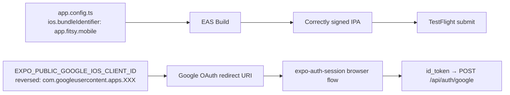

# S-104: iOS Bundle Identifier + Google Services Config

**Author**: Frontend Agent
**Date**: 2026-04-08
**Status**: FINAL
**Ticket**: S-104

---

## 1. Purpose

Close the P0 gap (G-1 from S-99 validation) blocking TestFlight builds: the app has no `ios.bundleIdentifier`, so EAS Build cannot sign or submit the app. Also audit whether `expo-google-services` / `GoogleService-Info.plist` is required for the current Google Sign-In approach.

---

## 2. Context

The current Google Sign-In implementation uses `expo-auth-session` with
`Google.useIdTokenAuthRequest` — a **browser-based OAuth PKCE flow** via
`expo-web-browser`. This approach:

- Does **not** use the native Google Sign-In SDK
- Does **not** require Firebase
- Does **not** require `GoogleService-Info.plist` or the `expo-google-services` plugin

`expo-google-services` is needed only if the app uses:
1. Firebase SDK (`@react-native-firebase`)
2. Native Google Sign-In SDK (`@react-native-google-signin/google-signin`)

Since Fitsy uses neither, adding `expo-google-services` would add build
complexity (EAS Build would fail without a real `GoogleService-Info.plist`)
for no actual benefit.

**Conclusion**: Only `ios.bundleIdentifier` is required for TestFlight.

---

## 3. Flow Diagram



---

## 4. Changes

### `apps/mobile/app.config.ts`

Add `ios` block with `bundleIdentifier`:

```ts
ios: {
  bundleIdentifier: 'app.fitsy.mobile',
  supportsTablet: false,
},
```

The `supportsTablet: false` ensures the app is iPhone-only, matching the product
intent (restaurant discovery is a phone use case).

### `expo-google-services` — **skipped**

Not required for `expo-auth-session` browser OAuth. The P1 gap (G-6) from the
S-99 validation is a false positive for our current auth architecture. If we
later migrate to native Google Sign-In, this can be added then with the real
`GoogleService-Info.plist` from Google Cloud Console.

---

## 5. What's Still Needed (Manual Steps, Not Code)

These are operational steps that must happen outside this PR, before a
TestFlight build can complete Google Sign-In:

| Step | Who | What |
|------|-----|------|
| G-2 | devops | Add `EXPO_PUBLIC_GOOGLE_IOS_CLIENT_ID` and `EXPO_PUBLIC_GOOGLE_WEB_CLIENT_ID` to EAS build profiles — tracked as **S-105** |
| G-3 | developer | In Google Cloud Console: verify the iOS OAuth client's "Bundle ID" matches `app.fitsy.mobile`, and that the authorized redirect URI includes `com.googleusercontent.apps.<ios-client-id>:/` |

---

## 6. Test Plan

1. `npx tsc --noEmit` in `apps/mobile/` — no type errors
2. `eas build --platform ios --profile development-simulator` — EAS picks up `app.fitsy.mobile` as the bundle ID
3. App launches in simulator — no regression on existing auth flows
