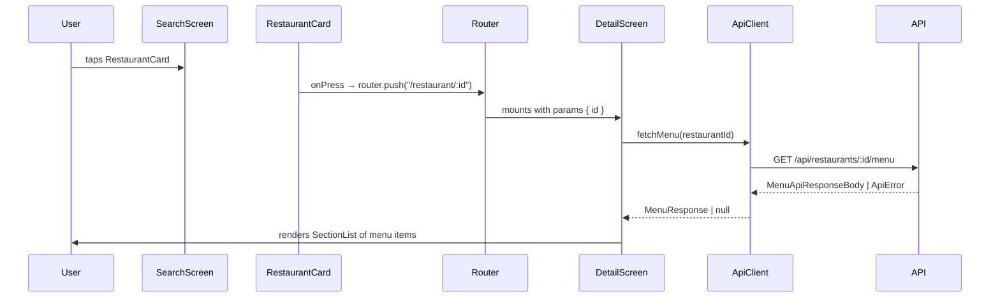

# S-19: Restaurant Detail Screen — Menu Items with Macro Breakdown

## Overview

This spec describes the restaurant detail screen introduced in sprint S-19. When a user taps a restaurant card on the Search screen, they are navigated to a new detail screen that fetches and displays the restaurant's full menu with per-item macro breakdowns.

---

## Data Flow



---

## Screen Architecture

```mermaid
graph TD
    A[_layout.tsx — Stack] --> B[(tabs) layout]
    A --> C[restaurant/[id].tsx — Detail screen]
    B --> D[search.tsx — Search screen]
    D -->|router.push| C
    C --> E[MenuItem.tsx — item row]
    C --> F[fetchMenu — apiClient.ts]
```

---

## Files Changed / Created

| File | Action | Description |
|------|--------|-------------|
| `apps/mobile/lib/apiClient.ts` | Updated | Add `fetchMenu(restaurantId)` |
| `apps/mobile/app/restaurant/[id].tsx` | Created | Detail screen with SectionList |
| `apps/mobile/components/MenuItem.tsx` | Created | Menu item row component |
| `apps/mobile/components/index.ts` | Updated | Export `MenuItem` |
| `apps/mobile/components/RestaurantCard.tsx` | Updated | Accept `onPress` prop |
| `apps/mobile/app/(tabs)/search.tsx` | Updated | Pass `onPress` to each card |
| `apps/mobile/app/_layout.tsx` | No-op | Already uses `<Stack>` |

---

## API Client

```ts
// apps/mobile/lib/apiClient.ts
export async function fetchMenu(restaurantId: string): Promise<MenuResponse | null>
```

- Calls `GET /api/restaurants/{id}/menu`
- Returns `null` on non-OK responses or network errors
- Uses `EXPO_PUBLIC_API_URL` env var, falling back to `http://localhost:3000`

---

## MenuItem Component

Each item row renders:

- **Name** — bold, primary text
- **Category** — if present, gray subtitle
- **Price** — formatted as `$X.XX`, if present
- **Macro row** — `P: Xg  C: Xg  F: Xg  Kcal: X`, shown only when `macros` is non-null
- **Confidence badge** — color-coded pill (HIGH=green, MEDIUM=amber, LOW=gray)
- **"No macro data"** — gray italic fallback when `macros` is null

---

## Detail Screen Behavior

| State | UI |
|-------|----|
| Loading | `ActivityIndicator` centered |
| Error / null | Error message in red banner |
| No menu items | "No menu items available" empty state |
| Items (with categories) | `SectionList` grouped by category |
| Items (no categories) | `FlatList` flat list |

---

## Navigation

`RestaurantCard` gains an optional `onPress?: () => void` prop. The card root is wrapped in `TouchableOpacity`. When `onPress` is omitted the card still renders correctly (no-op).

Search screen passes:
```tsx
onPress={() => router.push(`/restaurant/${item.id}`)}
```

---

## Confidence Color Reference

| Level | Text Color | Background |
|-------|-----------|------------|
| HIGH | `#2D7D46` | `#DCFCE7` |
| MEDIUM | `#D97706` | `#FEF3C7` |
| LOW | `#6B7280` | `#F3F4F6` |
