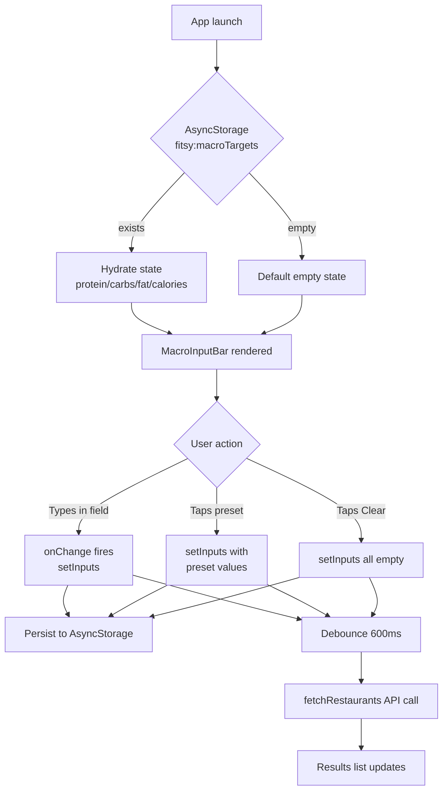

# S-20: Macro Target Form — Presets and Persistence

## Overview

Extracts the inline macro input UI from `SearchScreen` into a standalone `MacroInputBar` component, adds goal preset buttons, and persists macro targets across app restarts via `AsyncStorage`.

## Data / Control Flow



## Component: MacroInputBar

**File**: `apps/mobile/components/MacroInputBar.tsx`

### Props

```ts
interface MacroValues {
  protein: string;
  carbs: string;
  fat: string;
  calories: string;
}

interface MacroInputBarProps {
  values: MacroValues;
  onChange: (field: keyof MacroValues, text: string) => void;
}
```

### Behaviour

- Renders four labelled numeric `TextInput` fields (Protein, Carbs, Fat, Cals) in a horizontal row.
- Each field uses `keyboardType="numeric"` and `returnKeyType="done"`.
- A "Clear" button resets all four fields to empty string by calling `onChange` for each.
- Three preset pill buttons rendered in a horizontal `ScrollView` below the inputs:

| Preset | Calories | Protein | Carbs | Fat |
|--------|----------|---------|-------|-----|
| Cut (2000 kcal) | 2000 | 150 | 200 | 67 |
| Bulk (3000 kcal) | 3000 | 180 | 350 | 100 |
| Maintain (2500 kcal) | 2500 | 160 | 280 | 83 |

## Persistence

- On mount, `SearchScreen` reads `fitsy:macroTargets` from `AsyncStorage` and hydrates state.
- On every `inputs` state change, `SearchScreen` writes the new value to `AsyncStorage`.
- Storage is keyed under `"fitsy:macroTargets"` and serialised as JSON.

## Files Changed

| File | Change |
|------|--------|
| `apps/mobile/components/MacroInputBar.tsx` | New — extracted + enhanced component |
| `apps/mobile/components/index.ts` | Export `MacroInputBar` |
| `apps/mobile/app/(tabs)/search.tsx` | Import `MacroInputBar`, add AsyncStorage hooks |
| `apps/mobile/package.json` | Add `@react-native-async-storage/async-storage` |
