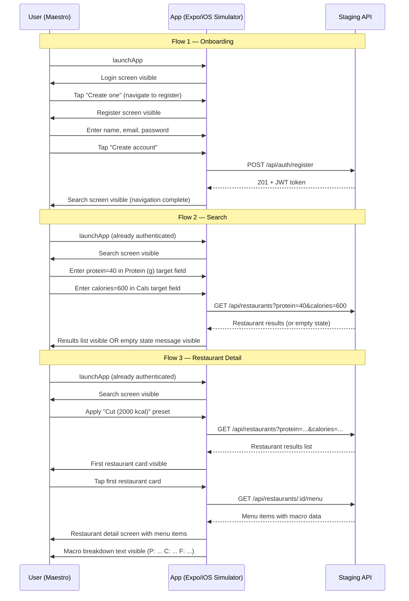

# S-25: Maestro E2E Flows — Search → Detail → Macro Match

## Overview

This spec defines the Maestro E2E test flows that validate the core user journey
against the staging environment: new user registration, macro-target search, and
restaurant detail with macro breakdown.

## Scope

| Flow | File | Depends On |
|------|------|------------|
| Onboarding | `e2e/flows/onboarding.yaml` | None |
| Search | `e2e/flows/search.yaml` | Seeded staging data or graceful empty state |
| Restaurant detail | `e2e/flows/restaurant-detail.yaml` | Seeded staging data |

## Test Flow Sequence



## Element Selectors

Flows use `accessibilityLabel` attributes set on components. These are stable,
implementation-agnostic identifiers that do not change with visual redesigns.

| Screen | Element | Accessibility Label |
|--------|---------|-------------------|
| Login | Email input | `Email address` |
| Login | Password input | `Password` |
| Login | Submit button | `Log in` |
| Login | Nav to register | `Create an account` |
| Register | Name input | `Full name` |
| Register | Email input | `Email address` |
| Register | Password input | `Password` |
| Register | Submit button | `Create account` |
| Search | Protein input | `Protein (g) target` |
| Search | Calories input | `Cals target` |
| Search | Preset button | `Apply Cut (2000 kcal) preset` |
| Search | Loading spinner | `Loading restaurants` |
| Search | Restaurant card | `View menu for {name}` (dynamic) |
| Restaurant | Loading spinner | `Loading menu` |

## Staging Data Requirements

The search and detail flows assume the staging database is seeded with at least
one restaurant that has menu items with macro data. The flows handle the empty
state gracefully — if no results appear, `search.yaml` asserts the empty state
message instead of failing.

## Running Locally

```bash
maestro test e2e/flows/
```

See `e2e/README.md` for full setup instructions.

## CI Integration

Flows run post-merge on `main` via `.github/workflows/e2e-staging.yml` using a
macOS GitHub Actions runner with a pre-built Expo iOS simulator build. The
`MAESTRO_APP_ID` env var is set to `com.fitsy.app`.
