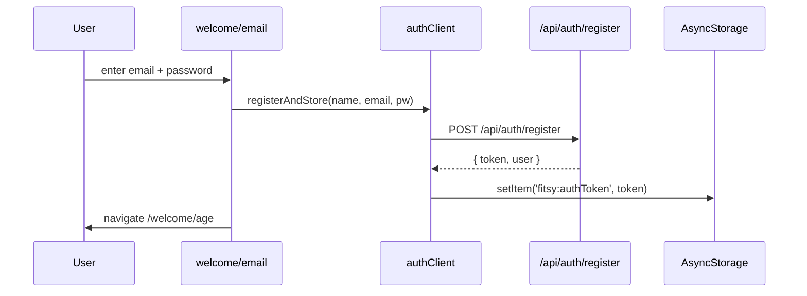
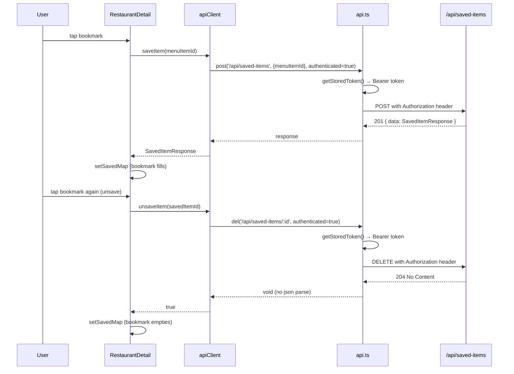

# S-62: Fix Saved Meals

## Problem

Saving and unsaving meals silently fails in two distinct ways:

### Bug 1 — `del()` chokes on 204 No Content

`apps/mobile/lib/api.ts` `del()` unconditionally calls `res.json()` after a
successful response. The DELETE `/api/saved-items/:id` endpoint returns
`204 No Content` (no body). Parsing an empty body throws a SyntaxError,
which `unsaveItem` catches and converts to `return false`. The server-side
delete succeeds but the UI never learns about it — the bookmark icon stays
filled and the item remains in the Saved tab until the screen re-focuses.

### Bug 2 — Welcome flow never stores a JWT

`apps/mobile/app/welcome/payment.tsx` completes onboarding by setting
`AsyncStorage.setItem('onboardingComplete', 'true')` and navigating to
`/(tabs)`. No token is ever issued or stored. Every subsequent authenticated
API call (save, unsave, fetch saved items, fetch restaurants) is sent without
an `Authorization` header and receives a `401 Unauthorized` response. The
caller's `catch` block swallows the error silently.

## Bugs Found (3 total)

### Bug 3 — `BookmarkButton` haptics crash blocks `onPress`

`BookmarkButton.handlePress` is `async` and **awaits** `Haptics.impactAsync`.
On iOS simulator and some devices, `expo-haptics` throws (e.g. "The method is
not available in the current platform"). The `await` propagates the rejection,
which means `onPress()` is never called — the bookmark action never fires.
The unhandled rejection surfaces as a red error toast.

## Fix

### 1. `api.ts` — handle 204 in `del()`

Change the return type from `Promise<T>` to `Promise<void>` and remove the
`res.json()` call on success. All current call-sites ignore the return value.

```
Before:
  return res.json() as Promise<T>;   // line 71 — throws on 204

After:
  // 204 No Content — nothing to parse
```

### 2. `payment.tsx` — register user at end of welcome flow

The payment screen must create a Fitsy account before navigating away.

Flow:
1. Derive `name` from onboarding state (stored in AsyncStorage during age
   step), `email` + `password` from a prior step, **or** accept that users
   who entered via the Apple/Google path already have a token by the time
   they reach this screen.
2. For the email path: collect email + password before age (move to
   welcome/index step 0, between the auth provider selection and the age
   screen). After payment, call `registerAndStore()` and store the JWT.
3. For the Apple/Gmail path: auth fires on the welcome splash screen before
   the onboarding steps; by payment time the token is already in
   AsyncStorage.

Because S-63 (auth rework) changes the welcome splash to perform real auth,
S-62 should only solve the email path for now and not duplicate S-63's work.

**Minimal fix for S-62**: add a `welcome/email.tsx` screen (email + password
form) inserted between the welcome splash and the age screen, so users who
tap "Continue with Email" authenticate before entering the onboarding flow.
Apple/Gmail users are handled in S-63.

## Data Flow





### 3. `BookmarkButton.tsx` — fire-and-forget haptics

Change `await Haptics.impactAsync(...)` to `.catch(() => {})` so that haptic
failures are silently swallowed and `onPress()` always runs.

## Files Changed

| File | Change |
|------|--------|
| `apps/mobile/lib/api.ts` | Fix `del()` return type to `void`, remove `res.json()` call on 204 |
| `apps/mobile/components/BookmarkButton.tsx` | Fire-and-forget haptics so a haptic failure never blocks `onPress` |
| `apps/mobile/app/welcome/email.tsx` | New screen: email + password form, calls `registerAndStore`, navigates to age |
| `apps/mobile/app/welcome/index.tsx` | "Continue with Email" navigates to `/welcome/email` instead of `/welcome/age` |
| `scripts/route-reviewers.sh` | Fix routing: `apps/api/tests/e2e/` → cto, in sync with reviewer.md |

## E2E Test Plan (mobile MCP + simulator)

1. Launch app in simulator — should land on welcome splash
2. Tap "Continue with Email" → should navigate to email screen (new)
3. Enter email + password → tap Continue → should navigate to age screen
4. Complete onboarding → reach Saved tab
5. Navigate to any restaurant → tap bookmark on a menu item → bookmark fills
6. Navigate to Saved tab → item appears
7. Tap bookmark again on the item → bookmark empties, item disappears from list
8. Kill app, reopen → saved items persist (token in AsyncStorage)
