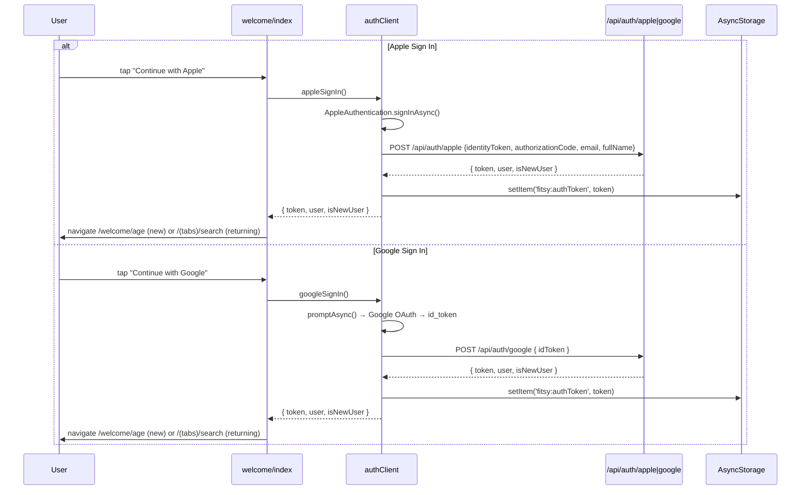

# S-63: Fix Auth — Apple + Gmail Only

## Problem

The welcome splash has two buttons ("Continue with Apple", "Continue with Email")
but neither performs real authentication:

- **Apple**: `appleSignIn()` in `authClient.ts` is a stub that throws
  `new Error('not implemented')`. Tapping Apple takes users into the onboarding
  flow without ever obtaining a JWT.
- **Email**: Goes directly to the age screen (S-62 added a real registration
  screen, but this is the email/password path, not the intended sign-in method).
- **Google**: Not implemented at all.

Product intent: Apple and Gmail are the only sign-in methods. No email/password.

## Fix

### 1. Replace welcome splash buttons

Remove the "Continue with Email" button. Replace with:
- "Continue with Apple" → real Apple Sign In (`expo-apple-authentication`)
- "Continue with Google" → Google OAuth (`expo-auth-session`)

Both flows, on success, store a JWT in AsyncStorage and navigate into the
onboarding flow (or directly to `/(tabs)/search` for returning users).

### 2. Implement Apple Sign In on mobile

Install `expo-apple-authentication`. Call
`AppleAuthentication.signInAsync()`, pass `identityToken` and
`authorizationCode` to the existing `/api/auth/apple` endpoint, store the
returned JWT.

### 3. Implement Google Sign In on mobile + API

Install `expo-auth-session` and `expo-web-browser`. Use
`Google.useIdTokenAuthRequest` to get a Google ID token, then verify it on
the server at a new `/api/auth/google` endpoint and issue a Fitsy JWT.

### 4. Add `/api/auth/google` API route

Verify the Google ID token (using Google's token-info endpoint or `google-auth-library`).
Find or create the Fitsy user, issue a JWT, return it.

### 5. Remove email/password sign-in from the welcome flow

The `/auth/login` and `/auth/register` screens remain (needed by E2E tests
and as a support fallback), but they are no longer linked from the welcome
splash. Only Apple and Google are offered on the main onboarding entry point.

## Data Flow

## Environment Variables Required

| Variable | Where | Purpose |
|---|---|---|
| `EXPO_PUBLIC_GOOGLE_CLIENT_ID` | `apps/mobile/.env.local` | Google iOS OAuth client ID |
| `GOOGLE_CLIENT_ID` | Vercel / `.env.local` | Server-side Google token verification |
| `APPLE_CLIENT_ID` | Vercel / `.env.local` | Apple audience (already present) |

## Files Changed

| File | Domain | Change |
|------|--------|--------|
| `apps/mobile/package.json` | frontend | Add `expo-apple-authentication`, `expo-auth-session`, `expo-web-browser` |
| `apps/mobile/app.config.ts` | frontend | Add `expo-apple-authentication` plugin |
| `apps/mobile/app/welcome/index.tsx` | frontend | Replace Email button with Google button; wire real Apple + Google auth |
| `apps/mobile/lib/authClient.ts` | frontend | Implement `appleSignIn()`, add `googleSignIn()` |
| `apps/api/app/api/auth/google/route.ts` | backend | New: verify Google ID token, find/create user, return JWT |
| `apps/api/services/googleAuth.ts` | backend | New: Google ID token verification service |

## E2E Test Plan (mobile MCP + simulator)

1. Launch app → welcome splash shows Apple + Google buttons (no Email)
2. Tap "Continue with Apple" → native Apple auth sheet appears
3. Complete Apple auth → JWT stored, navigate to onboarding
4. Tap "Continue with Google" → browser opens Google OAuth
5. Complete Google auth → JWT stored, navigate to onboarding
6. Kill and reopen app → auto-navigates to search (token persists)

> **Note**: Apple Sign In on simulator requires the simulator to have an Apple ID
> signed in (Settings → Apple ID). Google OAuth opens Safari for the OAuth flow.
> If OAuth credentials (`EXPO_PUBLIC_GOOGLE_CLIENT_ID`) are not configured,
> the Google button shows an error toast and the tap is a no-op.
