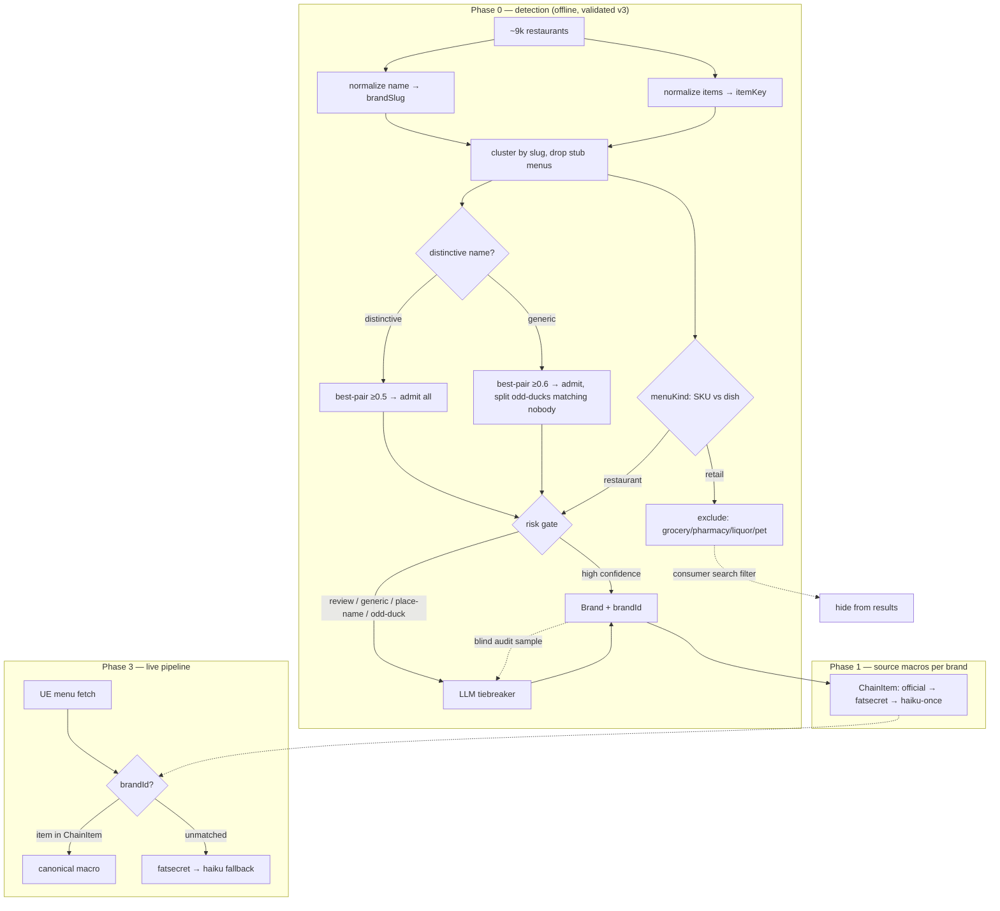
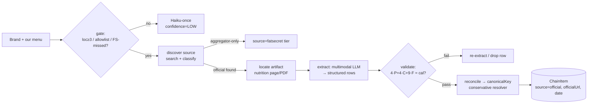

# Canonical Chain Macros

**Status:** Phase 0 detection validated (v3, asymmetric multi-signal); LLM tiebreaker next
**Last updated:** 2026-06-14
**Owner:** Dawit

> Detection has been run read-only over all 9,327 restaurants. The logic, metrics,
> and thresholds below are the **validated v3** versions. Script:
> `scripts/phase0-detect-chains.ts`; full per-cluster output: `scripts/phase0-chains.json`.

## Problem

Chain restaurants are seeded **inconsistently** because macro resolution happens
per-location, all-or-nothing. WaBa Grill is the canonical example: 25 locations, identical
menus, but **18 resolved from `fatsecret`** and **7 silently fell back to `haiku`** (the
FatSecret fetch/match missed). Same "Chicken Bowl," three different answers:

| Source | Cal | P | C | F |
|---|---|---|---|---|
| Official (WaBa JAN 2025) | 640 | 38 | 100 | 11 |
| Our FatSecret locations | 630 | 42 | 81 | 13 |
| Our Haiku locations | 588 | 50 | 56 | 18 |

Haiku is systematically wrong on chains (anchors ~59g carbs on every bowl, over-states
protein/fat), but the deeper bug is that **a known chain ever reaches Haiku at all**, and
that two locations of one brand can disagree.

Root cause: **there is no chain identity.** Each location is its own `Restaurant` row that
re-resolves macros independently. `chainFlag` is itself derived *from* the FatSecret match
(see Phase 3), so it can't break the loop.

## Goal

A **canonical chain macro table**: macros resolved **once per brand per item**, from the
best available source, reused across every location. Build it offline over the existing
~9k restaurants first, then wire it into the live pipeline as a short-circuit ahead of
FatSecret/Haiku.

Key principle: **canonical macros key to the item, never to the location.** A location's
menu is just *which* canonical items it offers; matched items get identical macros
everywhere; regional items / LTOs that match no canonical entry fall through to the normal
per-item fallback. Variation is absorbed at the membership level, not the macro level.

The canonical table is a **cache/indirection, not a source** — each entry stores macros
tagged with their underlying source (`official`/`fatsecret`/`haiku`), so existing
provenance ranking (`merchant=official > fatsecret > ffn > haiku`) is unchanged.

---

## Strategy & philosophy (read this first)

The framing that matters: **this is an identity-resolution problem, not unsupervised
data-mining.** Brand identity is a public, largely-solved fact; we should *import* truth
where we can and *infer* only the residual. Two structural commitments follow:

1. **Decouple identity from nutrition.** *Detection* ("same brand?") should match
   **aggressively** — over-merging is cheap, because only shared-core items canonicalize
   and the rest fall through. *Macro keying* ("same dish, inherit these macros?") should
   match **conservatively** — a wrong match attaches wrong nutrition. Same string-matching
   primitive, opposite strictness. Conflating them is what broke Chick-fil-A (see Learnings).

2. **Cheap deterministic core + LLM tiebreaker on the risky residual + blind audit.** A
   reproducible algorithm decides the high-confidence mass (~90%); an LLM adjudicates only
   the ambiguous/risky clusters (~10%); a periodic blind audit samples the auto-decided
   buckets to catch *confident* errors the tiebreaker never sees. This keeps cost and
   determinism while getting model-quality judgment where it pays.

**Source-native brand ID — checked, unavailable.** We hoped Uber Eats' `getFeedV1` /
`getStoreV1` payloads carried a brand/chain entity we could just join on. They do **not**
— verified against the live fixture (`scripts/cache/ue-feed-spike-sample.json`) and the
parser (`apps/api/services/menuSources/ueApiClient.ts`). Per-store keys are
`storeUuid, title, rating, actionUrl, image, mapMarker, meta*, signposts, tracking` — no
brand/chain/franchise field anywhere. So we must derive identity ourselves; the LLM
tiebreaker effectively does the "import world-knowledge" job UE won't hand us.

See **Future directions** for the bigger turns (embeddings, Google Places/Placekey,
buying chain-nutrition data, food-concept KB).



---

## Phase 0 — Chain detection (validated, v3)

Produce an independent brand identity over the existing ~9k restaurants *before* touching
macros. Four steps: normalize names, normalize items, decide same-brand (asymmetric),
classify menu kind.

**Step 1 — name normalization → `brandSlug`.** Lowercase; strip diacritics + trademark
glyphs; strip location qualifiers (parentheticals, store numbers `#417`, dash/`@`/`at`
tails, trailing gazetteer city names, legal suffixes); punctuation → `-`.
`WaBa Grill (Sunset)`, `Waba Grill #417`, `McDonald's®` → `waba-grill` / `mcdonald-s`.

**Step 2 — item-key normalization → `itemKey`** (lightweight, corroboration-only).
Lowercase; strip packaging/size tags (`[can]`, `(tp)`), counts/sizes (`5pc`, `20oz`,
`1/2`, `#2`, `w/`); drop stopwords; **token-sort**. So `Iced Jasmine Green Tea (TP)` and
`Jasmine Green Iced Tea` → same key. The *full* canonical-item resolver (alias maps,
fuzzy, human review) is Phase 1 — kept separate because there a mistake corrupts macros.

**Step 3 — same-brand decision (asymmetric, multi-signal).** A single menu-overlap
threshold can't span identical-menu chains and drifted-but-real ones, and a single
aggregate (median) discards information. So:

- **Metric:** **containment** = `|A∩B| / min(|A|,|B|)` on `itemKey` sets — robust to
  subset menus (a small menu that's a perfect subset scores 1.0; Jaccard would score 0.42).
- **Aggregate:** **best-pair** (max pairwise containment), not median. One byte-identical
  pair is strong proof; the median over-punishes small-N drift (it sank Chick-fil-A).
- **Hygiene:** drop **stub menus** (< `MIN_ITEMS`=5) before scoring.
- **Name distinctiveness:** a name is *distinctive* if it has a corpus-rare token (≤2
  clusters) **OR** a non-descriptor "brand word." A name is *generic* only if **every**
  token is a descriptor (cuisine/food/venue word: `thai`, `kitchen`, `ice`, `cream`). This
  is what makes `Taco *Bell*`, `*Panda* Express`, `Pizza *Hut*` distinctive even though
  their food-words are common — the earlier token-frequency-only rule misclassified them as
  generic and fragmented them.
- **Decision:**
  - **distinctive** name → the name licenses membership (collisions implausible): **admit
    all** locations if `best-pair ≥ 0.5`; `0.3–0.5` → review; below → not-chain.
  - **generic** name → collision risk: confirm if `best-pair ≥ 0.6`, **admit all members
    except true odd-ducks** (a member whose max containment to any sibling is `< 0.2` —
    i.e. it matches *nobody* — is split off); `0.45–0.6` → review; below → not-chain.

  The odd-duck split addresses "2 real + 1 impostor share a generic name": the impostor
  matches nobody and drops out, while a varied-but-real member (matches *somebody*) stays.

**Step 4 — menu-kind classification → `menuKind`.** Many multi-location clusters are
**not restaurants** (grocery, drugstore, convenience, liquor, pet) — real chains as
businesses but no fixed macro-bearing menu, and they pollute consumer search. Per
restaurant:
- `retailSkuRate` = fraction of items shaped like packaged-CPG SKUs with net weights
  (`(3.78 L)`, `(16 fl oz)`, `85/15 ground beef`). Restaurants 0–14%, grocery 36–100% —
  cleanly bimodal.
- `preparedDishRate` = fraction with dish words (`roll/plate/bowl/soup/latte/doughnut`) —
  guards weight-priced restaurants (malatang hot pot) and packaged-heavy ones (Krispy
  Kreme) from being mislabeled.
- **Rule:** `retailSkuRate ≥ 0.4 AND preparedDishRate < 0.3` → retail (sub-typed by
  pet/pharmacy/liquor lexicons); else `restaurant`. Compute **per restaurant** (singletons
  too). Consumers: the canonical build skips non-restaurant brands, and **consumer search
  filters `menuKind != restaurant`**.

### Phase 0 results (v3, over 9,327 restaurants)

| stage | chains | review | not-chain |
|---|---|---|---|
| v1 (raw items, Jaccard, median) | 474 | 144 | 250 |
| v2 (normalized keys, containment) | 664 | 75 | 85 |
| **v3 (asymmetric best-pair + menuKind)** | **706** (660 restaurant + 46 retail) | **57** | **61** |

- **660 restaurant chains** + 46 retail clusters excluded via `menuKind`.
- vs today's `chainFlag`: ~588 brand-new (0 locations flagged), ~66 partially flagged (the
  WaBa bug at scale — Subway 77/101, McDonald's 70/83), ~10 fully captured today.
- Chick-fil-A consolidates (best-pair 1.00); famous multi-word chains no longer fragment;
  only **1** odd-duck split (a retail cluster).
- Residual: place-name collisions (two unrelated "Tokyo Grill") and 2-loc low-overlap
  chains (Santouka Ramen, best-pair 0.33 → review) — handled by the LLM tiebreaker.

---

## Phase 0.5 — LLM tiebreaker (risk-gated)

The deterministic algo decides the confident mass; an LLM (Haiku, already wired) resolves
the ambiguous/risky residual (~100–150 clusters, one batched call each — single dollars,
one-time offline).

**Risk gate → send to LLM** when any of:
- `klass == review`, or
- a **generic-name** chain admit (collision-prone), or
- a **place-name** distinctive admit (e.g. "Tokyo Grill" — a brand-word that's really a
  location), or
- a 2-location low-best-pair pair, or
- an odd-duck split (confirm the impostor call).

**Per-cluster prompt:** brand name + per-location item samples + counts →
structured output `{ same_brand, canonical_name, impostor_location_ids[], is_retail,
confidence }`. The model brings world knowledge (it *knows* Chick-fil-A is a chain and
"Tokyo Grill" is generic) and reads menus to spot impostors. Adversarial 2–3 votes for the
highest-risk clusters.

**Feed back:** confirmed → assign `brandId`; impostors → split; retail → `menuKind`;
canonical_name → `Brand.displayName`.

**Critical design point — gate on *risk*, not on the algo's self-reported uncertainty.** A
tiebreaker only catches *known unknowns* (cases the algo flagged). It never sees the algo's
**confident errors** (two "Tokyo Grill" that auto-merge at high best-pair and never enter
review). Hence the gate deliberately includes confidently-decided-but-risky classes
(generic/place-name admits), and we add a **blind audit**: periodically sample the
auto-decided `chain`/`not-chain` buckets, LLM-check them, measure the true error rate, and
move the gate if it leaks.

---

## Brand schema + deliverables

```prisma
model Brand {
  id            String   @id @default(cuid())
  slug          String   @unique          // normalized brandSlug, e.g. "waba-grill"
  displayName   String                     // canonical name (LLM/curated), "WaBa Grill"
  aliases       String[] @default([])      // alt slugs that map to this brand
  locationCount Int      @default(0)
  menuKind      String   @default("restaurant") // restaurant|grocery|convenience|pharmacy|liquor|pet
  bestPair      Float?                     // detection score (max pairwise containment)
  distinctive   Boolean  @default(false)
  detectionConf String?                    // 'high' | 'review' | 'llm-confirmed'
  macroSource   String?                    // 'official'|'fatsecret'|'haiku'|null (unsourced)
  officialUrl   String?
  createdAt     DateTime @default(now())
  updatedAt     DateTime @updatedAt
  restaurants   Restaurant[]
}
```

On `Restaurant`: add `brandId String?` + `@@index([brandId])`, and
`menuKind String @default("restaurant")` (per-restaurant, so singleton groceries are
excluded too). Lookups: `brandSlug → Brand.slug @unique` (detection); `Restaurant.brandId`
FK (runtime → Brand → ChainItem).

**Deliverables:** `Brand` + `Restaurant.brandId` + `Restaurant.menuKind` migration; the
detection job (promote `scripts/phase0-detect-chains.ts` to write Brand/brandId/menuKind);
the risk-gated LLM tiebreaker pass; consumer-search filter on `menuKind`.

---

## Phase 1 — Source macros per brand

Per brand, build a canonical item list and resolve each item's macros from the best
available source: **official site → FatSecret → Haiku-once.** Output:
`ChainItem (brandId, canonicalKey, aliases[], macros, source, confidence)`, unique on
`(brandId, canonicalKey)`. The canonical item list is the union across locations,
fuzzy/embedding-deduped to `canonicalKey` + `aliases[]` — the **full, conservative** item
resolver (a wrong key attaches wrong macros; see Strategy §1).

### The reframe: official-source discovery is national-head-bounded, *not* 100×

The scary version of this problem is "660 LA brands → ~60k USA brands → find 60k nutrition
pages." That's the wrong model. Location count is a near-perfect proxy for whether official
nutrition exists at all, and the head is **national and roughly fixed**:

| LA locations | brands | official nutrition exists? |
|---|---|---|
| 26+ | 21 | Subway, McDonald's, Starbucks, Taco Bell — **guaranteed** (PDF/site/API) |
| 11–25 | 47 | El Pollo Loco, Wingstop, WaBa, Jamba — **almost always** |
| 6–10 | 92 | Shake Shack, sweetgreen, Mendocino Farms — **mixed** |
| 2–5 | 500 | Ggiata, Pizzana, HiHo Cheeseburger, "The Stand" — **almost never** |

Two consequences:

1. **The head doesn't multiply across cities.** McDonald's is McDonald's in all 50 states.
   Ingest the top ~300 national brands *once* and every future city inherits them. The 100×
   growth lands on the **2–5-location tail**, which mostly has no official nutrition and
   *correctly falls through* to FatSecret → Haiku-once. So the official-ingestion workload
   grows like the national brand head (low thousands, slowly), **not** like locations.
2. **Therefore Phase 1 is a bounded, ~quarterly batch over a few hundred brands**, not a
   per-location firehose — single-to-low-tens of dollars per refresh, dominated by vision
   tokens.

**Gate official discovery** — only attempt when `locationCount ≥ 3` **OR** the brand is on
a national-chain allowlist **OR** FatSecret missed (the WaBa case). Everything else →
Haiku-once, `confidence=LOW`, UI shows "estimated." Of LA's 660 chains only ~100–150 are
worth attempting, and nearly all are national → covered by the head once. LA-incremental
official work is tiny.

### The per-brand funnel (agentic, replaces "manual curated ingestion")

An agentic LLM automates the ingestion we'd assumed was manual. Per gated brand:



**Step A — discover the source (the "easy" half, with a hidden trap).** A naïve
`"<brand> nutrition"` search fails three ways our own data predicts: (a) **aggregators
outrank official** — FatSecret/MyFitnessPal/Nutritionix/CalorieKing are SEO-tuned and fill
results 1–5; (b) **name collisions** — the tail is full of place/generic names ("The Stand",
"Granville", "Corner Bakery"); (c) **wrong-city** same-name brands. The unlock for all three:
**we already have each brand's menu** — use it as both the disambiguation key and the
*verification* check. Search `<brand> + region + 2 sample items`, then **confirm the
candidate page actually contains items from our canonical menu** before trusting it. Classify
each candidate `official | aggregator | unrelated` (domain stem ≈ `brandSlug`, aggregator
blocklist, real menu/order page present); aggregator-only → no official, stays FatSecret-tier.

**Step B — extract from unstructured pages/PDFs (the hard half).** Do **not** write per-site
parsers — that's what genuinely can't scale to thousands of brands. **The LLM is the
parser.** By source shape: **PDF** (most fast food publishes nutrition grids as PDF) → render
pages to images → vision model (text extraction scrambles columnar grids; vision reads layout
natively); **static HTML table** → cleaned DOM + rendered screenshot; **JS calculator**
(Subway/Chipotle build-a-bowl) → headless snapshot at default config, head-only and few,
worth one-off handling not a general solver; **poster/menu image** → vision, same path as
PDF. One source-agnostic structured-output schema:
`{ item, servingSize, calories, protein, carbs, fat, sourceUrl }[]`.

**Step C — validate deterministically (what makes vision trustworthy).** Vision misreads
columns and drops digits. Catch it for free with the **macro–calorie identity**:
`|4·protein + 4·carbs + 9·fat − calories| ≤ tol` — any row that violates 4/4/9 is
re-extracted or dropped, killing the most common extraction errors (shifted column, dropped
digit, swapped P/C) with no human. Plus plausibility bounds and a **cross-check against
FatSecret where both exist** — large official-vs-FatSecret disagreement flags the brand for
review rather than silently trusting either (mirrors the Phase-0 blind-audit philosophy).

**Step D — reconcile + provenance.** Match extracted items → our `canonicalKey`s with the
**conservative** resolver. Tag every row `source=official`, store `officialUrl` **and the
retrieval date** — staleness is real (the WaBa chart is dated JAN 2025; the live pipeline
re-curates when it sees unmatched items on a known brand).

### Discovery spike — results (validated)

`scripts/phase1-discover-official.ts` (read-only) ran Step A over the **top 20 head brands**
(search → classify → site-scoped fallback → verify). Findings:

- **Official nutrition artifact found for 19/20 (95%).** The one miss (Burger King) wasn't a
  discovery failure — an aggregator (`fastfoodnutrition.org`) outranked BK's own page; a
  brand-domain-guessed second query (`site:bk.com nutrition`) recovers it.
- **The disambiguation trick works:** aggregators (FatSecret/MyFitnessPal/Nutritionix/ordering
  platforms) are reliably filtered by domain blocklist; official is confirmed by
  domain-stem ≈ `brandSlug`. Foreign-TLD mis-picks (`7-eleven.ca`, `starbucks.ie`) are fixed
  by a US/.com preference in candidate ranking.
- **Modality split confirms Step B's premise** — of the 19, only ~12 are plain static HTML;
  the rest are **JS-SPA nutrition pages** (Panda Express, Wingstop, IHOP, Popeyes — content
  client-rendered, empty to a static fetch) or **PDFs** (Jack in the Box
  `nutritional_brochure.pdf`, Boba Time `..._Nutrition_Sheet_September_2024.pdf` — note the
  date, i.e. staleness is real). So extraction **must** assume headless-render + vision/PDF for
  the head; a static HTML parser would silently capture <⅔ of it. Output:
  `scripts/phase1-discover-sample.json`.

**Conclusion:** Step A (discovery) is essentially solved for the head; the open risk is
entirely Step B (extraction across SPA/PDF), exactly where the multimodal-LLM-as-parser +
4/4/9 validator are aimed. Next: run the spike over a mid-tail sample (3–10 locations) to see
where official availability falls off, then build the extraction half.

### Coverage achieved (measured 2026-06-14, item-level)

Extraction ran over all gated brands; here is where the **676,137** menu items actually sit and
what each bucket's macro source is. This is the empirical justification for the whole effort —
**chains are half the catalog, and the big national chains alone are 27% of all items.**

| Bucket | Items | % of all | Macro source |
|---|---:|---:|---|
| **All chain items** (brandId set) | 336,492 | 50% | — |
| All indie items (no brand) | 339,645 | 50% | FatSecret/Haiku (out of scope for chains) |
| ↳ **52 official-extracted brands** (regional mid-tail) | 40,200 | 6% | **official** (agent — PDFs/static) |
| ↳ **SPA/deferred big chains** (Subway, McDonald's, Starbucks…) | 179,788 | 27% | → **Nutritionix** (buy) / fallback |
| ↳ other detected chains (no official artifact found) | 116,504 | 17% | FatSecret/Haiku |

The agent reached the **tractable 6%** (mid-tail brands that publish PDFs/HTML). The **27%
big-chain prize** (calculator SPAs) is the Nutritionix buy — and it lands into the **same**
`ChainItem` table under the same runtime canon-first lookup. The canonical layer is the shared
substrate both feed; the agent's 6% is the bootstrap that proves the pipeline.

**Runtime match (the canon-first short-circuit):** with `aliases[]` populated by the LLM
resolver (`phase1-align.ts`), incoming UE items resolve to a canonical macro **41%** of the time
across the 52 official brands (vs 11% naive-slug), zero per-item LLM at runtime; the rest fall
through to FatSecret/Haiku (UE is a combinatorial superset, so much of that miss is correct).

### Build-vs-buy on the head

The agent is the right *general* mechanism, but for the top ~100 national chains a licensed
chain-nutrition DB (**Nutritionix** ships brand IDs + an NLP menu-string→macros parser;
**MenuStat**) is likely higher-quality and cheaper than agentic extraction, and sidesteps the
JS-calculator problem entirely. Pragmatic split: **buy the national head, agent the regional
mid-tail (6–10 and the upper 2–5 band), Haiku-once the long tail** — the agent earns its keep
precisely where brands are too small for a commercial DB but too big to leave to Haiku.

### `ChainItem` schema *(Phase 1 migration)*

```prisma
model ChainItem {
  id           String   @id @default(cuid())
  brandId      String
  canonicalKey String                       // normalized resolver key, e.g. "chicken-bowl"
  aliases      String[] @default([])         // per-location name variants that map here
  calories     Int?
  proteinG     Float?
  carbsG       Float?
  fatG         Float?
  servingSize  String?
  source       String                        // 'official' | 'fatsecret' | 'haiku'
  confidence   String                        // 'HIGH' | 'MEDIUM' | 'LOW'
  officialUrl  String?
  retrievedAt  DateTime?                     // staleness tracking
  createdAt    DateTime @default(now())
  updatedAt    DateTime @updatedAt
  brand        Brand    @relation(fields: [brandId], references: [id])
  @@unique([brandId, canonicalKey])
  @@index([brandId])
}
```

---

## Phase 2 — Backfill the existing 670k *(high-level)*

- Map each chain location's items → canonical items; overwrite macros from the table,
  **respecting provenance rank** (never replace a higher tier with a lower one).
- Re-seed the 7 WaBa Haiku locations and every chain hit by the same silent-fallback bug.

### Divergence detector (regression test + bug finder)

Same item, same brand, macros disagreeing across locations beyond tolerance:

```sql
SELECT r."brandId", lower(mi.name) AS item, count(DISTINCT r.id) AS locations,
       max(mi.calories) - min(mi.calories) AS cal_spread
FROM "Restaurant" r JOIN "MenuItem" mi ON mi."restaurantId" = r.id
WHERE r."brandId" IS NOT NULL
GROUP BY r."brandId", lower(mi.name)
HAVING max(mi.calories) - min(mi.calories) > 50 AND count(DISTINCT r.id) > 1
ORDER BY cal_spread DESC;
```

Today this surfaces WaBa's Chicken Bowl spanning 588→630 cal. **After canonicalization it
must return ~0 rows** — runs as a standing regression check.

---

## Phase 3 — Wire the live pipeline *(high-level)*

- UE feed still fetches the **menu**; what changes is **macro resolution**: in
  `preload-ue-first.ts`, resolve `restaurant → brandId`; per item, hit the canonical table
  first; only unmatched items fall to FatSecret/Haiku.
- `brandId` set but **zero** canonical matches → Slack alert via `notifySlack`, **not** a
  silent downgrade. Unmatched items on a known chain → flag the brand for re-curation
  (new items / staleness; the WaBa chart is already dated JAN 2025).

### How `chainFlag` is set today (and why it's replaced)

`scripts/pipeline-utils.ts:612` (Q7) + `scripts/backfill-chain-flag.ts`:
`chainFlag = EXISTS(MacroEstimate WHERE source='fatsecret')` — circular, FatSecret-derived,
and the reason the 7 all-Haiku WaBa locations are `chainFlag=false` despite being one chain.
Phase 0's `brandId` becomes the independent identity; `chainFlag` derives from
`brandId IS NOT NULL`.

---

## Learnings log (why the design is what it is)

- **v1 — Jaccard + median, raw item strings.** 474 chains, 144 review. Real chains landed
  in review. Two faults: Jaccard punishes subset menus (87⊂207 scores 0.42), and we
  compared **un-normalized** item strings so `kebab`≠`kabob`.
- **v2 — containment + normalized `itemKey` + stub-drop.** 664 chains, 75 review.
  Containment fixed the subset problem; the item normalizer was the big unlock. Chick-fil-A
  still failed: 3 locations, loc1≡loc2 (1.00) but loc3 drifted (0.23) → **median** = 0.23,
  under the bar. Lesson: the failure was a keying-grade string problem leaking into a
  detection decision, plus a lossy aggregate.
- **v3 — asymmetric, best-pair, descriptor-distinctiveness, menuKind.** 660 restaurant
  chains. Best-pair rescued CFA. **Caught a regression mid-build:** token-frequency
  distinctiveness misclassified Taco Bell / Panda Express / 7-Eleven as generic and the
  component-split *fragmented* them (Taco Bell admitted 22/47). Fixed with (a) descriptor-
  based distinctiveness and (b) splitting only members that match *nobody*, not everything
  below a high bar.
- **Meta-lesson:** single-number thresholds *and* single-knob tuning both fail at the
  edges. Robustness comes from **combining signals asymmetrically by name type** + escalating
  the risky residual to an LLM — not from moving one threshold. And menu-overlap alone can't
  distinguish a real member with menu variation from an impostor; **name signal breaks the
  tie**, and where the name is ambiguous (place-names), the LLM does.

---

## Future directions (bigger turns)

We're currently inferring identity bottom-up from our own strings. The high-leverage moves
import truth or change the unit:

- **Embeddings** — semantic vectors (synonyms, word-order, bilingual all collapse). Use for
  Phase-1 item dedup, smoother detection similarity, or the **retrieval flip**: match each
  restaurant against an embedded reference catalog of known brands. ~$0.10 one-time, doubles
  as search-relevance infra. (Anthropic has no embeddings API → Voyage/OpenAI/local.) Great
  for identity; careful for macros (`spicy` vs `grilled chicken sandwich` are near in space).
- **External identity** — Google Places (place_id + brand), Placekey/Overture/Wikidata.
  UE-native ID is confirmed unavailable, so these are the remaining "import truth" sources;
  detection becomes a join, our clustering a fallback.
- **Buy the nutrition** — Nutritionix (NLP "menu string → macros" + chain DB with brand
  IDs), MenuStat, licensed FatSecret API. Build-vs-buy on Phase 1.
- **Food-concept KB** — model the *food*, not the brand's menu item: every item (chain or
  indie) maps to a shared food KB (USDA + branded DBs + NLP parser); chains just get an
  official override. The most durable reframe — it also fixes indie macros (the original
  complaint), not just chains.

---

## Open decisions

- `menuKind` cutoffs (`retailSkuRate ≥0.4`, `preparedDishRate <0.3`) — validated on the
  review band; spot-check against not-chain + singletons before locking.
- Tiebreaker: single-vote vs 2–3 adversarial votes per risk tier; blind-audit cadence.
- Top-N for curated/agentic official ingestion (Phase 1).
- Whether to fold `pharmacy` into `convenience` (UE menus rarely list meds, so the pharmacy
  sub-type rarely fires).
- Adopt embeddings now (Phase-0 similarity + Phase-1 dedup) or defer until a vector store
  is wired.

## Next step

Detection v3 is validated. Build the `Brand` + `brandId` + `menuKind` migration and the
detection job that writes them; then the risk-gated LLM tiebreaker over the ~100–150
flagged clusters.

In parallel, Phase 1 is being de-risked from the **discovery** end first: a spike
(`scripts/phase1-discover-official.ts`) that, over the gated head brands, runs
search → classify `official|aggregator|unrelated` → **verify the candidate page contains our
menu items**, and reports the official-source hit rate before we commit to the extraction
half. Validate hit rate on the head before building Step B.
