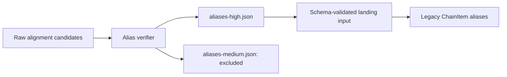

# Chain alias artifact handoff

The verifier writes `aliases-high.json`. The lander previously searched for
`aliases-verified.json`, then fell back to raw `aliases.json`. That bypassed verification.

Producer and consumer now share the filename constant. Missing or malformed HIGH
data fails before any DB work; raw, medium and historical filenames cannot substitute.
The lander also updates servingSize alongside macros, preventing old serving text from
surviving a nutrition update.

HIGH here means legacy verification output, **not approval for a serving override**.
The shared chain matcher separately requires reviewed source facts and full menu context.
These name aliases cannot bypass that gate.

The dev snapshot copier also accepts the upcoming nullable review JSON field, using
Prisma's explicit database-null marker. It remains compatible with the current schema.

Test: `npm test -w @fitsy/scripts -- --runInBand phase1-alias-input.test.ts`.
Default landing remains a local dry run. This change performs no database writes itself.
