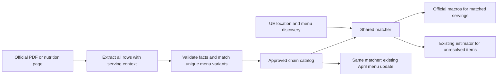

# Chain catalog onboarding and serving

Official nutrition is onboarded once per chain and published serving. UE still discovers locations and supplies their menus. Importing a new location does not fetch PDFs.

Onboard chains incrementally; finding every US chain source is not a prerequisite for adding coverage. UE discovery can precede catalog onboarding, with existing menus corrected afterward through the same matcher. Source discovery and extraction stay outside the UE run and API requests.



## Batch workflow

For missing brands, missing restaurant links or verified store-name variants, run [reviewed identity onboarding](chain-identity-batches.md) first.
The identity batch preserves menu rows and leaves a brand inactive until its nutrition catalog contains approved bindings.

1. Discover the official source, retain its URL, SHA-256, page/table, and serving. An extraction agent can prepare a complete candidate table; a URL alone is not approval.
2. Start a draft batch from those source facts with empty aliases, then export existing variants with `menu-inventory`. Add captured UE menus and group by brand + name + section + description. Inspect each unique configuration once, reusing it across stores.
3. Prepare a version-1 JSON batch. `changes` contain brand slug, serving-specific canonical key, four macros, source evidence, exact contextual aliases, and the expected prior catalog fields. New keys use `expected: null`. `quarantine` clears known bad legacy aliases.
4. Inspect the catalog plan and tests, then apply the exact saved hash. Previously reviewed rows can change only when the batch includes their exact old review as well as their facts. Competing alias bindings fail planning.
5. Plan the existing-menu update, apply a small canary, read back serving/search results and preservation, then apply the remaining reviewed rows. The first pending row per brand leads a custom batch.
6. Replay captured UE menus through the real writer in an isolated database. This proves future-import behavior without creating production locations.

The CLI is `scripts/preload-chain-pilot.ts`; its name and default seven-serving pilot remain compatible. All commands accept `--batch=/absolute/path/batch.json`. The JSON schema is `apps/api/services/chainCatalogBatch.ts`.

```sh
# Explicit database environment required. Planning and inventory do not write the DB.
npx tsx scripts/preload-chain-pilot.ts menu-inventory work/variants.json --batch=work/batch.json
npx tsx scripts/preload-chain-pilot.ts catalog-plan work/catalog-plan.json --batch=work/batch.json
npx tsx scripts/preload-chain-pilot.ts catalog-apply work/catalog-plan.json PLAN_HASH --batch=work/batch.json
npx tsx scripts/preload-chain-pilot.ts april-plan work/april-plan.json --batch=work/batch.json
npx tsx scripts/preload-chain-pilot.ts april-apply work/april-plan.json PLAN_HASH --limit=2 --batch=work/batch.json
# After canary verification and a fresh plan, bounded chunks reduce database round trips.
npx tsx scripts/preload-chain-pilot.ts april-apply work/remainder.json PLAN_HASH --limit=N --chunk-size=100 --batch=work/batch.json
```

Use fresh artifact names; plans and rollback journals never overwrite existing evidence. Replan after each successful batch. Roll back April journals before the catalog journal, following [the pilot recovery rules](chain-pdf-pilot.md). Catalog writes are atomic.
`--chunk-size=1..100` defaults to one guarded item at a time, retaining the original numbered per-item journals.
Sizes 2 through 100 validate every row in a chunk before any write and commit that chunk atomically.
It reuses one catalog/brand snapshot per transaction and writes estimates and winning menu macros in bulk.
The next chunk starts only after the complete prior chunk receipt is flushed to disk.
A stale item or estimate stops the whole pending chunk; previously committed chunks remain recorded.
Rollback accepts both journal formats and restores the selected journal atomically after comparing every recorded post-write row.
Missing or corrupt chunk intents or receipts block rollback until commit state is inspected from the saved plan.
A started marker without a completion receipt never proves that no rows committed.
Database serialization conflicts (Prisma P2034 or raw-query P2010 / SQLSTATE 40001) retry the entire guarded transaction at most twice, rechecking the original plan each time. Other errors are not retried. Do not change catalog approvals during an active UE enrichment run.

Catalog apply and rollback each use a 120-second transaction bound. The shared transaction helper otherwise defaults to 30 seconds. These bounds describe recovery behavior; local rollback tests verify restored data, not production network timing.

## Acceptance and limits

- Full meal, side, mini, regular, large, family and combo-component servings keep distinct keys. Conflicting source labels do not resolve to one official serving.
  A calorie range requires a reviewed `defaultServing` on the exact contextual alias, with the exact approved range, source URL/hash, locator and selected options.
  The default metadata is approval-bound; changed ranges, missing evidence and unresolved choices stay estimated.
- Approval fingerprints retain descriptions and sections. New wording becomes an unmatched variant until checked; no fuzzy match silently changes portions.
- Both serving paths use the same stored facts. Existing-menu updates preserve IDs and non-nutrition fields; new UE imports keep their existing menu replacement semantics.
- The importer works for any verified restaurant brand. Source discovery/extraction and alias proposal are still offline onboarding work; this change does not implement an unattended nationwide crawler.
- No PDF calls, model calls, or extra per-item database lookups are added to matching. Refresh scheduling is outside this work.

Regression coverage includes arbitrary brands sharing a canonical key, deduplicated inventory, edited-manifest refusal, existing approval changes, canary ordering, real database apply, no-op replans and rollback. Source-specific catalog expansion must add captured-menu and independently transcribed nutrition expectations before rollout.

See [the match-quality audit and scale-out workflow](chain-quality-scale-out.md) for manufacturer fact reuse and documented-default evidence.
