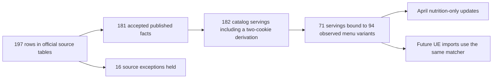

# WaBa + Yoshinoya: full-source catalog expansion

Status: production rollout verified, 2026-09-10 UTC. This expands the seven-serving pilot using the [reusable batch workflow](chain-catalog-batches.md).

## Production and import replay results

| Scope | Before | After | Unresolved after |
|---|---:|---:|---:|
| WaBa April menu rows | 46 / 795 | 369 / 795 | 426 |
| Yoshinoya April menu rows | 18 / 542 | 223 / 542 | 319 |
| Total April rows | 64 / 1,337 (4.8%) | 592 / 1,337 (44.3%) | 745 |
| Two captured UE menus (local replay) | 7 / 151 | 52 / 151 (34.4%) | 99 |

**Main dishes:** 378 of the 592 April matches are bowls, plates or salads (312 WaBa, 66 Yoshinoya). In the current UE captures, only 19 of the 52 matches are main dishes (17 WaBa, 2 Yoshinoya). Most current Yoshinoya matches are sides, drinks or desserts; its generic grilled entrée names allow sauce choices, so those are held. This is not broad current-entrée coverage for Yoshinoya.

The batch added 175 catalog records; the seven prior approvals remain identical. The April update changed 528 items across 31 of the 62 inspected locations: 510 changed at least one numeric macro, while 18 already had the published numbers and gained official attribution. Facts without aliases remain available for later serving review, without assigning components to meals. Legacy flat catalog records are preserved; unreviewed rows do not participate in the shared matcher.

## Production verification

Release [#272](https://github.com/dgmolla/fitsy/pull/272), merge `7b52f5e`, passed both [main Verify](https://github.com/dgmolla/fitsy/actions/runs/34441828997) and [Deploy](https://github.com/dgmolla/fitsy/actions/runs/34441829051), plus preview and production public smoke checks. Local validation passed 985 API tests across 91 suites, the production build, and all blocking local gates.

After a two-item canary, five batches of 100 and one of 26 were applied. Each batch passed cumulative readback before the next write.

| Final production check | Result |
|---|---|
| Catalog | 175 additions; all 178 prior rows unchanged; 182 approved servings, 94 aliases |
| Menu updates | 528 items verified against committed journals |
| Untouched items and estimates | 809 unchanged: 745 unmatched plus 64 prior official items |
| Identity and restaurants | All 1,337 menu IDs and all 62 restaurant records unchanged |
| Serving | All 528 updated detail values verified; two search/detail consistency checks passed |
| Remaining work in this batch | Catalog and April replans both returned zero changes |

One final read-only replan hit a dropped connection (`P1017`); a fresh read succeeded with zero pending changes. All writes and their readback had already succeeded; no write was repeated. Plans and per-item rollback journals were retained locally. Recovery applies April journals in reverse batch order before the catalog journal.

Production serving checks invoke the real services against the production database in read-only transactions. Public HTTP smoke passed; an entitled production-account HTTP probe was unavailable. Future-hex proof remains the local captured-menu replay described below.

## What was reviewed

- All 89 rows of WaBa's one-page PDF and all 108 rows of Yoshinoya's two-page PDF, including headings, portion weights, and the standard-recipe footnote. URLs, hashes and page/table locators are stored in the manifest.
- The 237 unique observed variants spanning the April inventory and two complete UE captures. Names, sections, descriptions, counts and available calorie labels remain in the captured fixtures. Each approved variant is reused across locations.
- Seventy-one bound servings have a separate literal macro transcription used by tests. This is an agent review against published nutrition, not an independent human nutrition audit or laboratory measurement.
- Decimal published calories are rounded to the nearest whole kcal for the existing schema. The two-cookie item is exactly twice the published one-cookie values. Other portions are not inferred by scaling.

## Source exceptions held

| Source rows | Count | Reason |
|---|---:|---|
| WaBa shrimp bowl, veggie bowl, plate | 3 | PDF/webpage macro disagreement; UE calorie labels also differ |
| WaBa 5/10/20-piece dumplings | 3 | Inconsistent calorie/macronutrient arithmetic across quantities |
| WaBa K-Ribs plate and strip | 2 | Published trans fat exceeds total fat |
| WaBa family salad | 1 | 300 kcal versus 128 kcal calculated from published macros |
| Yoshinoya regular combo TFC component | 1 | 649 kcal versus 995 kcal calculated from published macros |
| Yoshinoya two kids meals | 2 | Rice-meal heading but only 4/8 g carbohydrate; complete-meal interpretation unresolved |
| Yoshinoya 3/5/10-piece crispy gyoza | 3 | Published saturated fat exceeds total fat |
| Yoshinoya sweet-and-sour sauce | 1 | 13 g sugar exceeds 1 g total carbohydrate |

The 31 generic April `Cheesecake` rows are held because the flavor is unspecified; 18 bare `Signature House Salad` rows are held because chicken inclusion is unspecified. Additional unmatched menu items include configurable family/combo/taco meals, size ranges, source-missing dishes, and changed salad/sauce-choice descriptions. Regular Gyudon beef disagrees with UE calories; rice component portions do not match UE side labels. No source component is silently used as a full bowl. Published facts can be retained without an approved menu binding.

## Proof and limits

Aliases known to carry a calorie range (including Chicken Bowl in both Featured items and Rice Bowls) are not approved even for a later input lacking that label. April rows use their reviewed historical context; their estimated calories are not treated as source evidence.

A frozen, independently checked menu-to-serving table pins all 94 alias bindings, including their descriptions; expectations never follow the matcher's chosen key. Local tests replay every observed April variant, preserve unmatched records and non-nutrition fields, and verify served macros against the separate transcription. Both complete UE responses are parsed and sent through the production matcher and hex writer; the external estimator is stubbed only for unresolved items. All 52 matched items persist official values, and all 99 unresolved items take the fallback path.

These captures represent two menus, not a nationwide accuracy estimate. A new location with the same reviewed identity uses the same facts; new wording or conflicting labels abstain. No new production hex or city is imported by this rollout. Refresh remains outside scope.

The larger parallel replay also reproduced serialization failures from raw SQL (Prisma P2010 carrying PostgreSQL SQLSTATE 40001). The same bounded transaction retry now recognizes that known-aborted form; other SQL errors remain non-retryable. Tests force both ORM and raw SQL conflicts.

The checked-in batch is `apps/api/services/chainCatalogs/waba-yoshinoya-2026-09.json`. The generated extraction snapshot accounts for all 197 source rows; acceptance is visible in this document and the batch. Source discovery/extraction remains an offline agent task, while intake, validation, grouped inventory and both serving paths are reusable across chains.
