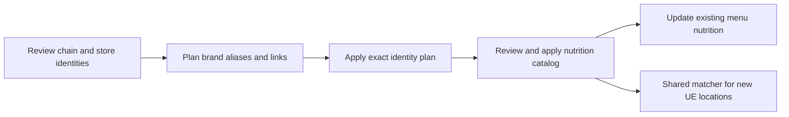

# Reviewed chain identity onboarding

Use this workflow when a known restaurant chain is missing from `Brand`, a legitimate store name fails the shared brand guard, or discovery mislabeled a restaurant chain as retail.
The old discovery rule requires at least five menu items at two stores; recognizable chains with sparse menus can therefore be missed.
Identity onboarding does not change menu membership or install nutrition facts.



## Review input

The schema is `apps/api/services/chainIdentityPlan.ts`.
Keep the reviewed JSON batch and source captures with the rollout evidence.
Record the reviewer, HTTPS source URL, capture SHA-256 and a locator explaining the chain/store relationship.
Search results and similar restaurant names are candidate evidence only.
Identity review provenance lives in the retained batch and journal files; it is not stored in `Brand` as a nutrition review blob.

| Input | Meaning |
|---|---|
| `brands[].id`, `slug`, `displayName` | Existing Fitsy identity, or a new ID reserved in the reviewed batch. |
| `brands[].expected` | Exact current identity fields; `null` only for a new brand. |
| `brands[].addAliases` | Explicit additional store/brand spellings; existing aliases are preserved. |
| `brands[].evidence` | Source URL, SHA-256 and review locator. |
| `brands[].classifyAsRestaurant` | Optional literal `true` after the cited source establishes that an existing brand is a restaurant chain. |
| `links[].brandId` | Reviewed Fitsy brand identity. |
| `links[].expected` | Current restaurant ID, name, UE store UUID, brand ID, chain flag and menu kind. |
| `links[].classifyAsRestaurant` | Optional literal `true` for each individually reviewed restaurant classification correction. |

Existing brands must pass the confidence gate and either already be classified as restaurants or explicitly request a source-reviewed classification correction.
Without the explicit correction fields, retail brands and locations remain excluded.
Source evidence must establish both the restaurant chain and the included locations; similar names or menu-unit heuristics are insufficient.
This command does not promote uncertain detections, rename brands, move restaurants between brands, or infer classification corrections.
A new brand receives the reviewed restaurant identity with `detectionConf: high`.
An explicit alias still passes through the production `verifiedBrand` function; there is no looser onboarding matcher.

## Apply and verify

Set `POSTGRES_URL_NON_POOLING` explicitly for the intended database.
Use an isolated local database for tests; the primary checkout's production environment is not a development target.
Do not apply identity or catalog changes during an active UE enrichment run.
The serializable identity check reads all restaurant identities and may otherwise conflict with the pipeline's writes.

```sh
npx tsx scripts/preload-chain-identity.ts plan work/identity-plan.json work/identity-batch.json
npx tsx scripts/preload-chain-identity.ts apply work/identity-plan.json PLAN_HASH
```

Planning reads a consistent snapshot and makes no database changes.
It checks every stored restaurant for identity changes caused by the proposed aliases, so the review cannot silently affect an omitted location.
The apply transaction repeats those checks and rejects changed plans, duplicate claims, collisions and conflicting existing links.
Brand aliases are additive; an explicitly reviewed correction can also change `menuKind` to `restaurant`.
Restaurant writes touch only `brandId`, `chainFlag` and the explicitly reviewed `menuKind`, plus the database-managed update timestamp.
Corrections compare the exact original classification and remain idempotent when the desired identity is already present.

Plans and journals are private files created without overwrite, flushed before proceeding, and bound to the database target and explicit plan hash.
An interrupted apply with a started file but no complete journal requires database readback before any retry.
Do not assume that an absent completion file proves an absent commit.

After identity readback, follow [catalog onboarding](chain-catalog-batches.md).
An identity with no approved nutrition aliases stays inactive in the official macro resolver.
Replay a complete captured UE menu and an existing-menu update before activating the catalog.
The UE importer uses the corrected identities through the existing shared matcher; it does not rerun the old menu-kind classifier.
`phase0-populate-brands.ts --apply` refuses databases containing reviewed catalog rows because its heuristic updates can undo reviewed identities and classifications.
Its read-only dry-run remains available for candidate discovery; apply reviewed changes through this workflow.

## Rollback

```sh
npx tsx scripts/preload-chain-identity.ts rollback work/identity-plan.json.applied.json PLAN_HASH
```

Roll back affected menu nutrition first, then the catalog, then identities.
Rollback compares the recorded post-write identities before changing anything and executes atomically.
It restores prior brand and restaurant classifications as well as aliases and links.
It refuses to delete a new brand with remaining catalog rows or restaurant references, including a location imported after the identity batch.
Inspect and handle those references explicitly before retrying.

The local database tests exercise missing sparse-chain identities and store aliases through the actual menu-serving service, shared resolver, existing-menu writer and transactional new-hex writer.
They also cover no-op replanning, collisions, omitted locations, concurrent edits, CLI target/hash checks and rollback.
These are synthetic safety tests; each chain still needs independent source and serving review.
