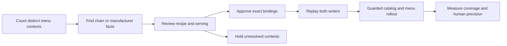

# Scaling the reviewed chain pipeline

The largest immediate opportunity is to improve chain menus already in production.
The September 11 read-only inventory found 297,506 menu rows across 688 brand groups and 3,811 locations with menus that pass the shared brand-name guard.
Only WaBa and Yoshinoya currently produce matches through the reviewed chain matcher: 592 rows before this candidate rollout.
This measures adoption of the reviewed override workflow, not the accuracy of the remaining estimates.

The inventory contains 4,845 catalog rows labeled `official`, but only 182 facts pass the approval validator.
Do not enable the remaining catalog in bulk based on its source label.
Source transcription, sold serving and menu binding still need evidence.
The snapshot and script are read-only; no additional brands were approved or updated.

## Where the next review can reach more users

These are existing menu rows to investigate, not promised new matches or measured customer demand.
Counts include drinks, combos and other items that may remain unresolved.
They can also include historical menus built by the FatSecret adapter; this inventory does not verify that every listed item is currently sold at every location.

| Suggested order | Chain | Locations with menus | Menu rows | Distinct contexts | Source and initial scope |
|---:|---|---:|---:|---:|---|
| 1 | El Pollo Loco | 54 | 3,725 | 127 | [Official nutrition guide](https://www.elpolloloco.com/content/pdfs/epl_web_nutrition_guide_mod_4_2026_hr.pdf): start with named standalone dishes and explicit servings; keep entrée-only combo facts separate from complete meals. |
| 2 | McDonald's | 82 | 10,457 | 354 | [Official US calculator](https://www.mcdonalds.com/us/en-us/about-our-food/nutrition-calculator.html): start with fixed products and sizes; review meal choices separately. |
| 3 | Panda Express | 58 | 5,398 | 172 | [Official nutrition table](https://www.pandaexpress.com/nutritioninformation): identify the sold entrée/side portion before matching; generic build-your-own bowls need configuration evidence. |

This ordering is an inference from existing reach, repeated contexts, meal relevance and the source structures checked on September 11.
It is not a measured match-yield ranking.
Together these three chains have 19,580 existing menu rows represented by 653 contexts.

For comparison, Subway has 12,850 rows / 346 contexts and Starbucks has 8,953 / 329.
Their greater raw reach does not establish a better first batch; actual menu configurations and meal relevance must be reviewed.
Domino's has 3,796 rows / 78 contexts and 99 catalog rows labeled `official`, but zero approved facts in this inventory.
That is an audit opportunity, not permission to wire those facts automatically.

## Operating sequence

## Repeatable lessons

1. **Review contexts, then propagate across locations.** The current WaBa/Yoshinoya audit reduces 1,337 rows to 168 contexts; ten new contexts support 66 additions.
   Keep location sampling for exceptions and avoid treating repeated stores as independent accuracy labels.
2. **Separate source facts from chain bindings.** A manufacturer/flavor/package fact can be reused, but each chain still needs an exact binding to its sold item.
   National discovery does not need to finish before an individual chain can be onboarded.
3. **Preserve serving structure during extraction.** Keep table headings, sizes, components, included sides and default selections.
   The official El Pollo Loco guide explicitly separates full meals from sections giving entrée-only values, illustrating why extracting names and numbers alone is insufficient.
4. **Keep similarity out of the write decision.** Use it to rank candidate facts; require recipe, portion and source evidence before approval.
   Keep conflicts and unknowns visible instead of forcing every item into a winner.
5. **Use the same matcher for both writers.** Every approved batch needs an existing-menu update replay and a captured-UE import replay, including negative cases.
   Report captured source listings separately from unique persisted menu items, since repeated listings can share an item name.
   In this batch the parser produces 79 unique WaBa names and 72 unique Yoshinoya names, and the database test requires all 151 items to persist; the reported 62 official matches are not inflated by same-name duplicates.
   Activating a reviewed brand also switches its new-import resolver away from the legacy FatSecret menu fallback to UE, so test the complete menu, empty responses and estimation volume before activation.
   The April nutrition-only update preserves the existing menu membership and does not perform that menu-source replacement.
6. **Make routine onboarding a data operation.** After the shared matcher/schema release, compatible facts and aliases can ship through guarded catalog and menu batches without a separate API deployment per chain.
   New matching or serving behavior still needs a code release.
   Run the offline UE pipeline from that compatible release too; deploying the API does not update an operator's older local checkout.
7. **Track quality independently from coverage.** Measure recipe, serving and transcription precision on a human-reviewed sample, plus official coverage, meal coverage, held reasons and changed nutrients.
   The current 66-row gain is mostly drinks: 59 drinks and seven Chicken Bowls.
8. **Watch approval-version propagation.** Adding the Chicken Bowl default changes its approval digest, so 18 already-official rows need attribution-only updates.
   At much larger scale, consider independently versioned fact and contextual-binding approvals so a new alias does not force unrelated attribution rewrites.
9. **Scope catalog loading when scale requires it.** The current runtime loads all eligible brands and their catalog once per run.
   The current brand-name guard also scans that brand list for each restaurant.
   For national runs, a brand-alias index and catalogs scoped to participating brands are sensible next optimizations; this audit did not measure a current latency problem.
   The inventory excludes 53 linked locations that fail the name guard; review legitimate name aliases instead of removing that guard.

The first human review packet covers [nine contexts affecting 190 rows](chain-quality-next-review.md): 36 already-applied protein-side rows with weak portion evidence and 154 unresolved near-identity rows.
The read-only inventory counted qualified brand-linked locations after applying the production brand-name guard.
The counts describe the current production cohort, not a national restaurant inventory or verified geographic coverage.
Refresh scheduling, new menu providers and adding cities remain outside this batch.

The [WaBa/Yoshinoya batch report](chain-quality-scale-out.md) records the candidate changes, evidence bands and release constraints.
