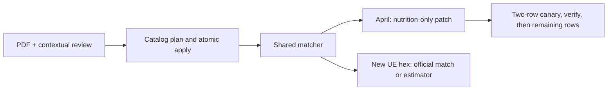

# WaBa + Yoshinoya: official-PDF correction pilot

## Audit result

The catalog is not safe to wire wholesale. The September audit found 4,667 rows across 52 brands; 2,275 lacked serving sizes. A calorie-versus-macro check flagged 379 rows for investigation, not 379 proven errors. WaBa's 48 rows and Yoshinoya's 127 rows reproduce their HTML tables, but copying a table correctly does not establish the right serving or UE item.

The pilot uses the official PDFs linked in `apps/api/services/chainPilotData.ts`. Each approved fact binds all four macros, a serving, PDF URL/hash, page/table locator and full contextual aliases. The files were visually checked; both relevant tables are on page 1.

| Reviewed configuration | Calories | Protein / carbs / fat (g) | Captured April rows |
|---|---:|---|---:|
| WaBa Chicken Plate | 820 | 54 / 110 / 15 | 7 |
| WaBa Steak Plate | 980 | 44 / 130 / 27 | 25 |
| WaBa Chicken Veggie Bowl | 590 | 39 / 90 / 11 | 7 |
| WaBa Miso Soup | 30 | 2 / 3 / 0 | 7 |
| Yoshinoya Gyudon Beef side, 198 g | 310 | 21 / 8 / 21 | 6 |
| Yoshinoya Habanero Chicken side, 166 g | 290 | 28 / 18 / 11 | 6 |
| Yoshinoya Clam Chowder, 227 g | 300 | 9 / 18 / 22 | 6 |

These are seven facts and thirteen contextual aliases, covering 64 April rows at 31 restaurants in the captured snapshot. Three facts are new catalog rows; four update existing rows with verified servings and provenance, including the Gyudon Beef numeric correction. Six unsafe WaBa legacy aliases are removed from five catalog rows: family-protein rows were bound to single plates/bowls, and a shrimp taco row was bound to bowls. Their underlying unreviewed facts remain quarantined from this matcher.

Yoshinoya's side-beef catalog row changes from 686 calories / 27 protein / 8 carbs / 63 fat to the PDF's 310 / 21 / 8 / 21; the captured UE label also says 310. The WaBa family chicken row at 1,050 calories must not supply a Chicken Plate at 820.

**Hold:** configurable/ranged meals, conflicting UE calories, WaBa shrimp PDF/HTML disagreements, and suspicious Yoshinoya rows remain unmatched. Other brands have not received a PDF accuracy audit. No blanket accuracy claim or menu refresh is included.

## Apply and rollback

Run `npx tsx --tsconfig apps/api/tsconfig.json scripts/preload-chain-pilot.ts` with an explicitly selected `POSTGRES_URL_NON_POOLING`. Commands below take a local artifact path. Plan commands only read the DB; each apply requires the printed plan hash and validates the target and current rows.

1. `catalog-plan <catalog.json>`; inspect twelve changes, then `catalog-apply <catalog.json> <hash>`.
2. `april-plan <april.json>`; inspect matches and reported unresolved restaurants, then `april-apply <april.json> <hash> --limit=2`. Planning uses the same verified brand identity as the writer. The first two rows exercise Chicken Plate and Gyudon Beef side when present.
3. Verify both canaries and serving-source agreement. Replan to a new file, apply the remaining count, then require another plan to return zero changes.
4. Rollback if needed: `april-rollback <april.json.journal>` in reverse batch order, then `catalog-rollback <catalog.json.applied.json>`.

Plans and per-row journals are exclusive, mode-600, fsynced files. Every transaction checks the captured state. April rollback is atomic per journal batch: any later edit aborts the entire rollback, and incomplete or noncontiguous journals are rejected before it starts. A known pre-write validation failure records `stopped.json` with the completed prefix count, allowing those committed rows to be rolled back while preserving the conflicting row. Unknown DB errors or crashes do not create this marker: incomplete evidence requires DB inspection against the saved plan because filesystem and DB commits cannot be atomic together. Never overwrite artifacts or blindly rerun a partial apply.

The April patch preserves IDs, membership, saved references and non-nutrition fields. Merchant data keeps priority. The batch limit defaults to 2 and must be between 1 and the plan's row count. Rollback order is an operator responsibility: reverse the April batches before rolling back their catalog approvals.

New-hex enrichment snapshots the catalog at startup: do not edit approvals during an active run; restart with the corrected catalog if an approval changes. Activation takes effect when enrichment next runs for a location; its existing pre-fetch skip rules still apply. This April pilot uses the separate nutrition-only command. Approving these brands switches all their future enrichment to UE menus: unmatched items use Haiku, and an empty UE menu skips the location, with no FatSecret menu fallback.

## Local proof

- The actual CLI runs plan/apply/replan/rollback on an isolated Postgres fixture and restores the exact initial state. Wrong hash, wrong target and invalid limits cannot write.
- Real-DB tests replay all 64 captured April rows and verify the detail service returns their corrected macros and HIGH confidence. All seven new-location dishes also agree between search and detail. Rollback restores a prior official estimate and refuses concurrent item or source edits.
- Fresh full-menu UE captures exposed WaBa dishes under “Featured items”; three verified contextual aliases fix those misses. All seven captured UE configurations persist at new local fixture locations through the actual hex writer, with the same four macros as the April path and zero estimator calls. Adapter tests additionally parse raw UE responses, exercise actual location titles and reject ambiguous/conflicting matches. No fabricated production restaurants are needed for this test.
