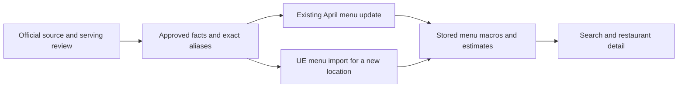

# Chain nutrition rollout: production results

**33,890 existing menu rows now use reviewed official nutrition across 27 brand identities.**
These thirteen completed batches are separate from the earlier WaBa/Yoshinoya rollout.
National onboarding is still in progress.

## What changed

| Completed batch | Rows updated | Nutrition values changed | Attribution only |
|---|---:|---:|---:|
| McDonald's, Panda Express, El Pollo Loco | 11,972 | 2,076 | 9,896 |
| Subway, Fatburger, Five Guys, Carl's Jr. | 7,165 | 2,246 | 4,919 |
| Taco Bell | 1,861 | 1,487 | 374 |
| Starbucks | 2,309 | 1,087 | 1,222 |
| Boba Time, Pizza Hut | 2,141 | 1,304 | 837 |
| Jollibee, Goop Kitchen, Rubio's, Farmer Boys | 423 | 246 | 177 |
| Domino's | 1,031 | 1,030 | 1 |
| Jamba, Panera, Robeks | 858 | 546 | 312 |
| Little Caesars, Papa Johns | 1,213 | 397 | 816 |
| Jimmy Johns | 81 | 78 | 3 |
| Wingstop | 382 | 12 | 370 |
| Burger King | 3,033 | 1,673 | 1,360 |
| IHOP | 1,421 | 224 | 1,197 |
| **Total** | **33,890** | **12,406** | **21,484** |

“Nutrition values changed” means at least one of calories, protein, carbs or fat changed.
“Attribution only” means those four values stayed the same and reviewed official attribution was applied.
These counts measure rollout behavior, not accuracy against measured food.

The batches loaded **1,165 approved facts and 1,652 exact menu aliases** into the chain catalog.
Existing menu items and their winning macro estimates then received the same facts through the shared matcher.
Jamba and Panera each have two stored brand identities, so 27 identities are not 27 distinct consumer brands.
Two additional identities, Dave's Hot Chicken and Nothing Bundt Cakes, were linked to 23 existing restaurants; their 232 menu items and estimates stayed unchanged, with no official nutrition activated yet.

## Both paths use the same catalog

The matcher, identity handoff and guarded bulk writer are merged through [PR 289](https://github.com/dgmolla/fitsy/pull/289).
The reviewed writer is commit `179be20e9a26eda262c428149630f72092730302`, merged as `848f117952b60b62bd1ee03291151e73a1184e55`.
Main Verify and Deploy passed for that release, followed by authenticated production checks.
Compatible source batches are data operations and need no API deployment per chain.
Offline UE runs must use a checkout containing that release.

## What was proved

| Check | Result and limit |
|---|---|
| Production preservation | All **89,301 menu IDs across 882 restaurants** preserved; all **55,411 unselected rows** unchanged. |
| Serving API | Complete authenticated menu reads checked every selected restaurant and changed row; search/detail checks passed per changed brand. |
| Repeat execution | Every completed batch produced zero pending catalog and April changes. |
| Recovery | Local exact rollback passed; production writes have bounded transaction journals and before/after snapshots. Production was not rolled back as a test. |
| Future imports | Local tests used the real parser, resolver, brand handoff, `persistHex` and serving layer. Current UE captures and simulated historical menus are separate evidence. No production hex was added. |
| Source quality | Automated transcription checks plus independent source/binding review. Review depth varies; this is not measured restaurant nutrition or an exhaustive human audit. |

Burger King, IHOP and Wingstop had no current UE capture because ordinary fetches were challenged and stopped.
Their import proof uses complete historical menus, so current availability and naming coverage remain unverified.
Activating an approved catalog routes new imports through UE; it does not guarantee UE will return a menu.

The [receipt record](chain-production-receipts-2026-09-12.json) contains counts, verification times and hashes of approvals and readbacks.
Full source captures, baselines and rollback journals remain in the task archive `work/chain-national`.
The aggregate record alone cannot perform a rollback.

## Errors caught before publication

| Failure pattern | Example and resolution |
|---|---|
| Wrong recipe or item class | Domino's Philly pizza proposed against a sandwich; current and April sandwich recipes also differed. Conflicting bindings were excluded. |
| Source disagreement | Panera whole-item labels disagreed with two source rows; those facts were held. Little Caesars pretzel variants were separated and conflicting category bindings removed. |
| Hidden accompaniments | Burger King onion rings had unresolved default sauce groups. Four facts affecting 136 rows were removed before rollout; sauce/syrup checks now inspect option-group roles. |
| Incomplete meal values | IHOP omelette calories exclude a required side. Meal categories remain held; standalone pancakes, waffles and French toast have three product-page checks, with the omelette as a positive control. |
| Wrong serving unit | Wingstop per-wing facts cannot match unspecified wing orders. Only explicit-size sides and single brownies were approved; missing beverage protein was not inferred as zero. |
| Wrong source scope | Pizza Hut's Canadian guide and Express breakfast items were excluded from ordinary US bindings. |

Burger King's 225 visible panels passed a full automated comparison with captured per-serving observations; independent review sampled raw macros and reviewed every proposed alias.
IHOP's automated checks cover all 417 source rows, while independent raw-source and alias review was sampled.
Its three standalone product pages support a stated category inference for 13 further variants, not direct checks of every variant or location.
Wingstop's 11 approved facts and aliases were independently checked against PDF text and a rendered page.
All three retain unresolved cases as estimates.

## Remaining work

1. Continue through remaining identities and source candidates, prioritizing restaurant meals and recording missing portions, recipe conflicts, wrong markets and unavailable facts.
2. Package the proven source adapters and proposal gates into the repeatable onboarding workflow.
   Discovery and review remain offline work, not an unattended nationwide service.
3. Keep source accuracy review separate from coverage and importer consistency.
   An exact alias and passing replay do not prove a restaurant serves the published portion.

The [September 11 inventory](chain-national-onboarding.md) covers the broader opportunity.
Its 688 menu-bearing groups are a review cohort, not 688 independently confirmed national chains or approved catalogs.
Use the [catalog runbook](chain-catalog-batches.md) for execution and recovery rules.
