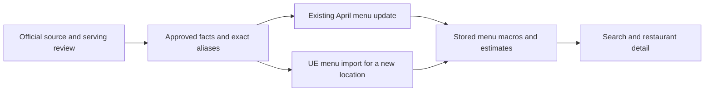

# Chain nutrition rollout: production results

**35,985 existing menu rows now use reviewed official nutrition across 41 brand identities.**
These 26 completed batches are separate from the earlier WaBa/Yoshinoya rollout.
National onboarding is still in progress.

## What changed

| Completed batch | Rows updated | Nutrition values changed | Attribution only |
|---|---:|---:|---:|
| McDonald's, Panda Express, El Pollo Loco | 11,972 | 2,076 | 9,896 |
| Subway, Fatburger, Five Guys, Carl's Jr. | 7,165 | 2,246 | 4,919 |
| Taco Bell | 1,861 | 1,487 | 374 |
| Starbucks | 2,309 | 1,087 | 1,222 |
| Boba Time, Pizza Hut | 2,141 | 1,304 | 837 |
| Jollibee, Goop Kitchen, Rubio's, Farmer Boys | 423 | 246 | 177 |
| Domino's | 1,031 | 1,030 | 1 |
| Jamba, Panera, Robeks | 858 | 546 | 312 |
| Little Caesars, Papa Johns | 1,213 | 397 | 816 |
| Jimmy Johns | 81 | 78 | 3 |
| Wingstop | 382 | 12 | 370 |
| Burger King | 3,033 | 1,673 | 1,360 |
| IHOP | 1,421 | 224 | 1,197 |
| Shake Shack | 446 | 56 | 390 |
| CAVA | 170 | 71 | 99 |
| Habit Burger & Grill | 107 | 107 | 0 |
| Wendy's | 201 | 111 | 90 |
| Fresh Brothers | 18 | 18 | 0 |
| Buffalo Wild Wings | 55 | 25 | 30 |
| Dunkin | 230 | 230 | 0 |
| Jersey Mike's | 60 | 60 | 0 |
| Popeyes | 108 | 108 | 0 |
| California Pizza Kitchen | 380 | 190 | 190 |
| BJ's Restaurant & Brewhouse | 243 | 243 | 0 |
| Nothing Bundt Cakes | 49 | 49 | 0 |
| Dave's Hot Chicken | 28 | 4 | 24 |
| **Total** | **35,985** | **13,678** | **22,307** |

“Nutrition values changed” means at least one of calories, protein, carbs or fat changed.
“Attribution only” means those four values stayed the same and reviewed official attribution was applied.
These counts measure rollout behavior, not accuracy against measured food.

The batches loaded **1,387 approved facts and 1,956 exact menu aliases** into the chain catalog.
Existing menu items and their winning macro estimates then received the same facts through the shared matcher.
Jamba, Panera and Popeyes each have two stored brand identities, so 41 identities represent 38 distinct consumer brands.
Dave's Hot Chicken and Nothing Bundt Cakes were also linked to 23 existing restaurants while preserving all 232 menu items and estimates.
Nothing Bundt Cakes now has 49 official nutrition updates across 10 locations; Dave's has 28 across 13 locations, with 100 rows still estimated.

## Both paths use the same catalog

The matcher, identity handoff and guarded bulk writer are merged through [PR 289](https://github.com/dgmolla/fitsy/pull/289).
The reviewed writer is commit `179be20e9a26eda262c428149630f72092730302`, merged as `848f117952b60b62bd1ee03291151e73a1184e55`.
Main Verify and Deploy passed for that release, followed by authenticated production checks.
Compatible source batches are data operations and need no API deployment per chain.
Offline UE runs must use a checkout containing that release.

## What was proved

| Check | Result and limit |
|---|---|
| Production preservation | All **108,038 menu IDs across 1,095 restaurants** preserved; all **72,053 unselected rows** unchanged. |
| Serving API | Complete authenticated menu reads checked every selected restaurant and changed row; search/detail checks passed per changed brand. |
| Repeat execution | Every completed batch produced zero pending catalog and April changes. |
| Recovery | Local exact rollback passed; production writes have bounded transaction journals and before/after snapshots. Production was not rolled back as a test. |
| Future imports | Local tests used the real parser, resolver, brand handoff, `persistHex` and serving layer. Current UE captures and simulated historical menus are separate evidence. No production hex was added. |
| Source quality | Automated transcription checks plus independent source/binding review. Review depth varies; this is not measured restaurant nutrition or an exhaustive human audit. |

Nine batches after Habit have no current UE capture.
Those batches use complete historical menus for import proof, so current availability and naming coverage remain unverified.
Dave's additionally passed replay of two current UE menus with 185 items: eight official matches and 177 retained estimates.
Activating an approved catalog routes new imports through UE; it does not guarantee UE will return a menu.

The [receipt record](chain-production-receipts-2026-09-12.json) contains counts, verification times and hashes of approvals and readbacks.
Full source captures, baselines and rollback journals remain in the task archive `work/chain-national`.
The aggregate record alone cannot perform a rollback.

## Errors caught before publication

| Failure pattern | Example and resolution |
|---|---|
| Wrong recipe or item class | Domino's Philly pizza proposed against a sandwich; current and April sandwich recipes also differed. Conflicting bindings were excluded. |
| Source disagreement | Panera whole-item labels disagreed with two source rows; those facts were held. Little Caesars pretzel variants were separated and conflicting category bindings removed. |
| Hidden accompaniments | Burger King onion rings had unresolved default sauce groups. Four facts affecting 136 rows were removed before rollout; sauce/syrup checks now inspect option-group roles. |
| Incomplete meal values | IHOP omelette calories exclude a required side. Meal categories remain held; standalone pancakes, waffles and French toast have three product-page checks, with the omelette as a positive control. |
| Wrong serving unit | Wingstop per-wing facts cannot match unspecified wing orders. Only explicit-size sides and single brownies were approved; missing beverage protein was not inferred as zero. |
| Wrong source scope | Pizza Hut's Canadian guide and Express breakfast items were excluded from ordinary US bindings. |
| Changed recipes | CAVA's older Greek Chicken and Spicy Chicken + Avocado descriptions differ from the current recipe. Only the matching descriptions were approved; 28 old or empty-description rows stayed held. |
| Conflicting official pages | Habit menu calories disagree with detailed nutrition for 321 mapped rows. Five consistent facts were approved; fries were excluded after discovering an unspecified ketchup serving. |
| Two current sources disagree | Buffalo Wild Wings nachos and carrots/celery disagreed with its current dine-in menu. Both bindings were removed; five other facts lacked a second label, which was recorded as absence rather than agreement. |
| Recipe and serving ambiguity | Dunkin ingredient blocks distinguish Swiss cheese from other sandwiches and standard from Kosher recipes. Jersey Mike's generic cookie and unspecified sub sizes stayed held. Fresh Brothers pizzas stayed held because whole-order slice counts were unavailable. |
| Duplicate chain identities | Popeyes had two additional locations under a second brand. Their eight eligible rows used the same reviewed facts, with separate brand-scoped aliases and both importer paths tested. |
| Default configuration and recipe scope | CPK whole pizzas use the explicit six-slice rule; seven-inch pizzas remain whole single pizzas. Three conflicting recipes affecting 15 rows were held. |
| Conflicting portion evidence | BJ’s four floats stayed held because the scoop descriptions and nutrition imply different quantities. Appetizers, sides, five pastas including garlic knots, and seven full-size Pizookies were reviewed separately. |
| Unproven sauce portion | Dave's ordinary cheese sauce had no menu weight or calorie label to establish the PDF portion. Review removed that binding before publication; four clear standard sides remained. |
| Nutrition servings versus guests | Nothing Bundt Cakes publishes nutrition servings per cake separately from approximate guest counts. Whole products use the flavor-specific nutrition count; generic cakes without a size remain held. |

Burger King's 225 visible panels passed a full automated comparison with captured per-serving observations; independent review sampled raw macros and reviewed every proposed alias.
IHOP's automated checks cover all 417 source rows, while independent raw-source and alias review was sampled.
Its three standalone product pages support a stated category inference for 13 further variants, not direct checks of every variant or location.
Wingstop's 11 approved facts and aliases were independently checked against PDF text and a rendered page.
All three retain unresolved cases as estimates.
Shake Shack's 35 facts and 44 aliases were independently reviewed in full.
CAVA and Habit review covered all 21 approved facts and 32 aliases; local tests also checked all 37 stored restaurant names with and without a prelinked brand.
Their production plans selected exactly the expected IDs and preserved Habit's 100 existing catalog rows.
Wendy's, Fresh Brothers, Buffalo Wild Wings, Dunkin, Jersey Mike's and Popeyes received independent review of every proposed fact and alias.
Their holds include changed recipes, unknown container quantities, mixed chicken orders, dip choices and unsized drinks.
Published standard servings and singular product assumptions remain distinct from measured portions.
CPK’s 50 facts and 66 aliases and BJ’s 35 facts and 36 aliases passed independent review and complete historical menu replays.
CPK’s 380 updates preserved 1,660 IDs; BJ’s 243 updates preserved 1,444 IDs.
Both batches passed authenticated complete-menu checks and empty repeat plans.
Nothing Bundt Cakes passed independent review of 26 source rows, 23 whole-order facts and 41 aliases.
Its 49 updates preserved all 104 menu IDs; 43 unclear configurations and 12 non-food candles stayed unchanged.
The fixed 12-Bundtini assortment includes three each of four named flavors; decorative toppers are treated as non-food accessories based on the product descriptions.
Dave's four facts and eight exact aliases passed source review and both writer paths.
Its 28 updates include four nutrition corrections and 24 confirmations of existing values; all 128 menu IDs and 100 unselected rows were preserved.
The six historical aliases and two current-only Featured items aliases are verified together; sauce conflicts, unknown heat levels and ambiguous portions remain estimates.
Peet’s regional catalog is prepared but inactive; its location-aware runtime still requires the repository’s simulator release gate.
Del Taco remains unpublished because its guide limits nutrition coverage to company-owned restaurants, and location eligibility has not been established.

## Remaining work

1. Continue through remaining identities and source candidates, prioritizing restaurant meals and recording missing portions, recipe conflicts, wrong markets and unavailable facts.
2. Package the proven source adapters and proposal gates into the repeatable onboarding workflow.
   Discovery and review remain offline work, not an unattended nationwide service.
3. Keep source accuracy review separate from coverage and importer consistency.
   An exact alias and passing replay do not prove a restaurant serves the published portion.

The [September 11 inventory](chain-national-onboarding.md) covers the broader opportunity.
Its 688 menu-bearing groups are a review cohort, not 688 independently confirmed national chains or approved catalogs.
Use the [catalog runbook](chain-catalog-batches.md) for execution and recovery rules.
