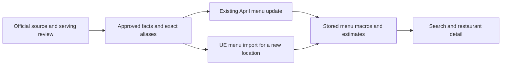

# Chain nutrition rollout: production results

**26,902 existing menu rows now use reviewed official nutrition across 16 chain identities.**
These seven completed batches are separate from the earlier WaBa/Yoshinoya rollout.
National onboarding is still in progress.

## What changed

| Completed batch | Rows updated | Nutrition values changed | Attribution only |
|---|---:|---:|---:|
| McDonald's, Panda Express, El Pollo Loco | 11,972 | 2,076 | 9,896 |
| Subway, Fatburger, Five Guys, Carl's Jr. | 7,165 | 2,246 | 4,919 |
| Taco Bell | 1,861 | 1,487 | 374 |
| Starbucks | 2,309 | 1,087 | 1,222 |
| Boba Time, Pizza Hut | 2,141 | 1,304 | 837 |
| Jollibee, Goop Kitchen, Rubio's, Farmer Boys | 423 | 246 | 177 |
| Domino's | 1,031 | 1,030 | 1 |
| **Total** | **26,902** | **9,476** | **17,426** |

“Nutrition values changed” means at least one of calories, protein, carbs or fat changed.
“Attribution only” means those four values stayed the same and the reviewed official attribution was applied.
These counts measure rollout behavior, not an accuracy score against measured food.

The batches loaded **795 approved facts and 1,189 exact menu aliases** into the chain catalog.
Existing menu items and their winning macro estimates were then updated through the shared matcher.
Two additional brand identities, Dave's Hot Chicken and Nothing Bundt Cakes, were linked to 23 existing restaurants; their 232 menu items and nutrition estimates stayed unchanged, with no official nutrition activated yet.

## Both paths use the same catalog

The shared matcher, identity handoff and guarded bulk writer are merged through [PR 289](https://github.com/dgmolla/fitsy/pull/289).
The reviewed writer is commit `179be20e9a26eda262c428149630f72092730302`, merged as `848f117952b60b62bd1ee03291151e73a1184e55`.
Main Verify and Deploy passed for that release, followed by authenticated production checks.
Subsequent compatible source batches are data operations; they do not require an API deployment per chain.
Offline UE runs must use a checkout containing the shared matcher release.

## What was proved

| Check | Result and limit |
|---|---|
| Existing production menus | All **67,444 menu IDs across 628 restaurants** preserved; every unselected row unchanged. |
| Serving API | Complete authenticated menu reads checked all selected restaurants and all changed rows; search/detail checks passed per changed brand. |
| Repeat execution | Every completed batch produced zero pending catalog and April changes. |
| Recovery | Local exact rollback passed; production changes have bounded transaction journals and full before/after snapshots. Production was not rolled back as a test. |
| Future UE imports | Local replays exercised the real parser, resolver, brand handoff, `persistHex` and serving layer. Current UE captures were used where available; complete historical menu shapes were tested separately. No production hex was added. |
| Source quality | Official tables were cross-checked and bindings independently reviewed. Review depth varies by batch; this is not measured restaurant nutrition or an exhaustive human audit of every source row. |

The [aggregate receipt record](chain-production-receipts-2026-09-12.json) contains counts, verification times and SHA-256 references to the retained plans, approvals and readbacks.
Full baselines, source captures and rollback journals remain in the local task archive `work/chain-national`.
The aggregate record alone cannot perform a rollback.

## Errors caught before publication

- **Recipe and item class:** Domino's Philly pizza was proposed against a sandwich fact; April sandwiches also differed from the current recipes.
  Those bindings were excluded.
- **Portions:** Rubio's explicitly named two-ounce crema cups require twice the published one-ounce facts.
  Ambiguous Goop portions and accompaniments remain estimated.
- **Source scope:** Pizza Hut's Canadian guide and Express breakfast items were excluded from ordinary US restaurant bindings.
- **Labels and aliases:** Unpublished café review caught missed “Cal.” labels and a Jamba waffle conflict surviving under a different name.
  The corrected label audit found no explicit-description conflicts in the seven published batches; most of those descriptions have no calorie label.

## Remaining work

1. Finish source review and guarded rollout for the café and next pizza-chain candidates.
2. Continue through remaining chain identities and source candidates, recording concrete holds for missing portions, recipe conflicts, wrong markets and unavailable official facts.
3. Package the proven source adapters and proposal gates into the repeatable onboarding workflow.
   Source discovery and review are still offline work, not an unattended nationwide service.

The [September 11 inventory and method](chain-national-onboarding.md) covers the broader opportunity.
Its 688 menu-bearing brand groups are a review cohort, not 688 independently confirmed national chains or approved catalogs.
Use the [catalog runbook](chain-catalog-batches.md) for execution and recovery rules.
