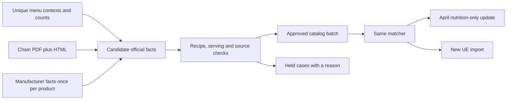

# Chain match quality and scale-out

The batch is live in production and adds 66 official matches across the existing WaBa and Yoshinoya April menus.
This is agent-reviewed source and serving evidence, not a measured human-reviewed nutrition accuracy score.
The code shipped in [PR #283](https://github.com/dgmolla/fitsy/pull/283), followed by guarded catalog and April updates on September 11, 2026.

| Measure | Before | Verified after | Meaning |
|---|---:|---:|---|
| April official rows | 592 / 1,337 | 658 / 1,337 | +59 exact packaged drinks and +7 Chicken Bowls |
| April estimated rows | 745 | 679 | Unresolved cases stay estimated |
| Captured UE official rows | 52 / 151 | 62 / 151 | WaBa 20 to 29; Yoshinoya 32 to 33 |
| New manufacturer facts | 0 in this batch | 9 | Reusable across chains through explicit bindings |
| Existing approvals reversed | 0 | 0 | No confirmed contradiction found for the applied contexts |

The batch also updated the approval reference on 18 already-official historical Chicken Bowls without changing their nutrients.
The completed production write set is therefore 84 rows: 66 new matches plus 18 attribution updates.
Current-menu replay proves the importer behavior using captured menus and an isolated database; it does not create production locations.

The before/after production comparison confirms numeric corrections on 61 of the 66 newly matched rows; five already had the correct numbers and gained official attribution.
Ten corrections change calories by at least 100 kcal.
The corrected rows now agree with the reviewed published facts across locations; actual kitchen portion accuracy remains unmeasured.

| Item | Before: estimated calories across locations | After: published facts | Rows |
|---|---:|---:|---:|
| Chicken Bowl | 514-588 | 640, with 38 g protein / 100 g carbs / 11 g fat | 7 |
| Pepsi 20 oz | 147-281 | 250 | 7 |
| Dole Apple Juice 15.2 oz | 65-156 | 210 | 6 |
| Unsweet Pure Leaf 16.9 oz | 0-91 | 0 | 7 |

## Production proof and limits

| Check | Verified result | Limit |
|---|---|---|
| Catalog apply and readback | Nine facts added, one approval extended; 191 approved facts and 105 contextual aliases; 352 unrelated rows unchanged | Published-source review is agent review |
| Two-row canary, then 82-row remainder | All 84 writes match independent source transcriptions; 62 restaurant records and all 1,337 menu IDs preserved | 61 numeric corrections; 23 attribution-only changes |
| Unaffected data | All 1,253 other menu rows and estimates unchanged | Existing weak serving evidence is not strengthened by preservation |
| Authenticated production HTTP | All 62 full menus / 1,337 items checked, including all 84 changed items; two search/detail comparisons pass | Existing allowlisted App Review account; not a paid-subscription test |
| Native serving before release | Three Maestro flows plus actual Mobile MCP checks of both writer fixtures and filter/search recovery pass | Owned simulator and synthetic dev fixtures |
| Both real writers locally | 168 April contexts representing 1,337 rows; 151 captured UE items physically persisted, 62 official | Repeated locations are weighted coverage, not independent quality labels |
| Idempotence | Fresh catalog and April plans both contain zero changes | Applies to the reviewed batch and captured production state |

The canary corrected one Chicken Bowl from 535 to 640 kcal and one Lime Cucumber Gatorade from 95 to 140 kcal before the remaining writes.
Full authenticated HTTP verification completed at `2026-09-11T12:03:36Z`.
Local checks passed 9/9 blocking checks; the pre-existing own-code-mocks check remains shadow.
Required reviews, exact-head PR checks, main [Verify](https://github.com/dgmolla/fitsy/actions/runs/34595842495) and [Deploy](https://github.com/dgmolla/fitsy/actions/runs/34595842488) passed.
The first final HTTP harness attempt used an unsupported search limit of 100; correcting the harness to the API's maximum of 50 produced the complete passing run without a product change.

| Release identity | Value |
|---|---|
| Reviewed PR head | `f704b951e4da9ffac64f47e0e409e229b94bc653` |
| Merged code | `32b4a7c743ab2ef980df13f7b4f938ce4ef5aa52` |
| Production deployment | `dpl_CWNHpQgz3NoyUPpbXx4ghMUg9t5Y`, READY |
| Previous production deployment | `dpl_3ShwX3paQ2fTiRsVr1Bwky62TSuy`, revision `8b8d49f939d739d6eb92164c07ecd057fe79407f` |

The task's retained `work/chain-quality/` evidence includes `production-final-readback.json`, `production-auth-http-final.json`, both no-op plans, and the catalog/canary/remainder journals.
For rollback, restore the April remainder and canary journals, then `production-catalog-rollout-plan.json.applied.json`, before restoring older matcher code.
No new production locations, hexes or mobile OTA were created by this batch.
Offline UE imports must also run revision `32b4a7c` or a compatible successor; an API deployment does not update an operator's older checkout.

## What the audit found

| Finding | Concrete example | Decision |
|---|---|---|
| Exact manufacturer labels close source gaps | Pepsi 20 oz: 250 kcal; Gatorade 20 oz: 140 kcal | Add nine fully identified products; keep flavor and package size distinct |
| A range sometimes has a documented default | WaBa Chicken Bowl: white rice, regular chicken, WaBa sauce | Approve 640 kcal for the two reviewed menu contexts and exact 640-760 range |
| Required choices sometimes have no default | WaBa tacos, family rice, family protein selector | Keep estimated until a specific complete configuration is established |
| PDF and HTML have different coverage | Yoshinoya HTML adds 99 g cheesecake and 227 g rice rows | Add candidates to research, not automatic bindings to generic cheesecake or rice |
| Official pages can disagree or contain errors | Yoshinoya HTML beef differs materially from PDF; PDF gyoza has saturated fat above total fat | Keep affected facts or bindings held; do not prefer a whole source blindly |
| Recipe wording protects identity | April Signature House includes chicken; current official ordering requires a protein choice | Keep the existing description-sensitive binding; do not inherit it by name |
| Discovery source is not menu source | Sparse historical menus were built by the FatSecret menu adapter at UE-discovered restaurants | Do not use `Restaurant.source = ue_feed` as evidence that the menu came from UE |

The 592 prior applied rows retain their evidence distinctions: 281 have matching-context captured UE calorie corroboration, 113 have reviewed mappings without that corroboration, and 198 have sparse historical WaBa names.
Calorie corroboration checks calories, not all three macros or actual kitchen portions.
The 198 rows represent only 11 repeated aliases, not 198 independent quality observations.
Their historical physical serving sizes remain unverified; no new aliases were inferred from them.
The two sparse protein-side aliases account for 36 rows and deserve explicit serving confirmation in the next human review.

## Remaining 679 rows

| Evidence band | Rows | Next evidence needed |
|---|---:|---|
| Nearby identity | 154 | Resolve generic chicken, half-half, cheesecake, vegetables and salad recipe identity |
| Serving or option ambiguity | 134 | Identify the actual default, package size or selected configuration |
| Only components available | 115 | Establish all ingredients, quantities and included sides before summing |
| Source disagreement | 109 | Resolve the specific serving/version conflict; keep inconsistent facts quarantined |
| No applicable fact in the reviewed source set | 167 | Expand official source discovery; absence in a PDF is not proof no official fact exists |

The last band includes 13 exact packaged rows still held: Dole Lemonade 20 oz and Orange Crush 20 oz.
The official distributor pages identify these packages but did not expose complete nutrition labels in this pass.
The other 154 source-gap rows need recipe-specific evidence, including Yoshinoya Miso Soup and Strawberry Shortcake.

## Repeatable operating flow

The 1,337 April rows reduce to 168 distinct menu contexts.
The 66 new matches come from ten reviewed contexts, which is the useful unit of onboarding work.
Sample locations separately to detect exceptions; repeated rows are coverage, not independent accuracy evidence.



1. **Prioritize repeated menu variants and main dishes.** Count affected locations and rows, but review each distinct recipe/serving context once.
2. **Capture complete source context.** Keep PDF table headings, HTML-only rows, source URLs/hashes and manufacturer label images; compare conflicts per fact.
3. **Reuse packaged facts across chains.** Key by market, brand, flavor and package serving, then approve each chain's exact menu binding.
4. **Treat closeness as a review queue.** Similar names propose candidates; they do not authorize writes.
5. **Require evidence for defaults.** Inspect every required food choice, optional defaults and quantity; a placeholder such as “Select Your Sauce” is not a selection.
6. **Test accepted and rejected contexts together.** Replay full menus, check April updates, preserve IDs and unrelated fields, and prove rollback before the canary.
7. **Measure quality separately from coverage.** Have a human label correct recipe, correct serving and correct transcription independently, stratified across applied evidence bands and near misses.

The same approved facts feed both writers, with no extra model, network or per-item database calls in matching.
The manufacturer compiler is offline and deterministic; it does not discover sources or automatically approve fuzzy bindings.
Enabling a brand also changes new-import menu resolution: reviewed brands use UE without the legacy FatSecret menu fallback.
Replay a complete captured UE menu before activating a new brand, including empty-menu behavior, unmatched estimation volume and duplicate listings.
The April nutrition-only update preserves existing menu membership; it does not replace historical FatSecret-built menus with UE menus.
National onboarding can proceed chain by chain, reusing manufacturer facts and contextual aliases across stores.
After this matcher/schema release, compatible facts and aliases can ship as guarded data batches without an API deployment or a separate implementation per chain.
New serving or matching behavior still requires a code release and regression coverage.
Track approved distinct contexts, affected rows, meal versus drink coverage, held reasons, and human-reviewed recipe/serving/transcription precision separately.
For the next review, prioritize the 36 already-applied sparse protein-side rows, then repeated unresolved main dishes; more drink matches alone do not establish better meal recommendations.
Menu-source provenance is a remaining improvement: record discovery source, menu source and nutrition source separately when importing future menus.
Refresh scheduling and additional menu providers remain outside scope.
See the [national onboarding playbook](chain-national-onboarding.md) for the next-chain ranking and the [nine-context review queue](chain-quality-next-review.md) for unresolved meal and serving questions.

## Reproduce the batch

The reviewed input is `apps/api/services/chainCatalogs/chain-quality-2026-09-input.json`.
It contains source URLs, content hashes, label locators and the exact default selections.

```sh
npx tsx scripts/preload-chain-product-batch.ts apps/api/services/chainCatalogs/chain-quality-2026-09-input.json work/chain-quality-batch.json
# Then follow the guarded catalog-plan/apply and april-plan/apply procedure:
# docs/engineering/pipeline/chain-catalog-batches.md
```

Use a new output path; the compiler refuses to overwrite an existing artifact.
Deploy the matcher code before applying this catalog: older code rejects the new default-serving approval fields.
For a code rollback, first roll back the April writes and then the catalog, using their saved journals, before restoring the older code.
The regression fixture independently transcribes all nine product labels and the Chicken Bowl facts.
The database replay covers all April variants, both complete captured UE menus, search/detail consistency, catalog identity, unrelated-row preservation and rollback.
Tests do not establish that customers receive exactly the published portion or choose the documented default.
