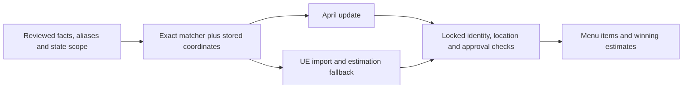

# Regional chain nutrition

A source that applies only to specified US states must carry those states in its catalog approval.
An exact menu name does not establish the source's geographic coverage.

| Case | Behavior |
|---|---|
| Existing national approval | Existing version-1 review hash and matching behavior remain valid. |
| Regional approval, eligible location | Exact menu identity and serving checks can select the approved facts. |
| Missing, invalid, foreign or uncertain coordinates | Regional facts are excluded; ordinary estimation remains available. |
| Two applicable facts claim the same alias | Reject as ambiguous, even when their macros agree. |
| Same alias in disjoint states | Each location can select its state's fact. |
| Location, identity or reviewed facts change before persistence | Abort the transaction before changing menu rows or recording a checkpoint. |

## Approval input

Add an optional `usStates` array to a reviewed change in the catalog batch:

```json
{"usStates": ["CA", "IL", "DC", "MD", "VA"]}
```

These are explicitly supported states, not examples or a default market inferred from the restaurant address.
Use separate canonical facts when regional recipes differ.
The array is nonempty, unique, uppercase and limited to recognized Census state/territory codes.
Every state is bound into the review hash; changing or removing the scope requires a new approval.
Reordering the same states does not invalidate approval.

The source review must establish statewide applicability.
State coverage does not establish city-only coverage, franchise ownership, restaurant availability, portions or menu membership.
Conflicting publication scopes stay held.
For example, this field cannot prove that a Del Taco location is company-owned or extend an LA-only guide to all of California.

## Shared flow



The April planner, both April writers and the UE-first resolver use the same matcher.
Both menu persistence paths recheck reviewed-chain metadata and facts against the current catalog and locked restaurant location.
All target restaurants, including those with only estimates, are locked before their menu rows.
Transactions use serializable isolation to cover concurrent new catalog/brand claims that locks on existing rows cannot cover.
Only known serialization aborts receive bounded retries; a large hex can repeat its entire transaction up to twice.
Avoid concurrent ingestion and backfill jobs targeting the same data.
An uncertain commit is never retried automatically.
Rollback restores recorded rows without requiring the restaurant to remain inside the source's region.

## Offline boundary reference

The lookup uses the [2025 Census cartographic state boundaries](https://www.census.gov/geographies/mapping-files/2025/geo/carto-boundary-file.html) at 1:500,000 scale.
The source archive URL and SHA-256 are embedded in the generated reference.
Regenerate it with `python3 scripts/preload-chain-boundaries.py /path/to/cb_2025_us_state_500k.zip`.
The generator verifies the pinned archive and preserves every polygon, hole and coordinate, with antimeridian unwrapping and no simplification.

The compressed reference loads only when a location needs checking.
Bounding boxes avoid unnecessary polygon scans, and a bounded coordinate cache shares results across menu items.
Matching adds no network, geocoding or model calls.
Coordinates within 250 metres of an edge are treated as uncertain.
These generalized boundaries and stored coordinates are an operational eligibility check, not a guarantee of location accuracy.
They do not add a state field to the database or change serving API responses.
