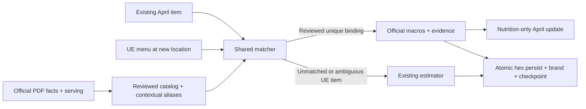

# Reviewed chains: April updates and new hexes

The same reviewed catalog matcher supplies both paths. The pilot is WaBa Grill and Yoshinoya; adding a reviewed alias enables that brand for UE-first chain enrichment. Reviewed brands deliberately drop FatSecret as a menu fallback: if UE has no menu, the location is skipped and its existing menu is untouched. Other brands retain the existing resolver order. A full enrichment rerun makes UE authoritative and removes items absent from that menu, unsetting saved links to removed items. This pilot uses the nutrition-only adapter for April; it does not run menu refresh.

- **April:** this adapter gets its production caller in the separate pilot runner. Validate the current catalog, brand and complete menu identity, then add/update the official estimate and recompute winning macros in one serializable transaction. IDs, membership, saved references, tags, prices and photos remain intact. A changed plan is rejected; re-planning a completed update is a no-op. Merchant estimates retain priority.
- **New hex:** resolve a unique verified brand, fetch its UE menu, match once against the run's catalog index, estimate only unmatched items, and persist the brand with the menu and checkpoint. The catalog never creates menu membership. Existing dietary tags survive official nutrition replacement; new official rows have no inferred dietary tags. Per-location logs count reviewed matches so alias drift is visible.
- **Unmatched items:** reviewed brands use Haiku for unreviewed UE items. FatSecret values need a separate serving match before reuse; a higher source rank does not establish the right serving. A verified chain can legitimately have zero matches in this partial pilot, so brand identity still persists and the per-location match count remains visible in logs.
- **Serving guard:** preserve exact UE calorie labels, ranges and customization flags. Ranges, malformed labels and calorie conflicts abstain. A named standard serving is not a claim about every optional customization.
- **Provenance:** official estimates store the catalog row, approval digest, PDF digest/URL, serving and menu fingerprint. Re-enriching a changed/unmatched item removes its prior reviewed-chain estimate; other legacy official sources are not deleted by that rule.
- **Integrity:** several estimates per item are valid. The hex invariant counts items with an estimate, not estimate rows. Missing estimates or a conflicting brand assignment abort the entire hex. Verified brand handoff sets the chain flag; an official estimate alone does not classify an unbound restaurant as a chain.

## Proof

`apps/api/tests/db/chainServing.db.test.ts` uses captured April identities and actual UE response excerpts for Chicken Plate and Original Gyudon Beef. It runs both real persistence paths against Postgres and checks nutrition equality, saved references, metadata preservation, no-op reruns, stale plans, ambiguous aliases, merchant precedence and transaction rollback. Parser tests preserve the captured 820/310 calorie labels and reject unsupported formats.

This is proof for reviewed configurations in the pilot, not an accuracy claim for every chain item. Refresh scheduling and additional menu sources are outside this change.
