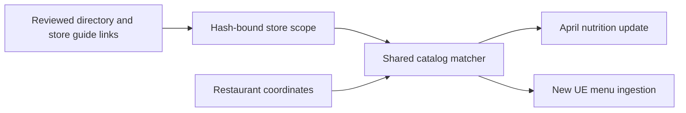

# Official-store nutrition scope

Use `storeScope` when official nutrition varies between stores inside the same state.
National facts keep their existing approval format.
A store scope can also include `usStates`; both restrictions must pass.

Each scope records the directory URL, retained content hash and locator, plus official store IDs, coordinates, distance tolerances and evidence linking each store to the fact's nutrition source.
Official store IDs are source identities, independent of Fitsy IDs and UE UUIDs.
The reviewed tolerance must be positive and at most 100 metres.
Reviewers must use the full official directory to establish that the tolerance cannot include a different same-brand outlet, including outlets without approved nutrition.
A radius is a location-identity tolerance, not a claim about an entire neighbourhood.
A directory region label alone does not establish the nutrition-guide association.

Matching requires exactly one eligible store inside its reviewed tolerance.
Missing, invalid, outside-radius and ambiguous locations remain unmatched.
The catalog rejects overlapping scopes for conflicting aliases, including overlaps with unscoped national facts.
The approval hash binds every scope field; reordering stores does not change the approval.
Changing evidence, coordinates, IDs or tolerances requires a new review.

Both April and UE writers recheck current restaurant coordinates through the shared matcher before committing official facts.
An ingestion result resolved before a location change cannot be written with stale eligibility.
No geocoder, scraping or LLM call runs during matching.
The matcher shares identical scope evaluators, prunes candidates by latitude and caches bounded per-location results.

Validation covers same-state regional exclusion through actual database persistence and served menu reads, April preservation/idempotence/rollback, stale-location rejection at both writers, catalog serialization/rollback, hash tampering and existing state/national approvals.
The database fixtures use synthetic brands and estimates; they do not prove actual Philz source coverage or a live UE import.
Philz source approval and production data changes remain separate from shipping this capability.
