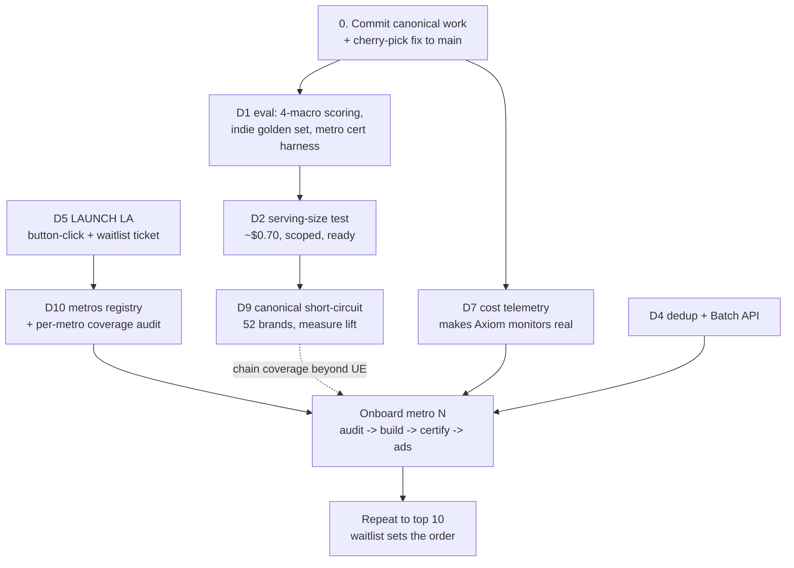

# Macro Accuracy & Model Selection - Recommendations

**Created:** 2026-08-16 (revised same day after the metro-direction decision)
**Branch:** `spike/open-model-macro-eval`
**Input docs:** `macro-accuracy-handoff-2026-08-16.md` (the nine decisions), `open-model-spike-2026-07-20.md` (evidence log)
**Status:** Recommendations, aligned with the settled direction: **launch LA now, then roll out to the top ~10 US metros** (NYC, Chicago, Houston, ...), each gated on a per-metro data check.
The original handoff had nine decisions; this doc adds a tenth (sourcing refactors) that the metro direction makes necessary.

---

## Context re-checked before recommending

These recommendations were made after re-ramping on the codebase and the current project state, not just the handoff.
Four facts materially update the handoff's framing:

1. **The canonical-chain work is not merely "on an unmerged branch" - part of it is uncommitted.**
   The `Brand`/`ChainItem` Prisma models exist only as an uncommitted working-tree diff on the main checkout (`prisma/schema.prisma`, +49 lines), and the migration (`prisma/migrations/20260614000000_add_brand_table/`) plus most `phase0-*.ts` scripts are untracked files.
   `canonical-chain-macros.md` itself is committed on `feat/subscription-gate`, but the schema and detection scripts it describes are one `git checkout .` away from being lost.
   This changes the urgency ordering: committing that work comes before any of the ten decisions.

2. **The app passed App Store review (2026-08-16) - launch is now a button-click, and Meta ads are back on the table.**
   Release is a manual click in App Store Connect, so any "before launch" work now competes directly with launching.
   `docs/gtm/strategy.md` still describes UGC creators, founder-led field work, and organic/LLM SEO with no paid channel, but Meta ads are under active consideration as a significant lever - precisely *because* Meta supports city/radius geo targeting.
   The strategy doc has no Meta section yet; writing one is a real gap (action item under Decision 5).
   There is still **no waitlist capture** on the out-of-area screen (`apps/mobile/app/welcome/results.tsx` is static copy with no email input).

3. **Direction decision (2026-08-16): serve the top ~10 metros, onboarded one at a time after the LA launch.**
   This supersedes both the handoff's open question and this doc's first-draft "LA-only, expand data-driven someday" answer.
   The decisive arguments are recorded in Decision 5; the consequences run through Decisions 1, 3, 4, 8, 9, and the new Decision 10.
   The scale planning target is now **~10 metros**, not "national ~1M restaurants" - a roughly 10x step, not a 100x step, and that distinction drives several calls below.

4. **Pricing assumptions still hold (verified 2026-08-16).**
   Haiku 4.5 is $1/$5 per MTok, the Batch API discount is a flat 50%, and no newer, cheaper Claude tier has shipped.
   The handoff's cost table stands as written.

---

## Summary of calls

| # | Decision | Recommendation |
|---|---|---|
| 0 | (Pre-decision) Branch hygiene | Commit the uncommitted canonical work today; cherry-pick the reliability fix + docs to main this week |
| 1 | Eval suite | Formalize hero-eval as the offline gate; extend scoring to all four macros; build an indie golden set; **build the per-metro certification harness** - it is now the rollout gate, not a someday tool |
| 2 | Mitigations | Serving-size test first, then description re-test; lookup coverage = D9; recalibration only if D3 reopens |
| 3 | Model | **Stay on Haiku 4.5.** Top-10 scale does not change the math enough to matter; revisit only at a true national build, after D2 mitigations + per-model calibration |
| 4 | Pipeline refactor | Order: cost telemetry → per-item dedup → canonical short-circuit (D9) → **Batch API at the first metro onboarding (now scheduled work, not deferred)** → parallel chunks only if wall-clock hurts |
| 5 | Launch & rollout | **Launch LA now.** Roll out top-10 metros one at a time, each gated on the D10 coverage audit + D1 certification; Meta geo-targeted ads per live metro; waitlist capture prioritizes the onboarding order |
| 6 | Cleanup | Yes, as a single agent-driven branch off the consolidation base, after consolidation; keep `hero-eval/` |
| 7 | Monitoring | Wire real `message.usage` cost telemetry; emit reconcile warnings as events; write `monitoring.md`; urgency rises - 10 metros multiply an unmonitored surface |
| 8 | Multi-metro performance | Partially reactivated: top-10 is ~2-3 days serial, tolerable without the dispatcher; stagger refreshes; the horizontal-hex dispatcher waits for national |
| 9 | Canonical chain macros | **Continue - now doubly central**: it is the accuracy program AND the coverage program (chains decouple from UE); scope the Nutritionix buy when metro onboarding begins, not "someday" |
| 10 | Sourcing refactors (new) | Metros registry → per-metro coverage audit vs Overture → canonical chain backfill beyond UE → multi-source matcher prerequisite → ghost-kitchen filter; **defer DoorDash/Grubhub as sources** |

---

## Decision 0 (pre-decision) - Branch topology and the production fix

**Recommendation: do handoff option 2 (doc + fix to main) now, and commit the stray canonical work first.**

Concretely, in order:

1. **On `feat/subscription-gate`: commit the uncommitted schema + migration + phase0 scripts.**
   This is not optional hygiene; it is the repo's own Session Discipline rule ("commit before you leave"), and the work at risk is the foundation of both the accuracy program and the coverage program (D9, D10).
   A `wip(canonical):` commit is fine.
2. **Cut `docs/macro-handoff` off `main` and cherry-pick:** `macroEstimationService.ts` + its tests (commit `be92d2b`), `macro-accuracy-handoff-2026-08-16.md`, `open-model-spike-2026-07-20.md`, and this doc.
   The fix stands alone (485 tests pass, no dependency on the model decision) and it closes a **live production bug**: positional macro misattribution on ~15% of Haiku batches and whole-batch loss on a stray control character, both in the nutrition Danger Zone.
   With launch a button-click away, this bug is about to corrupt data real users act on; leaving the fix on an unpushed spike branch is the single worst risk in the current topology.
3. **Push `spike/open-model-macro-eval`** as-is (it is currently not pushed anywhere - a laptop failure loses the whole spike record).
4. **Log full consolidation** (merging `feat/subscription-gate` and `feat/onboarding-macro-fixes` into main in order) as an explicit backlog ticket under D6.
   Do not attempt it as a side effect of any accuracy work.

Do **not** merge the spike branch wholesale into main; the 19k-line fixture and spike scaffolding stay on the branch as the record, per the handoff.

---

## Decision 1 - Formalize the eval suite

**Recommendation: hero-eval becomes the offline gate for model/prompt changes AND the per-metro certification instrument.
Extend metrics to all four macros, close the indie gap with a small hand-built golden set, and build the certification harness before metro #2.
Skip the scheduled-sampling eval and the pre-persist validator for now.**

Rationale:

- The harness's load-bearing property is **wrap-don't-reimplement** (it calls the real `estimateMacros`), which is why it survived four rounds of drift while eval-v1/v2 rotted.
  Formalizing means protecting that property, not adding infrastructure around it.
- **Calorie-only scoring is the most fixable credibility gap.**
  The ground truth (`ChainItem`) already stores protein/carbs/fat, and the calibration constants (`CARB_MULT`/`FAT_MULT`) act on macros, not calories - so a calorie-only metric literally cannot see whether the calibration helps or hurts.
  Score MdAPE + catastrophic rate per macro, and keep calories as the headline for comparability with rounds 1-4.
- **Indie ground truth: build a small golden set by hand rather than waiting for a data source that does not exist.**
  Pick ~50-100 indie items from the LA DB where truth is obtainable (menu-published calories, chain-adjacent indies, or hand-verified FatSecret generic matches), commit them as `ground-truth-indie.json`, and treat the set as a *sanity anchor*, not a statistical instrument.
- **The per-metro certification harness is no longer optional - it is the rollout gate.**
  Under the top-10 direction, "can we turn on city X" is a question that gets asked ~9 times, and answering it ad hoc each time guarantees it degrades into vibes.
  Define it once as a script: for a new metro, (a) run the D10 coverage audit (UE discovery vs Overture ground truth on sampled hexes), (b) spot-check N chain items against canonical/official values, (c) hand-check a small indie sample, (d) run the divergence detector, and emit a pass/fail summary.
  The never-written C7 `la-validation.ts` was this idea's ancestor; build the general version instead of the LA-specific one.
- **No CI gate.** The eval costs real dollars per run and the team is a single developer.
  The gate is procedural: any PR that touches `macroEstimationService.ts`, the prompt, or the model must include a hero-eval run in its description (paired MdAPE + catastrophic vs the committed baseline).

First action: add per-macro scoring to `run.ts`, re-run Haiku on the committed fixture for the 4-macro baseline, commit the numbers.

---

## Decision 2 - Mitigation priority and testing

**Recommendation: keep the handoff's ranking; run the serving-size test as the first paid action of the next work session.**

1. **Serving-size in the prompt - run it first.**
   ~$0.70, scoped, and it attacks the #1 failure cause (pizza/fractional at 40-54% catastrophic, size-qualified at 32-35%).
   Mechanics: extend the fixture builder to carry `ChainItem.servingSize`, add it to the payload the same way `description` is passed, and compare on the committed fixture with the paired-bootstrap protocol.
   One caveat to design around now: `servingSize` exists on chain ground truth but **production's Haiku path serves indies, which have no servingSize field**.
   So the production form of this mitigation is really a prompt-side instruction plus whatever size tokens exist in the item name/description, and the chain test is the upper bound.
   Measure both variants (explicit field vs prompt-only "state your assumed serving" instruction) while paying for one run.
2. **Lookup coverage - this is D9; see below.** Do not treat it as a separate mitigation track.
3. **Description in prompt - re-test cheaply in the same session** as serving-size.
   Eval-v2's "descriptions hurt" finding was measured on 8 indie dishes with a rotted harness; it deserves a clean re-measurement before being treated as truth.
4. **Per-model recalibration - only if D3 is reopened.** No standalone value while Haiku is the model.

Believe nothing that does not clear a paired bootstrap CI on the full fixture; round 1's subsampling projection being off by 3x is the cautionary tale.

---

## Decision 3 - Which model

**Recommendation: stay on Haiku 4.5.
The top-10 direction raises the stakes only slightly and does not change the answer; re-open the question only when a true national build is scheduled, and then with per-model calibration on the post-mitigation fixture.**

The top-10 math, explicitly, since the direction shift invites re-asking:
a top-10 footprint is very roughly 5-15x the current LA build, so a full rebuild lands around **$0.8-2.3k on Haiku (roughly half that with the Batch API)** versus ~$100-250 on Qwen.
The delta is a few hundred to ~$2k per occasional full rebuild - still founder-time noise, and the canonical layer (D9) shrinks the LLM-served volume further with every brand it captures.
This is a 10x step, not the 100x national step where the handoff's ~$18k/build figure lives.

**Why not Qwen, restated compactly (2026-08-16, on the question being re-asked):**

1. **The savings are not real yet.**
   ~$67-135 per LA build; ~$0.7-2k per top-10 rebuild; only at the ~1M-restaurant national target does the delta become a business number, and that target has no date.
2. **The accuracy gap is real, CI-confirmed, and lands on the worst metric.**
   On the only fair comparison (round 4, fixed schema, paired CI +0.9 to +4.7pp), Qwen is 2.5pp worse on median error and **3.3pp worse on catastrophic rate (30.1% vs 26.8%)**.
   That is roughly one additional item in eight of the >50%-wrong class - the class users make health decisions on - purchased to save money the project does not yet spend.
3. **Switching carries un-costed work and un-costed risk.**
   Qwen has never been measured under its own calibration (it currently runs Haiku's `CARB_MULT`/`FAT_MULT`, so its true number could be better or worse - unknown), one whole-chain unparseable response (Paris Baguette) is not root-caused, and the swap adds an OpenRouter/open-model-host dependency into the Danger Zone path (provider churn, model deprecations, variable serving quality).
4. **The decision is asymmetric and reversible in one direction only.**
   Staying on Haiku keeps the swap option open through the `providers.ts` shim at near-zero carrying cost.
   Switching and being wrong ships measurably worse health data to the first real users at launch - the impression that cannot be re-run.
5. **Nothing about fixing accuracy locks in Haiku.**
   The failure modes are shared (r = 0.43; mitigations are model-independent), so doing serving-size + canonical first loses nothing; if those close Qwen's worst buckets, the re-measurement at national scale is fairer, not staler.

Re-open trigger: a scheduled build where projected estimation spend exceeds roughly $5k (i.e., genuinely national, not top-10).
At that point run the D2-mitigated fixture with per-model calibration for both models and decide on the residual catastrophic-rate gap, not on MdAPE.

---

## Decision 4 - Pipeline refactor

**Recommendation: sequence by value-per-risk.
The metro direction promotes two items that were previously deferred: the Batch API (bulk builds are now scheduled work) and per-item dedup (10 metros of recurring refresh).**

| Order | Change | Call | Why |
|---|---|---|---|
| 1 | Ship the name-echo + control-char fix to main | **Now** (Decision 0) | Live production bug; stands alone |
| 2 | Real cost telemetry (`message.usage` → per-hex/per-run events) | **Now** | Small; makes the already-provisioned Axiom cost monitors functional (D7); also removes the vestigial `braveSearch`/`firecrawl` zero-fields |
| 3 | Per-item dedup (skip items with a fresh `MacroEstimate`; replace whole-menu `menuHash` gating) | **Before metro #2** | Refresh is about to become the pipeline's recurring workload across 10 metros; ~10x waste per refresh today; pure win; low risk |
| 4 | Canonical short-circuit ahead of FatSecret/Haiku | **With D9 Phase 3** | The structural accuracy fix AND the coverage unlock (D10); belongs in the same change as the lookup wiring |
| 5 | Batch API | **At the first metro onboarding** | Flat 50% off on builds that are now actually scheduled; the async ≤24h window is fine for metro builds (no user is waiting on a city that is not live yet) |
| 6 | Parallelize chunk calls (`Promise.all` over chunks, move the semaphore inside) | **Only if per-restaurant wall-clock becomes a bottleneck** | Second-order next to hex/metro-level scheduling (D8); adds rate-limit interaction risk |

`CHUNK_SIZE` stays at 50: the name-echo fix made count drift detectable and reconcilable, and there is no evidence smaller chunks improve accuracy.

---

## Decision 5 - Launch and metro rollout

**Recommendation: launch LA now (the button exists - press it), then roll out the top ~10 metros one at a time, each gated on the D10 coverage audit and D1 certification, with Meta geo-targeted ads following each metro as it goes live.**

*(This section was revised twice on 2026-08-16: first when App Store approval + the Meta-ads channel landed, then when the metro direction was settled.
The record of the arguments is kept below because it explains the gates.)*

### The rollout shape

1. **Launch LA immediately.** Nothing in the metro plan improves by delaying the release click.
2. **Ship the waitlist capture on the out-of-area screen** (`welcome/results.tsx` - today static copy with a dead-end CTA; add city + email posting to a tiny API route).
   Under the top-10 direction its job sharpens: it is the **ordering signal** for which metro to onboard next, and per-campaign leak measurement once Meta runs.
   The existing `preview_out_of_area` PostHog event gives the denominator.
3. **Onboard metros one at a time**, each through the same gate: D10 coverage audit → build (Batch API) → D1 certification (chain spot-check, indie sanity sample, divergence detector) → flip live → point geo-targeted ads at it.
   One at a time is deliberate: each city's audit will teach something (UE coverage ratios vary by metro - see D10), and the second city's onboarding should be cheaper than the first because the harness hardens.
4. **Prefer chain-dense metros early** (Houston/Phoenix-profile cities): the canonical head + FatSecret give their catalogs a validated accuracy floor on day one, and the national canonical head amortizes across every subsequent city.
5. **Write the missing Meta-ads GTM section** - `docs/gtm/strategy.md` has no paid channel documented.
   A good AI-drafted, founder-reviewed doc: per-metro geo-targeting setup (radius vs city, exclusions), budget ramp, CAC target vs the $4.99/$29.99 pricing, creative angles that survive Advantage+ expansion, and the waitlist as the out-of-area backstop.
   It belongs in `docs/gtm/`, not this pipeline doc; flagged here so it does not get lost.
6. **The hard rule that survives every framing: no paid spend pointed at a metro that has not passed its certification.**
   Ads into unvalidated health data buys churn and a burned first impression in a market that is more expensive to recover than to enter late.

### Why the direction shifted from "LA-only, expand someday" (the devil's-advocate record)

The first draft of this doc recommended LA-only with data-driven expansion later.
The strongest counterarguments, which drove the top-10 decision:

1. **The quality bar being applied to new cities is a bar LA does not meet either.**
   LA ships at ~27-31% catastrophic; a new city at similar-or-somewhat-worse is an incremental degradation, not a categorical one.
   Taken literally, the Danger Zone argument proves too much.
2. **The validated half of the catalog travels.**
   ~50% of items are chains, the chain path measures ~3.5% MdAPE, and chains are national - a new city's chain half inherits validated accuracy on day one, while the indie half is unvalidated *in LA too*.
3. **Virality and App Store dynamics are not geo-targetable.**
   Featuring, press, and social moments convert nothing into an empty app, and out-of-area users hitting a dead end are the classic source of permanent 1-star "doesn't work in my city" reviews; US rankings and keyword rank are national.
4. **Expansion's marginal cost is at its lifetime minimum right now.**
   ~$76/metro batched, the pipeline demonstrably works today, and the context is warm; "expand later" has a known failure mode of becoming "expand never," and the UE discovery mechanism carries time-correlated risk (schema drift, bot defenses).
5. **Real usage beats waitlist signal** for expansion decisions - thin coverage in a metro yields retention and search-depth data no email list can.

What the counterarguments do **not** overturn - and why the rollout is gated and sequential rather than thin-national-now:

- Paid users into uncertified data still buys churn (hence the certification gate before ads, argument 6 above).
- The operational instruments (D7 monitoring, D4 dedup) are not built yet; 10 metros multiply an unmonitored surface, so instruments land alongside the first onboarding, not after the tenth.
- Thin-national has a hidden wall-clock blocker (~20-56 days serial, D8) that top-10 does not; top-10 is achievable with the current serial pipeline.

D9 strengthens the whole plan: the national canonical head is ingested once and every metro inherits it, so each successive onboarding is cheaper and safer than the last.

---

## Decision 6 - Cleanup

**Recommendation: yes, exactly as inventoried, but strictly after (and on top of) the branch consolidation, as one agent-executed branch.**

- The inventory in the handoff is the spec; it is evidence-backed and already categorized (dead orchestrators, dead menu sources, dead eval harnesses v1/v2, dangling `preload.ts` references, docs to archive).
- **Sequencing is the only real decision, and the answer is: consolidation base first.**
  Deleting `uberEatsSource.ts` et al. on a branch cut from today's `main` guarantees conflicts with `feat/subscription-gate`; deleting after consolidation is mechanical.
- Traps to encode in the agent's instructions verbatim: keep `scripts/eval/hero-eval/` (directory) while deleting `scripts/eval/hero-eval.ts` (file) and the rest of `scripts/eval/*.ts`; retiring the dead sources requires also retiring `rerun.ts`, `backfill-photos.ts`, `ue-mode-smoke.ts` and their tests; run the full Pre-PR gate.
- Two doc fixes are cheap enough to do before consolidation, on the docs branch from Decision 0: mark `ue-first-pipeline.md` as "implemented, see runbook" (it still says "implementation not started"), and fix the `preload.ts` references in `status.md`.
- Also from this ramp-up: `runbook.md`/`status.md` still list C6 (E2E fault-recovery tests unverified) and C7 (`la-validation.ts` never written) as open pre-production items.
  C7's replacement is now the D1 per-metro certification harness; C6 (run the fault-recovery E2Es) should happen before the first metro build.
- `spike-logs/` (396K, regenerable): gitignore, do not commit.

---

## Decision 7 - Monitoring and observability

**Recommendation: do all three items, smallest first.
The metro direction raises the urgency: every onboarded city multiplies the unmonitored surface, so the instruments should exist before metro #2, not after metro #10.**

1. **Wire real cost telemetry** (D4 item 2).
   Read `message.usage` in the Haiku call path, accumulate per-hex and per-run, and emit it in the `cost_checkpoint`/`run` events instead of the hardcoded zeros.
   This single change makes the two already-provisioned Axiom cost monitors ("Cost overrun > $200", "Cost checkpoint spike") real instead of decorative - and metro builds are exactly where a cost overrun would first appear.
2. **Emit the new `[macroEstimation]` warnings as structured events.**
   `reconcile()` name-mismatch counts, positional-fallback-on-mismatch, and malformed-batch events should go to `fitsy-pipeline` (they are the production heartbeat of the reliability fix - a rising mismatch rate is the early signal of prompt/model drift).
   Console warnings on a CI runner are effectively write-only.
3. **Write `docs/engineering/pipeline/monitoring.md`** listing the Axiom dataset, the Slack alert channel env var, `pipeline-report.ts --latest`, and each monitor with what it means and what to do when it fires; link it from CLAUDE.md.
   Add the per-hex wall-clock anchors (452s dense / ~160s average) so metro build planning does not re-derive them.
   With refresh now on a recurring clock across metros, also make sure UE-cookie-expiry alerting is documented as the first thing to check when a refresh stalls.

Accuracy-over-time monitoring stays out of scope until after the first few metros; the offline eval + certification harness are the accuracy instruments for now.

---

## Decision 8 - Performance at metro and national scale

**Recommendation: the metro direction partially reactivates this decision, but the answer is "tolerate serial for now" - the horizontal dispatcher still waits.**

- **Top-10 is ~2-3 days of serial wall-clock** (LA is ~100 hexes in 4-5h; ten metros is very roughly 1,000-1,500 hexes), and no user is waiting on a city that is not yet live.
  Onboarding one metro at a time (D5) means each individual build is an overnight job.
  The Batch API's ≤24h async window (D4) fits the same shape.
- **Stagger refreshes** across metros (e.g., 1-2 metros per night) rather than refreshing everything at once; this bounds request volume against UE bot defenses and keeps any single failure blast-radius to one metro.
- **The horizontal hex dispatcher remains the settled design for national** (independent, checkpointed hexes sharded across workers via `PipelineCompletedHex`/`filterPendingHexes` with no change to hex logic) - documented, dormant, and cheap to add later precisely because the checkpointing already exists.
- Revisit only if metro onboarding cadence becomes gated on build time in practice, or a national build gets a date.

---

## Decision 9 - Canonical chain macros

**Recommendation: continue, and treat it as the primary program of the whole effort - the metro direction makes it doubly central, because it is now the accuracy fix AND the coverage fix.**

Why it is the priority:

- **Accuracy:** the lookup path measures ~3.5% MdAPE vs ~31% for estimation - a ~9x improvement on every item it captures, plus a cost win, plus it shrinks the D3 stakes.
- **Coverage (new weight under the metro direction):** once `Brand`/`ChainItem` are live, a chain location's menu and macros come from the canonical table, not from UE.
  Chains stop depending on UE's footprint at all, which is half the catalog made independent of the single sourcing platform (see D10).
- **Amortization:** the national canonical head is ingested once; all ten metros inherit it, and each onboarding gets cheaper and safer.

Steps, in order:

1. **Rescue the work (Decision 0, step 1).** Commit the schema, migration, and phase0 scripts.
2. **Wire the Phase-3 short-circuit for what already exists.**
   52 brands / 40,200 official items are in `ChainItem` with a measured 41% runtime match rate, and the live pipeline does not consult them.
   In `preload-ue-first.ts`: resolve `restaurant → brandId`, look items up in `ChainItem` first, fall through to FatSecret/Haiku, and Slack-alert (never silently downgrade) when a known brand matches zero items.
   Build this on the consolidation base so it lands with the schema it depends on.
3. **Measure the lift through the D1 eval before expanding coverage.**
   Score the canonically-matched items against ground truth vs the fall-through population; this turns the "official is better" assumption into a number and validates the conservative matcher.
4. **Scope the Nutritionix buy when the first metro onboarding is scheduled** (no longer "defer indefinitely").
   The 27% SPA-big-chain prize (Subway, McDonald's, Starbucks) is national and amortizes across all ten metros at once, which materially improves the buy's economics versus the LA-only world.
   It is still sequenced after steps 2-3: those brands largely resolve via FatSecret today at ~3.5% MdAPE, so the buy upgrades good data to official data, while the short-circuit upgrades catastrophic data to good data.
   Evaluate buy-vs-agent against Phase-1-agent coverage of the same brands at that point.

---

## Decision 10 (new) - Sourcing refactors: what relying on UE misses, and what to change for the metro rollout

**Recommendation: keep UE as the discovery and indie-menu backbone, but (a) measure its coverage per metro before trusting it there, (b) use the canonical layer to make chain coverage independent of UE, and (c) explicitly defer adding another delivery platform as a source.**

### What UE-only sourcing misses

- **Restaurants not on Uber Eats.** UE is ~20-25% of US delivery order share (DoorDash ~65%, Grubhub ~8%).
  Order share overstates the coverage gap - most restaurants multi-home across platforms - but real exclusives exist, and more importantly for Fitsy there are restaurants that do **no third-party delivery at all**: sit-down places, cash-only indies, chains with first-party-only delivery in some markets.
  Fitsy's core use case is on-the-go, GPS-based discovery, which includes places users walk into - a set UE structurally undercounts.
- **The gap varies by metro.** Grubhub is historically strong in NYC and Chicago; Texas metros skew DoorDash.
  A coverage ratio measured in LA does not transfer; each of the nine new metros has its own unknown ratio.
- **The inverse problem: ghost kitchens.** UE *over*-covers virtual brands with no walk-in storefront - noise for an on-the-go app, and it compounds across dense metros.
  The untracked `ghost-coords.ts`/`ghost-sample.ts` scripts show this is already a known irritation.
- **Menu shape.** UE menus are delivery menus: combinatorial modifier supersets, delivery-inflated prices, sometimes a subset of the dine-in menu.
  Tolerable, but UE is a proxy for the real menu, not the real menu.

### The refactors, ranked

1. **Metros registry (trivial but load-bearing; do before metro #2).**
   `CONFIG.bbox` is one hardcoded LA box.
   Add a `metros` config (name, bbox, hex set, status: building/live/paused) and per-metro run identity; every other rollout mechanism keys off it.
2. **Per-metro coverage audit - measure, don't assume.**
   For sampled hexes in each target metro, compare UE discovery counts against a free places ground truth (**Overture Maps** - the pre-UE pipeline already used Overture, so there is prior art in-repo).
   Output: a UE-coverage ratio per metro, feeding the D1 certification gate.
   A metro at ~85%+ of Overture's restaurant set is fine on UE alone; a metro that comes back at 60% tells you before users do.
3. **Canonical chain backfill - the biggest coverage refactor, and it is already in flight (D9).**
   Once canonical is live, chain locations can be discovered from *any* places source (Overture/Google Places), name-matched to a `Brand`, and served with the canonical menu - no menu scraping, no UE dependency.
   This makes ~half the catalog independent of UE's footprint and is the primary answer to any metro whose audit shows weak UE coverage.
4. **Multi-source identity prerequisite: phone column + `matchRestaurant()` dedupe.**
   The moment any second source writes restaurant rows (the Overture chain backfill above, or anything else), cross-source identity is required or duplicates follow.
   Already scoped in the backlog's memory; it moves from "someday" to "before refactor #3's backfill runs."
5. **Ghost-kitchen filter/label.**
   Promote the ghost-coords experiments into a real signal (virtual brands sharing coordinates with a host kitchen are detectable) that consumer search can exclude or demote.
   Cheap, and it protects the on-the-go value prop precisely where the metro rollout goes next (dense urban cores).
6. **Explicitly deferred: DoorDash/Grubhub as sources.**
   The intuitive answer to "UE misses things," and the wrong next move: both are more scraping-hostile than UE, each adds a fragile-cookie surface right as refresh volume grows ~10x, and refactors #2+#3 likely close most of the gap that matters.
   Revisit only if a specific metro's audit shows a large *indie* gap that canonical cannot touch.

### What is not a problem

The UE cookie is not a metro blocker: the spike confirmed the unauth cookie works US-wide, so onboarding NYC/Chicago/Houston needs no new auth work.
The real UE fragility is schema drift and bot defenses, which the existing circuit breaker + strict-hex-abort + staggered refreshes (D8) handle reasonably.

---

## How the metro direction reshuffles pipeline priorities

The direction collapses the "national scale" axis and rotates the pipeline's job from *build capacity* toward *operate a growing set of metros credibly*:

**Deflates to dormant:**

- D3 model choice (no cost pressure at top-10 scale; Qwen work moot until national).
- The national horizontal dispatcher (D8) - design settled, no code.
- Full-national anything: the planning unit is now "one metro at a time."

**Rises:**

1. **Reliability fix to main** - more urgent, not less: real users arrive in days and the bug corrupts data they act on.
2. **Refresh economics** - per-item dedup and staggered refresh become the recurring workload's main levers (D4, D8).
3. **Monitoring as trust instrumentation** - reconcile-warning events, cost telemetry, cookie-expiry alerting, all before metro #2 (D7).
4. **Served-path accuracy** - canonical short-circuit + serving-size test + the divergence detector as a standing check (D9, D2).
5. **The certification harness** - the repeatable per-metro gate, built once, used ~9 times (D1, D10).
6. **Honest display** - with real users, the second mitigation for a ~27% catastrophic rate is not only better estimates; it is the backlog's "AI macro source disclosure" work (source badges, confidence ranges, no false precision), which is the Danger Zone stated as UI.

---

## Suggested execution order

**Session A - protect and land (no new analysis):**
commit canonical work on `feat/subscription-gate`; push the spike branch; cut `docs/macro-handoff` off main with the fix + tests + three docs; open the PR; fix the two stale doc references; gitignore `spike-logs/`; file the consolidation ticket.
In parallel (launch-side, independent of the pipeline): **press the release button**, ship the waitlist-capture ticket, draft the Meta-ads GTM doc.

**Session B - measure (first paid work):**
add 4-macro scoring to hero-eval; establish the new Haiku baseline; run the serving-size A/B (both variants) and the description re-test; write results into the spike doc as round 5.

**Session C - metro machinery (on the consolidation base):**
metros registry; cost telemetry + reconcile events; per-item dedup; canonical Phase-3 short-circuit + measured lift; coverage-audit script against Overture; assemble the certification harness from those parts.

**Session D - first onboarding:**
pick metro #2 (waitlist + chain-density informed), run audit → Batch-API build → certify → flip live → point ads at it; write down what the harness missed and harden it for metro #3.
