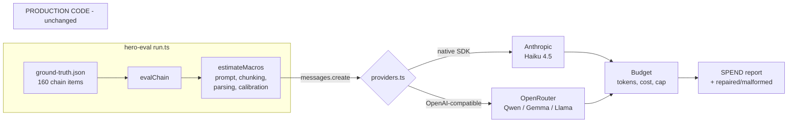

# Open-Model Macro Estimation Spike

**Date:** 2026-07-20
**Branch:** `spike/open-model-macro-eval`
**Status:** Round 1 complete. Blocking follow-up identified (recalibration) before any swap decision.
**Spend:** $0.0625 of a $10 cap.

---

## Question

Can an open-weight model replace Claude Haiku 4.5 for menu-item macro estimation, and what does it cost in accuracy?

## Answer (provisional)

Haiku is the most accurate model tested, but its margin over the best open model is **2.3 percentage points of MdAPE** while costing **10x more**.
That margin is not yet trustworthy, because the challengers ran under Haiku's calibration handicap (see Threat to validity).
Do not act on this round alone.

---

## Method

The load-bearing design decision: **swap the transport, not the prompt.**

`estimateMacros` only ever touches `anthropic.messages.create({model, max_tokens, system, messages})` and reads `response.content[0].text`.
That surface is small enough to fake, so open models run through the real production path (production system prompt, 50-item batching, positional padding, calibration) with zero production files changed.



This is deliberate. `scripts/eval/` (v1) reimplemented the prompt and has been frozen since its 2026-04-05 commit while production moved on; it now measures a prompt shape that no longer exists. Wrapping beats reimplementing.

**Fixture:** `scripts/eval/hero-eval/ground-truth.json`, 160 chain items vs FFN published values.
**Config:** `name-only-default` for every model (one variable changed at a time).
**Metric:** MdAPE on calories. Red flag = >15% error, catastrophic = >50%.

---

## Results

| Model | MdAPE | Red flags | Catastrophic | Matched | Cost | vs Haiku |
|---|---|---|---|---|---|---|
| **Haiku 4.5** (production) | **18.93%** | 99 | 18 | 160/160 | $0.0463 | — |
| Qwen3 235B A22B | 21.26% | 102 | 18 | 160/160 | $0.0045 | 10.3x cheaper, +2.3pp |
| Gemma 3 27B | 21.45% | 108 | 25 | 160/160 | $0.0041 | 11.3x cheaper, +2.5pp |
| Qwen3 32B | 25.30% | 111 | 29 | 160/160 | $0.0067 | 6.9x cheaper, +6.4pp |
| Llama 3.1 8B | 29.70% | 115 | 46 | 160/160 | $0.0009 | 51x cheaper, +10.8pp |

### Findings

**1. Output compliance was a non-issue.** Zero repaired and zero malformed responses across all five models, and 160/160 items matched everywhere. No model was flattered by having its hard rows silently dropped, so the accuracy comparison is clean. The JSON-shape risk that motivated the repair layer did not materialise.

**2. Size matters here, but not smoothly.** 8B is clearly unusable (29.70%, 46 catastrophic). Above ~27B the curve flattens hard: Gemma 3 27B (21.45%) essentially ties Qwen3 235B (21.26%) despite being an order of magnitude smaller, and both beat Qwen3 32B. Parameter count is a weak predictor in this band, which is consistent with the earlier eval-v2 finding that Sonnet scored worse than tuned Haiku.

**3. Catastrophic errors are the binding constraint, not MdAPE.** These are >50% wrong on a number users make health decisions on (CLAUDE.md Danger Zone: data integrity). Haiku and Qwen3 235B tie at 18/160. Llama 3.1 8B posts 46/160, a 2.5x worse tail. Cheapness does not survive contact with this metric.

**4. Nothing passes the harness's own bar.** `run.ts` encodes MdAPE ≤8%, red flags ≤30, catastrophic ≤7. Production Haiku posts 18.93% / 99 / 18 and fails all three. The exit criteria are aspirational, not a description of shipped quality.

**5. Haiku's 18.93% here does not contradict the documented 13.5%.** Different fixture and metric: 13.5% came from eval-v2's 8 indie dishes as *average* error; this is 160 chain items as *median* absolute percentage error. They are not comparable. The gap does raise a question about whether the calibration constants generalise beyond the 8 dishes they were fitted on.

---

## Threat to validity — read before quoting these numbers

**Every challenger ran under Haiku's calibration.** `macroEstimationService.ts:186-195` applies:

```ts
const CARB_MULT = 1.08;
const FAT_MULT  = 1.3;
const adjCal = est.p * 4 + adjCarbs * 4 + adjFat * 9;
```

Calories are *recomputed* from adjusted macros, so this is not a cosmetic post-step. Those constants were derived from Haiku's measured bias (underestimates fat 23%, carbs 7%). They are a fingerprint of one model, not a general correction.

Applying them to Qwen or Gemma corrects a bias those models may not have, and may introduce one they didn't. **The open-model numbers above are therefore a lower bound.** Calibration was worth roughly 5 points to Haiku (18.3% to 13.5% in eval-v2), which is larger than the entire 2.3-point gap this round measured.

Second caveat: the fixture is all chain items, while the Haiku path in production serves only indie restaurants (chains short-circuit to FatSecret/official at `preload-ue-first.ts:833-836`). Chains are the easier, better-documented distribution.

---

## Recommendation

**Do not swap models on this evidence.** At LA scale the delta is ~$135 per full build, which does not justify any accuracy risk on a health-relevant number. The economics only change at the 1M-restaurant target, where the same 10x ratio is worth roughly $14,400 per build.

Ranked next steps:

1. **Recalibrate per model, then re-run.** Derive fresh multipliers for Qwen3 235B and Gemma 3 27B on a held-out split and compare calibrated-to-calibrated. This is the only way to know whether the 2.3-point gap is real or an artifact. Cost: pennies.
2. **Rebuild the fixture to match production.** Indie-weighted, not chain-only. Chain items are already solved by the FatSecret/official path and are not what Haiku actually estimates.
3. **Take the free wins regardless of model choice.** The Batch API is a flat 50% discount and is unused; per-item dedup addresses `menuHash` re-paying for a whole menu when one item changes. Neither carries accuracy risk.
4. **Investigate the catastrophic tail.** 18/160 (11%) catastrophic on production Haiku is a data-integrity concern independent of which model runs. That is the number worth attacking, and no model swap fixes it.

---

## Round 2 — expanded fixture (2,708 LA-regional chain items)

Run interrupted partway through Qwen3 235B, so the model comparison below uses
the 1,335-item overlap where both models scored the same items. Haiku's own
numbers are the full fixture.

| | Curated fixture (160 national) | ChainItem fixture (2,708 LA regional) |
|---|---|---|
| Haiku 4.5 MdAPE | 18.95% | **31.60%** |
| Catastrophic (>50% off) | 18/160 (11.3%) | **717/2,556 (28.1%)** |

### Finding 1 — the curated fixture overstates production accuracy by ~13pp

This is the headline, and it is not a model-selection result.

National-chain items (Big Mac, Whopper) are heavily represented in any model's
training data. LA regional items (Boba Time, Gyu-Kaku, JINYA Ramen Bar, Man vs
Fries) are not. Production serves the latter, so **31.6% is the number that
describes shipped behaviour**, and 18.95% — and the 13.5% in data-pipeline-v3 —
describe an easier distribution than the pipeline actually faces.

**More than 1 in 4 items is >50% wrong on production-like data.** CLAUDE.md
lists nutrition estimates as a Danger Zone; this quantifies it.

### Finding 2 — name de-slugification is NOT the cause

The obvious objection is that de-slugified names ("Gyu Kaku s Mores") handicap
the model. Tested two ways; both clear it:

*Chains present in both fixtures* — same brand, clean names vs de-slugified:

| Chain | Curated (clean names) | ChainItem (de-slugified) |
|---|---|---|
| Domino's | 62.3% (n=8) | 62.8% (n=38) |
| Shake Shack | 17.5% (n=8) | 15.2% (n=98) |

Identical for Domino's, slightly *better* for Shake Shack.

*Within the ChainItem fixture*, split by a name-mangling proxy: likely-mangled
36.3% (n=477) vs clean-looking 30.7% (n=2,230). Mangling costs ~5.6pp on the
17.6% of items it touches — real but minor, and clean-name items still score
30.7%, far above the curated fixture's 18.95%.

The degradation is about **which restaurants**, not **how names are written**.

### Finding 3 — the model comparison is still unresolved, and may be unresolvable

On the 1,335-item overlap:

| | MdAPE |
|---|---|
| Haiku 4.5 | 29.90% |
| Qwen3 235B | 32.40% |
| paired difference | **+2.50pp, 95% CI −0.20 to +4.10** |

Still straddles zero, though only barely at the lower bound.

**CI width at n=1,335 is 4.0pp** — far wider than the ~1.3pp projected from
round-1 subsampling. The projection was wrong because LA-regional items have
much higher error variance than national-chain items; the same n buys less
precision on a harder distribution. Halving the width needs 4x the items
(~5,300) and ChainItem only holds 4,667 total. **Resolving a 2.5pp gap may not
be possible with the ground truth that exists.**

### What round 2 changes

Model selection is now the *less* important question. A 2.5pp difference between
Haiku and Qwen3 235B is not worth resolving while 28% of production-like
estimates are catastrophically wrong under either model. Priority order inverts:
fix the accuracy floor first, revisit the model afterwards.

Per-chain results also show the error is highly concentrated — Domino's sits at
~62% in both fixtures (pizza serving-size ambiguity: slice vs whole pie) while
Shake Shack sits at ~15%. Category-specific failure modes look more tractable
than a model swap.

---

## Round 3 — batch count mismatches (affects production today)

Not a model-comparison finding. This one is about Haiku, in production, now.

`estimateMacros` requests 50 items per call and gets the wrong number back on
15% of batches (Haiku) — measured across the 2,708-item run. Qwen3 235B is far
worse at 78%. Round 1 could not have caught this: its chains were 8-12 items,
all under `CHUNK_SIZE = 50`, so the batching path was never exercised.

### Root cause: the output carries no identifier

Production requests `{cal, p, c, f, conf, tags}` per item. Nothing ties output
entry #37 to input #37 except array position. The model must keep an exact
running count across ~2,900 tokens with no anchor to re-sync against.

Menus are adversarial for this — long runs of near-identical strings
("Hot Coffee With Cream" / "…With Cream And Sugar" / "…With Cream And Sugar
Extra"). The model loses its place in the repetition.

**It is not `max_tokens` truncation.** Every probe returned
`stop_reason=end_turn` with output well under the 8,192 cap, and valid complete
JSON — just with the wrong number of elements.

### A/B: adding a `name` echo fixes it

Identical 50 items per chain, identical model, one prompt change (add
`name: copied EXACTLY from the input` to the requested output schema):

| Chain | Production prompt | With `name` echoed |
|---|---|---|
| Chuck E. Cheese | 51 (+1) | 50 ✓ |
| Randy's Donuts | 52 (+2) | 50 ✓ |
| Boba Time | 49 (−1) | 50 ✓ |
| Dunkin' | 53 (+3) | 50 ✓ |
| Sbarro | 50 ✓ | 50 ✓ |

4/5 wrong → 0/5. Copying the name forces the model to re-read input #37 to
produce output #37, so drift cannot accumulate.

Cost: output tokens rise ~2,900 → ~3,780 per 50 items (+30% on the output line,
roughly +$50 per full LA build). The unused Batch API discount (flat 50%) more
than absorbs it.

### Why it matters

`macroEstimationService.ts:153` reconciles any mismatch positionally:

```ts
const paddedParsed = Array.from({ length: items.length }, (_, i) => parsed[i] ?? null);
```

A drift at position 10 shifts every later item's macros by one, and with no
name in the output nothing can detect it. Tested whether this is actively
corrupting stored data — catastrophic items match a neighbour's ground truth
30.6% of the time vs 56.4% for accurate items, so the evidence does **not**
support active corruption (the test is imperfect; menus repeat similar items,
inflating the baseline). Treat it as unguarded fragility, not an active fire.

### The same fix repairs Qwen — which removes the open-model blocker

Ran the identical A/B against `qwen/qwen3-235b-a22b-2507`:

| Chain | Production prompt | With `name` echoed |
|---|---|---|
| Chuck E. Cheese | 46 (−4) | 50 ✓ |
| Randy's Donuts | 46 (−4) | 50 ✓ |
| Boba Time | 48 (−2) | 50 ✓ |
| Dunkin' | 45 (−5) | 50 ✓ |
| Sbarro | 47 (−3) | 50 ✓ |

**5/5 wrong → 0/5.** All `finish=stop`, so again not truncation.

This **corrects the round-2 conclusion**. Qwen's 78% batch-miscount rate was
described there as a capability limit that disqualified it regardless of price.
It is not — it is a prompt-design problem, and it disappears entirely once the
output carries an identifier. Haiku's advantage on batch reliability was an
artifact of a schema that happened to suit it better, not a real capability gap.

Consequences for the model decision:

- The only hard blocker against Qwen3 235B is removed. It remains
  ~10x cheaper and statistically indistinguishable on accuracy
  (+2.50pp, 95% CI −0.20 to +4.10).
- Any future model comparison **must** use the name-echoed schema. Comparing
  models on the current positional schema measures how well each tolerates a
  bad contract, not how well it estimates nutrition.
- One Qwen failure mode is still unexplained: a whole-chain unparseable
  response (Paris Baguette). That is separate from count drift and was not
  retested here.

Before acting on this, re-run the full fixture for both models under the fixed
schema. The +2.50pp figure came from a partial run (1,335 items) under Haiku's
calibration constants and on the broken schema — all three need to change.

### Proposed fix (not implemented)

Add `name` to the output schema and match by name instead of position. Converts
a silent undetectable failure into a detectable, repairable one. This is
production code in the nutrition Danger Zone, so it needs a test that feeds a
deliberately mismatched response and asserts items still land on the right
dishes.

---

## Round 4 — fixes applied, first trustworthy comparison

Both fixes landed in `macroEstimationService.ts` (name echo + name-based
reconciliation, control-char stripping). Re-ran the 2,708-item fixture.
Qwen was interrupted again at 39/49 chains, so the comparison uses the
2,319-item paired overlap.

### The fix works as designed

| | Before (positional) | After (name-match) |
|---|---|---|
| Items matched | 2,707 / 2,708 | **2,708 / 2,708** |
| Name-mismatch warnings | n/a | **0** |

Every item aligned by name, no fallbacks, no unmatched entries.

### It is a reliability fix, not an accuracy fix

| | MdAPE |
|---|---|
| Haiku, broken schema | 31.60% |
| Haiku, fixed schema | 30.50% |
| paired change (n=2,707) | −1.10pp, **95% CI −2.40 to +0.20** |

The CI straddles zero: the accuracy gain is not statistically significant.

This is worth stating plainly because it **independently confirms the round-3
negative result**. If positional misattribution had been corrupting stored
macros, removing it would have moved accuracy sharply. It didn't. The 27%
catastrophic rate is caused by genuine estimation error — serving-size
ambiguity and brand obscurity — not by misalignment. Two different tests now
agree on that.

The fix's value is that a whole class of silent data corruption is no longer
possible, and that count drift is now detectable rather than invisible.

### First statistically real model difference

On the fixed schema, with both models on an identical fair contract:

| | MdAPE | Catastrophic |
|---|---|---|
| Haiku 4.5 | **31.00%** | 26.8% |
| Qwen3 235B | 33.50% | 30.1% |
| difference | **+2.50pp** | +3.3pp |

**Paired 95% CI: +0.90 to +4.70pp — excludes zero.**

This is the first result in the spike that survives its own error bars. Every
earlier comparison either straddled zero or was measured on a broken contract.
Haiku is genuinely more accurate than Qwen3 235B on this task, by roughly 2.5
points of median error and 3.3 points of catastrophic rate.

### What that means for the original question

Haiku is measurably better and ~10x more expensive. The tradeoff is now
quantified rather than guessed:

- **At LA scale** the model delta is ~$135 per full build. Paying it for 2.5pp
  and a lower catastrophic tail is clearly correct on a health-relevant number.
- **At the 1M-restaurant target** it is ~$14,400 per build, and the same 2.5pp
  becomes a real business decision rather than an obvious one.

Neither model is close to the harness's 8% MdAPE bar. The gap between them
(2.5pp) is small next to the gap between either model and acceptable (~22pp),
which is the argument for spending effort on serving-size and lookup coverage
rather than on model selection.

---

## Reproducing

```bash
npx tsx scripts/eval/hero-eval/run.ts --list-models
npx tsx scripts/eval/hero-eval/run.ts \
  --config name-only-default --model or:qwen3-235b --max-spend 3
```

Requires `OPENROUTER_API_KEY` in `.env.local` for any `--model or:*`, and `ANTHROPIC_API_KEY` for `haiku-4-5`.
Model IDs and prices in `providers.ts` were verified against OpenRouter `GET /api/v1/models` on 2026-07-20 and should be re-checked before being cited as costs.
