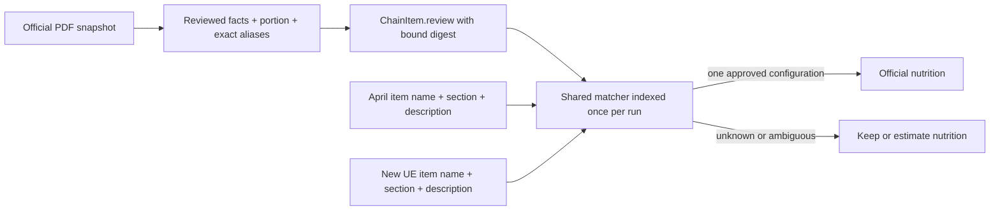

# Reviewed chain matching

> **Status:** Foundation; adapters and data approval ship separately · **Last verified:** 2026-09-09

A legacy `official/HIGH` row is not sufficient evidence for a serving override. WaBa's
old `chicken` row contained a family portion while its alias named a single plate.

`ChainItem.review` is optional JSON so the migration leaves every existing row
unreviewed. Its typed payload records the source SHA-256, table locator, reviewer,
and exact menu aliases. A second digest binds those fields to the brand, canonical
key, serving, all four macros, source URL, and confidence. Editing any of those
requires a new review. Locator/reviewer edge whitespace is cosmetic and normalized
before hashing. This is an integrity check, not a cryptographic signature.

Matching preserves parenthetical sizes and the complete section/description.
Only case and whitespace are normalized. A name without its reviewed context does
not inherit nutrition. Duplicate candidate configurations abstain. Missing, negative,
non-finite, or grossly inconsistent nutrition cannot become an approved match.
The energy check allows the larger of 60 calories or 20% for label rounding; it
is a sanity check and does not replace source review.
An explicit UE calorie range or a source calorie disagreement above the larger of
30 calories or 5% prevents an override. These are source labels, not the existing
estimated MenuItem columns. The markdown parser preserves ranges. The direct UE JSON parser and customization
metadata are integrated in the follow-on adapter release; this foundation does not
yet activate either ingestion path. `hasCustomizations` is declared now and unused
until that adapter; it does not select a meal configuration.

An approval with no aliases indexes no items; source facts can be reviewed before
menu bindings. Aliases are reusable across locations with the same configuration. They are
indexed once per run; an item match makes no database, network, or LLM call. The
caller must supply a verified brand ID. The API serving path does not run this matcher.

The shared source priority becomes merchant > reviewed official > FatSecret > FFN > Haiku,
in both SQL and TypeScript. Existing serving data has no official estimates.

This foundation does not change serving data. Pipeline and April update adapters
must both call this module; the April adapter must preserve Fitsy IDs and metadata.
Source tables, unknown customizations, and disputed facts remain subject to review.

Validation: run `npm test -w apps/api -- --runInBand chainCatalog chainPriority uberEatsSource`
with the isolated local Postgres URLs set to include JSONB and SQL/TypeScript parity.
Rollback: revert the code; leave the unused additive JSON column in place.
