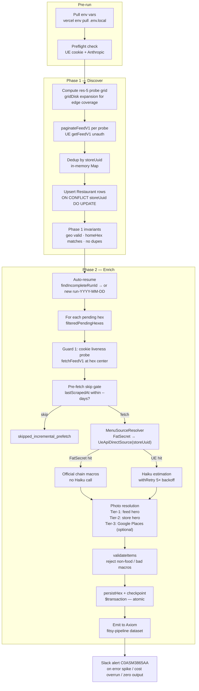

# UE-First Pipeline — Operational Runbook

> **Status:** living · **Last verified:** 2026-06-12

**Supersedes:** `docs/engineering/archive/preload-runbook.md` (described the retired Google Places + Firecrawl flow; archived).

**Primary script:** `scripts/preload-ue-first.ts`

---

## Phase flow



---

## Environment variables

Pull from Vercel before running:

```bash
vercel env pull .env.local
export $(grep -v '^#' .env.local | xargs)
```

### Required

| Variable | Purpose |
|---|---|
| `POSTGRES_PRISMA_URL` | Prisma pooled connection (runtime queries) |
| `POSTGRES_URL_NON_POOLING` | Prisma direct connection (used by preload script) |
| `ANTHROPIC_API_KEY` | Claude Haiku for macro estimation |
| `UE_LOC_COOKIE` | URL-encoded `uev2.loc` cookie — authoritative lat/lng for UE feed probes |

### Optional

| Variable | Default | Purpose |
|---|---|---|
| `GOOGLE_PLACES_API_KEY` | — | Tier-3 photo fallback only. If absent, restaurants without a UE feed hero or store hero image get `photoUrl=null`. No other pipeline function requires it. |
| `AXIOM_TOKEN` | — | Pipeline telemetry. If absent, no events are emitted (pipeline still runs). |
| `FATSECRET_KEY` / `FATSECRET_SECRET` | — | FatSecret chain macro lookups. If absent, FatSecret source is skipped; every restaurant falls to UE + Haiku. |

### UE_LOC_COOKIE mechanics

The `uev2.loc` cookie is set client-side by UberEats's web JS after an address pick. There is no RPC to refresh it programmatically. To rotate:

1. Open any browser (incognito is fine), go to `ubereats.com`
2. Pick any delivery address (logged-out session is sufficient)
3. DevTools → Application → Cookies → `uev2.loc` → copy the raw (URL-encoded) value
4. Update the secret: `vercel env add UE_LOC_COOKIE production`
5. Pull locally: `vercel env pull .env.local`

The cookie's `latitude`/`longitude` fields are overwritten per-probe by the script — the captured value only needs to be structurally valid, not geographically relevant. One captured cookie works for the entire US probe grid.

**Cookie expiry:** unknown; monitor via preflight. The script decodes + validates the cookie on startup and fails fast (`exit 1`) with rotation instructions if the feed probe returns empty.

---

## Invoking the script

```bash
npx tsx scripts/preload-ue-first.ts [flags]
```

### Flags

| Flag | Values / default | Description |
|---|---|---|
| `--phase` | `discover` \| `enrich` \| `both` (default: `both`) | Run only Phase 1, only Phase 2, or both |
| `--hex-id HEX` | res-7 hex cell ID | Phase 2 only: process exactly this one hex |
| `--max-hexes N` | integer | Limit Phase 2 to N pending hexes (representative sample) |
| `--dry-run` | flag | Skip all DB writes in Phase 2; print plans. Phase 1 still runs preflight but skips upserts. |
| `--force` | flag | Skip the pre-fetch and post-fetch menuHash skip gates; re-scrape all restaurants |
| `--days N` | integer (default: 7) | Skip restaurants scraped within N days (pre-fetch gate) |
| `--run-id ID` | string | Use this explicit run ID; otherwise auto-resumes or generates `run-ue-first-YYYY-MM-DD` |
| `--skip-preflight` | flag | Skip UE + Anthropic preflight (useful for offline/unit testing) |

---

## Common operations

### Full LA run (both phases)

```bash
vercel env pull .env.local
export $(grep -v '^#' .env.local | xargs)
npx tsx scripts/preload-ue-first.ts --phase=both
```

Expected: ~40 res-5 probes, ~94+ restaurants per hex, ~100 hexes total, 4–5 hours, ~$125–179 first run.

### Discover-only (populate Restaurant rows, no menu enrichment)

```bash
npx tsx scripts/preload-ue-first.ts --phase=discover
```

Use when: you want to audit what UE returns for the region before committing to a full enrich run, or when running Phase 1 and Phase 2 on separate schedules.

### Enrich-only (assumes Phase 1 already ran)

```bash
npx tsx scripts/preload-ue-first.ts --phase=enrich
```

Use when: Restaurant rows already exist from a prior Phase 1 run and you only need to fill menus/macros.

### Re-scrape a specific hex

```bash
npx tsx scripts/preload-ue-first.ts --phase=enrich --hex-id 872a1072fffffff --force
```

`--force` bypasses both skip gates so every restaurant in the hex is re-fetched even if recently scraped. Omit `--force` to only re-scrape stale or changed restaurants.

To find the hex ID for a lat/lng:

```bash
node -e "const {latLngToCell} = require('h3-js'); console.log(latLngToCell(34.05, -118.25, 7))"
```

### Dry run (verify coverage without writing)

```bash
npx tsx scripts/preload-ue-first.ts --phase=both --dry-run
```

Runs preflight + Phase 1 discovery (prints plan without upserts) + Phase 2 planning (prints item counts per hex without persisting).

### Incremental refresh (re-scrape restaurants older than 3 days)

```bash
npx tsx scripts/preload-ue-first.ts --phase=enrich --days=3
```

Lowers the skip threshold; restaurants scraped within 3 days are skipped, older ones are re-fetched.

---

## Resume behavior

The pipeline is midnight-safe and crash-safe.

On startup (Phase 2, no `--run-id` flag):

1. `findIncompleteRunId(totalHexCount, prisma)` queries `PipelineCompletedHex` for the most recent `runId` with fewer checkpoints than total hexes.
2. If found → resume that run (logs `Resuming incomplete run: <id>`).
3. If not found → generate `run-ue-first-YYYY-MM-DD` (logs `Starting fresh run: <id>`).

**Crash at 11:59 PM + rerun at 12:04 AM** resumes the same run because the date-based ID was already written to `PipelineCompletedHex`. The query uses max-checkpoint count, not date, as the discriminator.

**Hex-level atomicity:** each hex's Restaurant rows, MenuItem rows, MacroEstimate rows, and `PipelineCompletedHex` checkpoint are written in a single `$transaction`. On crash mid-hex, the DB has no partial data for that hex. On resume, `filterPendingHexes` returns the hex again and it is reprocessed from scratch.

To force a completely fresh run (ignores all checkpoints):

```bash
npx tsx scripts/preload-ue-first.ts --phase=enrich --run-id run-fresh-$(date +%s)
```

---

## Telemetry

All events are emitted to **Axiom dataset `fitsy-pipeline`** via `PipelineEmitter` (`scripts/pipeline-events.ts`). Events require `AXIOM_TOKEN` to be set; if absent the pipeline logs to stdout only.

| Event type | When emitted | Volume (full LA run) |
|---|---|---|
| `restaurant` | Per restaurant, batched per hex | ~6,000–10,000 |
| `error` | Immediately on failure | Varies — typically 50–500 |
| `cost_checkpoint` | After each hex completes | ~100 |
| `run` | Once, after run completes | 1 |

Events are distinguishable by `phase: 'ue-first'` field for Axiom dashboard filtering.

### Live reporting during a run

```bash
# Generate report for a specific run (queries Axiom)
npx tsx scripts/pipeline-report.ts --run-id "run-ue-first-2026-06-12"

# Latest run
npx tsx scripts/pipeline-report.ts --latest
```

### Axiom monitors (pre-configured)

| Monitor | Fires when |
|---|---|
| Error spike | > 50 errors in 5-minute window |
| Run failed | `restaurantsFailed > restaurantsPersisted` on run event |
| Cost overrun | `cumulativeCost > 200` mid-run |
| Zero output | `restaurantsPersisted == 0` on run event |

---

## Slack alerts

Alerts go to channel **C0ASM3865AA** via `SLACK_BOT_TOKEN`. The `notifySlack()` function in `preload-ue-first.ts` delegates to `packages/shared/src/utils/notifySlack.ts` with `source: "ue-first"`.

Alert scenarios:
- **UE cookie expired** — detected by per-hex cookie liveness probe (Guard 1); exits with rotation instructions
- **Hex aborted (strict)** — Guard 2 (systemic UE fetch failure or Haiku exhaustion after 5 retries) aborts the hex; pipeline exits for resume
- **Fatal unhandled exception** — caught in main() catch block

---

## Cost model

### Phase 1 (discover) — near zero

| Item | Cost |
|---|---|
| UE `getFeedV1` calls | $0 (no API key; raw HTTP) |
| ~40 res-5 probes for LA | $0 |

### Phase 2 (enrich) — first run

| Step | Volume | Cost |
|---|---|---|
| UE `getStoreV1` menu fetch | ~6,000–10,000 fetches | $0 (raw HTTP) |
| FatSecret chain lookups | ~500–1,000 chains | $0 (free API) |
| Brave Search (indie URL fallback) | Not used in UE-first | $0 |
| Haiku estimation | ~5,000–8,000 calls | $42–84 |
| Google Places photos (tier-3) | Only restaurants with no UE hero | $0–15 |
| **Total first run (LA)** | | **~$42–100** |

### Subsequent runs (incremental, URL/menu hash skip)

| Step | Cost |
|---|---|
| UE fetches for changed restaurants (~10%) | $0 |
| Haiku for changed restaurants | $4–8 |
| **Total incremental** | **$4–10** |

Cost levers:
- `--days N` — increase to skip more restaurants (reduce Haiku calls)
- `GOOGLE_PLACES_API_KEY` absent — eliminates tier-3 photo cost entirely
- `--max-hexes N` — cap cost for test/validation runs

---

## Verifying the data

```bash
# Open Prisma Studio (visual DB browser)
npx prisma studio

# Or direct SQL via psql
psql $POSTGRES_URL_NON_POOLING -c "SELECT COUNT(*) FROM \"Restaurant\";"
psql $POSTGRES_URL_NON_POOLING -c "SELECT COUNT(*) FROM \"MenuItem\";"
psql $POSTGRES_URL_NON_POOLING -c "SELECT COUNT(*) FROM \"MacroEstimate\";"

# Spot-check: restaurants with item counts
psql $POSTGRES_URL_NON_POOLING -c "
  SELECT r.name, COUNT(mi.id) as items
  FROM \"Restaurant\" r
  LEFT JOIN \"MenuItem\" mi ON mi.\"restaurantId\" = r.id
  GROUP BY r.name
  ORDER BY items DESC
  LIMIT 20;
"
```

**Expected post-run numbers (single LA hex, v6 baseline):** 94 restaurants, 6,791 items, 0 Google Places calls. See `docs/engineering/pipeline/baseline-v6.md` for the full reference.

---

## Rollback

```sql
-- Wipe all restaurant-scoped data (FK cascades handle MenuItem/MacroEstimate/SavedItem)
TRUNCATE "Restaurant" CASCADE;
TRUNCATE "PipelineCompletedHex";
```

Then re-run Phase 1 to repopulate. Supabase daily backups make a full restore one-command if needed.

---

## Known issues

| Issue | Workaround |
|---|---|
| `UE_LOC_COOKIE` expired — feed probe returns empty | Rotate cookie (see UE_LOC_COOKIE mechanics above); resume with `--run-id <last-run>` |
| Haiku rate limit (429) mid-hex | Pipeline retries 5× with up to 30s backoff per `retry-after` header; sustained 429s will abort the hex and leave it pending for resume |
| Non-food storefronts (florists, pharmacies) classified as `REGULAR_STORE` by UE | `validateItems()` rejects all items → logged as `skipped_validation_empty`; not a bug |
| Pagination cursor instability | `paginateFeedV1` deduplicates by `storeUuid`; a repeated page yields no new rows and the cursor halts naturally |
| Chain naming mismatch (FatSecret miss for known chain) | Extend `toFatSecretSlug` normalization table in `fatSecretSource.ts` when a "likely chain but FatSecret miss" pattern appears in Axiom logs |
