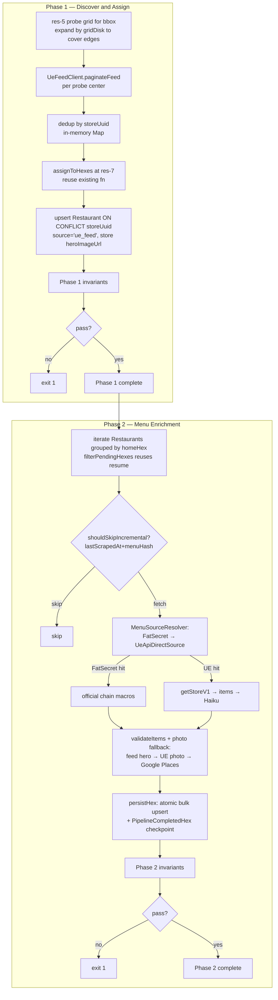

# UE-First Pipeline — Handoff Doc

**Created:** 2026-04-18
**Revised:** 2026-04-19 (rewritten against current code after review)
**Status:** Design finalized, spike cleared 2026-04-19 (see `ue-feed-spike-findings.md`), implementation not started
**Owner:** next session

---

## TL;DR

Replace the Overture → Brave → Firecrawl → UE-URL-discovery step with an **unauth `getFeedV1` discovery probe**. Same H3 hex batching, same FatSecret chain path, same Haiku indie path, same persistence and resume. Extend `ueApiClient.ts` with a new `fetchFeedV1` so one module owns both feed + store endpoints. Phase 2 uses a new `UeApiDirectSource` that takes a pre-known `storeUuid` and skips URL discovery.

Build it as an **additive orchestrator** (`scripts/preload-ue-first.ts`) that reuses the existing hex infra. Product decision: the app will only surface UE-listed restaurants, so dine-in-only venues are out of scope. The `externalPlaceId` column is deprecated in favor of `storeUuid` — on spike success we `TRUNCATE Restaurant` and rebuild, eliminating dual-identity tech debt.

Scope: ~3 engineering days after a successful spike, not 1–2 sprints.

---

## Motivation

### Current pipeline (v6 measured)

```
Overture parquet → per-restaurant URL discovery (sitemap → Brave → Firecrawl)
                → UE getStoreV1 menu fetch
                → UE photo fetch (API + HTML fallback)
                → FatSecret (chains) or Haiku (indies)
                → Prisma persist
```

**v6 baseline (run-2026-04-18-ue-api-v6-brave-photo, 91 restaurants):**
- Persisted: 76 / 91 = 83%
- Skipped: 15 (all "no source found")
- Runtime: 452s
- UE calls/hex: ~149 (77 menu attempts + 72 photo-related)
- Bot-defense events: 46 (down from 82 in v5)
- Cost: ~$1.60/run (Brave + Firecrawl + Haiku)

**Action before Stage 4:** commit these numbers + per-restaurant outcomes into `docs/engineering/pipeline/baseline-v6.md` so Stage 4 comparisons have a stable reference. The current `/tmp` log will not persist.

### Why the ceiling is ~83%

Deep-dive on the 15 misses (see conversation log 2026-04-18) showed:
- **10 venues not on UE at all** — out of scope (product decision: UE-only surface)
- **2 venues on UE but Overture geo is a commissary/ghost address** (Mama Musubi)
- **2 at-same-address duplicates** (Buster's Ice Cream == Buster's Coffee)
- **1 API bot-defense cascade** (Papa John's)

The URL-discovery pipeline burns Brave/Firecrawl calls on the 10 not-on-UE venues that structurally can't be found.  UE-first eliminates that waste by asking UE directly what's deliverable in a given area.

### Why UE-first wins

| Dimension | Overture-first (current) | UE-first |
|---|---|---|
| URL-discovery calls/hex | ~62 Brave + ~10 Firecrawl | 0 |
| UE calls/hex | ~149 | ~92 (est, confirm in spike) |
| Photo fetch calls | ~72/hex | ~0–20 (feed hero when present, Google Places fallback) |
| $/hex | ~$0.33 (+ Haiku) | ~$0 (+ Haiku + occasional Google Places) |
| Discovery latency/hex | ~190s | ~10s (est) |
| Closed-restaurant lag | 6–18 months (Overture upstream) | Days (UE delists fast) |
| Coverage of delivery venues | ~83% | ~95%+ (estimated; gate on Stage 4) |

The product decision narrows the surface to UE-listed venues only, so the Overture dine-in gap is not a risk — the trade becomes purely: fewer calls + fresher data with no material loss.

---

## Architecture

### One orchestrator, two phases, same infra

Phase 1 discovers. Phase 2 enriches. They live in the same script (`scripts/preload-ue-first.ts`) but are separable by flag (`--phase=discover|enrich|both`, default `both`). Phases communicate through the DB, not process handoff.

The orchestrator **reuses** every building block from `scripts/preload.ts`:
- `assignToHexes` (`scripts/hex-assignment.ts`) — homeHex assignment at res-7
- `persistHex` (`scripts/hex-persist.ts`) — atomic per-hex persist + checkpoint
- `filterPendingHexes` + `findIncompleteRunId` (`scripts/hex-resume.ts`) — midnight-safe resume
- `PipelineCompletedHex` (Prisma model) — checkpoint table
- `PipelineEmitter` + existing event schemas (`scripts/pipeline-events.ts`) — Axiom `fitsy-pipeline` dataset continues unchanged; add a `phase: 'ue-first' | 'legacy'` field to `RestaurantEvent`, `CostCheckpoint`, `SubstepEvent` so dashboards can filter by pipeline. Cost dashboards gain a `googlePlacesPhoto` key alongside the existing `braveSearch/firecrawl/haiku`.
- `API_SEMAPHORES` (`scripts/semaphore.ts`) — UE=5, Haiku=20 ceilings
- `validateApiCredentials` pattern (`scripts/preload.ts:218`) — preflight UE reachability (incl. `UE_LOC_COOKIE` decode + probe) + Anthropic
- `shouldSkipIncremental` + `computeMenuHash` (`scripts/preload.ts:306–331`) — see Freshness & skip logic below
- `MenuSourceResolver` (`apps/api/services/menuSources/resolver.ts`) — chain → UE fallback, swap `UberEatsSource` for a new `UeApiDirectSource`
- `FatSecretSource` — unchanged
- `validateItems` / `persistHexBulkInTx` (`scripts/pipeline-utils.ts`) — rejection + bulk persist
- `fetchGooglePlacesPhoto` (`apps/api/services/googlePlacesPhoto.ts`) — tier-3 photo fallback, with source-of-record tracking (see Photo resolution below)

### Freshness & skip logic

Two skip gates, in order:

1. **Pre-fetch gate** (new, cheap): `lastScrapedAt` within `--days` (default 7) AND `--force` not set → skip the UE call entirely. Saves UE bandwidth during re-runs. Bypassed by `--force`.
2. **Post-fetch gate** (existing `shouldSkipIncremental`, `preload.ts:312`): compute `newHash = sha256(sorted item names).slice(0, 16)`; compare to stored `menuHash`.
   - `lastScrapedAt` null → don't skip (first scrape)
   - `(now - lastScrapedAt) > skipDays` → don't skip (stale)
   - `storedHash && storedHash ≠ newHash` → don't skip (menu changed)
   - else → skip (saves Haiku + persist)

We do **not** introduce `lastMenuFetchedAt`; `lastScrapedAt + menuHash` already covers it.



### Phase 1 — Discover and Assign

**Inputs:** region bbox (default: current `preload.ts` LA bbox)
**Outputs:** `Restaurant` rows with `storeUuid`, `homeHex`, geo, name, `photoUrl` (hero), `photoSource='ue_feed_hero'`, `brand` if present, `cuisineTags`, `rating` if present, `priceLevel` if present.

**Steps:**
1. Compute res-5 hex probe grid covering the bbox. Expand by `gridDisk(1)` so edge stores aren't lost, then dedup probe centers. LA County ≈ 40 probes.
2. For each probe center, `paginateFeedV1(lat, lng)` until cursor exhausted. Concurrency via `API_SEMAPHORES.ubereats` (max 5).
3. Collect all raw `StoreCard[]`. Dedup by `storeUuid` (first-seen wins).
4. `assignToHexes` at resolution 7 (existing fn, unchanged).
5. Upsert into `Restaurant` with raw SQL mirroring `preload.ts:171`:
   ```
   INSERT ... ON CONFLICT ("storeUuid") DO UPDATE SET ... ;
   ```
6. Run invariants (see below). Exit 1 on failure.

**Concurrency:** 10 orchestrator-level parallel probes, clamped to 5 in-flight via the UE semaphore. Discovery for LA expected ~10s.

**Idempotency:** safe to re-run. `ON CONFLICT (storeUuid) DO UPDATE` refreshes non-menu fields. New restaurants get added; stale rows get refreshed.

### Phase 2 — Menu Enrichment

**Inputs:** `Restaurant` rows with `source='ue_feed'` where `shouldSkipIncremental` returns false (stale or menu changed).

**Steps (per hex, batched):**
1. Query Restaurants in this hex. Group by `homeHex`.
2. Per restaurant: run `shouldSkipIncremental(restaurantId, candidateHash, 7, prisma)` — if true, skip (existing fn, existing semantics).
3. Call `resolver.resolve(name, address, geo)` where resolver is:
   ```ts
   new MenuSourceResolver([
     new FatSecretSource(),
     new UeApiDirectSource(restaurant.storeUuid), // new source, wraps ueApiClient.fetchStoreV1
   ]);
   ```
   - FatSecret hit → official macros, skip Haiku (existing Path 1 behavior).
   - UE hit → structured items → `estimateMacros(items, anthropic)` under `API_SEMAPHORES.haiku` (existing Path 2 behavior).
4. Photo resolution — three tiers, write `photoSource` on every tier so Google Places spend is projectable:
   - Tier 1: `restaurant.photoUrl` already populated by Phase 1 → `photoSource='ue_feed_hero'`. No call.
   - Tier 2: UE photo-only lookup via `UberEatsSource.lookupPhoto` if tier 1 missing → `photoSource='ue_photo_lookup'`. No call cost.
   - Tier 3: `fetchGooglePlacesPhoto(name, lat, lng)` → `photoSource='google_places'`. Costs one Places call per miss.

   **Spend projection:** Axiom query `sum(count(*)) by photoSource` on the UE-first restaurant events gives Google Places call volume per run. Multiply by current Places unit cost to project monthly spend. Tier-1 hit rate is the lever — if feed hero is present on ~80% of cards, tier-3 volume stays low.
5. `validateItems` → `persistHex` → `PipelineCompletedHex` checkpoint. Atomic per-hex.

**Concurrency:** existing `CONFIG.concurrency=10` per hex, clamped by `API_SEMAPHORES.ubereats` (5) and `.haiku` (20). Do **not** introduce a new "workers=5" knob.

**Why UeApiDirectSource exists:** `UberEatsSource` today does URL discovery (Brave/sitemap/Firecrawl) before hitting `getStoreV1`. UE-first has the `storeUuid` from Phase 1, so it can skip discovery entirely. `UeApiDirectSource` is a thin `MenuSource` that wraps `fetchStoreV1(storeUuid)` + `parseStoreV1Response` from `apps/api/services/menuSources/ueApiClient.ts`.

### Unified UE client

`apps/api/services/menuSources/ueApiClient.ts` is already the right home for both endpoints. Extend it:

```ts
// existing
export async function fetchStoreV1(storeUuid, opts): Promise<UeStoreResponse | null>

// new
export async function fetchFeedV1(lat, lng, cursor?, opts?): Promise<UeFeedResponse | null>
export async function* paginateFeedV1(lat, lng, opts?): AsyncIterable<StoreCard>
```

Share the retry/backoff/headers layer (`jitteredBackoffMs`, `BROWSER_UA`, `x-csrf-token: x`, `RETRY_STATUSES = {403,429,502,503}`) via a private `postUe(endpoint, body, opts)` helper that both public fns call. One module, two endpoints, zero duplication.

No separate `ueFeedClient.ts` file.

---

## Schema changes

One destructive migration: `prisma/migrations/20260419_ue_first_rebuild/migration.sql`. Product decision (2026-04-19): wipe Restaurant data and rebuild from UE. The app is UE-only, so pre-spike Overture rows have no value worth preserving. Removing `externalPlaceId` eliminates dual-identity tech debt.

```sql
-- 1. Wipe all restaurant-scoped data (FK cascades handle MenuItem/MacroEstimate/SavedItem)
TRUNCATE "Restaurant" CASCADE;
TRUNCATE "PipelineCompletedHex";

-- 2. Retire externalPlaceId — storeUuid is the new external identity
ALTER TABLE "Restaurant" DROP CONSTRAINT "Restaurant_externalPlaceId_key";
ALTER TABLE "Restaurant" DROP COLUMN "externalPlaceId";

-- 3. Add UE-first columns
ALTER TABLE "Restaurant" ADD COLUMN "storeUuid"   TEXT NOT NULL;
ALTER TABLE "Restaurant" ADD COLUMN "homeHex"     TEXT;
ALTER TABLE "Restaurant" ADD COLUMN "brand"       TEXT;
ALTER TABLE "Restaurant" ADD COLUMN "photoSource" TEXT;  -- re-adds the column dropped in 20260405

CREATE UNIQUE INDEX "Restaurant_storeUuid_key" ON "Restaurant"("storeUuid");
CREATE INDEX "Restaurant_homeHex_idx"          ON "Restaurant"("homeHex");
```

**Consequences:**
- Legacy `scripts/preload.ts` breaks (references `externalPlaceId`). Acceptable — it's being deprecated. Mark it with a top-of-file `@deprecated` JSDoc comment the same day the migration lands; delete in Stage 6.
- Every API route or query that filters on `externalPlaceId` must switch to `storeUuid`. `grep -rn externalPlaceId apps/` before landing the migration; patch each callsite in the same PR.
- No reconciliation script needed. No `source='ue_feed'` discriminator needed — every row is UE. Keep `Restaurant.source` column for future non-UE sources; UE-first writes `source='ue_feed'`.

**Rollback** is schema-level: `TRUNCATE Restaurant CASCADE`, then re-run Phase 1. No per-row tagging required because everything is UE-sourced.

**Do not add:** `lastMenuFetchedAt`. `lastScrapedAt` + `menuHash` already express freshness.

---

## File structure

```
scripts/
  preload-ue-first.ts          # orchestrator (mirrors preload.ts structure)
  ue-feed-spike.ts             # spike (scripts/ convention, not scripts/spikes/)
  ue-first-invariants.ts       # phase-scoped checks
  preload.ts                   # @deprecated — kept until Stage 6 cleanup

apps/api/services/menuSources/
  ueApiClient.ts               # EXTENDED — adds fetchFeedV1, paginateFeedV1
  ueApiDirectSource.ts         # new MenuSource; wraps fetchStoreV1 with a pre-known storeUuid
```

Shared utilities already exist — no new `shared/` subdir. Normalization lives next to the code that uses it (extend `toFatSecretSlug` or add a sibling helper in `fatSecretSource.ts`), not in a detached module.

---

## Invariants — baked into the orchestrator

Reuse `PipelineEmitter` for reporting. Each invariant failure emits a `PipelineError` event and causes `exit 1`.

### Phase 1 invariants

| Check | Query/Assertion |
|---|---|
| storeUuid is unique (enforced by schema, asserted anyway) | `SELECT "storeUuid", COUNT(*) FROM "Restaurant" GROUP BY "storeUuid" HAVING COUNT(*) > 1` = empty |
| Every Restaurant has valid geo | `lat BETWEEN -90 AND 90 AND lng BETWEEN -180 AND 180` for all |
| homeHex matches geo | `latLngToCell(lat, lng, 7) === homeHex` |
| Every Restaurant has non-empty name and storeUuid | `name <> '' AND storeUuid <> ''` |
| In-run: unique storeUuids in memory = rows upserted | inline assertion |

### Phase 2 invariants

| Check | Query/Assertion |
|---|---|
| Every attempted Restaurant has outcome | `lastScrapedAt IS NOT NULL` for every row processed this run |
| MenuItem FK integrity | No MenuItem with missing `restaurantId` |
| No orphan MacroEstimates | Every MacroEstimate links to an existing MenuItem |
| Unique (restaurantId, name) | Matches existing `@@unique([restaurantId, name])` constraint |
| Macro values in sane ranges | calories 0–5000, protein 0–200g, carbs 0–500g, fat 0–300g |

Reuse `scripts/verify-prod.sh` as the entry point for the nightly variant; no new cron infra in scope.

---

## Spike — CLEARED 2026-04-19

Full findings: `docs/engineering/archive/ue-feed-spike-findings.md`. Script: `scripts/ue-feed-spike.ts`. Sample response: `scripts/cache/ue-feed-spike-sample.json`.

### What was validated

1. ✅ `getFeedV1` returns 200 JSON unauth when a `uev2.loc` cookie is present in the jar.
2. ✅ Response carries per-store geo at `store.mapMarker.latitude/longitude` (not `store.location.*` as originally hypothesized).
3. ✅ Cookie `latitude`/`longitude` fields are authoritative — one captured cookie works for the entire US probe grid; the HERE `reference` token inside the cookie is cosmetic.
4. ✅ No 403/429/captcha across 5 rapid cross-country probes (LA Downtown → Santa Monica → SF → NYC).
5. ✅ 52–100 stores per probe with `storeUuid`, title, rating, photos, actionUrl.

### Actual response shape (correcting the plan's hypothetical)

Stores live in `data.feedItems[]` filtered by `type === "REGULAR_STORE"`. **`data.storesMap` is empty/deprecated in the current response** — do not read from it.

Per-store fields (for Phase 1 upsert):
- `store.storeUuid` — stable external identity
- `store.title.text` — name
- `store.rating.text` — rating (parse as float); `store.rating.accessibilityText` embeds review count
- `store.actionUrl` — `/store/<slug>/<shortUuid>?diningMode=DELIVERY` (parse for slug/shortUuid if needed)
- `store.image.items[]` — 6 resolutions of hero image (2880w → 240w); pick one for `photoUrl`
- `store.mapMarker.latitude`, `store.mapMarker.longitude` — **geo for hex assignment**
- `store.signposts[]` — promo/deal badges
- No top-level `priceRange` field observed. If needed, fall back to `getStoreV1`.

### Cookie mechanics

- UE's web client sets `uev2.loc` client-side in JS after address pick. **No RPC exists to set it** — `setTargetLocationV1` returns 400 ("Delivery location cookie is not set"), `getLocationDetailsV1` returns 404 (`ERR_MISSING_HANDLER`).
- Capture once from any logged-out session at ubereats.com → DevTools → Application → Cookies → `uev2.loc`. Store raw (URL-encoded) value as `UE_LOC_COOKIE` secret.
- To probe an arbitrary lat/lng: decode the cookie JSON, overwrite `latitude` and `longitude`, re-encode, send.

### Still unvalidated (deferred to Stage 3, non-blocking)

- Pagination beyond `offset: 0` — first page returned 52–100 stores which may be the terminal page. Probe with `offset: 80` in Stage 3 to confirm.
- Rate-limit ceiling under burst (plan assumes 5 concurrent via `API_SEMAPHORES.ubereats`; proven safe at 5 sequential, not yet tested at 50+ burst).
- Cookie lifetime — unknown. Plan: monitor; rotate cookie if first pipeline run returns empty-state at scale.

### Kill-criteria status

| Criterion | Status |
|---|---|
| Feed endpoint requires a session cookie unobtainable unauth | ❌ Cleared — cookie is capturable from any browser session; one works US-wide |
| Response omits per-store lat/lng | ❌ Cleared — `mapMarker` has both |
| Rate limits < 30 probes/min | ❔ Unverified at burst; 5 sequential probes succeeded |
| Cursor unstable across retries | ❔ Not yet tested (first page sufficient for spike) |

---

## Risks and mitigations

| Risk | Likelihood | Mitigation |
|---|---|---|
| Captured `uev2.loc` cookie expires | Medium | Rotation procedure documented in spike findings. Preflight check in `validateApiCredentials` decodes the cookie and calls `getFeedV1` with a known lat/lng; on empty-state, fail fast with rotation instructions. No RPC exists to refresh it programmatically. |
| Bot-defense on feed probes | Medium | Retry with jitter (reuse existing UE retry layer, `ueApiClient.ts:36`); re-probe at hex vertices if center fails; circuit breaker pauses 5min at >30% per-hex probe failure rate |
| UE tightens WAF and blocks all unauth reads | Low (for now) | Restore Restaurant table from Supabase snapshot; revert migration |
| Chain naming mismatch between UE and FatSecret | Medium | Extend `toFatSecretSlug` (`fatSecretSource.ts:32`) with a normalization table; expand as Phase 2 logs "likely chain but FatSecret miss" |
| Photo quality regresses vs. current three-tier | Low | Three-tier fallback retained; `photoSource` tracking makes Google Places volume visible in Axiom |
| Google Places spend spike if feed hero coverage is low | Medium | Axiom query on `photoSource` distribution after Stage 4; gate production rollout on acceptable Places call volume |

---

## Rollback

Schema-level rollback (works because every row is UE-sourced after the migration):

```sql
TRUNCATE "Restaurant" CASCADE;
TRUNCATE "PipelineCompletedHex";
```

Then re-run Phase 1 to repopulate. Document this in the runbook before Stage 6 cutover.

To back out the migration entirely (e.g. UE feed endpoint turns out to be unreliable post-launch): restore from the pre-migration snapshot; Supabase daily backups make this one-command.

---

## Rollout plan

### Stage 1 — Spike — DONE 2026-04-19

- ✅ `scripts/ue-feed-spike.ts` written and run; `scripts/cache/ue-feed-spike-sample.json` committed.
- ✅ Kill-criteria 1 and 2 cleared; 3 and 4 deferred to Stage 3 (non-blocking).
- ✅ Findings: `docs/engineering/archive/ue-feed-spike-findings.md`.
- **Gate:** cleared → proceed to Stage 2.

### Stage 2 — Schema + source module (~1 day)

- Write migration `20260419_ue_first_rebuild` (TRUNCATE + drop `externalPlaceId` + add `storeUuid/homeHex/brand/photoSource`). Apply to staging.
- `grep -rn externalPlaceId apps/ scripts/ packages/` and migrate every reference to `storeUuid` in the same PR. Mark `scripts/preload.ts` `@deprecated`.
- Extend `apps/api/services/menuSources/ueApiClient.ts` with `fetchFeedV1` + `paginateFeedV1` sharing the existing retry layer. Feed extractor must read `data.feedItems[]` filtered by `type === "REGULAR_STORE"`, not `data.storesMap`. Use `store.mapMarker.latitude/longitude` for geo.
- Add `UE_LOC_COOKIE` env var to `.env.example` and Vercel secrets. Document rotation procedure (capture from browser DevTools → Cookies → `uev2.loc`) inline in `ueApiClient.ts` near the cookie header assembly.
- Build `apps/api/services/menuSources/ueApiDirectSource.ts` (thin wrapper over `fetchStoreV1` + `parseStoreV1Response`). Add unit tests alongside existing source tests.
- **Gate:** migration applied; `npx tsc --noEmit` green; `ueApiDirectSource.test.ts` green; feed client tested against the committed spike sample.

### Stage 3 — Pipeline orchestrator (~1.5 days)

- Write `scripts/preload-ue-first.ts`. Mirror `preload.ts` structure. Reuse: `assignToHexes`, `persistHex`, `filterPendingHexes`, `findIncompleteRunId`, `PipelineEmitter` (with new `phase='ue-first'` field), `API_SEMAPHORES`, `validateApiCredentials` pattern (UE feed + Anthropic preflight only), `shouldSkipIncremental`, `validateItems`, `fetchGooglePlacesPhoto`.
- Instantiate resolver as `new MenuSourceResolver([new FatSecretSource(), new UeApiDirectSource(storeUuid)])`.
- Implement pre-fetch skip gate (new) + post-fetch `shouldSkipIncremental` (existing).
- Write `photoSource` on every restaurant upsert; include it in the `RestaurantEvent` payload.
- Wire invariants; both phases fail closed on violations.
- `--phase`, `--hex-id`, `--max-hexes`, `--dry-run`, `--force`, `--days` flags — mirror `preload.ts`.
- **Gate:** single South Pasadena res-7 hex end-to-end persist count ≥ v6 (76).

### Stage 4 — Baseline + side-by-side (~0.5 day)

- Commit `docs/engineering/pipeline/baseline-v6.md` with v6 per-restaurant outcomes and aggregate numbers. Freeze the numbers before running Phase 1.
- Run UE-first against 10 diverse hexes (dense urban, suburban, sparse) in a clean-staging DB.
- Per hex, compare: persist count, per-restaurant coverage delta (UE-first rows not in v6 baseline — dine-in venues expected missing, that's fine), data quality (macro presence, photo presence), photoSource distribution (spend projection).
- Document in `docs/engineering/pipeline/ue-first-coverage-report.md`. No reconciliation script needed — staging is wiped before the run.

### Stage 5 — Cutover decision

Based on Stage 4 report:
- UE-first persist count ≥ v6 AND coverage delta favorable: cut over, mark `preload.ts` deprecated, plan deletion.
- UE-first has hidden bugs: fix and re-run Stage 4.

### Stage 6 — Production

- Wire `scripts/preload-ue-first.ts --phase=discover` to daily cron.
- Wire `scripts/preload-ue-first.ts --phase=enrich` to a worker that drains the backlog.
- Extend `scripts/verify-prod.sh` with the invariants from both phases.
- Monitoring: Axiom queries on `fitsy-pipeline` filtered by `phase=ue-first` — probe success rate, bot-defense rate, enrichment throughput, invariant violation count. Reuse existing `RestaurantEvent` / `CostCheckpoint` / `SubstepEvent` schemas.

---

## Open questions

1. **Probe grid edge behavior** — res-5 centers can miss stores just inside the bbox near an edge; `gridDisk(1)` expansion is the cheap fix. Confirm in Stage 3 that edge dedup matches the non-expanded set.
2. **Pagination cursor handling** — needs spike data.
3. **Chain normalization** — extend `toFatSecretSlug` with a normalization map, or add a peer helper. Owned by whoever logs the first "likely chain but FatSecret miss" in Phase 2.
4. **UE_API_MODE for Stage 4 fairness** — legacy pipeline must run with `UE_API_MODE=primary` during Stage 4 so the comparison isn't biased against JSON-LD-only mode.

---

## Context for the next session

Everything above is design decisions from conversations on 2026-04-18 and 2026-04-19. Key reference points:

- **v6 run log:** `/tmp/hex-ue-api-v6.log` — ephemeral. Commit the baseline doc in Stage 4 before relying on these numbers.
- **v6 miss analysis:** conversation history for per-restaurant diagnosis of 15 skipped venues.
- **Current UE store client:** `apps/api/services/menuSources/ueApiClient.ts` — extend with `fetchFeedV1`, share retry layer.
- **Existing orchestrator:** `scripts/preload.ts` — deprecate same day as migration lands; delete in Stage 6.
- **Existing hex logic:** `scripts/hex-assignment.ts`, `scripts/hex-persist.ts`, `scripts/hex-resume.ts` — use directly.
- **Existing resolver:** `apps/api/services/menuSources/resolver.ts` — inject `[FatSecretSource, UeApiDirectSource]`.
- **Existing telemetry:** `scripts/pipeline-events.ts` — reuse Axiom `fitsy-pipeline` dataset; add `phase` + `photoSource` fields.
- **Prisma schema:** `prisma/schema.prisma` — destructive migration required (TRUNCATE + drop `externalPlaceId` + add `storeUuid/homeHex/brand/photoSource`).

**First action:** Stage 2 — write the destructive migration and extend `ueApiClient.ts` with `fetchFeedV1` + `paginateFeedV1`. Spike is cleared (2026-04-19).
