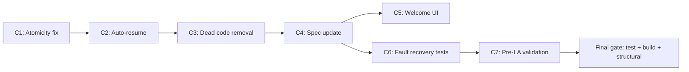

# Pipeline V3 Hardening Plan

**Created:** 2026-04-14
**Context:** Spec audit of `docs/engineering/specs/data-pipeline-v3.md` against `scripts/preload.ts` revealed critical atomicity violations and ~1,400 lines of dead code. The spec was also stale (still referenced Google Places).

**Root cause:** S-139 built `persistHex()` with correct atomic transaction semantics, but S-141 wired preload.ts to bypass it entirely — doing per-restaurant persists with a standalone checkpoint. The spec's core invariant ("nothing reaches the DB until the entire hex is done") was violated.



---

## Commits

### C1: Atomicity — wire `persistHex()` + menuHash in txn

**Files:** `scripts/preload.ts`, `scripts/hex-persist.ts`, `scripts/pipeline-utils.ts`

**Changes:**
- Refactor `processRestaurant()` in preload.ts to return `{ restaurantId, items: ValidatedPair[], menuHash }` instead of persisting inline
- Collect all results for a hex, then call `persistHex()` once at end of hex loop
- Add `updateMenuHashInTx(restaurantId, menuHash, tx)` to `hex-persist.ts` transaction loop
- Remove now-dead `persistItems()` and `computeAndStoreDietaryOptions()` imports from preload.ts

**Exit criteria:**
- [ ] `npx tsc --noEmit` — zero errors
- [ ] `npm test --workspace=@fitsy/scripts` — hex-persist, pipeline-utils tests pass
- [ ] `persistHex()` is the ONLY path that writes to DB in preload.ts (no standalone `persistItems`, no standalone checkpoint create)
- [ ] `menuHash`/`lastScrapedAt` update is inside the `$transaction` block

---

### C2: Auto-resume across midnight

**Files:** `scripts/preload.ts`, `scripts/hex-resume.ts`, `scripts/hex-resume.test.ts`

**Changes:**
- Add `findLatestIncompleteRunId(totalHexCount, prisma)` to `hex-resume.ts`
- On startup (no `--run-id` flag): query `PipelineCompletedHex` for most recent runId with fewer checkpoints than total hexes. If found, resume it. Otherwise, generate new date-based runId.
- Add unit test: incomplete run with 5/10 hexes done returns that runId; fully complete run returns null.

**Exit criteria:**
- [ ] `npx tsc --noEmit` — zero errors
- [ ] `npm test --workspace=@fitsy/scripts` — new resume UT passes
- [ ] Crash at 11:59 PM + rerun at 12:04 AM resumes the same run (verifiable from test logic)

---

### C3: Dead code removal

**Files deleted:**
- `apps/api/services/googlePlacesService.ts` (164 lines)
- `apps/api/services/googlePlacesService.test.ts` (25 lines)
- `apps/api/services/menuSources/yelpSource.ts` (150 lines)
- `scripts/preload-rest.ts` (849 lines)
- `scripts/hex-grid.ts` (52 lines)
- `scripts/hex-grid.test.ts` (lines TBD)

**Files modified:**
- `CLAUDE.md` — remove `GOOGLE_PLACES_API_KEY` from env var table
- `scripts/route-reviewers.sh` — remove references to deleted files if any
- `apps/api/services/menuSources/types.ts` — remove Google Places comment if present

**Exit criteria:**
- [ ] `npx tsc --noEmit` — zero errors (proves nothing imported deleted files)
- [ ] `npm test` — full suite passes
- [ ] `bash scripts/structural-tests.sh` — passes
- [ ] `grep -r "googlePlacesService\|yelpSource\|preload-rest\|hex-grid" --include="*.ts" scripts/ apps/` returns zero results (no dangling references)

---

### C4: Spec update

**Files:** `docs/engineering/specs/data-pipeline-v3.md`

**Changes:**
- Remove stale "Pre-hex mode" section (lines 314-327)
- Update "17K" references to "~19K" in implementation section
- Update resume docs to describe auto-resume behavior (date-based + midnight-safe fallback)
- Verify Mermaid diagram matches current architecture

**Exit criteria:**
- [ ] `bash scripts/structural-tests.sh` — Mermaid diagram check passes
- [ ] No references to Google Places, `--resume` flag, or checkpoint JSON file remain in spec
- [ ] Spec's "How it works" section matches actual preload.ts flow

---

### C5: Welcome screen UI fixes

**Files:** `apps/mobile/app/welcome/*.tsx`

**Changes:** Already restored from `git stash@{3}`. These are onboarding screen updates from a prior session that were stashed and never committed.

**Exit criteria:**
- [ ] `npx tsc --noEmit` — zero errors
- [ ] No runtime errors in welcome flow (visual check if simulator available)

---

### C6: Fault recovery tests

**Files:** `scripts/mini-hex-e2e.test.ts`

**Changes:** Add 3 new tests to the `describeIfE2E` block:

1. **Transaction rollback** — mock a persist failure mid-hex. Verify: no `PipelineCompletedHex` checkpoint exists for that hex, no partial menu items in DB.
2. **Partial-hex resume** — checkpoint 2 of 4 hexes. Call `filterPendingHexes()`. Verify: only the 2 uncompleted hexes are returned.
3. **DuckDB failure propagation** — mock `execSync` throwing. Verify: error propagates cleanly, no corrupt/empty cache file written.

**Exit criteria:**
- [ ] All 3 tests pass when run with DB + DuckDB: `E2E=1 npm test --workspace=@fitsy/scripts -- --testPathPattern='mini-hex-e2e'`
- [ ] Test 1 proves: when `persistHex()` throws, DB has zero rows for that hex (items, estimates, checkpoint)
- [ ] Test 2 proves: resume skips exactly the completed hexes and returns exactly the pending ones
- [ ] Test 3 proves: failed DuckDB download leaves no cache file on disk

---

### C7: Pre-LA validation gate

**Files:** `scripts/la-validation.ts` (new)

**Changes:** Lightweight validation script that confirms readiness for full LA run:

1. Download Overture cache for LA bbox `{south: 33.95, north: 34.15, west: -118.50, east: -118.15}`
2. Assert restaurant count is 18,000-21,000
3. Assert Chick-fil-A has >0 locations (regression guard for category filter)
4. Assign to hexes, find the densest hex, log its count
5. Process 3 representative hexes through source resolution only (no persist): sparse (<20), medium (50-100), dense (200+)
6. Report source resolution rates per hex

**Exit criteria:**
- [ ] Script completes without crash
- [ ] Restaurant count in range 18,000-21,000
- [ ] Chick-fil-A count > 0
- [ ] All 3 representative hexes complete source resolution
- [ ] Dense hex completes in under 5 minutes
- [ ] Source resolution rate (non-skip) is > 30% across all hexes

---

## Final gate

After all 7 commits land:

```bash
npm test              # full suite — all workspaces
npm run build         # catches issues tests miss
bash scripts/structural-tests.sh
npx tsc --noEmit      # redundant with build but explicit
```

All must pass. No regressions. Then push.
