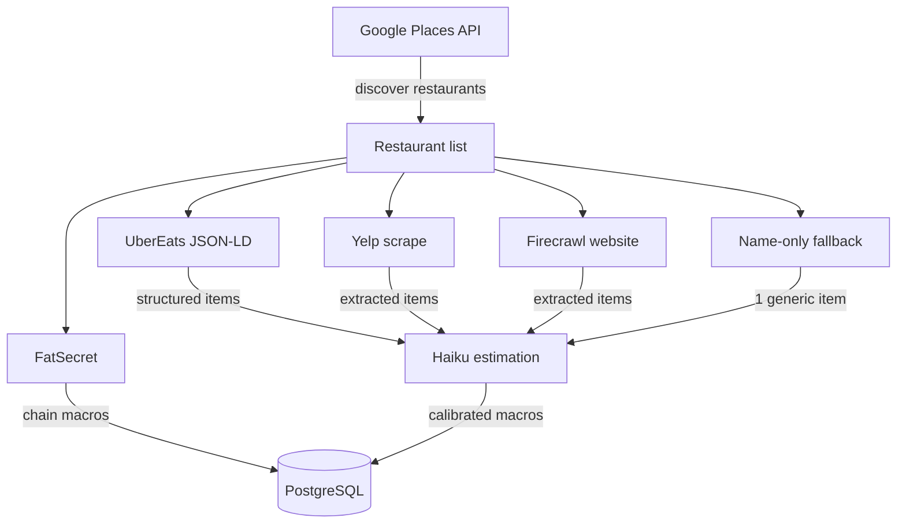

# Data Pipeline V2 — Spec

## Context

The preload pipeline discovers restaurants, scrapes menus, estimates macros, and persists to the DB. After auditing the current state (April 2026), we've identified systemic issues with data quality, estimation accuracy, pipeline reliability, and scalability.

This spec documents every known gap and proposes fixes, prioritized by impact.

---

## Design Principles

### 1. Phased Pipeline
The pipeline is a sequence of independent stages, each with its own inputs, outputs, and failure modes. Each stage can be rerun independently without re-executing upstream stages. Stages are: **discover → resolve URLs → fetch menus → estimate macros → validate → persist**. Intermediate results are checkpointed so failures don't cascade.

### 2. Failure Handling & Resilience
Every external call (Google Places, UberEats, Brave Search, Haiku, Firecrawl) can fail transiently. The pipeline retries with backoff, falls through to alternative sources, and never destroys good data because a re-fetch failed. Transactional persistence ensures partial writes don't corrupt the DB. A failed restaurant should degrade gracefully (fewer items, lower quality source) rather than crash the run.

### 3. Scalability & Performance
The pipeline must scale from 20 to 25,000 restaurants without architectural changes. API calls are parallelized with per-service concurrency limits. Rate limits are respected via semaphores and delays, not by running slowly. The target is: **25K restaurants in under 4 hours on a single machine.** URL discovery is cached so subsequent runs are 10x faster.

### 4. Estimation Accuracy
Macro estimates are the core product value. Haiku systematically underestimates restaurant portions, especially cooking fats (~23% under) and carbs (~7% under). Post-hoc calibration corrects for this. Accuracy is measured via eval-v2 (automated prompt lab with 8+ indie restaurant test cases, 50+ runs per config). Target: **<10% average calorie error**.

### 5. Data Quality
Every item in the DB must be real food with plausible macros. Non-food items (merchandise, utensils, condiments) are filtered before persistence. HTML entities are decoded. Macro math is validated (cal ≈ P×4 + C×4 + F×9 ± 20%). Items from mismatched restaurants are rejected via name validation. Source quality is tracked per item.

### 6. Cost Efficiency
External API costs are minimized through caching (URL cache, sitemap index), incremental updates (skip recently-scraped restaurants), and source prioritization (free sources first: FatSecret → UE JSON-LD → cached URLs, then paid: Brave Search → Firecrawl). Target: **<$10 per incremental refresh of 25K restaurants** after initial population.

### 7. Observability
Every pipeline run produces structured logs: per-restaurant source, item count, previous item count, errors, duration, cost. Regressions are detected by comparing current vs previous item counts. A summary report shows source breakdown, error rates, and total cost. Alerts fire when a run degrades >20% of restaurants.

### 8. Evals
Estimation accuracy is continuously measured, not assumed. The eval-v2 system tests prompt variants and calibration strategies against hand-curated indie restaurant cases with expected macros. New prompt ideas, model changes, or calibration adjustments are eval'd before shipping. Target: every accuracy change has a measured delta with 50+ run statistical significance.

---

## Current Architecture



**Source priority:** FatSecret → UberEats → Yelp → Firecrawl website → Firecrawl search → name-only

**Current stats (April 2026):** 21 restaurants, 1,648 items, ~13.5% avg macro estimation error on eval cases.

---

## Part 1: Known Bugs & Data Quality Issues

### 1.1 HTML Entities in Item Names
**Status:** Fix committed, needs rerun.
**Issue:** 67 items have `&amp;`, `&#39;` etc. in names/descriptions. Source: UE JSON-LD and FatSecret.
**Fix:** `decodeHtml()` added to `persistItems()`. Rerun preload to clean.

### 1.2 Non-Food Items Persisted
**Issue:** Pine & Crane has T-shirts, hats, hoodies, mugs, chopsticks, forks, napkins stored as menu items with 0 cal estimates. Users see these in search results.
**Scope:** ~10 items currently, will grow with more restaurants.
**Fix:** Item-level validation before persist — reject items matching non-food patterns:
- Merchandise: regex for `shirt|hoodie|hat|mug|bag|tote`
- Utensils: `chopstick|fork|spoon|knife|napkin|plate|bowl|straw|container`
- Zero-cal food items (not drinks): if `calories == 0` and not a beverage, reject

### 1.3 Condiments as Standalone Items
**Issue:** Ketchup packets, mustard, individual sauce cups stored as menu items.
**Scope:** ~20 items (mostly FatSecret chains).
**Fix:** Filter items where `calories < 30` AND name matches condiment patterns (`packet|sauce cup|dressing packet`). Or: filter by FatSecret category if available.

### 1.4 Duplicate Chick-fil-A
**Issue:** 2 restaurant records, 344 items each. Expected — different Google Places locations.
**Status:** Not a bug. Each location should have its own record for proximity-based search.

### 1.5 FatSecret Thin Coverage
**Issue:** Pollo Campero (6 items), Jollibee (6 items) — FatSecret returns too few items but `found: true` stops the resolver from trying UE/Yelp.
**Fix:** If FatSecret returns `< 10 items`, fall through to next source. FatSecret data can still be used for the items it covers (prefer published macros over Haiku estimates).

### 1.6 Macro Math Mismatch
**Issue:** Jollibee Cheese Burger: 360 cal stated but `p*4 + c*4 + f*9 = 215`. FatSecret data error.
**Scope:** 10 items with >50 cal discrepancy.
**Fix:** Validation gate: if `|cal - (p*4 + c*4 + f*9)| > 20%`, flag item. For Haiku-estimated items, recalculate cal from macros (already done via calibration). For FatSecret items, trust their published cal and flag the macro breakdown as unreliable.

### 1.7 Missing Prices
**Issue:** 577/1,648 items have null prices. FatSecret never provides prices. Yelp sometimes doesn't.
**Impact:** Price is used for portion-size inference in some prompts. Missing prices reduce estimation quality.
**Fix:** For UE-sourced items, prices come from JSON-LD (reliable). For Yelp/Firecrawl, extract price from markdown if present. For FatSecret chains, price data isn't critical since macros are already published.

### 1.8 Missing Descriptions
**Issue:** 698/1,648 items missing descriptions. FatSecret (344 Chick-fil-A + 130 McDonald's) never has descriptions. Some UE items also lack them.
**Impact:** Eval shows descriptions can hurt accuracy (for indie items). For chains, descriptions don't matter since macros are published.
**Fix:** Low priority. Name-only estimation is competitive with description-based.

---

## Part 2: Pipeline Reliability

### 2.1 No Retry on Transient Failures
**Issue:** A single failed UE fetch or Haiku call causes the restaurant to fall to name-only (1 item). Rate limits, network blips, and API hiccups are common.
**Fix:** Retry up to 2 times with exponential backoff (1s, 3s) for:
- UE HTML fetch (rate limiting)
- Haiku API calls (rate limiting, timeout)
- Firecrawl API calls (rate limiting)

### 2.2 Delete-Before-Insert Is Not Transactional
**Issue:** `persistItems()` deletes all existing items, then inserts new ones. If insert fails (Haiku error, DB error), the restaurant has 0 items.
**Fix:** Wrap delete + insert in a DB transaction. Rollback on failure.

### 2.3 No Quality Gate Before Persist
**Issue:** Bad data gets persisted without validation. Non-food items, HTML entities, wrong restaurants — all reach the DB.
**Fix:** Validation layer between estimation and persistence:

```typescript
function validateItems(items: MenuItem[], macros: MacroData[]): { valid: ValidatedItem[], rejected: RejectedItem[] } {
  // 1. Reject non-food items (merchandise, utensils)
  // 2. Reject items with invalid macros (0 cal food, math mismatch)
  // 3. Decode HTML entities
  // 4. Reject items with name < 3 chars or > 200 chars
  // 5. Reject items where name looks like a review or description
}
```

### 2.4 No Regression Detection
**Issue:** A bad scrape can replace 55 good items with 1 name-only item. No way to detect this.
**Fix:** Before deleting, compare new item count to existing:
- If new count < existing * 0.5 AND existing > 5: **skip persist**, log warning
- If new count = 1 AND source = "name-only" AND existing > 5: **skip persist**
- Override with `--force` flag

### 2.5 Yelp Slug Guessing Is Fragile
**Issue:** `buildYelpSlug()` constructs a URL like `yelp.com/menu/bacari-silverlake-los-angeles`. If the slug is wrong, Firecrawl scrapes the wrong page (or a 404), and Haiku might extract garbage.
**Fix:**
1. Validate that scraped markdown contains menu-like content (prices, item patterns)
2. Check restaurant name in the page matches expected name
3. Consider using Yelp Fusion API for business lookup first (free, 5000/day), then construct menu URL from the confirmed alias

### 2.6 UE Rate Limiting
**Issue:** UberEats rate-limits after ~20 rapid requests. No backoff logic.
**Fix:** Add 500ms delay between UE fetches. On 403/empty response, backoff to 2s and retry once.

### 2.7 URL Discovery — Replace Firecrawl with Brave Search
**Issue:** Firecrawl search is the primary URL discovery method for finding UberEats store pages. It's slow (10 RPM = 29 hours for 17,500 restaurants), expensive ($105), and inconsistent (returns different results across runs).

**Tested alternatives:**

| Service | QPS | Cost/1,000 | Free Tier | UE URL Hit Rate | Status |
|---------|-----|-----------|-----------|----------------|--------|
| Firecrawl (current) | 0.17 | $6 | Credits | ~70% | Slow, inconsistent |
| Brave Search | 20 | $5 | 2,000/month | ~90% | **Validated** — 5/5 correct in testing |
| Exa | 10 | $7 | 1,000/month | ~85% est | Not tested |
| Serper | 50 | $5 | 2,500 credits | ~90% est | Not tested |
| Google CSE | 100 | $5 | 100/day | N/A | **Deprecated** — closed to new customers 2025 |

**Decision:** Replace Firecrawl search with **Brave Search API** for URL discovery.
- 120x faster (20 QPS vs 0.17 QPS)
- Slightly cheaper ($5 vs $6 per 1,000)
- More reliable (consistent Google-quality results)
- Validated: tested against 5 restaurants, found correct UE URL for all 4 that exist on UE, correctly returned no UE result for the 1 that doesn't

**Implementation:**
1. New `BraveSearchSource` in `apps/api/services/` — query `"{name} uber eats {city}"`, filter results for `ubereats.com/store/` URLs
2. Replace Firecrawl `discoverUberEatsUrl()` with Brave Search in `UberEatsSource.lookup()`
3. Fallback chain: URL cache → Brave Search → UE sitemap (exact match only)
4. Cache discovered URLs as before

**At 17,500 restaurants:**
- Brave Search: 17,500 queries at 20 QPS = **15 minutes**, $78
- vs Firecrawl: 29 hours, $105

---

## Part 3: Estimation Accuracy

### 3.1 Current State
- **Production prompt:** name-only (no description) via Haiku
- **Post-hoc calibration:** P: 1.0x, C: 1.08x, F: 1.3x
- **Avg error:** ~13.5% on 8 indie restaurant test cases (eval-v2, 50 runs)
- **Systematic bias:** Haiku underestimates cooking fats by 23%, carbs by 7%, protein is accurate

### 3.2 Why Haiku Underestimates
Haiku's training data is dominated by home-cooking recipes and USDA standard servings. Restaurant portions are 2-3x larger for starches and 3-4x more cooking fat. The model doesn't have this calibration.

Key insight: Haiku knows ingredient macros well (per 100g). The gap is **portion estimation** — how much of each ingredient is on the plate.

### 3.3 Approaches Tested (Eval-V2)

| Approach | Avg Error | Verdict |
|----------|-----------|---------|
| Production (current prompt + desc) | 24.2% | Descriptions hurt |
| Name-only | 18.3% | Best prompt |
| Name-only + flat 1.17x | 15.2% | Good but overcorrects some |
| Name-only + C:1.08x F:1.3x | **13.5%** | **Best** — shipped |
| Soft nudge ("portions are bigger") | 31.0% | Overcorrects |
| Hard multipliers in prompt (2.5-3x) | 30.7% | Way overcorrects |
| Decompose into components + USDA | 60-154% | Haiku bad at gram weights |
| Few-shot examples | 20.6% | Biased toward example food types |
| Sonnet (bigger model) | 21.3% | More reasoning ≠ better calibration |
| Two-pass (reason then estimate) | 31.6% | Worst — verbose overthinking |
| Images (dish photo) | 20.1% | Inconclusive (only 1 case had image) |

### 3.4 Alternative Approaches — Feasibility & Impact

#### A. Train a Fine-Tuned Model
**Concept:** Fine-tune a small model (Haiku or open-source) on restaurant nutrition data specifically.
**Data needed:** ~1,000-5,000 labeled examples (restaurant dish name → actual macros).
**Where to get data:**
- Chain restaurants with published nutrition (we have ~500 from FatSecret)
- Calorie-counting apps (MFP has user-submitted restaurant entries, noisy)
- Commission nutritionist analysis of ~50 local dishes ($500-1000)

**Feasibility:** Medium. Anthropic supports fine-tuning. The bottleneck is labeled data quality. Chain data is plentiful but may not generalize to indie restaurants (different portion patterns).
**Expected impact:** Could get to <10% error if training data is representative. Risk: overfitting to chains.
**Cost:** Fine-tuning ~$50-100. Data collection $500-2000.
**Timeline:** 2-4 weeks.

#### B. Vision-Based Estimation (Dish Photos)
**Concept:** Send the dish photo to a vision model to estimate portion size, then combine with text-based estimation.
**Data source:** UberEats, DoorDash, Yelp, Google Maps all have dish photos for many items.
**Challenge:** Photo availability varies. Only ~30% of indie items have photos on UE. Also, photos are styled/angled for marketing — may not represent actual portion.

**Feasibility:** High for implementation, uncertain for accuracy. Anthropic's vision models can analyze food photos. The question is whether photos actually improve portion estimation vs text-only.
**Expected impact:** Unknown. Our single test case was inconclusive. Could be +5% or +0%.
**Cost:** ~$0.003 per image (Haiku vision). ~$3 per 1,000 items.
**Timeline:** 1 week to integrate, 2 weeks to evaluate properly.

**Recommended test:** Run eval-v2 with images for 20+ items that have UE photos. If image+text beats text-only by >3%, invest further.

#### C. Retrieval-Augmented Estimation (RAG)
**Concept:** For each indie dish, find the 3-5 most similar dishes with known macros (from chain data or USDA) and include them as reference points in the prompt.
**Data source:** Our existing FatSecret data (~500 chain items with published macros) + USDA FoodData Central (~7,000 restaurant entries, free).

**Feasibility:** Medium. Need embedding index for similarity search. Could use USDA's free API for dynamic lookup.
**Expected impact:** Potentially high — anchoring to real data should beat the model guessing from training data. But untested.
**Cost:** Embedding: ~$0.0001/query. USDA API: free.
**Timeline:** 1-2 weeks.

#### D. Calibration from Chain Data
**Concept:** Run Haiku's name-only estimation against all chain items with published macros. Compute the signed error per dish category (pasta, burger, bowl, etc.). Apply category-specific correction factors to indie estimates.

**Feasibility:** High. We have the data and the eval framework. Just need to categorize dishes and compute per-category multipliers.
**Expected impact:** Should beat our current blanket multiplier. Italian pasta might get C:1.15x F:1.4x while fried rice gets C:1.05x F:1.1x.
**Cost:** ~$0.50 in Haiku calls to estimate all 500 chain items.
**Timeline:** 1-2 days.
**Risk:** Chain portions ≠ indie portions. Chick-fil-A sandwich calibration may not transfer to indie sandwich shops.

#### E. Hybrid: Haiku Estimate + Deterministic Adjustment
**Concept:** Haiku estimates the base dish type and composition. Code applies deterministic adjustments based on:
- `restaurant_avg_price` (tier: casual / mid / upscale / fine)
- `item_price / avg_price` (relative position on menu)
- Cuisine type (Italian → +fat, Thai → +oil, etc.)
- Cooking method keywords in name/description (fried → +fat, grilled → baseline)

**Feasibility:** High. All signals available in current data.
**Expected impact:** Moderate. The blanket multiplier already gives ~5% improvement. Per-cuisine/price adjustments could add another 2-3%.
**Cost:** Zero runtime cost — pure code logic.
**Timeline:** 2-3 days to build, 1 week to tune with more eval cases.

#### F. Multi-Source Consensus
**Concept:** For each item, get estimates from 2-3 different approaches (Haiku name-only, Haiku with description, decomposition) and use median or weighted average.
**Tested:** Ensemble (name-only + decompose avg) scored 39.2% — worse than name-only alone. Decompose overestimates too much to average out.
**Verdict:** Not viable with current decomposition quality. Could revisit if decomposition improves.

### 3.5 Recommended Accuracy Roadmap

1. **Now:** Ship current calibration (C:1.08x, F:1.3x) — done ✓
2. **Next:** Category-specific calibration from chain data (approach D) — 1-2 days
3. **Then:** Vision-based estimation eval with 20+ images (approach B) — 1-2 weeks
4. **Later:** RAG from USDA + chain data (approach C) — 1-2 weeks
5. **If needed:** Fine-tuned model (approach A) — 2-4 weeks

---

## Part 4: Scaling

### 4.1 Incremental Updates
**Current:** Full re-scrape every run. At 20 restaurants, takes 3 min. At 2,000, would take 5+ hours and cost $100+ in API calls.
**Fix:** Add `lastScrapedAt` and `menuHash` fields to Restaurant model. Skip restaurants scraped within N days unless `--force` flag. Compute hash of menu items to detect actual changes.

### 4.2 Staged Pipeline
**Current:** One monolithic script does everything.
**Fix:** Break into independent stages:

```
Stage 1: discover    → Restaurant records (Google Places)
Stage 2: resolve-url → URL cache (Brave Search → UE sitemap → Yelp alias)
Stage 3: fetch-menu  → Raw menu data (UE JSON-LD, Yelp markdown, Firecrawl)
Stage 4: estimate    → Macro estimates (Haiku + calibration)
Stage 5: validate    → Filter non-food, decode entities, check macro math
Stage 6: persist     → DB writes (transactional, with regression guard)
```

Each stage reads from previous stage's output. Can rerun any stage independently. Supports selective re-processing: "re-estimate macros for restaurant X" = rerun stages 4-6 for X only.

### 4.3 Parallelism
**Current:** 5 concurrent restaurants, sequential Haiku chunks within each.
**Fix:**
- Increase restaurant concurrency to 10-15
- Parallelize Haiku chunks within a restaurant (3-4 concurrent)
- Per-API semaphores: UE fetch (5 concurrent, 500ms delay), Haiku (10-20 concurrent), Brave Search (15 concurrent), Firecrawl (3 concurrent)

### 4.4 Multi-Region Discovery
**Current:** Hardcoded to Silver Lake/Hollywood (34.0928, -118.3086, 3km).
**Fix:** Hex grid tiled over restaurant-dense neighborhoods. Each hex cell = one Google Places Nearby Search call (2km radius). Dedup by `externalPlaceId` across overlapping cells.

```
LA metro restaurant-dense area: ~1,200 km²
Hex cell coverage: ~12.6 km² (2km radius)
Cells needed: ~100 (scoped to neighborhoods, skip industrial/residential)
Google Places calls: ~100-300 (with pagination)
Cost: ~$1.50
```

Neighborhoods defined as bounding boxes — Silver Lake, Hollywood, DTLA, Santa Monica, Koreatown, West Hollywood, Los Feliz, Echo Park, Venice, Culver City, etc. Easy to add new neighborhoods or cities.

### 4.5 Cost & Time Projections (25K restaurants)

**First run (cold start):**

| Step | Method | Volume | Cost | Time |
|------|--------|--------|------|------|
| Discover | Google Places hex grid | ~300 calls | $1.50 | 30 sec |
| URL discovery | Brave Search | 17,500 queries | $78 | 15 min |
| Menu fetch (UE) | Raw HTTP + JSON-LD | ~12,000 fetches | $0 | 40 min |
| Menu fetch (Yelp) | Raw HTTP or Firecrawl | ~4,000 fetches | $0-12 | 13-40 min |
| Menu fetch (Firecrawl) | Firecrawl scrape | ~1,500 fetches | $4.50 | 25 min |
| Macro estimation | Haiku (chunked) | ~10,500 calls | $42-84 | 3 hours @ 60 RPM |
| **Total first run** | | | **$126-180** | **~4.5 hours** |

With Haiku tier 4 (4,000 RPM): **~1.5 hours total**.

**Subsequent runs (URL cache populated, incremental):**

| Step | Method | Volume | Cost | Time |
|------|--------|--------|------|------|
| Discover | Skip (< 7 days) | 0 | $0 | 0 |
| URL discovery | **All cached** | 0 | **$0** | 0 |
| Menu fetch | Only changed restaurants (~10%) | ~2,500 | $0-2 | 15 min |
| Macro estimation | Only changed (~10%) | ~1,050 calls | $4-8 | 18 min |
| **Total incremental** | | | **$4-10** | **~30 min** |

**Cost comparison vs current:**

| Scenario | Current (Firecrawl) | V2 (Brave + incremental) | Savings |
|----------|--------------------|-----------------------|---------|
| First run, 25K | $165-205, 40 hours | $126-180, 4.5 hours | 20% cost, 9x speed |
| Weekly refresh | $58-100 | $4-10 | **90% cost reduction** |

---

## Part 5: Implementation Priority

| Priority | Fix | Impact | Effort |
|----------|-----|--------|--------|
| P0 | HTML entity decode (rerun preload) | 67 items display wrong | Done, needs rerun |
| P0 | Non-food item filter | Users see T-shirts in search | 1 hour |
| P0 | Transaction safety on persist | Data loss on insert failure | 30 min |
| P1 | Brave Search for URL discovery | 9x faster, more reliable | 2 hours |
| P1 | Regression detection (item count check) | Prevents data wipes | 1 hour |
| P1 | FatSecret min threshold (fall through if < 10) | Better Pollo Campero/Jollibee menus | 30 min |
| P1 | Retry with backoff (UE, Haiku, Firecrawl) | Fewer failed restaurants per run | 2 hours |
| P1 | Yelp slug validation | Prevents wrong restaurant data | 1 hour |
| P2 | Category-specific macro calibration | ~2-3% accuracy improvement | 1-2 days |
| P2 | Incremental updates (skip recent) | 90% cost reduction at scale | 1 day |
| P2 | Macro math validation gate | Catch FatSecret data errors | 1 hour |
| P2 | Multi-region hex grid discovery | Scale to all of LA (25K restaurants) | 2-3 days |
| P3 | Staged pipeline architecture | Selective reprocessing, checkpoints | 3-5 days |
| P3 | Vision-based estimation eval | Unknown accuracy impact | 1-2 weeks |
| P3 | Raw Yelp fetch (replace Firecrawl) | Eliminate Yelp scraping cost | 1 day |
