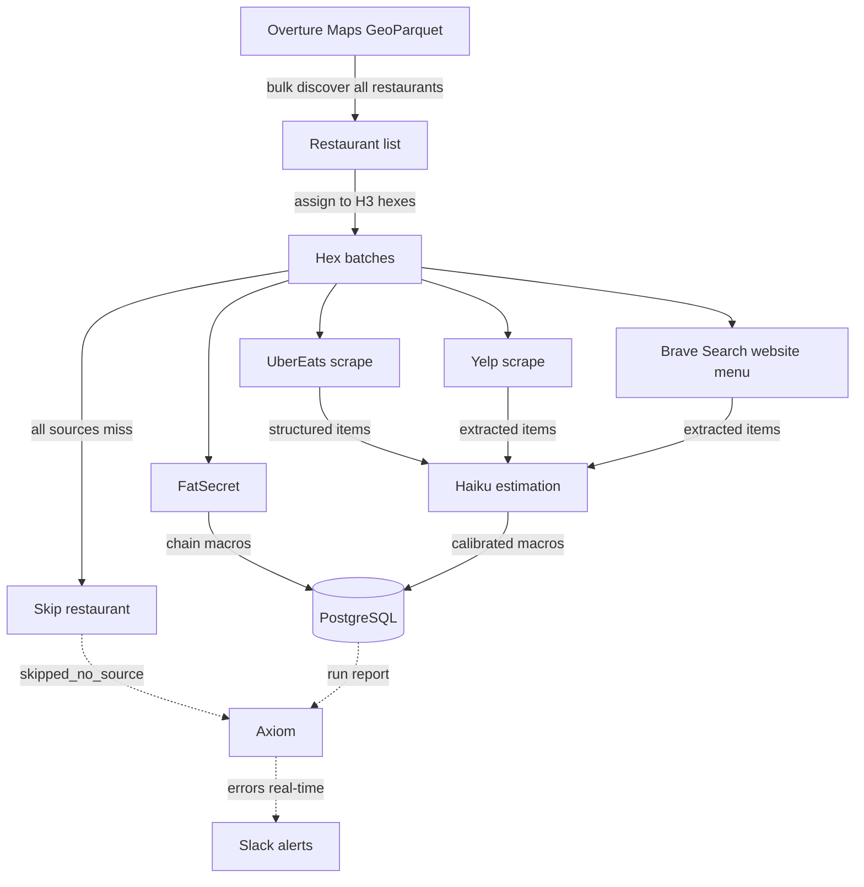

# Data Pipeline V3 — Spec

## Context

The preload pipeline discovers restaurants, scrapes menus, estimates macros, and persists to the DB. After auditing the current state (April 2026), we've identified systemic issues with data quality, estimation accuracy, pipeline reliability, and scalability.

This spec documents every known gap and proposes fixes, prioritized by impact.

**Key architecture change (April 2026):** Discovery switched from Google Places Nearby Search to **Overture Maps** (free GeoParquet on S3). Google Places had a hard cap of 20 results per API call with no pagination, making it fundamentally insufficient for data completeness at scale. Overture Maps returns every restaurant in a metro via a single DuckDB query — no API key, no rate limits, no result cap. Validated: 17K restaurants in central LA, 14.7K in Manhattan, with full address/phone/website/category data from Foursquare, Meta, Microsoft, and OSM sources.

---

## Design Principles

### 1. Hex-Level Checkpointing
Restaurants are discovered in bulk via Overture Maps, then assigned to H3 hex cells for processing. Each hex is an atomic unit: process all restaurants in memory, then batch-persist to DB and mark the hex as completed. **If the pipeline crashes, it resumes from the first incomplete hex — no work is repeated for completed hexes, and no partial data reaches the DB.** This is the core resilience mechanism.

### 2. Failure Handling & Resilience
Every external call (UberEats, Brave Search, Haiku, Firecrawl) can fail transiently. The pipeline retries with backoff, falls through to alternative sources, and never destroys good data because a re-fetch failed. Transactional persistence ensures partial writes don't corrupt the DB. A failed restaurant should degrade gracefully (fewer items, lower quality source) rather than crash the run.

### 3. Scalability & Performance
The pipeline must scale from 20 to 1,000,000 restaurants without architectural changes. Discovery scales linearly via Overture Maps bbox queries. Menu processing is parallelized with per-service concurrency limits. Rate limits are respected via semaphores and delays, not by running slowly. The target is: **25K restaurants in under 4 hours on a single machine.** URL discovery is cached so subsequent runs are 10x faster.

### 4. Estimation Accuracy
Macro estimates are the core product value. Haiku systematically underestimates restaurant portions, especially cooking fats (~23% under) and carbs (~7% under). Post-hoc calibration corrects for this. Accuracy is measured via eval-v2 (automated prompt lab with 8+ indie restaurant test cases, 50+ runs per config). Target: **<10% average calorie error**.

### 5. Data Quality
Every item in the DB must be real food with plausible macros. Non-food items (merchandise, utensils, condiments) are filtered before persistence. HTML entities are decoded. Macro math is validated (cal ≈ P×4 + C×4 + F×9 ± 20%). Items from mismatched restaurants are rejected via name validation. Source quality is tracked per item.

### 6. Cost Efficiency
External API costs are minimized through free discovery (Overture Maps), caching (URL cache, sitemap index), incremental updates (skip recently-scraped restaurants), and source prioritization (free sources first: FatSecret → UE → cached URLs, then paid: Brave Search → Firecrawl). Target: **<$10 per incremental refresh of 25K restaurants** after initial population.

### 7. Observability
Every pipeline run produces structured logs: per-restaurant source, item count, previous item count, errors, duration, cost. Regressions are detected by comparing current vs previous item counts. A summary report shows source breakdown, error rates, and total cost. Alerts fire when a run degrades >20% of restaurants.

### 8. Evals
Estimation accuracy is continuously measured, not assumed. The eval-v2 system tests prompt variants and calibration strategies against hand-curated indie restaurant cases with expected macros. New prompt ideas, model changes, or calibration adjustments are eval'd before shipping. Target: every accuracy change has a measured delta with 50+ run statistical significance.

---

## Current Architecture



**Source priority:** FatSecret → UberEats → Yelp → Brave Search (website menu) → skip

If all sources miss, the restaurant is **skipped entirely** — no fake items are persisted. The old "name-only" fallback (Haiku guessing from restaurant name alone) has been removed. A skipped restaurant is flagged as `skipped_no_source` in metrics.

**Current stats (April 2026):** 22 restaurants, 268 items, ~13.5% avg macro estimation error on eval cases.

---

## Deep Dive: Discovery — Overture Maps

### Why Overture Maps

Google Places Nearby Search has a hard cap of 20 results per API call. Testing confirmed there is no pagination support in v1. In dense areas (Hollywood, Koreatown, DTLA), a single hex can have 100-350+ restaurants — Google Places misses 80%+ of them. This is a fundamental data completeness blocker.

**Overture Maps** is a free, open dataset combining POI data from Foursquare, Meta, Microsoft, and OpenStreetMap. Data is published as GeoParquet files on S3, queryable via DuckDB.

### Validation results (April 2026)

| Area | Bbox size | Overture restaurant POIs | Google Places cap |
|---|---|---|---|
| Central LA metro | ~40km × 28km | **~19,200** (ILIKE pattern) | 20 per call |
| NYC Manhattan | ~9km × 11km | **14,768** | 20 per call |
| Chicago downtown | ~7km × 7km | **3,129** | 20 per call |
| SF core | ~5km × 4.5km | **3,029** | 20 per call |
| Hollywood (2km²) | ~2km × 2km | **359** | 20 per call |
| Silver Lake (2km²) | ~2km × 2km | **118** | 20 per call |

### Data fields available

| Overture field | Maps to | Quality |
|---|---|---|
| `names.primary` | `name` | High — commercial sources |
| `addresses[].freeform/locality/postcode/region` | `address` | Full street + city + zip + state |
| `geometry` (point) | `lat`, `lng` | Precise coordinates |
| `id` (UUID) | `externalPlaceId` | Stable across releases |
| `categories.primary + alternate` | `cuisineTags` | Granular (28 restaurant subcategories observed) |
| `websites[]` | used for menu discovery | Available for many POIs |
| `phones[]` | — | Available but not currently used |
| `brand.names.primary` | `chainFlag` | Present for chains — reliable chain detection |
| `sources[].dataset` | `source` | Foursquare, Meta, Microsoft, OSM |
| `confidence` | — | 0-1 score, useful for filtering |

**Not available in Overture:** rating, userRatingCount, priceLevel, photos. These are deferred — not needed for core macro-aware discovery. Can be added later via Yelp Fusion API (free tier) or user-generated reviews.

### Discovery query

```sql
LOAD spatial; LOAD httpfs;
SET s3_region = 'us-west-2';

SELECT
  id,
  names.primary as name,
  categories.primary as category,
  categories.alternate as alt_categories,
  addresses[1].freeform as address,
  addresses[1].locality as city,
  addresses[1].postcode as zip,
  addresses[1].region as state,
  websites[1] as website,
  phones[1] as phone,
  brand.names.primary as brand_name,
  confidence,
  ST_Y(geometry)::DOUBLE as lat,
  ST_X(geometry)::DOUBLE as lng
FROM read_parquet(
  's3://overturemaps-us-west-2/release/{LATEST}/theme=places/type=place/*',
  filename=true, hive_partitioning=1)
WHERE
  bbox.xmin BETWEEN {west} AND {east}
  AND bbox.ymin BETWEEN {south} AND {north}
  AND (
    -- Pattern catches all *_restaurant variants automatically
    -- (fast_food_restaurant, chicken_restaurant, vegan_restaurant, etc.)
    (categories.primary ILIKE '%restaurant%'
     AND categories.primary NOT LIKE '%equipment%'
     AND categories.primary NOT LIKE '%wholesale%')
    -- Explicit list for non-restaurant food places
    OR categories.primary IN (
      'cafe', 'coffee_shop', 'bakery', 'diner', 'steakhouse',
      'sandwich_shop', 'ice_cream_shop', 'juice_bar', 'dessert_shop',
      'donuts', 'desserts', 'food_truck', 'bubble_tea', 'tea_room',
      'bar', 'cocktail_bar', 'wine_bar', 'gastropub', 'pub', 'lounge'
    )
  );
```

### Implementation

Discovery downloads Overture data to a local parquet cache, then each hex queries that cache. Only one hex of data is in memory at a time.

```typescript
// 1. Download Overture data for metro to local parquet cache
//    LA metro: ~19K rows → ~2MB file, ~30s download
//    National: ~1M rows → ~100MB file, ~5-10 min download
const cachePath = "scripts/cache/overture-discovery.parquet";
// Cache freshness checks: file age < 7 days AND bbox matches sidecar metadata
// A .meta.json sidecar stores the bbox used for download — prevents
// reusing a small test bbox cache for full LA queries
if (!isCacheFresh(cachePath, boundingBox)) {
  await downloadOvertureToParquet(boundingBox, cachePath);
  writeCacheMeta(cachePath, boundingBox);  // bbox sidecar
}

// 2. Generate hex grid
const hexIds = polygonToCells(metroPolygon, 7);  // ~100 hexes for LA

// 3. Process hex by hex — only one hex in memory at a time
for (const hexId of hexIds) {
  if (await isHexComplete(hexId, runId)) continue;  // resume

  // Query LOCAL parquet for this hex's bbox — instant (0.03s)
  const boundary = cellToBoundary(hexId);
  const restaurants = await queryLocalParquet(cachePath, boundary);

  // Process: fetch menus → estimate macros → persist + checkpoint
  await processHex(hexId, restaurants);
  // All hex data freed after persist
}

// 4. Cleanup (optional — cache is reusable for subsequent runs)
```

**Memory model:** Only one hex of data in memory at any time. The local parquet file is the intermediate store — downloaded once from S3, queried per hex (instant), reused across runs, cheap to regenerate if lost.

**Measured sizes:**

| Scope | Parquet file | S3 download | Per-hex query |
|---|---|---|---|
| LA metro (~19K rows) | ~2MB | ~30s | 0.03s |
| National (~1M rows) | ~100MB | ~5-10 min | 0.03s |

**No deduplication needed** — Overture returns each POI exactly once (unlike overlapping radius queries).

---

## Deep Dive: Hex-Level Checkpointing

The pipeline must survive crashes and resume without wasting completed work. At scale — 25K restaurants across ~100 hex cells, ~4 hours total — a crash at hour 2 should not restart from zero.

### Hex grid algorithm

We use [Uber's H3](https://h3geo.org/) hierarchical hex grid system (`h3-js` npm package) to assign restaurants to processing batches.

**Why H3:**
- Deterministic — same inputs always produce same hex IDs (critical for checkpoint resumability)
- Hierarchical — resolution can be tuned: res 7 (~5.16 km² per hex) for dense urban, res 6 (~36.13 km²) for suburban
- Geographic locality — restaurants in the same neighborhood are processed together
- Industry standard — well-maintained, used by Uber, Foursquare, etc.

**Restaurant-to-hex assignment:**

```typescript
import { latLngToCell } from "h3-js";

// After Overture discovery, assign each restaurant to its hex
for (const restaurant of allRestaurants) {
  const hexId = latLngToCell(restaurant.lat, restaurant.lng, 7);
  // bucket into hex groups for processing
}
```

**Resolution choice:**

| H3 Resolution | Hex area | Restaurants per hex (LA dense) | Hexes for LA metro |
|---|---|---|---|
| 6 | 36.13 km² | ~1,500 (too much memory) | ~15 |
| **7** | **5.16 km²** | **~150-350 (good batch size)** | **~100** |
| 8 | 0.74 km² | ~20-50 (too many hexes) | ~700 |

**Resolution 7** is the sweet spot: each hex contains a manageable batch of restaurants (~150-350 in dense LA, fewer in suburbs), and ~100 hexes covers the LA metro.

### How it works

The hex cell is the atomic unit of work. For each hex:

1. **Process** — for each restaurant in this hex: resolve URL → fetch menu → estimate macros. All results held in memory (~2MB per hex).
2. **Persist** — batch-write all restaurants + items + macros to DB in one transaction
3. **Checkpoint** — mark hex as completed in the same DB transaction

**Nothing reaches the DB until the entire hex is done.** If the pipeline crashes mid-hex, the DB has no partial data for that hex. On restart, the hex is simply reprocessed from scratch.

### Checkpoint storage

Checkpoint lives in the DB (not a file) for atomicity with data persistence:

```prisma
model PipelineCompletedHex {
  id        String   @id @default(cuid())
  runId     String
  hexId     String
  count     Int      // restaurants persisted in this hex
  createdAt DateTime @default(now())

  @@unique([runId, hexId])
}
```

The hex data persist and checkpoint write happen in the **same DB transaction** — either both succeed or neither does. This eliminates the gap where data is written but checkpoint isn't (or vice versa).

### Resume behavior

```
1. Generate new runId (timestamp-based)
2. Discover all restaurants via Overture Maps
3. Assign to hex cells
4. For each hex:
   - Has PipelineCompletedHex for this runId? → skip (already done)
   - Otherwise → process → persist + checkpoint in one transaction
5. All hexes done → run complete
```

**Resume-by-default:** On startup, the pipeline queries `PipelineCompletedHex` for the most recent `runId` with fewer checkpoints than total hexes. If found, it resumes that run. Otherwise, it generates a new date-based `runId` (`run-YYYY-MM-DD`). This is midnight-safe: a crash at 11:59 PM + rerun at 12:04 AM resumes the same run. Pass `--run-id <id>` to override.

### Walkthrough: crash at hour 2 of a 4-hour run

```
Setup: 100 hexes, 25K restaurants, ~2.5 min per hex

Hour 0:00   Pipeline starts, runId = "2026-04-14T10:30:00Z"
Hour 0:02   hex_001 done → DB: data + checkpoint in one txn
Hour 0:05   hex_002 done → DB: data + checkpoint in one txn
...
Hour 1:58   hex_049 done → DB: 49 checkpoints
Hour 2:00   hex_050 processing, 140/200 restaurants done in memory → CRASH
            (nothing from hex_050 was written to DB)

DB state: hex_001–049 fully persisted + checkpointed

Hour 2:01   Restart → auto-detects incomplete run, resumes runId
  hex_001–049: checkpointed → skip (instant, 0 API calls)
  hex_050: no checkpoint → process all 200 → persist + checkpoint
  hex_051–100: no checkpoint → process normally

Total restart time: ~2 hours 2 min
Wasted work: ~2 min (reprocessing hex_050)
Wasted cost: ~$1 (API calls for 200 restaurants)
```

### Why hex-level, not per-restaurant

| | Per hex | Per restaurant |
|---|---|---|
| Checkpoint writes | ~100 | ~25,000 |
| Worst-case waste on crash | ~2 min | ~6 sec |
| DB state on crash | Clean — no partial data | Partial — need skip logic |
| Complexity | Simple — one list of done hexes | Need to track per-restaurant status + handle partial DB state |

2 minutes of worst-case waste is not worth the complexity of per-restaurant tracking. The clean DB guarantee (hex either fully persisted or not at all) is a major simplification.

---

## Deep Dive: Failure Handling & Resilience

### Retry on Transient Failures

**Issue:** A single failed UE fetch or Haiku call causes the restaurant to fall to a lower-quality source. Rate limits, network blips, and API hiccups are common.

**Fix:** Retry up to 2 times with exponential backoff (1s, 3s) for:
- UE HTML fetch (rate limiting, bot defense)
- Haiku API calls (rate limiting, timeout)
- Firecrawl API calls (rate limiting, credits)

### Transactional Persistence

**Issue:** `persistItems()` deletes all existing items, then inserts new ones. If insert fails (Haiku error, DB error), the restaurant has 0 items.

**Fix:** Wrap delete + insert in a DB transaction. Rollback on failure.

### Quality Gate Before Persist

**Issue:** Bad data gets persisted without validation. Non-food items, HTML entities, wrong restaurants — all reach the DB.

**Fix:** Validation layer between estimation and persistence:

```typescript
function validateItems(items: MenuItem[], macros: MacroData[]): { valid: ValidatedItem[], rejected: RejectedItem[] } {
  // 1. Reject non-food items (merchandise, utensils)
  // 2. Reject items with invalid macros (0 cal food, math mismatch)
  // 3. Decode HTML entities
  // 4. Reject items with name < 3 chars or > 200 chars
  // 5. Reject items where name looks like a review or description
}
```

### Regression Detection

**Issue:** A bad scrape can replace 55 good items with 1 low-quality item. No way to detect this.

**Fix:** Before deleting, compare new item count to existing:
- If new count < existing * 0.5 AND existing > 5: **skip persist**, log warning
- If new count = 1 AND existing > 5: **skip persist**
- Override with `--force` flag

### Yelp Slug Validation

**Issue:** `buildYelpSlug()` constructs a URL like `yelp.com/menu/bacari-silverlake-los-angeles`. If the slug is wrong, Firecrawl scrapes the wrong page (or a 404), and Haiku might extract garbage.

**Fix:**
1. Validate that scraped markdown contains menu-like content (prices, item patterns)
2. Check restaurant name in the page matches expected name
3. Consider using Yelp Fusion API for business lookup first (free, 5000/day), then construct menu URL from the confirmed alias

### UE Rate Limiting

**Issue:** UberEats rate-limits after ~20 rapid requests. No backoff logic.

**Fix:** Add 500ms delay between UE fetches. On 403/empty response, backoff to 2s and retry once.

### Firecrawl Credit Exhaustion

**Issue:** Firecrawl returns HTTP 402 when credits are exhausted. Previously this was swallowed silently (`return null` with no logging), causing the entire Firecrawl fallback path to fail without any indication.

**Fix:** All Firecrawl functions log HTTP status + response body on non-OK responses. The observability report includes Firecrawl error counts. Alerts fire on sustained 402s.

---

## Deep Dive: Scalability & Performance

### Incremental Updates

**Current:** Full re-scrape every run. At 20 restaurants, takes 3 min. At 2,000, would take 5+ hours and cost $100+ in API calls.

**Fix:** Add `lastScrapedAt` and `menuHash` fields to Restaurant model. Skip restaurants scraped within N days unless `--force` flag. Compute hash of menu items to detect actual changes.

### Parallelism

**Current:** 5 concurrent restaurants, sequential Haiku chunks within each.

**Fix:**
- Increase restaurant concurrency to 10-15
- Parallelize Haiku chunks within a restaurant (3-4 concurrent)
- Per-API semaphores: UE fetch (5 concurrent, 500ms delay), Haiku (10-20 concurrent), Brave Search (15 concurrent), Firecrawl (3 concurrent)

### Discovery at Scale

**Current:** Overture Maps bulk download via DuckDB. One query per metro area returns all restaurants.

**Scale projections:**

| Metro | Overture POIs | Query time | Cost |
|---|---|---|---|
| LA metro | ~19,000 | ~30 sec | $0 |
| NYC | ~15,000 | ~30 sec | $0 |
| Top 10 US metros | ~100,000 | ~5 min | $0 |
| National (all US) | ~1,000,000 | ~30 min | $0 |

Discovery is no longer a bottleneck or cost center. The pipeline can discover every restaurant in America for free.

### URL Discovery — Replace Firecrawl with Brave Search

**Issue:** Firecrawl search is the primary URL discovery method for finding UberEats store pages. It's slow (10 RPM = 29 hours for 17,500 restaurants), expensive ($105), and inconsistent (returns different results across runs).

**Tested alternatives:**

| Service | QPS | Cost/1,000 | Free Tier | UE URL Hit Rate | Status |
|---------|-----|-----------|-----------|----------------|--------|
| Firecrawl (current) | 0.17 | $6 | Credits | ~70% | Slow, inconsistent |
| Brave Search | 20 | $5 | 2,000/month | ~90% | **Validated** — 5/5 correct in testing |
| Exa | 10 | $7 | 1,000/month | ~85% est | Not tested |
| Serper | 50 | $5 | 2,500 credits | ~90% est | Not tested |

**Decision:** Replace Firecrawl search with **Brave Search API** for URL discovery.
- 120x faster (20 QPS vs 0.17 QPS)
- Slightly cheaper ($5 vs $6 per 1,000)
- More reliable (consistent results)
- Validated: tested against 5 restaurants, found correct UE URL for all 4 that exist on UE, correctly returned no UE result for the 1 that doesn't

**Implementation:**
1. New `BraveSearchSource` in `apps/api/services/` — query `"{name} uber eats {city}"`, filter results for `ubereats.com/store/` URLs
2. Replace Firecrawl `discoverUberEatsUrl()` with Brave Search in `UberEatsSource.lookup()`
3. Fallback chain: URL cache → Brave Search → UE sitemap (exact match only)
4. Cache discovered URLs as before

### Website Menu Fallback — Replace Firecrawl Search with Brave

**Issue:** The final fallback for restaurants not on UE/Yelp uses Firecrawl search to find a menu page on the restaurant's website. Same problems as UE URL discovery — slow, expensive, inconsistent.

**Fix:** Replace with Brave Search: query `"{name} {city} menu"`, take the top result that matches the restaurant's domain or contains menu-like content. Brave is already integrated for UE URL discovery — reuse the same service.

**Fallback chain (updated):**
```
FatSecret → UberEats → Yelp → Brave Search (website menu) → skip
```

Firecrawl is retained only for scraping a known URL (not for search/discovery).

**At 17,500 restaurants:**
- Brave Search: 17,500 queries at 20 QPS = **15 minutes**, $78
- vs Firecrawl: 29 hours, $105

### Cost & Time Projections (25K restaurants)

**First run (cold start):**

| Step | Method | Volume | Cost | Time |
|------|--------|--------|------|------|
| Discover | Overture Maps (DuckDB) | 1 query | **$0** | 30 sec |
| URL discovery | Brave Search | 17,500 queries | $78 | 15 min |
| Menu fetch (UE) | Raw HTTP + markdown parse | ~12,000 fetches | $0 | 40 min |
| Menu fetch (Yelp) | Raw HTTP or Firecrawl | ~4,000 fetches | $0-12 | 13-40 min |
| Menu fetch (Firecrawl) | Firecrawl scrape | ~1,500 fetches | $4.50 | 25 min |
| Macro estimation | Haiku (chunked) | ~10,500 calls | $42-84 | 3 hours @ 60 RPM |
| **Total first run** | | | **$125-179** | **~4.5 hours** |

With Haiku tier 4 (4,000 RPM): **~1.5 hours total**.

**Subsequent runs (URL cache populated, incremental):**

| Step | Method | Volume | Cost | Time |
|------|--------|--------|------|------|
| Discover | Overture Maps | 1 query | $0 | 30 sec |
| URL discovery | **All cached** | 0 | **$0** | 0 |
| Menu fetch | Only changed restaurants (~10%) | ~2,500 | $0-2 | 15 min |
| Macro estimation | Only changed (~10%) | ~1,050 calls | $4-8 | 18 min |
| **Total incremental** | | | **$4-10** | **~30 min** |

---

## Deep Dive: Estimation Accuracy

### Current State
- **Production prompt:** name-only (no description) via Haiku
- **Post-hoc calibration:** P: 1.0x, C: 1.08x, F: 1.3x
- **Avg error:** ~13.5% on 8 indie restaurant test cases (eval-v2, 50 runs)
- **Systematic bias:** Haiku underestimates cooking fats by 23%, carbs by 7%, protein is accurate

### Why Haiku Underestimates
Haiku's training data is dominated by home-cooking recipes and USDA standard servings. Restaurant portions are 2-3x larger for starches and 3-4x more cooking fat. The model doesn't have this calibration.

Key insight: Haiku knows ingredient macros well (per 100g). The gap is **portion estimation** — how much of each ingredient is on the plate.

### Approaches Tested (Eval-V2)

| Approach | Avg Error | Verdict |
|----------|-----------|---------|
| Production (current prompt + desc) | 24.2% | Descriptions hurt |
| Name-only | 18.3% | Best prompt |
| Name-only + flat 1.17x | 15.2% | Good but overcorrects some |
| Name-only + C:1.08x F:1.3x | **13.5%** | **Best** — shipped |
| Soft nudge ("portions are bigger") | 31.0% | Overcorrects |
| Hard multipliers in prompt (2.5-3x) | 30.7% | Way overcorrects |
| Decompose into components + USDA | 60-154% | Haiku bad at gram weights |
| Few-shot examples | 20.6% | Biased toward example food types |
| Sonnet (bigger model) | 21.3% | More reasoning ≠ better calibration |
| Two-pass (reason then estimate) | 31.6% | Worst — verbose overthinking |
| Images (dish photo) | 20.1% | Inconclusive (only 1 case had image) |

### Alternative Approaches — Feasibility & Impact

#### A. Train a Fine-Tuned Model
**Concept:** Fine-tune a small model (Haiku or open-source) on restaurant nutrition data specifically.
**Data needed:** ~1,000-5,000 labeled examples (restaurant dish name → actual macros).
**Where to get data:**
- Chain restaurants with published nutrition (we have ~500 from FatSecret)
- Calorie-counting apps (MFP has user-submitted restaurant entries, noisy)
- Commission nutritionist analysis of ~50 local dishes ($500-1000)

**Feasibility:** Medium. Anthropic supports fine-tuning. The bottleneck is labeled data quality. Chain data is plentiful but may not generalize to indie restaurants (different portion patterns).
**Expected impact:** Could get to <10% error if training data is representative. Risk: overfitting to chains.
**Cost:** Fine-tuning ~$50-100. Data collection $500-2000.
**Timeline:** 2-4 weeks.

#### B. Vision-Based Estimation (Dish Photos)
**Concept:** Send the dish photo to a vision model to estimate portion size, then combine with text-based estimation.
**Data source:** UberEats, DoorDash, Yelp all have dish photos for many items.
**Challenge:** Photo availability varies. Only ~30% of indie items have photos on UE. Also, photos are styled/angled for marketing — may not represent actual portion.

**Feasibility:** High for implementation, uncertain for accuracy. Anthropic's vision models can analyze food photos. The question is whether photos actually improve portion estimation vs text-only.
**Expected impact:** Unknown. Our single test case was inconclusive. Could be +5% or +0%.
**Cost:** ~$0.003 per image (Haiku vision). ~$3 per 1,000 items.
**Timeline:** 1 week to integrate, 2 weeks to evaluate properly.

**Recommended test:** Run eval-v2 with images for 20+ items that have UE photos. If image+text beats text-only by >3%, invest further.

#### C. Retrieval-Augmented Estimation (RAG)
**Concept:** For each indie dish, find the 3-5 most similar dishes with known macros (from chain data or USDA) and include them as reference points in the prompt.
**Data source:** Our existing FatSecret data (~500 chain items with published macros) + USDA FoodData Central (~7,000 restaurant entries, free).

**Feasibility:** Medium. Need embedding index for similarity search. Could use USDA's free API for dynamic lookup.
**Expected impact:** Potentially high — anchoring to real data should beat the model guessing from training data. But untested.
**Cost:** Embedding: ~$0.0001/query. USDA API: free.
**Timeline:** 1-2 weeks.

#### D. Calibration from Chain Data
**Concept:** Run Haiku's name-only estimation against all chain items with published macros. Compute the signed error per dish category (pasta, burger, bowl, etc.). Apply category-specific correction factors to indie estimates.

**Feasibility:** High. We have the data and the eval framework. Just need to categorize dishes and compute per-category multipliers.
**Expected impact:** Should beat our current blanket multiplier. Italian pasta might get C:1.15x F:1.4x while fried rice gets C:1.05x F:1.1x.
**Cost:** ~$0.50 in Haiku calls to estimate all 500 chain items.
**Timeline:** 1-2 days.
**Risk:** Chain portions ≠ indie portions. Chick-fil-A sandwich calibration may not transfer to indie sandwich shops.

#### E. Hybrid: Haiku Estimate + Deterministic Adjustment
**Concept:** Haiku estimates the base dish type and composition. Code applies deterministic adjustments based on:
- `item_price / avg_price` (relative position on menu)
- Cuisine type (Italian → +fat, Thai → +oil, etc.)
- Cooking method keywords in name/description (fried → +fat, grilled → baseline)

**Feasibility:** High. All signals available in current data.
**Expected impact:** Moderate. The blanket multiplier already gives ~5% improvement. Per-cuisine/price adjustments could add another 2-3%.
**Cost:** Zero runtime cost — pure code logic.
**Timeline:** 2-3 days to build, 1 week to tune with more eval cases.

#### F. Multi-Source Consensus
**Concept:** For each item, get estimates from 2-3 different approaches (Haiku name-only, Haiku with description, decomposition) and use median or weighted average.
**Tested:** Ensemble (name-only + decompose avg) scored 39.2% — worse than name-only alone. Decompose overestimates too much to average out.
**Verdict:** Not viable with current decomposition quality. Could revisit if decomposition improves.

### Recommended Accuracy Roadmap

1. **Now:** Ship current calibration (C:1.08x, F:1.3x) — done
2. **Next:** Category-specific calibration from chain data (approach D) — 1-2 days
3. **Then:** Vision-based estimation eval with 20+ images (approach B) — 1-2 weeks
4. **Later:** RAG from USDA + chain data (approach C) — 1-2 weeks
5. **If needed:** Fine-tuned model (approach A) — 2-4 weeks

---

## Deep Dive: Data Quality

### HTML Entities in Item Names
**Status:** Fix committed, needs rerun.
**Issue:** 67 items have `&amp;`, `&#39;` etc. in names/descriptions. Source: UE and FatSecret.
**Fix:** `decodeHtml()` added to `persistItems()`. Rerun preload to clean.

### Non-Food Items Persisted
**Issue:** Pine & Crane has T-shirts, hats, hoodies, mugs, chopsticks, forks, napkins stored as menu items with 0 cal estimates. Users see these in search results.
**Scope:** ~10 items currently, will grow with more restaurants.
**Fix:** Item-level validation before persist — reject items matching non-food patterns:
- Merchandise: regex for `shirt|hoodie|hat|mug|bag|tote`
- Utensils: `chopstick|fork|spoon|knife|napkin|plate|bowl|straw|container`
- Zero-cal food items (not drinks): if `calories == 0` and not a beverage, reject

### Condiments as Standalone Items
**Issue:** Ketchup packets, mustard, individual sauce cups stored as menu items.
**Scope:** ~20 items (mostly FatSecret chains).
**Fix:** Filter items where `calories < 30` AND name matches condiment patterns (`packet|sauce cup|dressing packet`). Or: filter by FatSecret category if available.

### FatSecret Thin Coverage
**Issue:** Pollo Campero (6 items), Jollibee (6 items) — FatSecret returns fewer items than expected.
**Fix:** Flag in the observability report as `low_item_count` with source + count. Don't automatically fall through — some restaurants genuinely only have 6 items. Let the report surface these for manual review.

### Macro Math Mismatch
**Issue:** Jollibee Cheese Burger: 360 cal stated but `p*4 + c*4 + f*9 = 215`. FatSecret data error.
**Scope:** 10 items with >50 cal discrepancy.
**Fix:** Validation gate: if `|cal - (p*4 + c*4 + f*9)| > 20%`, flag item. For Haiku-estimated items, recalculate cal from macros (already done via calibration). For FatSecret items, trust their published cal and flag the macro breakdown as unreliable.

### Missing Prices
**Issue:** 577/1,648 items have null prices. FatSecret never provides prices. Yelp sometimes doesn't.
**Impact:** Price is used for portion-size inference in some prompts. Missing prices reduce estimation quality.
**Fix:** Flag count in observability report with breakdown by source (FatSecret vs UE vs Yelp vs website). For UE-sourced items, prices come from scraping (reliable). For Yelp/Firecrawl, extract price from markdown if present. For FatSecret chains, price data isn't critical since macros are already published.

### Missing Descriptions
**Issue:** 698/1,648 items missing descriptions. FatSecret (344 Chick-fil-A + 130 McDonald's) never has descriptions. Some UE items also lack them.
**Impact:** Eval shows descriptions can hurt accuracy (for indie items). For chains, descriptions don't matter since macros are published.
**Fix:** Low priority. Name-only estimation is competitive with description-based. Ignore.

---

## Deep Dive: Cost Efficiency

### Source Prioritization

Free sources are tried first, paid sources only as fallback:

1. **FatSecret** — free, official chain macros, no Haiku call needed
2. **UberEats** — free (raw HTTP scrape), structured items
3. **URL cache** — free, avoids re-discovery on subsequent runs
4. **Brave Search** — $5/1,000 queries, for URL discovery
5. **Firecrawl** — $3-6/1,000 scrapes, last resort for menu fetching

### Cost Projections by Scale

| Scale | Discovery | URL Discovery | Menu Fetch | Haiku | Total |
|-------|-----------|---------------|------------|-------|-------|
| 20 restaurants | $0 | ~$0.10 | ~$0 | ~$0.50 | ~$1 |
| 200 restaurants | $0 | ~$1 | ~$0 | ~$5 | ~$6 |
| 2,000 restaurants | $0 | ~$9 | ~$2 | ~$17 | ~$28 |
| 25,000 restaurants (LA) | $0 | ~$78 | ~$5-17 | ~$42-84 | **~$125-179** |
| 25,000 incremental | $0 | $0 (cached) | ~$0-2 | ~$4-8 | **~$4-10** |

Target: **<$200 first run, <$10 incremental refresh** for 25K restaurants. Incremental updates reduce ongoing cost by ~90%.

---

## Deep Dive: Observability

### Metrics as source of truth

The pipeline emits events to Axiom as it runs. **Axiom is the source of truth for observability** — not in-memory state. If the pipeline crashes at hour 2, events emitted up to that point are already persisted and queryable.

The run report is generated *from* Axiom events after the pipeline completes (or on-demand for crashed runs):

```bash
# Generate report for a specific run
npx tsx scripts/pipeline-report.ts --run-id "2026-04-13T10:30:00Z"

# Or latest run
npx tsx scripts/pipeline-report.ts --latest
```

This script queries Axiom, aggregates the events, and prints a clean summary. No in-memory accumulation needed.

### Event schemas

#### Restaurant event (one per restaurant, always emitted)

```typescript
interface RestaurantEvent {
  type: "restaurant";
  runId: string;
  hexId: string;
  name: string;
  overtureId: string;
  source: string;              // winning source: "fatsecret" | "ubereats" | "yelp" | "brave_website" | "none"
  status: string;              // "ok" | "skipped_no_source" | "skipped_haiku_failed" | "skipped_validation_empty" | "skipped_regression" | "skipped_db_error"
  itemCount: number;           // items persisted (0 for skipped)
  rejectedCount: number;       // items rejected by validation
  sourcesAttempted: string[];  // ["fatsecret", "ubereats", "yelp", "brave_website"]
  sourcesFailed: string[];     // ["ubereats", "yelp"] — misses, not errors
  nameMismatch: boolean;       // true if scraped name didn't match expected name (logged, not rejected)
  durationMs: number;
  _time: string;
}
```

**Misses vs errors:** A source "miss" (FatSecret has no match for an indie restaurant) is expected behavior — it goes in `sourcesFailed` on the restaurant event. An "error" (UE returned 403, Haiku timed out) is a breakage — it gets its own error event. This keeps the error stream clean for things that actually broke.

#### Error event (emitted immediately on failure)

```typescript
interface PipelineError {
  type: "error";
  runId: string;
  hexId: string;
  restaurant: string;
  overtureId: string;
  stage: "discovery" | "url_resolution" | "menu_fetch" | "macro_estimation" | "validation" | "persistence";
  source: string;              // "ubereats" | "haiku" | "firecrawl" | "brave" | "db" | "regression_guard"
  error: string;
  retryable: boolean;
  retriesAttempted: number;
  _time: string;
}
```

#### Cost checkpoint event (emitted per hex)

```typescript
interface CostCheckpoint {
  type: "cost_checkpoint";
  runId: string;
  hexId: string;
  hexesCompleted: number;
  hexesTotal: number;
  cumulativeCost: number;
  cumulativeCostBreakdown: {
    braveSearch: number;
    firecrawl: number;
    haiku: number;
  };
  _time: string;
}
```

#### Run event (emitted once at end, if pipeline completes)

```typescript
interface RunEvent {
  type: "run";
  runId: string;
  discoverySource: "overture";
  durationTotal: string;
  hexesTotal: number;
  hexesCompleted: number;
  restaurantsDiscovered: number;
  restaurantsPersisted: number;
  restaurantsFailed: number;
  itemsTotal: number;
  costTotal: number;
  _time: string;
}
```

The `run` event is a lightweight summary. Detailed breakdowns (source distribution, data quality flags, per-restaurant failures) are derived by querying the `restaurant` and `error` events for this `runId`.

### Report queries (pipeline-report.ts)

The report script runs these Axiom APL queries and formats the output:

```
# Coverage
['fitsy-pipeline'] | where runId == "..." and type == "restaurant" | summarize
  persisted = countif(status == "ok"),
  failed = countif(status != "ok"),
  total = count()

# Source breakdown
['fitsy-pipeline'] | where runId == "..." and type == "restaurant" and status == "ok"
  | summarize count() by source

# Source hit rates (misses)
['fitsy-pipeline'] | where runId == "..." and type == "restaurant"
  | mv-expand sourcesFailed
  | summarize miss_count = count() by sourcesFailed

# Errors by stage
['fitsy-pipeline'] | where runId == "..." and type == "error"
  | summarize count() by stage, source

# Name mismatches
['fitsy-pipeline'] | where runId == "..." and type == "restaurant" and nameMismatch == true
  | project name, source

# Cost
['fitsy-pipeline'] | where runId == "..." and type == "cost_checkpoint"
  | summarize max(cumulativeCost)

# Low item count
['fitsy-pipeline'] | where runId == "..." and type == "restaurant" and status == "ok" and itemCount < 10
  | project name, source, itemCount
```

### Axiom integration

[Axiom](https://axiom.co/) is a log/event platform with a generous free tier (500MB/day ingest, 30-day retention). Good fit for pipeline observability — we don't need a full APM tool, just structured event storage with query/dashboard support.

**Single dataset:** `fitsy-pipeline` (Axiom free tier limits writable datasets to 2; the other is used by Vercel). Events are distinguished by a `type` field:

| Event type | When emitted | Volume (25K run) |
|---|---|---|
| `type: "run"` | Once, after run completes | 1 event (the full report) |
| `type: "restaurant"` | Per restaurant, batched per hex | ~25K events |
| `type: "error"` | Immediately on failure | Varies — typically 50-500 per run |
| `type: "cost_checkpoint"` | After each hex completes | ~100 events |

Event schemas are defined above. All events are emitted to the single `fitsy-pipeline` dataset.

**Emission timing:**
- `restaurant` events: batched per hex (emitted after hex completes)
- `error` events: emitted immediately (real-time alerting)
- `cost_checkpoint` events: emitted per hex (mid-run cost monitoring)
- `run` event: emitted once at end (if pipeline completes; if not, reconstruct from other events)

**Implementation:**
```typescript
import { Axiom } from "@axiomhq/js";
const axiom = new Axiom({ token: process.env["AXIOM_TOKEN"] });
const DATASET = "fitsy-pipeline";

// Errors — emit immediately
function emitError(err: PipelineError) {
  axiom.ingest(DATASET, [err]);  // non-blocking, buffers internally
}

// After each hex: restaurant events + cost checkpoint
function emitHexResults(restaurants: RestaurantEvent[], costCheckpoint: CostCheckpoint) {
  axiom.ingest(DATASET, [...restaurants, costCheckpoint]);
}

// After run completes
function emitRunSummary(run: RunEvent) {
  axiom.ingest(DATASET, [run]);
}

// Flush before process exits
await axiom.flush();
```

**Cost:** Free tier covers us easily. 25K restaurant events + ~500 errors + ~100 cost checkpoints + 1 run summary = ~5MB per run.

**Alerts (already configured in Axiom):**

4 monitors are live, created via Axiom REST API. All alert to Slack.

| Alert | Type | APL Query | Fires when |
|---|---|---|---|
| Error spike | Threshold (5 min) | `['fitsy-pipeline'] \| where type == "error" \| summarize count()` | > 50 errors in 5 min window |
| Run failed | MatchEvent | `['fitsy-pipeline'] \| where type == "run" and restaurantsFailed > restaurantsPersisted` | Instantly on matching event |
| Cost overrun | MatchEvent | `['fitsy-pipeline'] \| where type == "cost_checkpoint" and cumulativeCost > 200` | Instantly, mid-run (~2 min lag) |
| Zero output | MatchEvent | `['fitsy-pipeline'] \| where type == "run" and restaurantsPersisted == 0` | Instantly on matching event |

**Dashboards (build in Axiom UI):**
- Run history: cost, duration, restaurant count over time
- Source distribution: pie chart of source breakdown per run
- Data quality trends: missing prices, low item counts, macro mismatches per run
- Failure rate by source: which sources are flakiest
- **Live error stream:** real-time errors during a running pipeline, filterable by stage/source

---

## Deep Dive: Evals

*(To be expanded. Current eval system: eval-v2 with 8 indie test cases, 50 runs per config, automated prompt lab. Target: CI-integrated eval runs, regression detection on prompt changes, expanded test corpus.)*

---

## Implementation Tasks

### Wave 1 — Data integrity (ship before next preload run)

| # | Task | What to do | Effort |
|---|------|-----------|--------|
| 1.1 | Non-food item filter | Add `validateItems()` with merchandise/utensil/zero-cal regex filters. Reject before persist. | 1 hr |
| 1.2 | Condiment filter | Filter items `cal < 30` AND name matches condiment patterns. | 30 min |
| 1.3 | Transaction safety on persist | Wrap `persistItems()` delete+insert in `prisma.$transaction`. Rollback on failure. | 30 min |
| 1.4 | HTML entity decode | Rerun preload to apply existing `decodeHtml()` fix to 67 items. | 10 min |
| 1.5 | Regression detection | Before persist: if new item count < 50% of existing and existing > 5, skip + log warning. `--force` override. | 1 hr |

### Wave 2 — Reliability & observability

| # | Task | What to do | Effort |
|---|------|-----------|--------|
| 2.1 | Retry with backoff | Wrap UE fetch, Haiku calls, Firecrawl scrape in retry (2 attempts, 1s/3s backoff). | 2 hrs |
| 2.2 | UE rate limiting | Add 500ms delay between UE fetches. On 403: backoff to 2s, retry once. | 30 min |
| 2.3 | Yelp slug validation | Check scraped markdown contains menu-like content + restaurant name match. | 1 hr |
| 2.4 | Observability report | Implement `PipelineReport` interface. Collect stats during run, write JSON to `scripts/cache/reports/`. | 3 hrs |
| 2.5 | Axiom integration | Emit `run`, `restaurant`, `error` events to `fitsy-pipeline` dataset. Errors emitted real-time. Flush on exit. | 2 hrs |
| 2.6 | Macro math validation | Flag items where `\|cal - (p*4 + c*4 + f*9)\| > 20%`. Include in report. | 1 hr |

### Wave 3 — Source improvements

| # | Task | What to do | Effort |
|---|------|-----------|--------|
| 3.1 | Brave Search for UE URL discovery | New `BraveSearchSource`. Query `"{name} uber eats {city}"`, filter for `ubereats.com/store/` URLs. Replace Firecrawl search in `UberEatsSource.lookup()`. | 2 hrs |
| 3.2 | Brave Search for website menu fallback | Query `"{name} {city} menu"`, take top result matching restaurant domain. Replace Firecrawl search as final fallback. | 1 hr |
| 3.3 | Update fallback chain | `FatSecret → UberEats → Yelp → Brave (website) → skip`. Firecrawl retained for scraping known URLs only. | 30 min |

### Wave 4 — Scale prep

| # | Task | What to do | Effort |
|---|------|-----------|--------|
| 4.1 | Overture Maps discovery | Implement `discoverFromOverture()` using DuckDB. Bbox query → restaurant list with name, address, lat/lng, category, website, overtureId. Replace Google Places discovery. | 1 day |
| 4.2 | Hex assignment | Assign Overture-discovered restaurants to H3 res 7 cells via `latLngToCell()`. Group into processing batches. | 2 hrs |
| 4.3 | Hex-level checkpointing (DB) | `PipelineCompletedHex` table. Persist data + checkpoint in single DB transaction. Auto-resume via `findIncompleteRunId()`. | 1 day |
| 4.4 | Incremental updates | Add `lastScrapedAt` + `menuHash` to Restaurant. Skip if scraped within N days. `--force` override. | 1 day |
| 4.5 | Parallelism tuning | Increase concurrency to 10-15 restaurants. Per-API semaphores (UE: 5, Haiku: 20, Brave: 15, Firecrawl: 3). | 3 hrs |
| 4.6 | Remove Google Places | ~~Done~~ — deleted `googlePlacesService.ts` + tests, removed `GOOGLE_PLACES_API_KEY` from env vars. | ~~2 hrs~~ |

### Wave 5 — Accuracy (when time permits)

| # | Task | What to do | Effort |
|---|------|-----------|--------|
| 5.1 | Category-specific calibration | Run Haiku against all FatSecret chain items. Compute per-category (pasta, burger, etc.) correction factors. Replace blanket multiplier. | 1-2 days |
| 5.2 | Vision-based estimation eval | Run eval-v2 with dish photos for 20+ items. Measure if image+text beats text-only by >3%. | 1-2 weeks |
| 5.3 | RAG from USDA + chain data | Embedding index for similar-dish lookup. Include 3-5 reference items in prompt. | 1-2 weeks |
| 5.4 | Fine-tuned model | Only if 5.1-5.3 don't reach <10% error. Fine-tune Haiku on chain nutrition data. | 2-4 weeks |

### Dependencies

```
Wave 1 → Wave 2 (need clean data before obs report is meaningful)
Wave 2 → Wave 3 (need obs before changing sources, so we can measure impact)
Wave 3 → Wave 4 (need Brave before scaling, since Firecrawl can't handle 25K)
Wave 4 → independent of Wave 5
Wave 5 → can start any time after Wave 1
```

---

## Configuration

All configuration via environment variables. No hardcoded secrets.

| Variable | Purpose | Required |
|---|---|---|
| `POSTGRES_PRISMA_URL` | Prisma connection string (pooled) | Yes |
| `POSTGRES_URL_NON_POOLING` | Prisma direct connection (migrations) | Yes |
| `ANTHROPIC_API_KEY` | Claude Haiku API | Yes |
| `FIRECRAWL_API_KEY` | Firecrawl scrape (known URLs only) | Yes |
| `BRAVE_API_KEY` | Brave Search for URL discovery | Yes (after Wave 3) |
| `AXIOM_TOKEN` | Pipeline observability events | Yes (after Wave 2) |
| `FATSECRET_KEY` / `FATSECRET_SECRET` | FatSecret chain macro lookups | Yes |
| `TARGET_BBOX` | Bounding box for Overture discovery (default: LA metro) | No |
| `H3_RESOLUTION` | Hex resolution for processing batches (default: 7) | No |
| `MAX_RESTAURANTS` | Max restaurants to process (default: unlimited) | No |
