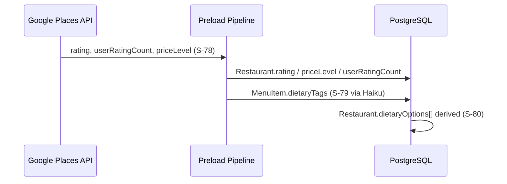

# S-77: Schema Migration — Rating, Price, Dietary Tags

## Summary

Add enrichment fields to `Restaurant` and `MenuItem` to support filter-based discovery (S-81) and dietary tag extraction (S-79).

## Changes

### Restaurant

| Field | Type | Purpose |
|-------|------|---------|
| `rating` | `Float?` | Google Places aggregate rating (0–5) |
| `userRatingCount` | `Int?` | Number of ratings from Google Places |
| `priceLevel` | `String?` | Price tier: "$", "$$", "$$$", "$$$$" |

### MenuItem

| Field | Type | Purpose |
|-------|------|---------|
| `dietaryTags` | `String[]` | Dietary classifications: vegan, vegetarian, gluten-free, keto, dairy-free |

## Data Flow



## Migration

```
npx prisma migrate dev --name add_enrichment_fields
```

## Notes

- All new fields are nullable / have defaults — zero downtime for existing rows.
- `dietaryTags` defaults to empty array (`String[]` in Prisma = `text[]` in Postgres with `DEFAULT '{}'`).
- No breaking changes to existing API responses.
