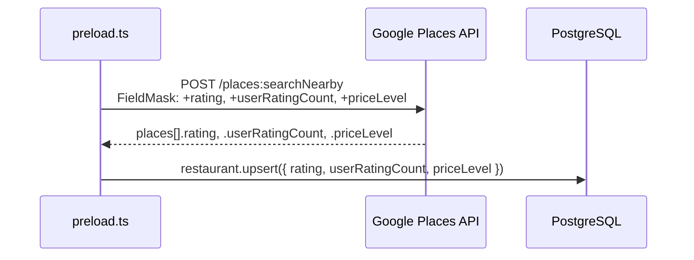

# S-78: Enrich Google Places Fetch

## Summary

Request `rating`, `userRatingCount`, and `priceLevel` from the Google Places Nearby Search API and store them on `Restaurant` during preload. This makes those fields queryable via the filter expansion in S-81.

## Changes

### `apps/api/services/googlePlacesService.ts`
- Add `rating`, `userRatingCount`, `priceLevel` to `PlaceResult` and `GooglePlacesEntry`
- Extend `FIELD_MASK` to include those fields

### `scripts/preload.ts`
- Pass the new fields in the restaurant `upsert` create/update

### `scripts/preload-rest.ts`
- Pass the new fields in the Supabase REST restaurant upsert

## Data Flow

## Field Mapping

| Google Places field | `PlaceResult` field | DB column |
|---|---|---|
| `rating` | `rating: number \| null` | `Restaurant.rating` |
| `userRatingCount` | `userRatingCount: number \| null` | `Restaurant.userRatingCount` |
| `priceLevel` | `priceLevel: string \| null` | `Restaurant.priceLevel` |

## Notes

- `priceLevel` from Google Places API v1 is a string enum: `"PRICE_LEVEL_FREE"`, `"PRICE_LEVEL_INEXPENSIVE"`, `"PRICE_LEVEL_MODERATE"`, `"PRICE_LEVEL_EXPENSIVE"`, `"PRICE_LEVEL_VERY_EXPENSIVE"`. Normalize to `"$"`, `"$$"`, `"$$$"`, `"$$$$"` on ingest.
- All fields nullable — restaurants with no rating or price data are stored with `null`.
