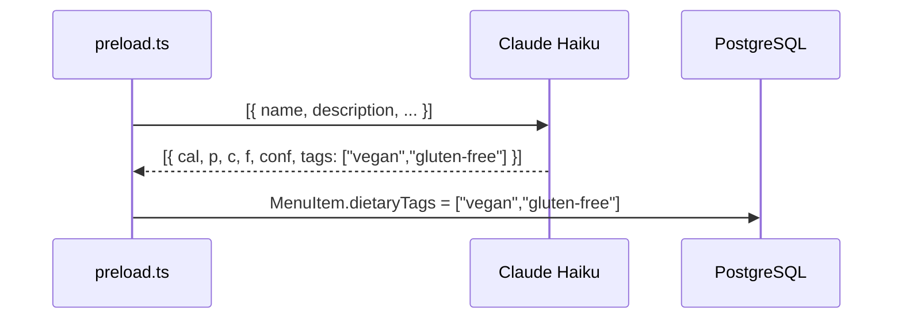

# S-79: Dietary Tag Extraction

## Summary

Extend Claude Haiku macro estimation to also return dietary classification tags per menu item. Tags are stored in `MenuItem.dietaryTags[]` and later aggregated into `Restaurant.dietaryOptions[]` in S-80.

## Tags

| Tag | Criteria |
|-----|----------|
| `vegan` | No animal products (meat, dairy, eggs, honey) |
| `vegetarian` | No meat/fish; dairy/eggs OK |
| `gluten-free` | No wheat, barley, rye, or cross-contamination |
| `keto` | High-fat, low-carb (≤10g net carbs) |
| `dairy-free` | No milk, cheese, butter, cream |

## Changes

### `apps/api/services/menuSources/types.ts`
Add `dietaryTags: string[]` to `MacroData`.

### `apps/api/services/macroEstimationService.ts`
- Extend `HaikuEstimate` to include `tags: string[]`
- Update system prompt to request dietary tags per item
- Map `tags` into `MacroData.dietaryTags`

### `scripts/preload.ts`
Pass `macro.dietaryTags` when creating/updating `MenuItem`.

### `scripts/preload-rest.ts`
Pass dietary tags in the MenuItem upsert body.

## Data Flow

## Notes

- Tags are best-effort — Haiku may miss some; that's acceptable for a discovery feature.
- Empty array is the correct default when no tags apply (matches schema default).
- `MacroData.dietaryTags` defaults to `[]` when Haiku omits the field.
- Doesn't affect Path 1 (FatSecret chains) — those items have known nutrition but unknown dietary status. FatSecret items get `dietaryTags: []`.
